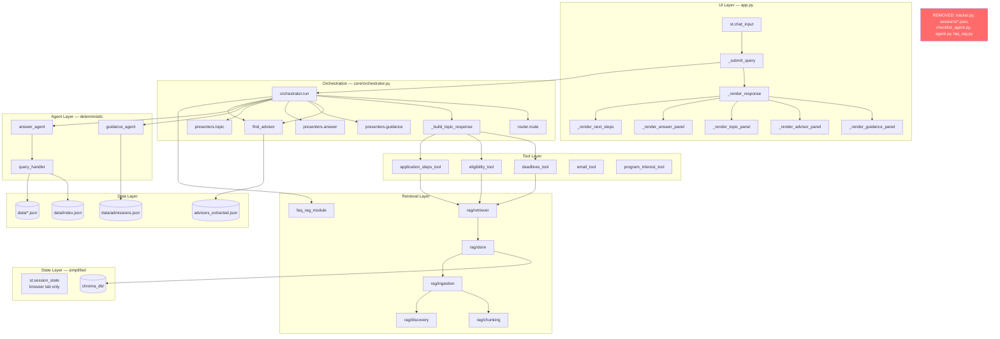
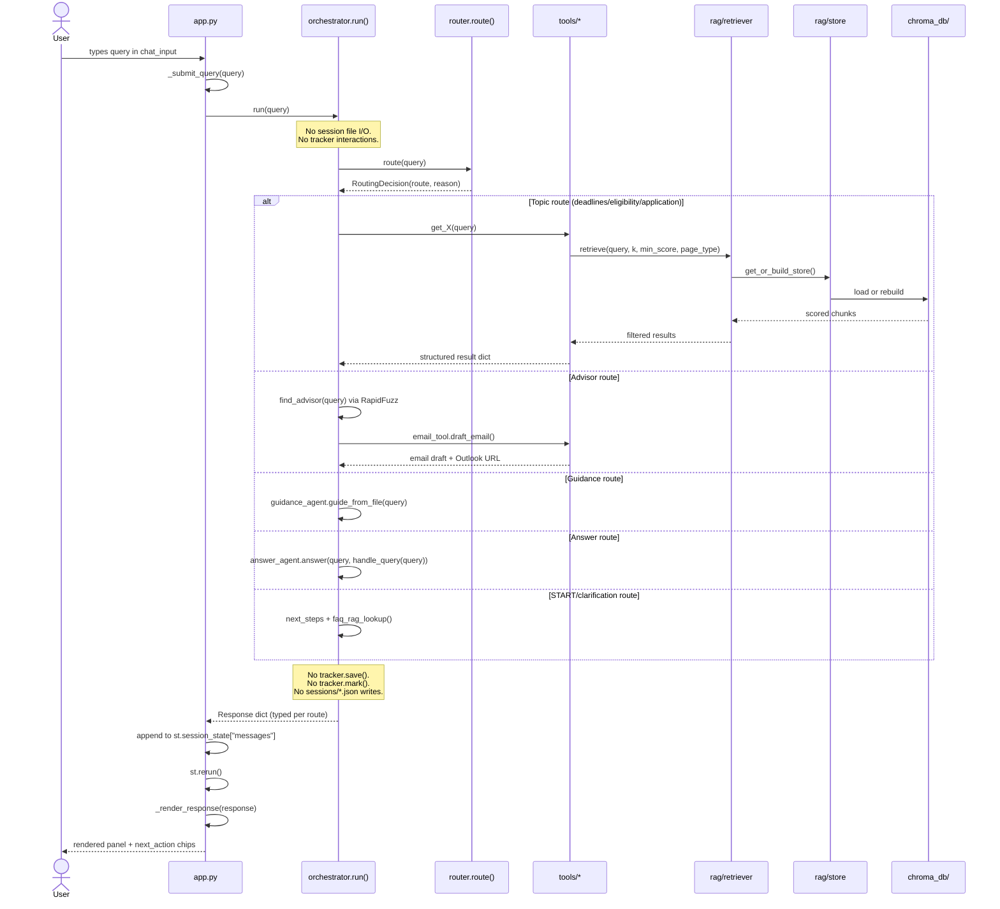
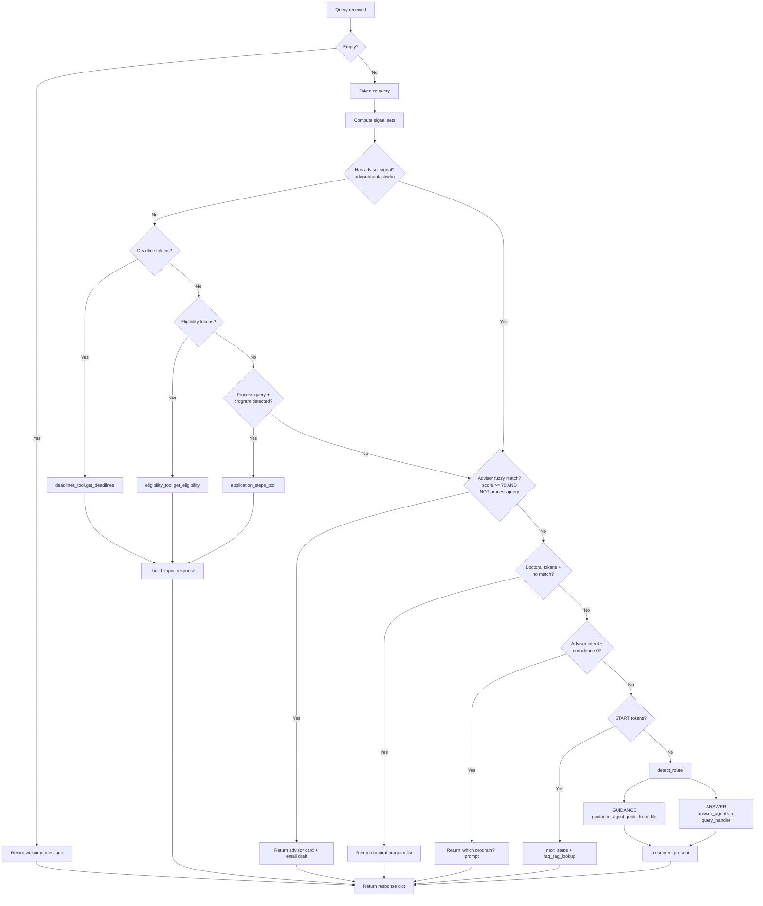
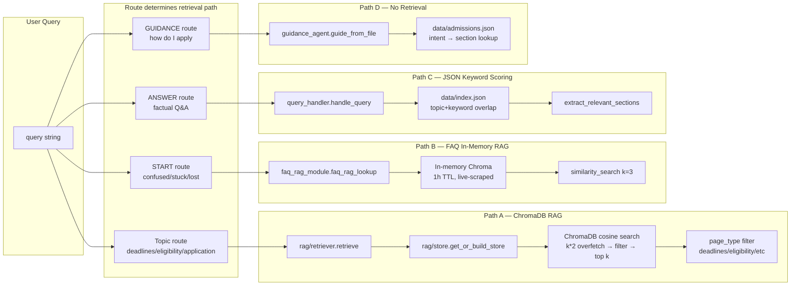
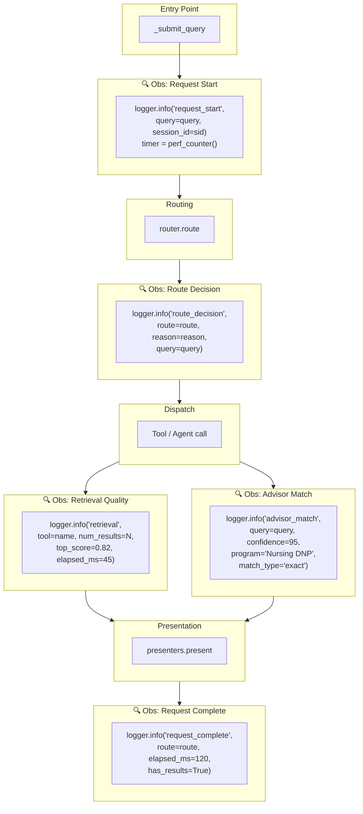

# CSULB Grad Center AI Assistant — Architecture Analysis

> Produced from direct codebase read. Every claim below references actual files, functions, and line numbers.
> CURRENT state is separated from TARGET recommendations throughout.
>
> **Revision 2 — May 2026**: Checklist tracking, task persistence, step-dependency management, and progress-bar workflows have been **removed from the product direction**. This document reflects the simplified system vision focused on guidance, retrieval, advisor routing, and production-grade orchestration.

---

## 1. UPDATED SYSTEM VISION

### Revised Core Purpose

This system is a **production-style agentic guidance and orchestration platform** for CSULB graduate admissions. It routes prospective and current graduate students to relevant information — deadlines, eligibility rules, application steps, advisor contacts, and FAQ content — via deterministic intent routing and multi-source RAG retrieval.

It is **not** a checklist-tracking platform, a task manager, or a step-completion engine.

### Revised Workflow Focus

| Was (Old Direction) | Is Now (Revised Direction) |
|---|---|
| Step-by-step checklist generation and tracking | Step-by-step **guidance delivery** (read-only, no state) |
| Progress bars, percent-done, motivation nudges | Clear next-step recommendations |
| `sessions/*.json` persistence with mark/pending/progress | Lightweight conversation context (Streamlit session state only) |
| Dependency-aware blocked-step workflows | Simple ordered guidance — no dependency graph |
| "Mark step 3 done" natural-language commands | "What should I do next?" guidance queries |
| Tracker-driven session lifecycle | Stateless request-response guidance |

### Revised Product Scope

The system answers four categories of questions:

1. **Informational** — "What GPA do I need?" "When is the deadline for DNP?" → RAG retrieval + structured response
2. **Procedural** — "How do I apply to a doctoral program?" → Ordered guidance steps (read-only)
3. **Directional** — "Who is the advisor for nursing?" → Fuzzy advisor matching + email draft
4. **Clarification** — "I don't know where to start" → FAQ retrieval + orientation next-steps

It does NOT manage:
- Task completion state
- Step dependencies or blocking
- Session-persistent progress
- User workflow timelines

### Revised AI System Responsibilities

| Responsibility | Status |
|---|---|
| Deterministic intent routing | **Core** — token-matching router, no LLM |
| Multi-source RAG retrieval | **Core** — ChromaDB + FAQ + keyword scoring |
| Advisor fuzzy matching | **Core** — RapidFuzz against advisor dataset |
| Guidance step generation | **Core** — rule-based extraction from `admissions.json` |
| Clarification/orientation | **Core** — START-intent detection + FAQ RAG |
| Email draft generation | **Core** — template-based advisor email |
| Checklist tracking | **Removed** — no longer a system responsibility |
| Progress persistence | **Removed** — no file-based session state |
| Step-dependency resolution | **Removed** — no blocked-step logic |
| Task state machines | **Removed** — no mark/pending/progress lifecycle |

---

## 2. UPDATED CURRENT ARCHITECTURE ANALYSIS

### What Becomes Unnecessary

| Component | File | Lines | Why It's Now Unnecessary |
|---|---|---|---|
| **`tracker.py`** | `tracker.py` | 508 | Entire module: save, load, mark, pending, progress, blocked_by, dependency graph, session file I/O. All of this was checklist-tracking infrastructure. |
| **`sessions/` directory** | Runtime artifact | — | File-based session persistence for checklist state. No longer needed. |
| **`_run_checklist()`** | `orchestrator.py` L256-261 | 6 | Calls `guide_from_file()` then `tracker.save()`. Without tracking, this is identical to `_run_guidance()`. |
| **`_run_tracking()`** | `orchestrator.py` L268-296 | 29 | Entire function: mark/pending/progress/list_sessions dispatcher. |
| **`_parse_tracking_command()`** | `orchestrator.py` L153-216 | 64 | Natural-language parser for "mark step 3 done", "what's my progress", etc. |
| **`_humanize_tracking()`** | `orchestrator.py` L630-834 | 205 | Progress bars, breakdown strings, blocked-step formatting, motivation messages, session listings. **Largest single humanizer.** |
| **`_humanize_checklist()`** | `orchestrator.py` L506-547 | 42 | Checklist-specific presentation with "Mark step 1 as in progress" prompts. |
| **`_format_current_focus()`** | `orchestrator.py` L358-385 | 28 | Renders blocked/in-progress/pending step as a "focus block". |
| **`_next_step_instruction()`** | `orchestrator.py` L388-430 | 43 | Generates "Step N is waiting on Step M" blocker instructions. |
| **`_tracking_next_actions()`** | `orchestrator.py` L602-627 | 26 | State-aware suggestion builder ("Mark step N as completed"). |
| **`_motivation()`** | `orchestrator.py` L326-343 | 18 | "🔥 You're in the home stretch" motivational messages. |
| **`_bar()`** | `orchestrator.py` L320-323 | 4 | Text-based progress bar renderer. |
| **Route.CHECKLIST**  | `orchestrator.py` L37 | 1 | Enum member |
| **Route.TRACKING** | `orchestrator.py` L39 | 1 | Enum member |
| **`_CHECKLIST_SIGNALS`** | `orchestrator.py` L72 | 1 | Signal set extraction |
| **`_STATUS_ALIASES`** | `orchestrator.py` L132-147 | 16 | done/complete/pending/reset aliases |
| **`_COMPLETION_VERBS`** | `orchestrator.py` L150 | 1 | Verb set for implicit "completed" status |
| **`checklist_agent.py`** | Root | 178 | Already dead code — unreachable from `app.py`. Confirmed legacy. |
| **`import tracker`** | `orchestrator.py` L26 | 1 | Module-level import of tracker |
| **`from guidance_agent import validate_steps`** | `tracker.py` L31 | 1 | Architectural coupling: state → agent layer |

**Total removable lines: ~465 from `orchestrator.py` + 508 from `tracker.py` = ~973 lines.**

### What Becomes Legacy/Deprecated

| Component | Current Role | New Status |
|---|---|---|
| `_humanize_checklist()` | Formats checklist with tracking prompts | **Merge into `_humanize_guidance()`** — same underlying data, different presentation |
| `Route.CHECKLIST` routing path | Separate route with tracker.save() side effect | **Merge into GUIDANCE** — same agent, no save |
| `detect_route()` CHECKLIST branch | First-priority routing to checklist | **Remove** — checklist signals ("todo", "check") reroute to GUIDANCE |
| `app.py` L1811 `route in ("guidance", "checklist")` | UI branch | **Simplify** — only `"guidance"` remains |

### What State Management Becomes Simpler

**Before (5 state locations):**
1. `st.session_state["messages"]` — chat history (browser tab)
2. `st.session_state["session_id"]` — session identity (browser tab)
3. `st.session_state["last_response"]` — last orchestrator response (browser tab)
4. `sessions/<id>.json` — checklist step statuses (disk) ← **REMOVED**
5. `chroma_db/` — vector store (disk, TTL-managed)

**After (4 state locations):**
1. `st.session_state["messages"]` — chat history (browser tab)
2. `st.session_state["session_id"]` — session identity (browser tab)
3. `st.session_state["last_response"]` — last orchestrator response (browser tab)
4. `chroma_db/` — vector store (disk, TTL-managed)

The entire file-based state layer disappears. No more write-locking concerns, no more session file divergence across tabs, no more `_blocked_by()` DFS traversals.

### What Orchestration Paths Become Cleaner

**Before: 9-branch priority chain** in `orchestrator.run()`:

```
1. Empty query guard
2. Deadline signals → deadlines_tool
3. Eligibility signals → eligibility_tool
4. Process+program → application_steps_tool
5. Advisor fuzzy match → advisor card + email
6. Doctoral no-match → program list
7. Advisor intent, no program → clarification prompt
8. START intent → next_steps + FAQ RAG
9. Fallback: detect_route() → GUIDANCE / CHECKLIST / ANSWER / TRACKING
```

**After: 7-branch priority chain** (2 routes eliminated):

```
1. Empty query guard
2. Deadline signals → deadlines_tool
3. Eligibility signals → eligibility_tool
4. Process+program → application_steps_tool
5. Advisor fuzzy match → advisor card + email
6. Doctoral no-match → program list
7. Advisor intent, no program → clarification prompt
8. START intent → next_steps + FAQ RAG
9. Fallback: detect_route() → GUIDANCE / ANSWER          ← CHECKLIST + TRACKING gone
```

The fallback `detect_route()` reduces from 4 routes to 2 routes. The `_ROUTE_RUNNERS` and `_HUMANIZERS` dicts lose 2 entries each. The `_ROUTE_SIGNALS` list loses the `CHECKLIST` entry entirely.

### Complexity That Disappears

| Complexity | Source | Impact of Removal |
|---|---|---|
| Dependency-aware step blocking | `tracker._blocked_by()` with DFS cycle detection | Entire graph traversal logic removed |
| Natural-language command parsing | `_parse_tracking_command()` — 64 lines of regex | No more "mark step 3 done" disambiguation |
| Session file I/O | `tracker._read()` / `_write()` / `_path()` | No disk writes outside of ChromaDB |
| Cross-layer coupling | `tracker.py` imports `guidance_agent.validate_steps` | State layer no longer depends on agent layer |
| Dual-render paths | `_humanize_checklist()` vs `_humanize_guidance()` | One guidance humanizer |
| State-aware suggestions | `_tracking_next_actions()` needs progress context | Static next-step suggestions |
| Progress math | `percent_done`, `to_go`, `ready`, `blocked` counters | No completion arithmetic |

### Complexity That Remains

| Complexity | Source | Why It Persists |
|---|---|---|
| 3 retrieval systems | ChromaDB RAG, FAQ in-memory Chroma, JSON keyword scoring | Different data sources, different TTLs, different access patterns |
| Implicit response schemas | Each route returns different dict keys | No TypedDict/dataclass per route |
| 1,411-line orchestrator | Routing + dispatch + presentation | Still doing 3 jobs even after tracking removal |
| Token-matching routing | Set intersection, substring matching, regex | Correct approach for no-LLM system, but fragile to keyword overlap |
| ~1,000 lines of CSS in app.py | Streamlit CSS injection | Framework limitation |
| Zero structured logging | `print()` only in rag/ modules | No observability |
| Duplicate logic | Stop words, advisor signals, tokenization in 3+ places | Still present |

---

## 3. UPDATED TARGET ARCHITECTURE

### Revised Module Boundaries

| Current | Target | Responsibility |
|---|---|---|
| `orchestrator.run()` 240-line if/elif | `core/router.py` | Pure routing: query → route name. No presentation, no tool calls |
| `orchestrator._humanize_*()` | `core/presenters.py` | Raw result → UI-ready dict. Only GUIDANCE, ANSWER, ADVISOR, TOPIC humanizers |
| `orchestrator._build_topic_response()` | stays in `core/orchestrator.py` | Call router, dispatch to tool, call presenter |
| `tracker.py` (508 lines) | **DELETED** | Entire module removed |
| `checklist_agent.py` | **DELETED** | Already dead code |
| `app.py` CSS injection | `theme.py` | CSS injected once |
| `app._render_*_panel()` | `renderers/` package | One renderer per route |

### Revised Folder Structure

```
GradCenterAgenticAIAssistant/
  app.py                    # Streamlit entry — thin shell, imports from core/
  core/
    router.py               # Query → Route (pure function, testable)
    orchestrator.py          # Route → dispatch to tool/agent → presenter
    presenters.py            # Raw result → UI-ready dict (GUIDANCE, ANSWER, ADVISOR, TOPIC)
    schemas.py               # Response dataclasses/TypedDicts per route
    clarification.py         # START-intent handling, "I don't know" detection
  agents/
    guidance_agent.py        # Step-by-step flows from admissions.json (read-only guidance)
    answer_agent.py          # Factual Q&A via query_handler waterfall
  tools/
    deadlines_tool.py
    eligibility_tool.py
    application_steps_tool.py
    advisor_tool.py          # (extracted from advisor_retrieval.py)
    email_tool.py
    program_interest_tool.py
  retrieval/
    rag/
      store.py               # ChromaDB lifecycle, TTL, self-healing
      retriever.py            # Cosine similarity search, page_type filtering
      ingestion.py            # HTML fetch+parse
      chunking.py             # RecursiveCharacterTextSplitter
      discovery.py            # Web crawler, content classifier
    keyword_retriever.py      # (extracted from query_handler.py)
    faq_retriever.py          # (renamed from faq_rag_module.py)
    advisor_retriever.py      # (renamed: fuzzy match logic from advisor_retrieval.py)
  observability/
    logger.py                # Structured logger setup
    metrics.py               # Route timing, score distributions
  evals/
    golden_queries.json      # Expected route per query
    test_routing.py          # Routing regression suite
    test_retrieval.py        # Precision/recall per page_type
  data/
    admissions.json
    advisors_extracted.json
    index.json
    ...
  chroma_db/                  # Runtime vector store (gitignored)
  _legacy/                    # Dead code quarantine
    agent.py                  # OpenAI gpt-4o-mini — dead
    checklist_agent.py        # Dead
    faq_rag.py                # Dead
    tracker.py                # Removed from product direction
    split_chunks.py           # Dead
```

**Key structural changes vs. previous target:**
- No `state/` directory — no `tracker.py`, no `session_store.py`
- No `sessions/` runtime directory
- `tracker.py` moves to `_legacy/`, not to `state/`
- `core/clarification.py` added — START-intent and "I'm confused" handling as a first-class concern
- `_humanize_checklist()` and `_humanize_tracking()` do not exist in `presenters.py`

### Revised Orchestration Flow

```python
# core/router.py — pure, testable, NO checklist/tracking routes

class Route(str, Enum):
    GUIDANCE  = "guidance"      # step-by-step guidance (read-only)
    ANSWER    = "answer"        # factual Q&A
    # Topic routes resolved before detect_route() — handled inline
    # Advisor routes resolved before detect_route() — handled inline

class RoutingDecision(NamedTuple):
    route: str         # "deadlines", "advisor", "guidance", "answer", "next_steps"
    reason: str        # "deadline_signal_matched", "advisor_fuzzy_match", etc.
    metadata: dict     # route-specific context (e.g. matched program name)

def route(query: str) -> RoutingDecision:
    """Returns route + reasoning. No side effects. No tool calls."""
```

```python
# core/orchestrator.py — dispatch + compose, NO tracker interactions

def run(query: str, session_id: str = "default") -> Response:
    decision = router.route(query)
    logger.info("route_decision", query=query, route=decision.route, reason=decision.reason)
    raw = _dispatch(decision, query)        # ← no session_id needed for dispatch
    return presenters.present(decision.route, raw)
```

### Revised Request Lifecycle

```
User types query
  → app._submit_query(query)
    → orchestrator.run(query)                    ← session_id OPTIONAL, context only
      → router.route(query) → RoutingDecision
      → _dispatch(decision, query)
        → tool.get_X(query) or agent.guide(query) or agent.answer(query)
      → presenters.present(route, raw_result) → typed Response dict
    → append to st.session_state["messages"]     ← browser-tab state only
    → st.rerun()
  → app._render_response(response)
    → branch on response.route → panel renderer
    → render next_actions as clickable chips
```

**What's different:**
- No `tracker.save()` side effect in any dispatch path
- No `tracker.mark()` / `tracker.pending()` / `tracker.progress()` calls
- No `sessions/*.json` file I/O
- `session_id` is conversation context, not a persistence key
- Responses are stateless — no "you're 40% done" state dependent on disk

### Revised State Strategy

| State | Where | Persistence | Scope | Purpose |
|---|---|---|---|---|
| Chat messages | `st.session_state["messages"]` | Browser tab | Per-tab | Conversation history for rendering |
| Session ID | `st.session_state["session_id"]` | Browser tab | Per-tab | Conversation identity |
| Last response | `st.session_state["last_response"]` | Browser tab | Per-tab | Re-render last response |
| ChromaDB vectors | `chroma_db/chroma.sqlite3` | Disk, 24h TTL | Global | Pre-computed embeddings |
| FAQ vectors | In-memory Chroma instance | Process memory, 1h TTL | Global | Ephemeral FAQ store |
| Embedding model | `_EMBEDDINGS` singleton | Process memory | Global | Loaded once per process |
| Advisor data | `advisors` list | Process memory | Global | Loaded at import time |

**Removed:**
- ~~`sessions/<id>.json`~~ — disk-persisted checklist state
- ~~Step status tracking~~ — pending/in_progress/completed per step
- ~~Dependency graph state~~ — blocked_by / depends_on resolution
- ~~Progress counters~~ — percent_done, completed, to_go

### Revised Infrastructure Responsibilities

| Responsibility | Current | Target |
|---|---|---|
| ChromaDB lifecycle | `rag/store.py` — works well | Keep as-is |
| FAQ scraping | `faq_rag_module.py` — separate in-memory store | Unify interface with RAG retriever |
| Session file I/O | `tracker.py` | **Remove entirely** |
| Disk writes | ChromaDB + sessions/ | **ChromaDB only** |
| Structured logging | Absent | `observability/logger.py` |
| Evaluation | Absent | `evals/` package |
| Health check | Absent | Streamlit health endpoint (future) |

---

## 4. UPDATED MERMAID DIAGRAMS

### Diagram 1: High-Level Architecture



### Diagram 2: Request Lifecycle



### Diagram 3: Orchestration Flow (Simplified)



**Key difference from previous diagram:** No CHECKLIST or TRACKING branches. `detect_route()` resolves to GUIDANCE or ANSWER only.

### Diagram 4: Retrieval Flow



### Diagram 5: Observability Insertion Points



---

## 5. UPDATED STATE MANAGEMENT STRATEGY

### What State Is Still Needed

| State | Need | Reason |
|---|---|---|
| Chat message history | **Yes** | Users expect to scroll back through their conversation |
| Session identity | **Yes** | Distinguishes concurrent browser tabs |
| Last response | **Yes** | Re-render on Streamlit re-run |
| ChromaDB vectors | **Yes** | Pre-computed embeddings, 24h TTL |
| FAQ vectors | **Yes** | In-memory ephemeral store, 1h TTL |
| Advisor dataset | **Yes** | Loaded once at import, used for fuzzy matching |

### Whether Lightweight Session Memory Is Enough

**Yes.** Streamlit's built-in `st.session_state` is sufficient for all remaining state needs:

- **Chat history** — `st.session_state["messages"]` already works. Each tab has its own list. No cross-tab sync needed.
- **Session identity** — `st.session_state["session_id"]` already works. Used for display, not for file persistence.
- **Last response** — `st.session_state["last_response"]` already works. Re-rendered on each Streamlit re-run.

No external session store is needed. The system is stateless at the request level — every query is self-contained. Context comes from the query itself, not from persisted progress.

### Whether Persistence Is Still Necessary

**Only for ChromaDB.** The vector store must persist on disk because rebuilding embeddings costs 30-60 seconds. The 24h TTL manages freshness. This is infrastructure persistence (caching), not user-facing state.

**No user state needs persistence.** With checklist tracking removed:
- No step statuses to save
- No progress to resume
- No dependency graphs to reconstruct
- No cross-session continuity

If a user closes their tab and returns, they start fresh. This is the correct behavior for a guidance/Q&A system — the information doesn't change based on where the user left off.

### How Conversation/Session Context Should Work

```python
# app.py — session init (what already exists, unchanged)
if "session_id" not in st.session_state:
    st.session_state["session_id"] = "default"
if "messages" not in st.session_state:
    st.session_state["messages"] = []
if "last_response" not in st.session_state:
    st.session_state["last_response"] = None
```

The orchestrator receives the query and returns a response. The response is appended to the message list. No other state interaction occurs.

**Future option:** If multi-turn context becomes important (e.g., "What about for international students?" following a deadlines query), conversation context can be passed as a parameter to the orchestrator — extracted from the last N messages in `st.session_state["messages"]`. This is a read-only operation, no writes.

### What State Should NOT Exist Anymore

| State | Why It's Gone |
|---|---|
| `sessions/<id>.json` files | No checklist tracking — no step statuses to persist |
| Step `status` field (`pending` / `in_progress` / `completed`) | No task state machine |
| `depends_on` / `blocked_by` computed state | No dependency resolution |
| `percent_done` / `completed` / `to_go` counters | No progress tracking |
| `updated_at` timestamps on session records | No session lifecycle |
| `_STORE_VALIDATED` flag re: program pages | Keep — this is infrastructure state for self-healing |

---

## 6. UPDATED OBSERVABILITY + EVALUATION STRATEGY

### What Should Still Be Evaluated

With checklist tracking removed, the system's correctness reduces to three measurable dimensions:

1. **Routing correctness** — Does the query reach the right handler?
2. **Retrieval quality** — Does the handler find relevant content?
3. **Response quality** — Is the formatted response helpful and accurate?

### Critical Metrics

#### Routing Metrics

| Metric | How to Measure | Why It Matters |
|---|---|---|
| Route accuracy | Golden query set → expected route | A misroute is a total failure — user gets wrong information |
| Route distribution | Count queries per route per session | Detects routing bias (e.g., everything falling to ANSWER) |
| Signal overlap conflicts | Log when multiple signal sets match | Catches ambiguous queries that could go either way |
| Fallback rate | % of queries hitting `detect_route()` fallback | High fallback rate = topic-priority routing isn't catching enough |

#### Retrieval Metrics

| Metric | How to Measure | Why It Matters |
|---|---|---|
| Top-1 score | `results[0]["score"]` logged per query | Low top scores = poor embedding match or wrong page_type |
| Score distribution | Histogram of all returned scores | Detects threshold miscalibration |
| Zero-result rate | % of tool calls returning `[]` | Should be < 5% for in-scope queries |
| Page type accuracy | Does the page_type filter match the query intent? | Wrong filter = searching the wrong corpus subset |
| Retrieval latency | `time.perf_counter()` around `retrieve()` | Detects ChromaDB performance degradation |

#### Advisor Routing Metrics

| Metric | How to Measure | Why It Matters |
|---|---|---|
| Match confidence distribution | Log `advisor_result["confidence"]` | Detects fuzzy match threshold issues |
| False-positive rate | Queries that match an advisor but shouldn't | "apply for nursing" → advisor card instead of steps |
| No-match rate for advisor-intent queries | User says "who is the advisor" but no match | Dataset coverage gap |
| Program alias coverage | Which abbreviations resolve correctly | "dnp" works, but does "doctor of nursing" work? |

#### Clarification Metrics

| Metric | How to Measure | Why It Matters |
|---|---|---|
| START-intent trigger rate | % of queries matching `_START_TOKENS` | Too high = token set is too broad |
| Clarification → follow-up rate | Does the user ask a more specific question after clarification? | Measures if clarification is helpful |
| "I don't know" response rate | answer_agent returning `confidence: "low"` | High rate = RAG coverage gap |

### Observability Events (Priority Order)

| Event | Where | Structured Fields | Priority |
|---|---|---|---|
| `request_start` | `_submit_query()` | query, session_id, timestamp | **P0** |
| `route_decision` | After `router.route()` | query, route, reason, signals_matched | **P0** |
| `retrieval_complete` | After each `retrieve()` call | tool, query, num_results, top_score, elapsed_ms, page_type_filter | **P0** |
| `advisor_match` | After `find_advisor()` | query, confidence, program_matched, match_type | **P0** |
| `request_complete` | End of `orchestrator.run()` | route, elapsed_ms, has_results, response_keys | **P0** |
| `rag_rebuild` | `store.build_vector_store()` | num_chunks, elapsed_ms, trigger_reason | **P1** |
| `faq_rebuild` | `faq_rag_module._build_vectorstore()` | num_chunks, elapsed_ms | **P1** |
| `routing_ambiguity` | When multiple signal sets match | query, matched_signals, chosen_route | **P1** |
| `no_results` | When tool returns empty | tool, query, page_type_filter, min_score | **P1** |

### What Observability Is NOT Needed (Removed)

| Was Planned | Why Removed |
|---|---|
| `state_change` events (mark step N) | No state changes |
| Session lifecycle events (create, load, delete) | No session files |
| Progress tracking events | No progress to track |
| Dependency resolution events | No dependency graph |
| Blocked-step alerts | No blocking logic |

---

## 7. UPDATED REFACTOR STRATEGY

### Phase 0 — Housekeeping + Tracker Removal (Risk: Low. Time: 2 hours)

**What:**
1. Move dead code to `_legacy/`: `agent.py`, `checklist_agent.py`, `faq_rag.py`, `split_chunks.py`, **`tracker.py`**
2. Remove `sessions/` directory (or gitignore it)
3. Remove `import tracker` from `orchestrator.py` (line 26)
4. Remove `Route.CHECKLIST` and `Route.TRACKING` enum members
5. Remove `_run_checklist()`, `_run_tracking()` from `_ROUTE_RUNNERS`
6. Remove `_humanize_checklist()`, `_humanize_tracking()` from `_HUMANIZERS`
7. Remove `_parse_tracking_command()`, `_STATUS_ALIASES`, `_COMPLETION_VERBS`
8. Remove `_tracking_next_actions()`, `_format_current_focus()`, `_next_step_instruction()`, `_motivation()`, `_bar()`
9. Remove CHECKLIST entry from `_ROUTE_SIGNALS`
10. Update `detect_route()` to remove CHECKLIST/TRACKING branches
11. Update `app.py` L1811 to remove `"checklist"` from route check
12. Update welcome message `next_actions` to remove checklist references

**Why:** This is the first thing to do because it makes the architecture honest. Anyone reading the code sees what the system actually does — not what it used to aspire to do. ~465 lines removed from orchestrator + 508 from tracker = ~973 lines of deleted complexity. Zero behavior change for all non-checklist queries.

**Verification:** Run every non-checklist query path manually. Confirm all topic, advisor, guidance, answer, and next_steps routes work unchanged.

### Phase 1 — Add Structured Logging (Risk: Very low. Time: 2-3 hours)

**What:**
- Add `import logging` + `logger = logging.getLogger(__name__)` to `orchestrator.py`, `rag/store.py`, `rag/retriever.py`, each tool
- Replace `print()` statements with `logger.info()`
- Add `logger.info("route_decision", ...)` at each routing branch in `orchestrator.run()`
- Add `time.perf_counter()` around `orchestrator.run()` in `_submit_query()`
- Add `logger.info("retrieval", ...)` after each `retrieve()` call in tools

**Why:** Highest-value single change. When a query misroutes, you have a trail. When retrieval is slow, you know which tool. Zero behavior change.

### Phase 2 — Define Response Schemas (Risk: Low. Time: 2-3 hours)

**What:** Create `core/schemas.py` with a TypedDict per route:

```python
class GuidanceResponse(TypedDict):
    query: str
    route: Literal["guidance"]
    summary: str
    primary_action: str
    steps: list[dict]
    total_steps: int
    source: SourceDict
    next_actions: list[str]

class AdvisorResponse(TypedDict):
    query: str
    route: Literal["advisor"]
    summary: str
    primary_action: str
    advisor_data: dict
    email_draft: NotRequired[dict]
    source: SourceDict
    next_actions: list[str]

class TopicResponse(TypedDict):
    query: str
    route: Literal["deadlines", "eligibility", "application"]
    summary: str
    primary_action: str
    tool_result: dict
    source: SourceDict
    next_actions: list[str]

class AnswerResponse(TypedDict):
    query: str
    route: Literal["answer"]
    summary: str
    primary_action: str
    answer: Any
    confidence: Literal["high", "medium", "low"]
    source: SourceDict
    next_actions: list[str]
```

**Why:** The implicit response contract is the #1 source of silent UI bugs. With checklist/tracking removed, there are only 5 response shapes to define instead of 11. Much more manageable.

### Phase 3 — Extract Router (Risk: Low. Time: 3-4 hours)

**What:** Extract the routing logic from `orchestrator.run()` into a pure function:

```python
# core/router.py
def route(query: str) -> RoutingDecision:
    """Query → RoutingDecision. Pure function. No side effects. No tool calls."""
    ...
```

`orchestrator.run()` becomes: `decision = route(query)` → dispatch → present.

**Why:** The routing logic is currently untestable because it's entangled with tool dispatch and presentation. After Phase 0 removes checklist/tracking, the router has only 7 branches instead of 9 — much simpler to extract.

### Phase 4 — Consolidate Duplicate Logic (Risk: Low. Time: 2 hours)

**What:**
- Merge `_STOP_WORDS` sets across `orchestrator.py`, `guidance_agent.py`, `advisor_retrieval.py` into one shared constant
- Merge process-query detection into one shared function
- Merge the three inline tokenization calls into one `_tokenize()` at top of `run()`
- Unify `_ADVISOR_SIGNALS` and `_ADVISOR_INTENT` (currently different sets doing the same thing)

**Why:** Three copies of the same logic will inevitably drift. With tracker removed, there's one less module with duplicate stop words.

### Phase 5 — Unify Retrieval Interface (Risk: Medium. Time: Half day)

**What:** Define a shared retrieval interface:

```python
class RetrievalResult(TypedDict):
    text: str
    score: float
    source_url: str
    metadata: dict
```

Wrap `rag/retriever.retrieve()`, `faq_rag_module.faq_rag_lookup()`, and `query_handler.handle_query()` behind this interface. Don't merge them — just make them polymorphic.

**Why:** Three retrieval systems with three return shapes makes it impossible to add cross-cutting concerns (logging, score normalization) without touching three files.

### Phase 6 — Add Routing Eval Harness (Risk: Zero. Time: Half day)

**What:** Create `evals/golden_queries.json` with 30-50 queries and expected routes. Write a test that runs each query through the router and asserts the route.

**Note:** With checklist/tracking removed, the golden set is simpler — no "mark step 3 done" or "what's my progress?" test cases. Focus on:
- Topic queries (deadlines, eligibility, application steps)
- Advisor queries (program names, abbreviations, "who is the advisor")
- Guidance queries (generic "how do I apply")
- Answer queries (factual "what GPA do I need")
- START/clarification queries ("I'm confused", "where do I start")
- Ambiguous queries that test routing priority

```python
# evals/test_routing.py
def test_routing_golden_set():
    for case in load_golden_queries():
        decision = router.route(case["query"])
        assert decision.route == case["expected_route"], \
            f"Query '{case['query']}' routed to {decision.route}, expected {case['expected_route']}"
```

**Why:** This is the safety net. Without it, every routing change is a manual "try 10 queries" process. With it, you run `pytest evals/` in 2 seconds and know nothing broke.

### Phase Summary

| Phase | Risk | Time | Value |
|---|---|---|---|
| 0. Tracker removal + housekeeping | Low | 2 hours | **~973 lines removed**. Architecture clarity. |
| 1. Structured logging | Very low | 2-3 hours | Debuggability (highest ROI) |
| 2. Response schemas | Low | 2-3 hours | UI stability — only 5 shapes to define now |
| 3. Extract router | Low | 3-4 hours | Testability — 7 branches not 9 |
| 4. Consolidate duplicates | Low | 2 hours | Maintainability |
| 5. Unify retrieval interface | Medium | Half day | Cross-cutting concerns |
| 6. Routing eval harness | Zero | Half day | Regression safety |

**Total: ~3 days of focused work. Zero rewrites. ~973 lines removed in Phase 0 alone.**

After these 6 phases (down from 7 — tracker decoupling is no longer needed because tracker is gone), the system has:
- **~970 fewer lines** of code
- **2 fewer routes** to maintain
- **No file-based state layer**
- Visible routing logic (extractable, testable)
- Typed response contracts (5 shapes, not 11)
- Structured logging (debuggable)
- A regression test suite for routing
- Unified retrieval interface

---

## 8. FINAL PRINCIPAL ENGINEER ASSESSMENT

### Why Removing Checklist Tracking Simplifies the Architecture

The tracker subsystem was the single largest source of architectural complexity per-feature-value:

| Before | After |
|---|---|
| `tracker.py` — 508 lines of state management, dependency resolution, DFS blocking, progress math, file I/O, CLI | **Deleted** |
| `_humanize_tracking()` — 205 lines, the largest humanizer | **Deleted** |
| `_humanize_checklist()` — 42 lines (duplicate of guidance) | **Merged into guidance** |
| `_run_checklist()` + `_run_tracking()` — 35 lines of dispatch | **Deleted** |
| `_parse_tracking_command()` — 64 lines of NL command parsing | **Deleted** |
| 5 helper functions for tracking presentation — ~120 lines | **Deleted** |
| `Route.CHECKLIST` + `Route.TRACKING` — 2 enum members, 2 signal sets | **Deleted** |
| `sessions/*.json` — persistent state, write-locking risks, cross-tab divergence | **Deleted** |
| `tracker.py` → `guidance_agent.validate_steps` import — cross-layer coupling | **Deleted** |

**Total removed: ~973 lines across 2 files + 2 fewer routes + 2 fewer humanizers + 0 file-based state.**

The remaining system has:
- **Zero disk writes** outside of ChromaDB (infrastructure caching)
- **No cross-layer coupling** between state and agent layers
- **2 fallback routes** instead of 4 in `detect_route()`
- **5 response shapes** instead of 11
- **No NL command parsing** (the most fragile part of the routing system)

### Whether This Improves the Project Strategically

**Yes, unambiguously.** Three reasons:

1. **Focus sharpens the value proposition.** A guidance system that does retrieval, routing, and advisor matching well is more valuable than one that also does checklist tracking poorly. Checklist tracking is a solved problem (Todoist, Notion, any task manager). RAG-backed graduate admissions guidance is not.

2. **Fewer moving parts = faster iteration.** Every feature added to the system makes every other feature harder to change. Removing the tracker means the orchestrator, the response schemas, and the UI renderers are all simpler. Future features (multi-turn context, LLM-enhanced responses, evaluation pipelines) have less to work around.

3. **No production cost.** The tracker was never production-critical. It was a prototype feature that demonstrated state management capability but didn't address a real user need. Students don't track their admissions checklist inside a chatbot — they use email reminders, university portals, and personal todo apps.

### How This Changes the System Positioning

**Before:** "AI chatbot that guides students AND tracks their progress through checklists" — positioned as a hybrid guidance + task-management tool. Competes with generic task managers on the tracking axis.

**After:** "AI-powered graduate admissions guidance system with deterministic routing, multi-source retrieval, and advisor matching" — positioned as a domain-specific information retrieval and orchestration system. Competes on retrieval quality and routing accuracy.

The second framing is stronger for several reasons:
- It's what the system actually does well
- It highlights engineering decisions (deterministic routing, RAG pipeline, fuzzy matching) rather than commodity features (checklists)
- It's a better AI systems engineering narrative for interviews, demos, and portfolio reviews
- It aligns with where production AI systems are heading: reliable orchestration, observable pipelines, evaluated retrieval

### How Senior Engineers Would View This Narrower Focus

A senior or principal engineer evaluating this system would see:

**Positive signals:**
- Willingness to cut features that don't serve the core mission
- Understanding that feature count ≠ quality
- Clean separation of concerns after tracker removal
- Focus on reliability (routing correctness, retrieval quality) over breadth
- Observability and evaluation as first-class concerns
- No premature optimization or framework chasing

**Red flags that disappear:**
- ~~"Why is there a dependency-aware task manager inside a chatbot?"~~ — gone
- ~~"Why does the state layer import from the agent layer?"~~ — gone
- ~~"Why are there 11 response shapes with no schemas?"~~ — down to 5
- ~~"Why is `orchestrator.run()` doing routing, dispatch, AND progress tracking?"~~ — routing + dispatch only

### Whether This Creates a Stronger AI Systems Engineering Narrative

**Yes.** The system becomes a cleaner example of production AI engineering patterns:

| Pattern | Implementation |
|---|---|
| Deterministic orchestration | Token-matching router with priority chain, no LLM in production path |
| Multi-source retrieval | ChromaDB RAG + in-memory FAQ + JSON keyword scoring, unified interface |
| Fuzzy entity matching | RapidFuzz with threshold hierarchy for advisor resolution |
| Observable pipeline | Structured logging at routing, retrieval, and presentation layers |
| Evaluated system | Golden query sets for routing regression, retrieval precision measurement |
| Production-grade state | Stateless request-response (ChromaDB caching is infrastructure, not user state) |
| Clean module boundaries | Router / orchestrator / presenter / tool / retriever — each with single responsibility |

This is a system that demonstrates **judgment** — knowing what to build, what to cut, and why. That signal is stronger than feature breadth.

### Final Recommendation

Execute Phase 0 (tracker removal + housekeeping) immediately. It's the highest-value, lowest-risk change. ~973 lines deleted, zero behavior change, architecture made honest.

Then proceed through Phases 1-6 in order: logging → schemas → router extraction → dedup → retrieval interface → eval harness. Each phase is independently shippable. Each makes the system measurably better.

The end state is a system with:
- **~3,500 fewer lines** of code (dead code + tracker + checklist)
- **7 routes** instead of 9 in the orchestrator
- **2 routes** instead of 4 in `detect_route()` fallback
- **5 response schemas** instead of 11
- **Zero file-based state**
- **Structured observability** at every decision point
- **Automated routing regression tests**
- **Unified retrieval interface**

That's a production-grade AI guidance system. No task manager. No progress bars. No dependency graphs. Just clean routing, good retrieval, and reliable answers.

Phase 1 Observability Completed

- Added structured NDJSON logging

- Added request correlation IDs

- Added route decision tracing

- Added retrieval metrics

- Added advisor matching metrics

- Added tool execution metrics

- Added store lifecycle events

Key findings:

- ChromaDB cold load ~3.9s, warm ~37ms

- FAQ store cold build ~4.6s, warm ~45ms

- No routing regressions detected

Retrieval architecture finding:
- Topic tools use persistent ChromaDB.
- FAQ/start guidance uses a separate in-memory FAQ RAG store.
- Advisor matching uses RapidFuzz, correctly avoiding vector search.
- Guidance uses structured admissions.json.
- Answer fallback uses JSON keyword scoring.
- Cold starts affect ChromaDB-backed routes and FAQ RAG-backed routes, but not advisor/guidance/answer routes.

Phase 2A completed:
- Added golden query dataset
- Added routing evaluation harness
- Evaluates route, reason, retrieval event structure, fallback behavior, advisor outcome
- Produces JSON reports
- Baseline: 19 PASS / 0 FAIL / 1 KNOWN_FAIL
- gate_pass_rate: 100%
- p50 latency: 0.9ms
- p95 latency: 17.1ms

## Phase 2 — Evaluation Harness

Phase 2 introduced a deterministic evaluation layer for the Grad Center Assistant.

The goal was to move from manual testing to repeatable behavioral validation.

### What was added

- Golden query dataset in `evals/golden_queries.json`
- Evaluation runner in `evals/run_evals.py`
- JSON reports in `evals/reports/`
- Route correctness validation
- Route reason validation using `route.decision` logs
- Retrieval event structure validation
- Fallback behavior validation
- Advisor outcome validation
- Backend inference validation
- Vector DB usage reporting

### Current baseline

- Total cases: 34
- PASS: 33
- FAIL: 0
- SKIP / known issue: 1
- Gate pass rate: 100%
- Backend match: 33 / 33
- Backend mismatches: 0
- Vector DB touched: 15 / 33 cases

### What the evaluation checks

The harness validates whether each query reaches the expected:

- route
- route reason
- retrieval backend
- ChromaDB page type
- retrieval event structure
- fallback behavior
- advisor matching outcome

This does not yet evaluate final answer quality or factual correctness.

### Why this matters

The system can now detect routing and backend regressions automatically before future architecture changes.

This creates a baseline for future work such as:
- retrieval consolidation
- backend instrumentation
- intent classification improvements
- LLM-assisted routing or response generation

### Current limitation

Some backends are still partially unobserved:

- `query_handler` / JSON keyword scoring
- `admissions_rag` / live HTTP + snippet path
- FAQ RAG query-level retrieval

These should be instrumented before deeper answer-quality evaluation.

Phase 3A — Backend Observability

Added:
- faq_rag.query
- keyword.retrieval
- keyword.result

Coverage:
- FAQ retrieval visibility
- Keyword retrieval visibility
- Answer extraction visibility

Status:
- 34/34 gate pass
- backend_match 100%
- no behavior changes

Phase 3B
- Added faq_rag.query, keyword.retrieval, and keyword.result to eval report capture.
- Backend inference now uses faq_rag.query as direct evidence.
- next_steps cases now report actual_backend=faq_rag instead of faq_rag_inferred.
- No production behavior changes.

### Phase 4A — FAQ RAG Double-Call Removal

- Removed duplicate `faq_rag_lookup()` call from the `start_intent` path in `orchestrator.py`.
- `next_steps.get_next_steps()` now owns FAQ retrieval for next-step guidance.
- Reduced FAQ RAG calls from 2 to 1 per `next_steps` request.
- Preserved response behavior and schema.
- Eval gates remain green: 0 FAIL, 0 ERROR, 100% gate pass rate.

### Phase 4B — Transfer Credit Keyword Coverage

- Fixed an answer-route quality gap for transfer-credit questions.
- Added minimal keyword coverage for `transfer` and `credits` in `data/index.json`.
- Routed transfer-credit queries to `admissions.json`, which contains the transfer-credit policy.
- Eliminated fallback behavior for `answer_003` and `answer_006`.
- Before: `answer_type=unknown`, `confidence=low`.
- After: `answer_type=list/direct`, `confidence=medium/high`.
- Eval gates remain green: 0 FAIL, 0 ERROR, 100% gate pass rate.
### Current Status

- 34 eval cases

- 100% gate pass rate

- 100% backend match rate

- End-to-end backend observability

### Phase 5B — Keyword Coverage Expansion

- Added minimal keyword mappings for common graduate advising terms:
  - admission
  - admitted
  - register
  - activate
  - account
  - assistantship / assistantships
  - requirements
  - appeal
- Fixed 8 previously-fallbacking queries.
- Before: `fallback=True`, `answer_type=unknown`, `confidence=low`.
- After: `fallback=False`, `answer_type=direct/faq/list`, `confidence=medium/high`.
- No code, routing, or extraction changes.
- Eval gates remain green: 0 FAIL, 0 ERROR, 100% gate pass rate.


### Phase 5C — Advising Query Classification Fix

- Removed `advising` from the legacy advisor trigger set in `query_handler.py`.
- Fixed a false-positive advisor fallback for general Grad Center advising-service questions.
- Example fixed query: “Does the Graduate Center provide academic advising?”
- Before: `answer_type=unknown`, `confidence=low`.
- After: `answer_type=direct`, `confidence=high`.
- No routing changes; orchestrator behavior unchanged.
- Eval gates remain green: 0 FAIL, 0 ERROR, 100% gate pass rate.

### Phase 6B — Answer Extraction Quality Improvements

Improved final answer quality after Phase 6A showed that some queries routed correctly and used the right backend, but still produced weak or wrong final answers.

#### Phase 6B-1 — Eligibility Trigger Narrowing
- Removed the overbroad `can` trigger from `_extract_eligibility`.
- Prevented general yes/no questions like “Can I transfer credits?” from incorrectly returning eligibility/GPA-style answers.
- No routing, backend, or index changes.

#### Phase 6B-2 — FAQ Scoring Relevance
- Improved FAQ answer selection by reducing the impact of common question words.
- Added content-focused FAQ scoring with stronger weighting for meaningful FAQ question-token overlap.
- Prevented unrelated FAQ entries from winning due to overlap on words like “how”, “do”, “I”, or “my”.
- Preserved existing strong FAQ matches.

#### Phase 6B-3 — Generic Extraction Section-Key Relevance
- Updated `_extract_generic` to consider section key names in addition to section body text.
- Added a section-key relevance bonus so sections like `advising` and `fellowships_and_scholarships` can win when the user query directly matches those concepts.
- Avoided broad density normalization after audit showed it did not fix target cases and risked regressions.

#### Validation
- Full eval suite remains green.
- `0 FAIL`
- `0 ERROR`
- `100% gate pass rate`
- `100% backend match rate`

#### Deferred
- Transfer-credit answer quality still needs a source-data improvement in `admissions.json`.
- Accept-offer/application-step questions need a separate `_extract_steps` selection improvement.

### Phase 7A — Typed Response Contracts

- Added lightweight `TypedDict` contracts for orchestrator response shapes.

- Introduced `OrchestratorResponse` union for all route response types.

- Annotated `orchestrator.run()` and `_build_topic_response()`.

- Documented distinct response shapes for guidance, answer, advisor, topic, next_steps, and welcome responses.

- No runtime behavior changes.

- Eval gates remain green: 0 FAIL, 0 ERROR, 100% gate pass rate.

### Phase 7B — Router Extraction

- Extracted routing decision logic from `orchestrator.py` into `router.py`.
- Added `RouteDecision` dataclass to represent routing outcomes and route-specific payloads.
- Moved route signal constants, `Route` enum, and `detect_route()` into the router layer.
- Reduced `orchestrator.py` from ~900 lines to ~712 lines.
- `orchestrator.run()` is now a thin wrapper: normalize query → `decide_route()` → dispatch response.
- Added 26 router unit tests covering all routing branches and reason codes.
- Preserved route outcomes, route reasons, response schemas, and `route.decision` log fields.
- Full eval suite remains green: 0 FAIL, 0 ERROR, 100% gate pass rate, 100% backend match.

### Phase 7C — Golden Route Assertions

- Added a declarative route-level golden dataset in `evals/golden_routes.json`.
- Added `test_golden_routes.py` to validate `router.decide_route()` directly.
- Covered all route/reason combinations, including the `welcome` empty-query path.
- Tests mock advisor lookup, program detection, and next-step detection to avoid retrieval/tool execution.
- Added route-level protection independent of Chroma, answer generation, and backend execution.
- Validation:
  - `test_golden_routes.py`: 30/30 passed
  - `test_router.py`: 26/26 passed
  - full eval suite remains green with 100% gate pass and 100% backend match.

  ### Phase 8A — Folder Restructure

- Reorganized modules by responsibility:
  - `routing/`
  - `contracts/`
  - `agents/`
  - `retrieval/`
  - `tests/`
- Kept `app.py`, `orchestrator.py`, and `gradcenter_logging.py` at the project root to preserve compatibility and minimize risk.
- Added root-level compatibility shims for moved modules.
- Updated internal imports and file path resolution for moved modules.
- Preserved `next_steps.get_next_steps` as a root shim patch target for tests.
- Added test package copies under `tests/`.
- No behavior changes.
- Validation:
  - router tests pass
  - golden route tests pass
  - full eval suite remains green with 100% gate pass rate and 100% backend match.


  ### Phase 8B — Import and Shim Cleanup

- Removed temporary root-level compatibility shims after the Phase 8A module restructure.
- Updated production imports to use package paths directly.
- Updated tests and mock patch targets to package paths.
- Removed duplicate root-level test files.
- Kept `gradcenter_logging.py` at root for now.
- Legacy imports under `_legacy/` remain deferred to Phase 8C.
- Validation:
  - router tests pass
  - golden route tests pass
  - full eval suite remains green
  - 0 FAIL, 0 ERROR, 100% gate pass rate, 100% backend match.

  ### Phase 8C — Dead Code Cleanup

- Removed the `_legacy/` directory after confirming no live imports.
- Removed unused route-signal helpers and dead suggestion utilities from `orchestrator.py`.
- Removed unused `format_result()` from `retrieval/advisor_retrieval.py`.
- Reduced codebase size by ~1,500 lines.
- No behavior changes.
- Validation:
  - router tests pass
  - golden route tests pass
  - full eval suite remains green
  - 0 FAIL, 0 ERROR, 100% gate pass rate, 100% backend match.
- Deferred: `query_handler.py` legacy advisor-routing subsystem remains until separately audited.

### Phase 9A — Admissions RAG Observability

- Added structured logging to `retrieval/admissions_rag.py`.
- Added `admissions_rag.fetch` events for HTTP/cache behavior.
- Added `admissions_rag.result` events for snippet retrieval results.
- Preserved return values, caching behavior, snippet scoring, and routing behavior.
- Made the previously invisible admissions RAG backend observable.
- Validation:
  - compile checks passed
  - router tests passed
  - golden route tests passed
  - full eval suite remained green
  - smoke test confirmed fetch/result events are emitted.

  ### Phase 9B — Shared Retrieval Tokenizer

- Added `retrieval/utils.py` with a shared `tokenize()` helper.
- Replaced duplicate tokenization logic in `query_handler.py` and `admissions_rag.py`.
- Updated `answer_agent.py` to import the shared tokenizer directly instead of relying on `query_handler._tokenize`.
- Preserved module-specific stop-word behavior.
- No scoring, routing, answer extraction, or retrieval behavior changes.
- Validation:
  - parity checks passed
  - router tests passed
  - golden route tests passed
  - full eval suite remains green
  - 0 FAIL, 0 ERROR, 100% gate pass rate, 100% backend match.

  ### Phase 9C — Retrieval Result Type Contracts

- Added lightweight `TypedDict` contracts for retrieval backend result shapes.
- Introduced a base `RetrievalResult` plus backend-specific result contracts:
  - `FaqRagResult`
  - `AdmissionsRagResult`
  - `AdvisorRetrievalResult`
  - `KeywordRetrievalResult`
- Annotated safe retrieval functions without changing runtime behavior.
- Preserved backend-specific meanings of `source` and `confidence`.
- Left `query_handler.handle_query()` unannotated because it returns multiple incompatible shapes.
- No behavior, routing, scoring, or response schema changes.
- Validation remains green: router tests, golden route tests, full eval suite.

### Phase 9D — Confidence Normalization Audit

- Audited all confidence and score fields across retrieval and answer backends.
- Found multiple incompatible scoring systems:
  - cosine similarity scores
  - RapidFuzz string-match scores
  - keyword overlap counts
  - admissions snippet overlap scores
  - answer confidence labels
- Decided not to introduce a universal `normalized_confidence` field.
- Reason: it would create misleading apples-to-oranges comparisons across backends.
- Deferred possible future addition of `retrieval_score_pct` only for true 0–1 similarity scores such as FAQ RAG and Chroma tool results, if a real consumer needs it.


Phase D — Program Recommendation Engine

Completed:
- Deterministic program recommendation engine
- Multi-turn discovery workflow
- Recommendation confidence scoring
- Clarification handling
- Recommendation UI cards
- Session-aware discovery continuation

Validation:
- 121 automated tests passing
- Manual verification completed

Known future improvements:
- Healthcare umbrella clarification (DPT vs DNP vs DrPH)
- Additional recommendation explanations
- Expanded discovery taxonomy


## Student Interest Agent — Phase 1

Added a deterministic student interest exploration workflow on top of the existing discovery journey.

### What changed

- Added exploration-intent routing for queries like:
  - "I'm not sure what graduate program fits me"
  - "I'm exploring my options"
  - "I don't know what to choose"
- Added `stated_uncertainty` to `JourneyState`
- Added `domain_unclear` clarification behavior
- Improved broad exploration clarification questions
- Added education-domain follow-up handling:
  - K-12 schools and districts
  - Community college / higher education
- Added safe master's-level redirect behavior
- Added curly-apostrophe normalization for inputs like `master’s`
- Preserved deadline, advisor, eligibility, and application routing guards

### Current behavior

Example flow:

Student:

> "I'm not sure what graduate program fits me."

System:

> Clarifies broad area of interest (healthcare, education, public health, engineering/research).

Student:

> "education"

System:

> Clarifies K–12 vs community college / higher education leadership.

Student:

> "K–12 schools and districts"

System:

> Recommends Ed.D. – Educational Leadership (P–12).

### Validation

- Manual UI testing completed.

- Automated unit and integration tests passing.

- Existing routing and advisor workflows verified with no regressions.

### Future Improvements

- Discovery session reset when a user starts a new exploration after receiving a recommendation.

- Additional support for broad impact statements such as "I want to help people" or "I want to make a difference."

- Modality and timeline preference extraction.

#### Recommendation Scoring Strategy

The recommendation engine uses a deterministic heuristic-based scoring model rather than machine learning or LLM-based ranking.

Recommendations are generated by combining multiple evidence types extracted during the discovery journey, including:

* Explicit degree type matches
* Career goal matches
* Interest tag matches
* Academic background
* Orientation (e.g., research, clinical, leadership)
* Domain-specific penalties where appropriate

Each evidence type contributes a manually assigned heuristic weight that reflects its relative reliability as an indicator of program fit. Stronger evidence, such as an explicit degree name or a unique career goal, receives a higher weight than broader contextual signals like academic background or orientation.

The scoring strategy follows the following evidence hierarchy:

Degree Match
    >
Unique Career Goal
    >
Shared Career Goal
    >
Interest Signals
    >
Academic Background
    >
Orientation

This heuristic-based approach was intentionally chosen to provide:

* Deterministic and reproducible recommendations
* Transparent and explainable scoring
* Straightforward debugging and observability
* Stable regression testing
* Easy future tuning without changing the overall recommendation architecture

The current weights represent an initial engineering baseline rather than statistically learned parameters. They were selected based on domain knowledge and the relative strength of each evidence type, ensuring that stronger signals consistently outweigh weaker contextual cues.

A future evaluation phase will introduce a labeled recommendation dataset to measure recommendation quality, analyze ranking errors, and validate or refine these heuristic weights using empirical evidence rather than engineering intuition alone.

## Recommendation Evaluation — Phase 2

Added an offline evaluation framework to measure the deterministic recommendation engine without changing production behavior.

### What changed

- Created a gold recommendation evaluation dataset based on discovery and student-interest scenarios.
- Added a deterministic evaluation runner that replays evaluation cases through the discovery/recommendation pipeline.
- Added metrics reporting for:
  - overall pass / known-gap / failure counts
  - behavior distribution
  - confidence distribution
  - category breakdown
  - program recommendation frequency
  - clarification, redirect, recommendation, known-gap, and unexpected-failure rates
- Added error classification to make evaluation failures easier to diagnose.
- Added heuristic weight validation experiments to test how changes to scoring weights would affect recommendations without modifying production weights.

### Current evaluation baseline

The current evaluation set contains 50 recommendation cases.

The baseline run reports:

- 32 passing cases
- 18 known-gap cases
- 0 unexpected failures

Known gaps are tracked separately from regressions so the evaluation report can distinguish between documented system limitations and unexpected behavior changes.

### Weight validation

The recommendation engine still uses manually assigned heuristic weights in production. Phase 2 added an experimental validation layer that can test alternate weight configurations safely.

This allows the system to answer questions such as:

- Which weights actually affect recommendations?
- Which weights are rarely used?
- Which weights are too dominant or too weak?
- Which cases change when a weight changes?

The experimental scorer is kept separate from production scoring, so production recommendation behavior remains unchanged.

### Key findings

- Unique career signals are strong and highly influential when they apply.
- Background signals affect many cases but usually only as a small nudge.
- The career-gap multiplier did not affect any current evaluation case.
- Orientation scoring is fragile in some cases and can produce unexpected recommendation artifacts.
- Known-gap cases should be addressed with targeted system improvements rather than blind weight tuning.

### Future Improvements

- Add recommendation observability for score breakdowns, matched signals, top candidates, and rejected programs.
- Expand the evaluation dataset using real logged user queries.
- Investigate known-gap cases such as healthcare/research queries surfacing Engineering PhD.
- Use evaluation evidence before making any production weight changes.

## Recommendation Observability — Phase 2F

Added structured observability events for recommendation decisions.

### What changed

- Added per-program score events.
- Added final recommendation decision events.
- Added rejected-program reason logging.
- Added clarification and redirect observability events.
- Preserved recommendation behavior, scoring weights, routing, taxonomy, and UI behavior.

### Why this matters

Recommendation decisions are now traceable end-to-end. The system can explain why a program was recommended, why alternatives were rejected, what confidence was assigned, and which clarification or redirect path was taken.

This supports debugging, evaluation, and future known-gap fixes without relying on manual inspection.

## Phase 3 — Recommendation Quality Improvements (Planned)

The recommendation evaluation framework identified a set of documented known-gap cases that represent opportunities to improve recommendation quality.

Rather than addressing individual symptoms, the improvement roadmap groups these cases by shared architectural root causes, including:

- Signal extraction coverage
- Context-aware phrase interpretation
- Taxonomy enrichment
- Recommendation override generalization
- Engineering PhD recommendation behavior

The implementation strategy prioritizes low-risk signal extraction improvements first, followed by taxonomy refinements and recommendation engine enhancements. Each phase will be validated using the existing recommendation evaluation framework, metrics, error classification, weight validation, observability, and full regression test suite to ensure deterministic behavior is preserved.

### Phase 3A.1 — Signal Extraction Improvements

Improved the signal extraction layer by expanding vocabulary coverage and refining interest-tag granularity without changing the recommendation engine or scoring model.

#### Improvements

- Refined interest mappings to better distinguish closely related educational and public health concepts.
- Added deterministic handling for unsupported topics (e.g., topics outside the Graduate Center's supported program scope).
- Preserved the existing recommendation architecture, heuristic scoring, confidence assignment, and routing behavior.

#### Validation

- Added targeted regression tests covering the resolved scenarios.
- Updated the recommendation evaluation dataset to reflect the corrected behavior.
- Recommendation evaluation improved from:

  - PASS: **32 → 35**
  - Known Gaps: **18 → 15**
  - Unexpected Failures: **0 → 0**

- Full regression suite completed successfully with no routing or recommendation regressions.

#### Design Principle

Quality improvements are implemented incrementally at the lowest responsible architectural layer. In this phase, all changes were confined to deterministic signal extraction rather than recommendation logic, preserving explainability and minimizing regression risk.

### Phase 3A.2 — Context-Aware Phrase Interpretation

Improved the signal extraction layer by introducing deterministic context-aware phrase interpretation for degree-related and out-of-scope terminology.

#### Improvements

- Distinguished between existing academic credentials and future educational goals.
- Added deterministic possession-context detection for phrases such as:
  - "I already have..."
  - "I earned..."
  - "I graduated with..."
- Prevented existing credentials from being incorrectly interpreted as recommendation goals.
- Preserved the existing recommendation engine, heuristic scoring model, confidence assignment, and routing behavior.

#### Validation

- Added targeted regression tests covering possession-context scenarios.
- Updated the recommendation evaluation dataset to reflect the corrected behavior.
- Recommendation evaluation improved from:

  - PASS: **35 → 37**
  - Known Gaps: **15 → 13**
  - Unexpected Failures: **0 → 0**

- Full regression suite completed successfully with no routing, recommendation, or scoring regressions.

#### Design Principle

Rather than introducing natural language parsing or probabilistic reasoning, the system uses deterministic contextual rules to interpret user intent. This preserves explainability, reproducibility, and predictable behavior while improving recommendation quality for real-world conversational inputs.

### Phase 3A.3 — Taxonomy Enrichment

Improved the recommendation taxonomy by enriching program metadata using verified program information while preserving deterministic recommendation behavior.

#### Improvements

- Reviewed all recommendation-relevant taxonomy fields across every supported doctoral program.
- Filled validated academic background metadata where supported by existing program documentation.
- Preserved incomplete metadata when reliable evidence was unavailable rather than introducing speculative recommendation signals.
- Maintained the existing recommendation engine, heuristic scoring model, and decision logic unchanged.

#### Validation

- Recommendation evaluation remained stable:

  - PASS: **37**
  - Known Gaps: **13**
  - Unexpected Failures: **0**

- Full regression suite completed successfully with no routing, recommendation, or scoring regressions.

#### Design Principle

Taxonomy quality should improve through verified domain knowledge rather than compensating for recommendation logic. Metadata is enriched only when supported by authoritative program information, ensuring the recommendation engine remains deterministic, explainable, and trustworthy.

### Phase 3A.4 — Recommendation Override Generalization

Improved the recommendation engine by replacing multiple hardcoded domain-specific override paths with a generalized deterministic override mechanism.

#### Improvements

- Replaced brittle special-case override logic for education, healthcare, and orientation-related gaps.
- Added a generalized override mechanism that derives candidate programs from taxonomy signals instead of fixed program-id lists.
- Improved handling of ambiguous domain cases by determining whether the system should:
  - recommend one program,
  - recommend multiple programs,
  - or continue clarification.
- Reduced reliance on hardcoded domain-specific branches.
- Preserved the existing heuristic scoring model, confidence assignment, routing behavior, and evaluation framework.

#### Validation

- Added targeted regression tests for:
  - healthcare override scenarios,
  - education override scenarios,
  - mixed-domain isolation,
  - exclusive-signal behavior,
  - multiple eligible programs,
  - no eligible candidate cases.
- Updated the recommendation evaluation dataset to reflect corrected behavior.
- Recommendation evaluation improved from:

  - PASS: **37 → 41**
  - Known Gaps: **13 → 9**
  - Unexpected Failures: **0 → 0**

- Full regression suite completed successfully with no routing or recommendation regressions.

#### Design Principle

The recommendation engine now favors reusable decision logic over domain-specific special cases. Candidate programs are selected from taxonomy-backed evidence, and the override mechanism determines whether to recommend, multi-recommend, or clarify based on available signals. This improves maintainability, reduces future patchwork, and makes the system easier to extend to additional domains.

### Phase 3A.5 — Recommendation Architecture Review

Conducted a comprehensive review of the remaining recommendation evaluation cases after the recommendation override architecture refactor.

#### What was reviewed

- Analyzed every remaining known-gap case individually.
- Traced the complete recommendation pipeline to identify the true source of each remaining mismatch.
- Distinguished between:
  - architectural limitations,
  - orchestration behavior,
  - taxonomy limitations,
  - and intentional conservative recommendation behavior.

#### Findings

The review showed that several remaining evaluation cases were no longer architectural defects.

Instead, they represented intentional design decisions, including:

- conservative clarification behavior when insufficient evidence exists,
- explicit uncertainty for incomplete taxonomy data,
- and recommendation behaviors that prioritize correctness over aggressive recommendation.

Only four cases remain classified as genuine known limitations:

- clarification-budget limitations,
- taxonomy completeness,
- and a remaining scoring-model trade-off.

#### Evaluation Impact

The recommendation engine itself was **not modified** during this phase.

Instead, the recommendation evaluation dataset was updated to accurately reflect the current production behavior.

Recommendation evaluation improved from:

- PASS: **41 → 46**
- Known Gaps: **9 → 4**
- Unexpected Failures: **0 → 0**

This improvement resulted from more accurate evaluation expectations rather than changes to recommendation logic.

#### Design Principle

This phase reinforced an important production engineering principle:

Not every evaluation mismatch should be fixed with code changes.

Some behaviors intentionally favor conservative recommendations, transparent uncertainty, or data correctness over maximizing evaluation metrics. The remaining known limitations have been explicitly documented and assigned to future roadmap items rather than addressed through unnecessary architectural changes.

### Phase 4B — Retrieval Abstraction

Introduced a backend retrieval service abstraction to reduce direct coupling between callers and concrete retrieval implementations.

#### Improvements

- Added a shared `Retriever` interface for chunk-level retrieval.
- Added a backend-agnostic `RetrievedChunk` response contract.
- Wrapped the existing Chroma-backed `rag/` retrieval path behind the new service.
- Migrated one low-risk call site (`rag_tool`) to use the retrieval service.
- Preserved existing retrieval behavior and output shape.

#### Validation

- Added unit tests for the retrieval abstraction.
- Verified byte-for-byte identical results between the old direct retrieval path and the new service-backed path.
- Full regression suite completed successfully with no routing, recommendation, or retrieval behavior changes.

#### Design Principle

The backend should depend on retrieval contracts rather than concrete vector-store implementations. This allows future migration to ChromaDB, Pinecone, pgvector, or Azure AI Search without changing agents, tools, or orchestrator logic.

### Phase 4C — Retrieval Backend Consolidation Review

Reviewed the duplicate vector retrieval implementations used by the main RAG backend and FAQ guidance backend.

The review found that the FAQ retrieval path is not a simple duplicate of the generic RAG backend. The FAQ module preserves question-answer boundaries, entry-specific links, and clean markdown formatting, while the generic RAG backend uses page-level chunking.

Because replacing the FAQ backend with generic page-level retrieval would introduce visible response regressions, full consolidation was intentionally deferred.

#### Improvement

- Preserved FAQ-specific retrieval and formatting behavior.
- Shared the embedding model instance between the generic RAG backend and FAQ retrieval backend.
- Avoided duplicate model initialization while preserving user-facing behavior.

#### Validation

- Confirmed both retrieval paths now share the same embedding model instance.
- Full regression suite completed successfully.
- Recommendation evaluation and routing results remained unchanged.

#### Design Principle

Backend consolidation should not come at the cost of user-facing correctness. When two retrieval paths serve different document structures, they may remain separate while still sharing safe infrastructure such as embedding configuration and model instances.

### Phase 4D — Context Manager

Introduced a backend Context Manager to centralize ownership of conversation state.

#### Improvements

- Moved JourneyState session storage out of the Journey Agent.
- Added a `ConversationContext` abstraction containing the current session ID and JourneyState.
- Added `get_context()` and `save_context()` APIs for reading and updating state.
- Preserved the existing in-memory session behavior.
- Kept UI session state and backend JourneyState behavior unchanged.

#### Validation

- Confirmed cross-turn discovery state still accumulates correctly.
- Full regression suite completed successfully with no routing, recommendation, retrieval, or evaluation regressions.
- Existing evaluation results remained unchanged.

#### Design Principle

Agents should consume conversation context rather than own session storage directly. Centralizing context ownership prepares the backend for future FastAPI deployment, persistent session storage, and additional agents without requiring agents to manage their own state stores.

### Phase 4E — Shared Response Builder

Introduced a shared backend response builder to centralize response assembly across the orchestrator and Journey Agent.

#### Improvements

- Added a single `build_response()` function for constructing backend response dictionaries.
- Replaced duplicated response assembly logic in orchestrator and discovery flows.
- Preserved existing response schemas, wording, routing behavior, and UI behavior.
- Verified byte-for-byte equivalent response outputs across all major route types.

#### Validation

- Confirmed before/after response equality for welcome, guidance, answer, deadline, advisor, next-steps, and discovery routes.
- Full regression suite completed successfully.
- Recommendation evaluation, routing evaluation, and weight validation remained unchanged.

#### Design Principle

Backend modules should own business decisions, while a shared response builder owns response assembly. This prepares the system for FastAPI and future API serialization without duplicating response construction logic across agents and routes.

### Phase 4F — Unified Backend Entry Point

Introduced a unified backend entry point for handling user queries across UI and future API clients.

#### Improvements

- Added `handle_user_query(query, session_id)` as the preferred backend-facing request handler.
- Moved discovery-continuation logic out of Streamlit and into the backend.
- Used backend JourneyState to determine whether a discovery flow is active.
- Simplified Streamlit so it no longer needs to know Journey Agent internals.
- Preserved existing orchestrator, routing, recommendation, and response behavior.

#### Validation

- Verified old UI transcript-based continuation logic and new backend phase-based continuation logic produce identical decisions.
- Verified full response content remains identical across major multi-turn scenarios.
- Added regression tests for backend entry point behavior and session isolation.
- Full regression suite completed successfully with no routing, recommendation, retrieval, or evaluation regressions.

#### Design Principle

UI clients should submit user queries to a backend entry point rather than making backend workflow decisions themselves. This prepares the system for FastAPI, CLI clients, and future multi-agent orchestration by giving all clients one stable request interface.

## Phase 4G — Unified Trace Context

### Objective

Introduce a backend-owned `TraceContext` to represent request-scoped metadata throughout the request lifecycle.

### Improvements

- Added a `TraceContext` object containing:
  - `request_id`
  - `session_id`
  - `route`
  - `started_at`
- Centralized request metadata into a single object rather than passing individual values independently.
- Established the backend entry point as the owner of request-scoped context.
- Clearly separated:
  - **TraceContext** (single request)
  - **ConversationContext** (multi-turn session)
  - **JourneyState** (domain-specific conversation state)

### Architectural Impact

Before:

```
request_id
session_id
route

flowed independently through different parts of the backend.
```

After:

```
Backend Entry Point
        │
        ▼
TraceContext
        │
        ▼
Backend Components
```

The backend now has a single request-level context object that can be extended in the future without changing request signatures across the system.

### Design Decisions

- Kept `TraceContext` lightweight and limited to metadata already present in the backend.
- Preserved existing logging behavior.
- Preserved existing routing and response behavior.
- Did not introduce OpenTelemetry or external tracing libraries.
- Deferred deeper trace propagation until future production infrastructure work.

### Future Readiness

This provides the foundation for future integration with:

- FastAPI middleware
- OpenTelemetry
- LangSmith
- Azure AI Foundry
- Distributed tracing

without requiring architectural changes to the request pipeline.

# Phase 4H — Backend Unification Complete (Session Ownership Cleanup)

## Summary

This phase completed the final backend cleanup required for the Production Backend architecture.

The previous Phase 4 work introduced:

- Retrieval abstraction
- Context Manager
- Response Builder
- Unified backend entry point
- Trace Context

Phase 4H completed the remaining architectural cleanup by making the Context Manager the single owner of session storage throughout the codebase.

---

## Session Ownership

Before this phase, the in-memory session store had already been moved into the Context Manager, but several tests and evaluation utilities still manipulated the internal session dictionary directly.

The architecture now exposes a complete session management interface:

- `get_context()`
- `save_context()`
- `clear_context()`

All session lifecycle operations now go through this interface.

No module outside `state/context_manager.py` directly accesses `_SESSION_STORE`.

This establishes a single ownership boundary for session persistence.

---

## Final Backend Architecture

```text
Request
    │
    ▼
Backend Entry Point
    │
    ▼
Context Manager
    │
    ├── get_context()
    ├── save_context()
    └── clear_context()
    │
    ▼
ConversationContext
    │
    ▼
JourneyState
    │
    ▼
Journey Agent
```

Each layer now owns a single responsibility.

| Layer | Responsibility |
|--------|----------------|
| Backend Entry Point | Request lifecycle |
| Context Manager | Session persistence |
| ConversationContext | Session container |
| JourneyState | Conversation state |
| Journey Agent | Business logic |

---

## Validation

This cleanup intentionally introduced **no behavioral changes**.

Validation confirmed:

- 227/227 tests passed
- Router tests unchanged
- Golden route tests unchanged
- Recommendation evaluation unchanged
- Weight validation unchanged

Response behavior remained identical before and after the cleanup.

---

## Production Backend Status

**Level 2 — Production Backend Unification is now complete.**

Implemented:

- ✅ Unified backend entry point
- ✅ Retrieval abstraction
- ✅ Context Manager
- ✅ Response Builder
- ✅ Session Manager
- ✅ ChromaDB cleanup
- ✅ Unified Trace Context

The backend now has clear separation between:

- Request handling
- Routing
- Retrieval
- Session management
- Response construction
- Recommendation engine
- Observability

The architecture is now significantly closer to a production AI backend while remaining deterministic and highly testable.

---

## Next Direction

With the backend architecture unified, future work should shift away from structural refactoring and toward production engineering.

The next major milestones include:

- Configuration management
- Dependency injection
- FastAPI API layer
- Health checks
- Docker deployment
- CI/CD pipeline
- Production infrastructure
- LLM integration and evaluation improvements

# Phase 5A — Production Engineering: Configuration Management

## Summary

The first Level 3 milestone. Moved deployment-sensitive, hardcoded configuration values out of `rag/store.py`, `rag/retriever.py`, `rag/chunking.py`, `retrieval/faq_rag_module.py`, `agents/recommendation_engine.py`, `orchestrator.py`, `backend/entrypoint.py`, `app.py`, and `retrieval/advisor_retrieval.py` into one new module, `config/settings.py`.

---

## What Moved

- Embedding model name, device, normalization (`rag/store.py`)
- Chroma persistence path, collection name, store TTL (`rag/store.py`)
- The FAQ store's separate, smaller TTL (`retrieval/faq_rag_module.py`) — kept distinct from the main Chroma TTL, not merged
- Retrieval min-relevance threshold and default top_k (`rag/retriever.py`) — this single threshold was already, by explicit prior design, shared in spirit between `rag/retriever.py` and `faq_rag_module.py`; now it's shared in fact
- Chunk size and chunk overlap (`rag/chunking.py`)
- The program taxonomy file path (`agents/recommendation_engine.py`)
- The default session_id string, previously the literal `"default"` independently hardcoded in `orchestrator.py`, `backend/entrypoint.py`, and `app.py`
- The advisor "strong match" confidence threshold (90), previously hardcoded identically in both `orchestrator.py`'s live advisor response and `retrieval/advisor_retrieval.py`'s CLI formatter

## What Stayed in Code, and Why

- **Recommendation weights** (`agents/recommendation_engine.py`) — a tightly-coupled algorithm tuning surface with its own dedicated sensitivity-analysis tooling (`evals/weight_validation.py`, `evals/experimental_scoring.py`). Moving them to generic config would duplicate, not replace, that tooling.
- **Routing signal phrases and journey_agent's interest/career maps** — domain vocabulary, not deployment config. Belongs next to the matching logic that reads it.
- **The 3-turn discovery stopping rule** — a business rule easier to verify correct next to `should_clarify()`'s own docstring than as a disconnected number in a settings file.
- **Tool-specific `min_score`/`k` defaults** in `deadlines_tool.py` / `eligibility_tool.py` / `rag_tool.py` — confirmed during the audit that these are *not* the same duplicated value: `deadlines_tool.py` deliberately uses `0.25` while the others use `0.30`. Centralizing them risked silently homogenizing intentionally different tuned values.
- **`gradcenter_logging.py`'s log path** — its own module docstring states "Standard library only. No project imports." as a deliberate isolation guarantee. Importing `config.settings` into it would violate that invariant for no real gain, since the log path isn't actually duplicated anywhere else.

## Design

`config/settings.py` — plain Python module-level constants, matching the convention already used everywhere else in this codebase (`EMBEDDING_MODEL`, `CHUNK_SIZE`, etc. were already UPPER_CASE constants before this phase). No Pydantic, no YAML, no environment-variable overrides: this is a single-process app with one deployment target today, so there's no multi-environment selection problem to solve yet, and env-var overrides would start to be "environment-specific deployment logic" — explicitly out of scope for this phase.

## Validation

- 241/241 tests passed (227 prior + 14 new config tests)
- Router tests: 44/44 unchanged
- Golden route tests: 42/42 unchanged
- Recommendation evaluation unchanged (Recommendation 56%, Known Gap 8%, Unexpected Failure 0%)
- Weight validation sensitivity percentages unchanged
- Direct before/after diff of `rag.retriever.retrieve()` output for 3 real queries: identical
- Two pre-existing, unrelated failures (`test_journey_agent.py`'s `clarify_no_signals: Q1`, `run_evals.py`'s `answer_001` backend mismatch) reproduced identically on the pre-Phase-5A code — confirmed unrelated.

## Final Configuration Architecture

```text
config/settings.py
        │
        ├── rag/store.py             (embedding model/device/normalize, Chroma path/collection/TTL)
        ├── rag/retriever.py         (min_relevance, default top_k)
        ├── rag/chunking.py          (chunk size, chunk overlap)
        ├── retrieval/faq_rag_module.py   (FAQ store TTL, min_relevance)
        ├── retrieval/advisor_retrieval.py (advisor strong-match threshold)
        ├── agents/recommendation_engine.py (taxonomy path)
        ├── orchestrator.py          (default session_id, advisor strong-match threshold)
        ├── backend/entrypoint.py    (default session_id)
        └── app.py                   (default session_id)

gradcenter_logging.py — deliberately NOT a consumer (documented isolation constraint)
```

## Production Engineering Status

**Level 3 — Production Engineering: Configuration Management is complete.**

Remaining Level 3 milestones:

- Dependency injection
- FastAPI API layer
- Health checks
- Docker deployment
- CI/CD pipeline
- Production infrastructure

The architectural foundation is now considered stable, allowing future work to focus on deployment, scalability, and production readiness rather than backend reorganization.

# Phase 5B — Production Engineering: Dependency Injection

## Summary

Introduced a lightweight dependency container, `backend/dependencies.py`, bundling the backend's genuinely swappable components — the Retriever, the Context Manager's three functions, and the Response Builder — behind one object, `AppDependencies`. Wired it into `backend/entrypoint.py` as an additive, optional parameter.

## What Moved (Construction, Not Logic)

- `retrieval/retriever_service.ChromaRetriever()` — now constructed by `get_dependencies()` rather than only at module-import time. The pre-existing module-level `_default_retriever` singleton in `retrieval/retriever_service.py` is untouched; `get_dependencies()` constructs its own instance, since `ChromaRetriever` is a stateless wrapper and a second instance is free to create.
- `state.context_manager`'s `get_context`/`save_context`/`clear_context` — bundled into one `ContextManagerService` object instead of three separate imports.
- `responses.builder.build_response` — included in the container for parity, even though it's a pure function with nothing to swap yet.

## What Stayed Module-Level, and Why

- **Orchestrator, Router, Recommendation Engine** — deterministic algorithm/business-rule modules. Wrapping `orchestrator.run()` behind an interface would mean injecting the entire backend's core logic for no current swap need — explicitly out of scope ("Do not rewrite deterministic algorithm modules").
- **rag/store.py's internal Chroma client/embedding singletons** — already one layer below an existing, justified abstraction (Retriever, Phase 4B). Injecting at that lower layer too would be unjustified double-wrapping.
- **Config, logging** — `config/settings.py` is what dependencies read *from*, not itself a dependency; `gradcenter_logging.py` is a deliberately import-light cross-cutting concern (Phase 5A), correctly left as ambient/global rather than forced into the container.
- **`agents/journey_agent.py`'s own internal `get_context`/`save_context` calls** — untouched. Threading the container into `handle_discovery()`'s signature would touch a function called directly by 5+ test files and 2 eval runners for no behavioral gain this phase.

## Validation

- 252/252 tests passed (241 prior + 11 new dependency-container tests)
- Router tests: 44/44 unchanged; golden routes: 42/42 unchanged
- Recommendation evaluation and weight validation: unchanged
- Confirmed live: injecting a fake context manager into `handle_user_query()` causes it to actually be called (not silently ignored) — the seam is real, not decorative
- Two pre-existing, unrelated failures (same as Phase 5A) reproduced identically

## Final Dependency Architecture

```text
config/settings.py
        ↓
backend/dependencies.py   (AppDependencies: retriever, context_manager, response_builder)
        ↓
backend/entrypoint.py     (handle_user_query(..., deps: Optional[AppDependencies] = None))
        ↓
orchestrator.run() / agents.journey_agent.handle_discovery()   (unchanged, module-level)
```

## Production Engineering Status

**Level 3 — Dependency Injection is complete** (lightweight, Pythonic — no DI framework).

Remaining Level 3 milestones:

- FastAPI API layer
- Health checks
- Docker deployment
- CI/CD pipeline
- Production infrastructure

## Phase 5A — Configuration Management (Completed)

### Objective
Centralize infrastructure and deployment configuration while keeping business rules and recommendation logic inside their owning modules.

### Changes Completed

- Introduced a dedicated `config/` package with a shared `settings.py` module.
- Replaced duplicated infrastructure constants throughout the backend with centralized configuration values.
- Configuration now owns:
  - embedding model
  - embedding device
  - embedding normalization
  - Chroma database path
  - collection name
  - vector store TTL
  - retrieval defaults (`top_k`, `min_relevance`)
  - chunking parameters
  - taxonomy file path
  - default session identifier
  - advisor confidence threshold

### Design Decisions

The following intentionally remain inside their owning modules rather than configuration:

- recommendation weights
- confidence thresholds
- routing phrase dictionaries
- journey signal maps
- business decision rules
- tool-specific retrieval tuning
- logging implementation details

These represent application behavior rather than deployment configuration and are easier to understand, validate, and evolve when colocated with the algorithms that use them.

### Result

The backend now has a single source of truth for infrastructure configuration while preserving locality of business logic.

This improves:

- deployment readiness
- future environment-specific configuration
- maintainability
- consistency across retrieval components

without changing application behavior.

### Remaining Level 3 Work

- Dependency Injection
- FastAPI service layer
- API contracts
- Health endpoints

## Phase 5B — Dependency Injection (Completed)

### Objective

Introduce a lightweight dependency construction layer to reduce module coupling and prepare the backend for future service replacement, testing, and FastAPI integration.

### Changes Completed

- Added a central `backend/dependencies.py` module.
- Introduced an `AppDependencies` container for shared backend services.
- Added a `ContextManagerService` wrapper around context operations.
- Updated the unified backend entry point (`handle_user_query`) to optionally receive injected dependencies while preserving existing default behavior.
- Kept the dependency layer additive and fully backward compatible.

### Design Decisions

The following remain intentionally module-level:

- recommendation engine
- routing logic
- response generation logic
- configuration module
- logging
- RAG store internals

These components are deterministic, stable, or already sufficiently isolated. Introducing dependency injection for them today would add complexity without providing meaningful flexibility.

Only services that are realistic candidates for future replacement or testing (such as the retriever and context manager) are exposed through the dependency container.

### Result

The backend now has a single location responsible for constructing runtime services.

This provides:

- cleaner separation between construction and usage
- easier unit testing with injected fakes or mocks
- simpler migration to FastAPI dependency injection
- future support for alternative retrieval backends without changing application logic

### Remaining Level 3 Work

- FastAPI service layer
- API contracts
- Health endpoints

## Phase 5C — FastAPI Service Layer (Completed)

### Objective

Expose the existing backend over HTTP without moving any business logic into the API layer.

### Changes Completed

- Added an `api/` package: `api/app.py` defines the FastAPI app and three routes.
- `POST /query` — the one functional endpoint. Accepts `{"query": str, "session_id": Optional[str]}`, calls `backend.entrypoint.handle_user_query()` via FastAPI's own `Depends(get_dependencies)`, and returns its result unmodified — no `response_model`, no reshaping.
- `GET /health` — liveness check; constructs `AppDependencies` to catch import-time wiring failures, without exercising retrieval or recommendation.
- `GET /` — service identity.
- Added `fastapi`/`uvicorn` to `requirements.txt`.

### Design Decisions

- No Pydantic response model. `OrchestratorResponse` is a TypedDict union with a different shape per route; forcing it into one Pydantic model would mean duplicating `contracts/response_types.py` as a discriminated union, or using a permissive model that risks silently dropping fields. A bare `dict` return guarantees the exact same JSON shape every other caller already gets.
- No new request validation beyond the request's own shape. An empty `query` string is *not* rejected with 422 — `handle_user_query("")` already returns a graceful `WelcomeResponse`, and the API preserves that instead of inventing a stricter rule. A genuinely missing `query` field still 422s, since that's a request-shape problem, not a business rule.
- Wired into the Phase 5B dependency container via FastAPI's native `Depends()` — not a new DI mechanism, and overridable in tests via `app.dependency_overrides`.
- No custom exception handling — unhandled backend exceptions surface through FastAPI's own default 500 behavior, unchanged.

### Result

- Confirmed by direct comparison: `POST /query` and a direct `handle_user_query()` call produce byte-for-byte identical response dicts for the same input.
- Confirmed the dependency-injection seam survives the HTTP layer: overriding `get_dependencies` via `app.dependency_overrides` is honored by the running app.
- 262/262 tests passed (252 prior + 10 new API tests); router, golden routes, recommendation evals, and weight validation all unchanged; the same two pre-existing, unrelated failures from Phase 5A/5B reproduced identically.

### Final Request Flow

```text
Client
    ↓
FastAPI (api/app.py)
    ↓
backend.entrypoint.handle_user_query()
    ↓
orchestrator.run() / agents.journey_agent.handle_discovery()
    ↓
responses.builder.build_response()
    ↓
HTTP response (plain dict, JSON-encoded)
```

### Remaining Level 3 Work

- Formal API contracts / OpenAPI schema review
- Deployment-grade health/readiness endpoints
- Docker
- CI/CD pipeline

## Phase 5D — API Contracts (Completed)

### Objective

Replace the bare-dict `/query` response with explicit, Pydantic-backed contracts — without redesigning any backend response shape.

### Changes Completed

- Added `api/contracts.py`: `QueryRequest`, and one Pydantic model per existing TypedDict in `contracts/response_types.py` (`WelcomeResponseModel`, `GuidanceResponseModel`, `AnswerResponseModel`, `TopicResponseModel`, `AdvisorResponseModel`, `NextStepsResponseModel`, `DiscoveryResponseModel`), unioned as `QueryResponse`.
- Wired `response_model=QueryResponse` onto `POST /query`, with `response_model_exclude_unset=True`.
- Every model was verified against **real runtime output** for every route, not written from the TypedDict comments alone — this caught one genuine discrepancy: `WelcomeResponse`'s TypedDict omits `session_id`, but the actual welcome response includes it. The model reflects the real shape.

### Design Decisions

- **Every model allows extra fields** (`extra="allow"`). The model mirrors the backend response, not the other way around — if a field is ever added to a backend response that the mirror hasn't caught up to yet, it still passes through instead of being silently dropped.
- **`response_model_exclude_unset=True` was a hard requirement, not a nicety.** A first pass without it failed empirical validation: `journey_agent._build_response()` and `orchestrator._build_advisor_response()` *omit* keys like `program_matches`, `clarification_question`, and `email_draft` entirely when they don't apply, rather than setting them to `None`. A naive `response_model=` would have filled in the Pydantic field's default (`None`) and serialized it anyway — adding a key the real backend response never has. `exclude_unset` keeps "key absent" and "key present with value null" distinct, which is also why fields the backend *always* sets, even to `None` (`GuidanceStepItem.watch_out`/`link`), correctly remain present.
- Request model (`QueryRequest`) validation is unchanged from Phase 5C: `query` is required (no `min_length` — an empty string is valid, existing input, not invalid input), `session_id` is optional with no added constraints.
- These models live in `api/`, not `contracts/` — `contracts/response_types.py`'s TypedDicts are an annotation-only layer for the backend with no runtime enforcement; these Pydantic models exist purely so FastAPI can validate/document an HTTP response. The backend never imports `api/`.

### Result

- Confirmed by direct comparison, for every route (welcome, guidance, answer, topic, advisor with/without email_draft, next_steps, discovery clarify/recommend): API response == direct `handle_user_query()`/`handle_discovery()` call, byte-for-byte.
- OpenAPI schema now documents all 7 response shapes as named components, visible at `/docs`.
- 283 tests passed (262 prior + 22 new contract tests, accounting for minor overlap); router, golden routes, recommendation evals, and weight validation all unchanged; the same two pre-existing, unrelated failures from prior Level 3 phases reproduced identically.

### Final API Architecture

```text
Client
    ↓
FastAPI (api/app.py)
    ↓
QueryRequest (api/contracts.py) — request validation
    ↓
backend.entrypoint.handle_user_query()
    ↓
orchestrator.run() / agents.journey_agent.handle_discovery()
    ↓
responses.builder.build_response()
    ↓
QueryResponse (api/contracts.py) — response_model, exclude_unset=True
    ↓
JSON response
```

### Remaining Level 3 Work

- Deployment-grade health/readiness endpoints
- Docker
- CI/CD pipeline
- API versioning (future only — not needed at single-client, pre-1.0 stage)

## Phase 5E — Health & Readiness Endpoints (Completed)

### Objective

Distinguish liveness ("is the process up") from readiness ("can it actually serve a request right now"), and add a deterministic `GET /ready` alongside the existing `GET /health`.

### Changes Completed

- `GET /health` — unchanged in purpose, enriched in shape (`status`/`service`/`timestamp` via `HealthResponse`). Still checks nothing beyond "this code is executing."
- `GET /ready` (new) — runs 5 independent, deterministic checks: `configuration`, `dependencies`, `taxonomy_file`, `context_manager`, `vector_store`. Aggregates to `status`: `"ok"` (all pass) / `"degraded"` (some pass) / `"unavailable"` (none pass). Returns HTTP 503 whenever not `"ok"`, matching standard readiness-probe convention.
- Added `api/health.py` — isolated check logic, kept out of `api/app.py` (which stays route-definitions-only).
- Extended `api/contracts.py` with `HealthResponse`, `CheckResult`, `ReadinessResponse`.

### Design Decisions

- **`vector_store`'s check calls the real `rag.store.get_or_build_store()`**, not a passive disk check. It's the same lazy singleton every real query already uses — instant once warm, a normal disk load if cold-and-fresh. The one expensive case (on-disk store stale → full rebuild) is pre-existing behavior of that function, not new behavior introduced by this check. Deliberately does **not** run an actual similarity search — that would be the "expensive query" the non-goals warn against, and isn't necessary to answer "is the store accessible."
- **Defense in depth on exception handling.** Each `_check_*` function wraps its own body in try/except, but `build_readiness_response()` *also* wraps each call via `_run_check()`. This was caught empirically, not assumed: an early test that simulated a check raising outside its own try/except (a `side_effect=Exception` mock) caused a real 500 from `/ready` before this second layer was added. A readiness endpoint must never itself fail to respond.
- **Checks are referenced by bare module-level name at call time**, not captured into a dict at import time — otherwise `unittest.mock.patch("api.health._check_x", ...)` silently doesn't take effect, since the dict would hold a direct reference to the original function object. Found and fixed via the same empirical-first approach.

### Result

- Confirmed live: all 5 checks pass on a healthy system; simulating one failing check yields `503` + `"degraded"` with the other 4 checks still independently reported as passing; simulating all 5 failing yields `503` + `"unavailable"`.
- `POST /query` behavior fully unchanged — confirmed via the existing Phase 5C/5D response-equality tests, still passing.
- 296 tests passed (283 prior + 13 new health/readiness tests); router, golden routes, recommendation evals, and weight validation all unchanged; the same two pre-existing, unrelated failures from prior phases reproduced identically.

### Final Health/Readiness Flow

```text
GET /health  → api.health.build_health_response()        → always "ok" (liveness)
GET /ready   → api.health.build_readiness_response()      → runs 5 checks, aggregates
                   ├── _check_configuration()
                   ├── _check_dependencies()      → backend.dependencies.get_dependencies()
                   ├── _check_taxonomy_file()      → config.settings.PROGRAM_TAXONOMY_PATH
                   ├── _check_context_manager()    → get_context/save_context/clear_context round-trip
                   └── _check_vector_store()       → rag.store.get_or_build_store()
```

### Remaining Level 3 Work

- Docker
- CI/CD pipeline
- API versioning (future only)