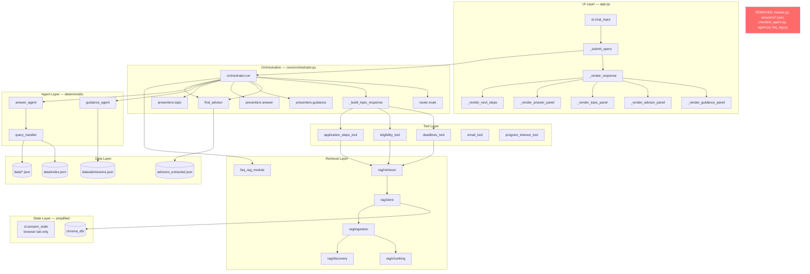
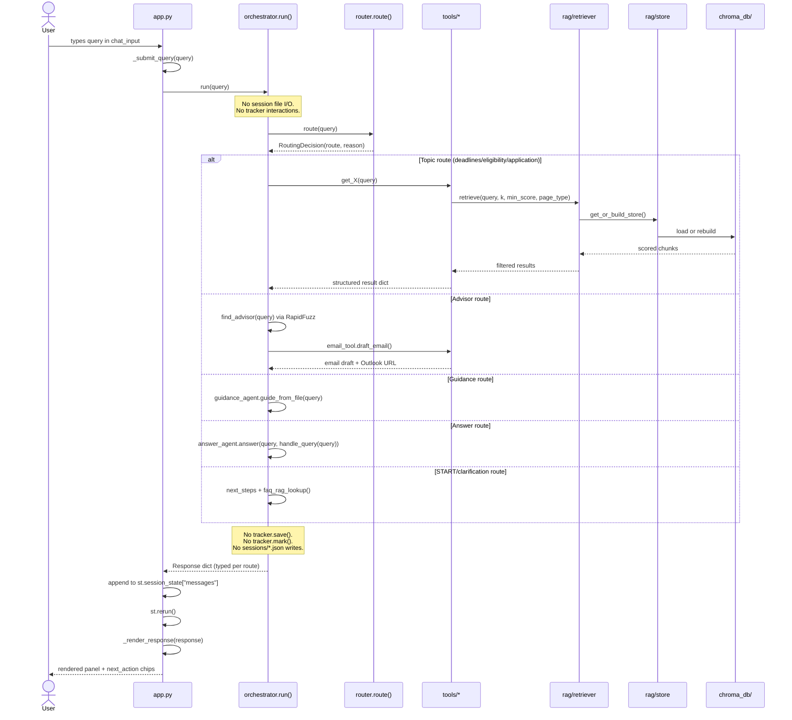
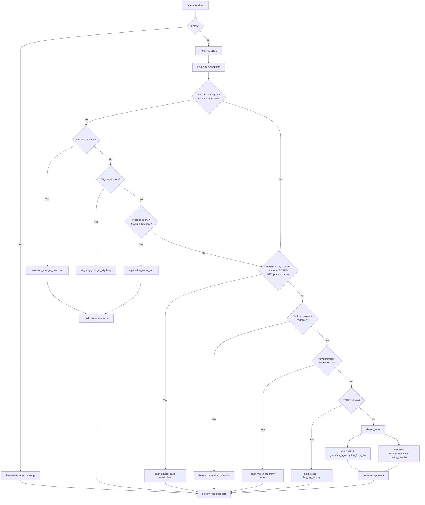
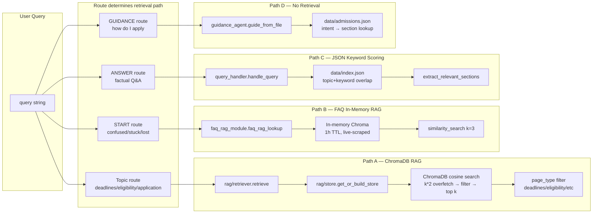
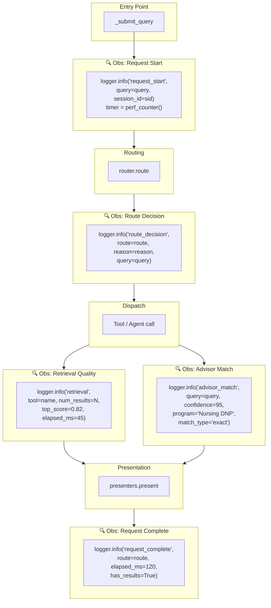

# CSULB Grad Center AI Assistant — Architecture Analysis

> Produced from direct codebase read. Every claim below references actual files, functions, and line numbers.
> CURRENT state is separated from TARGET recommendations throughout.
>
> **Revision 2 — May 2026**: Checklist tracking, task persistence, step-dependency management, and progress-bar workflows have been **removed from the product direction**. This document reflects the simplified system vision focused on guidance, retrieval, advisor routing, and production-grade orchestration.

---

## 1. UPDATED SYSTEM VISION

### Revised Core Purpose

This system is a **production-style agentic guidance and orchestration platform** for CSULB graduate admissions. It routes prospective and current graduate students to relevant information — deadlines, eligibility rules, application steps, advisor contacts, and FAQ content — via deterministic intent routing and multi-source RAG retrieval.

It is **not** a checklist-tracking platform, a task manager, or a step-completion engine.

### Revised Workflow Focus

| Was (Old Direction) | Is Now (Revised Direction) |
|---|---|
| Step-by-step checklist generation and tracking | Step-by-step **guidance delivery** (read-only, no state) |
| Progress bars, percent-done, motivation nudges | Clear next-step recommendations |
| `sessions/*.json` persistence with mark/pending/progress | Lightweight conversation context (Streamlit session state only) |
| Dependency-aware blocked-step workflows | Simple ordered guidance — no dependency graph |
| "Mark step 3 done" natural-language commands | "What should I do next?" guidance queries |
| Tracker-driven session lifecycle | Stateless request-response guidance |

### Revised Product Scope

The system answers four categories of questions:

1. **Informational** — "What GPA do I need?" "When is the deadline for DNP?" → RAG retrieval + structured response
2. **Procedural** — "How do I apply to a doctoral program?" → Ordered guidance steps (read-only)
3. **Directional** — "Who is the advisor for nursing?" → Fuzzy advisor matching + email draft
4. **Clarification** — "I don't know where to start" → FAQ retrieval + orientation next-steps

It does NOT manage:
- Task completion state
- Step dependencies or blocking
- Session-persistent progress
- User workflow timelines

### Revised AI System Responsibilities

| Responsibility | Status |
|---|---|
| Deterministic intent routing | **Core** — token-matching router, no LLM |
| Multi-source RAG retrieval | **Core** — ChromaDB + FAQ + keyword scoring |
| Advisor fuzzy matching | **Core** — RapidFuzz against advisor dataset |
| Guidance step generation | **Core** — rule-based extraction from `admissions.json` |
| Clarification/orientation | **Core** — START-intent detection + FAQ RAG |
| Email draft generation | **Core** — template-based advisor email |
| Checklist tracking | **Removed** — no longer a system responsibility |
| Progress persistence | **Removed** — no file-based session state |
| Step-dependency resolution | **Removed** — no blocked-step logic |
| Task state machines | **Removed** — no mark/pending/progress lifecycle |

---

## 2. UPDATED CURRENT ARCHITECTURE ANALYSIS

### What Becomes Unnecessary

| Component | File | Lines | Why It's Now Unnecessary |
|---|---|---|---|
| **`tracker.py`** | `tracker.py` | 508 | Entire module: save, load, mark, pending, progress, blocked_by, dependency graph, session file I/O. All of this was checklist-tracking infrastructure. |
| **`sessions/` directory** | Runtime artifact | — | File-based session persistence for checklist state. No longer needed. |
| **`_run_checklist()`** | `orchestrator.py` L256-261 | 6 | Calls `guide_from_file()` then `tracker.save()`. Without tracking, this is identical to `_run_guidance()`. |
| **`_run_tracking()`** | `orchestrator.py` L268-296 | 29 | Entire function: mark/pending/progress/list_sessions dispatcher. |
| **`_parse_tracking_command()`** | `orchestrator.py` L153-216 | 64 | Natural-language parser for "mark step 3 done", "what's my progress", etc. |
| **`_humanize_tracking()`** | `orchestrator.py` L630-834 | 205 | Progress bars, breakdown strings, blocked-step formatting, motivation messages, session listings. **Largest single humanizer.** |
| **`_humanize_checklist()`** | `orchestrator.py` L506-547 | 42 | Checklist-specific presentation with "Mark step 1 as in progress" prompts. |
| **`_format_current_focus()`** | `orchestrator.py` L358-385 | 28 | Renders blocked/in-progress/pending step as a "focus block". |
| **`_next_step_instruction()`** | `orchestrator.py` L388-430 | 43 | Generates "Step N is waiting on Step M" blocker instructions. |
| **`_tracking_next_actions()`** | `orchestrator.py` L602-627 | 26 | State-aware suggestion builder ("Mark step N as completed"). |
| **`_motivation()`** | `orchestrator.py` L326-343 | 18 | "🔥 You're in the home stretch" motivational messages. |
| **`_bar()`** | `orchestrator.py` L320-323 | 4 | Text-based progress bar renderer. |
| **Route.CHECKLIST**  | `orchestrator.py` L37 | 1 | Enum member |
| **Route.TRACKING** | `orchestrator.py` L39 | 1 | Enum member |
| **`_CHECKLIST_SIGNALS`** | `orchestrator.py` L72 | 1 | Signal set extraction |
| **`_STATUS_ALIASES`** | `orchestrator.py` L132-147 | 16 | done/complete/pending/reset aliases |
| **`_COMPLETION_VERBS`** | `orchestrator.py` L150 | 1 | Verb set for implicit "completed" status |
| **`checklist_agent.py`** | Root | 178 | Already dead code — unreachable from `app.py`. Confirmed legacy. |
| **`import tracker`** | `orchestrator.py` L26 | 1 | Module-level import of tracker |
| **`from guidance_agent import validate_steps`** | `tracker.py` L31 | 1 | Architectural coupling: state → agent layer |

**Total removable lines: ~465 from `orchestrator.py` + 508 from `tracker.py` = ~973 lines.**

### What Becomes Legacy/Deprecated

| Component | Current Role | New Status |
|---|---|---|
| `_humanize_checklist()` | Formats checklist with tracking prompts | **Merge into `_humanize_guidance()`** — same underlying data, different presentation |
| `Route.CHECKLIST` routing path | Separate route with tracker.save() side effect | **Merge into GUIDANCE** — same agent, no save |
| `detect_route()` CHECKLIST branch | First-priority routing to checklist | **Remove** — checklist signals ("todo", "check") reroute to GUIDANCE |
| `app.py` L1811 `route in ("guidance", "checklist")` | UI branch | **Simplify** — only `"guidance"` remains |

### What State Management Becomes Simpler

**Before (5 state locations):**
1. `st.session_state["messages"]` — chat history (browser tab)
2. `st.session_state["session_id"]` — session identity (browser tab)
3. `st.session_state["last_response"]` — last orchestrator response (browser tab)
4. `sessions/<id>.json` — checklist step statuses (disk) ← **REMOVED**
5. `chroma_db/` — vector store (disk, TTL-managed)

**After (4 state locations):**
1. `st.session_state["messages"]` — chat history (browser tab)
2. `st.session_state["session_id"]` — session identity (browser tab)
3. `st.session_state["last_response"]` — last orchestrator response (browser tab)
4. `chroma_db/` — vector store (disk, TTL-managed)

The entire file-based state layer disappears. No more write-locking concerns, no more session file divergence across tabs, no more `_blocked_by()` DFS traversals.

### What Orchestration Paths Become Cleaner

**Before: 9-branch priority chain** in `orchestrator.run()`:

```
1. Empty query guard
2. Deadline signals → deadlines_tool
3. Eligibility signals → eligibility_tool
4. Process+program → application_steps_tool
5. Advisor fuzzy match → advisor card + email
6. Doctoral no-match → program list
7. Advisor intent, no program → clarification prompt
8. START intent → next_steps + FAQ RAG
9. Fallback: detect_route() → GUIDANCE / CHECKLIST / ANSWER / TRACKING
```

**After: 7-branch priority chain** (2 routes eliminated):

```
1. Empty query guard
2. Deadline signals → deadlines_tool
3. Eligibility signals → eligibility_tool
4. Process+program → application_steps_tool
5. Advisor fuzzy match → advisor card + email
6. Doctoral no-match → program list
7. Advisor intent, no program → clarification prompt
8. START intent → next_steps + FAQ RAG
9. Fallback: detect_route() → GUIDANCE / ANSWER          ← CHECKLIST + TRACKING gone
```

The fallback `detect_route()` reduces from 4 routes to 2 routes. The `_ROUTE_RUNNERS` and `_HUMANIZERS` dicts lose 2 entries each. The `_ROUTE_SIGNALS` list loses the `CHECKLIST` entry entirely.

### Complexity That Disappears

| Complexity | Source | Impact of Removal |
|---|---|---|
| Dependency-aware step blocking | `tracker._blocked_by()` with DFS cycle detection | Entire graph traversal logic removed |
| Natural-language command parsing | `_parse_tracking_command()` — 64 lines of regex | No more "mark step 3 done" disambiguation |
| Session file I/O | `tracker._read()` / `_write()` / `_path()` | No disk writes outside of ChromaDB |
| Cross-layer coupling | `tracker.py` imports `guidance_agent.validate_steps` | State layer no longer depends on agent layer |
| Dual-render paths | `_humanize_checklist()` vs `_humanize_guidance()` | One guidance humanizer |
| State-aware suggestions | `_tracking_next_actions()` needs progress context | Static next-step suggestions |
| Progress math | `percent_done`, `to_go`, `ready`, `blocked` counters | No completion arithmetic |

### Complexity That Remains

| Complexity | Source | Why It Persists |
|---|---|---|
| 3 retrieval systems | ChromaDB RAG, FAQ in-memory Chroma, JSON keyword scoring | Different data sources, different TTLs, different access patterns |
| Implicit response schemas | Each route returns different dict keys | No TypedDict/dataclass per route |
| 1,411-line orchestrator | Routing + dispatch + presentation | Still doing 3 jobs even after tracking removal |
| Token-matching routing | Set intersection, substring matching, regex | Correct approach for no-LLM system, but fragile to keyword overlap |
| ~1,000 lines of CSS in app.py | Streamlit CSS injection | Framework limitation |
| Zero structured logging | `print()` only in rag/ modules | No observability |
| Duplicate logic | Stop words, advisor signals, tokenization in 3+ places | Still present |

---

## 3. UPDATED TARGET ARCHITECTURE

### Revised Module Boundaries

| Current | Target | Responsibility |
|---|---|---|
| `orchestrator.run()` 240-line if/elif | `core/router.py` | Pure routing: query → route name. No presentation, no tool calls |
| `orchestrator._humanize_*()` | `core/presenters.py` | Raw result → UI-ready dict. Only GUIDANCE, ANSWER, ADVISOR, TOPIC humanizers |
| `orchestrator._build_topic_response()` | stays in `core/orchestrator.py` | Call router, dispatch to tool, call presenter |
| `tracker.py` (508 lines) | **DELETED** | Entire module removed |
| `checklist_agent.py` | **DELETED** | Already dead code |
| `app.py` CSS injection | `theme.py` | CSS injected once |
| `app._render_*_panel()` | `renderers/` package | One renderer per route |

### Revised Folder Structure

```
GradCenterAgenticAIAssistant/
  app.py                    # Streamlit entry — thin shell, imports from core/
  core/
    router.py               # Query → Route (pure function, testable)
    orchestrator.py          # Route → dispatch to tool/agent → presenter
    presenters.py            # Raw result → UI-ready dict (GUIDANCE, ANSWER, ADVISOR, TOPIC)
    schemas.py               # Response dataclasses/TypedDicts per route
    clarification.py         # START-intent handling, "I don't know" detection
  agents/
    guidance_agent.py        # Step-by-step flows from admissions.json (read-only guidance)
    answer_agent.py          # Factual Q&A via query_handler waterfall
  tools/
    deadlines_tool.py
    eligibility_tool.py
    application_steps_tool.py
    advisor_tool.py          # (extracted from advisor_retrieval.py)
    email_tool.py
    program_interest_tool.py
  retrieval/
    rag/
      store.py               # ChromaDB lifecycle, TTL, self-healing
      retriever.py            # Cosine similarity search, page_type filtering
      ingestion.py            # HTML fetch+parse
      chunking.py             # RecursiveCharacterTextSplitter
      discovery.py            # Web crawler, content classifier
    keyword_retriever.py      # (extracted from query_handler.py)
    faq_retriever.py          # (renamed from faq_rag_module.py)
    advisor_retriever.py      # (renamed: fuzzy match logic from advisor_retrieval.py)
  observability/
    logger.py                # Structured logger setup
    metrics.py               # Route timing, score distributions
  evals/
    golden_queries.json      # Expected route per query
    test_routing.py          # Routing regression suite
    test_retrieval.py        # Precision/recall per page_type
  data/
    admissions.json
    advisors_extracted.json
    index.json
    ...
  chroma_db/                  # Runtime vector store (gitignored)
  _legacy/                    # Dead code quarantine
    agent.py                  # OpenAI gpt-4o-mini — dead
    checklist_agent.py        # Dead
    faq_rag.py                # Dead
    tracker.py                # Removed from product direction
    split_chunks.py           # Dead
```

**Key structural changes vs. previous target:**
- No `state/` directory — no `tracker.py`, no `session_store.py`
- No `sessions/` runtime directory
- `tracker.py` moves to `_legacy/`, not to `state/`
- `core/clarification.py` added — START-intent and "I'm confused" handling as a first-class concern
- `_humanize_checklist()` and `_humanize_tracking()` do not exist in `presenters.py`

### Revised Orchestration Flow

```python
# core/router.py — pure, testable, NO checklist/tracking routes

class Route(str, Enum):
    GUIDANCE  = "guidance"      # step-by-step guidance (read-only)
    ANSWER    = "answer"        # factual Q&A
    # Topic routes resolved before detect_route() — handled inline
    # Advisor routes resolved before detect_route() — handled inline

class RoutingDecision(NamedTuple):
    route: str         # "deadlines", "advisor", "guidance", "answer", "next_steps"
    reason: str        # "deadline_signal_matched", "advisor_fuzzy_match", etc.
    metadata: dict     # route-specific context (e.g. matched program name)

def route(query: str) -> RoutingDecision:
    """Returns route + reasoning. No side effects. No tool calls."""
```

```python
# core/orchestrator.py — dispatch + compose, NO tracker interactions

def run(query: str, session_id: str = "default") -> Response:
    decision = router.route(query)
    logger.info("route_decision", query=query, route=decision.route, reason=decision.reason)
    raw = _dispatch(decision, query)        # ← no session_id needed for dispatch
    return presenters.present(decision.route, raw)
```

### Revised Request Lifecycle

```
User types query
  → app._submit_query(query)
    → orchestrator.run(query)                    ← session_id OPTIONAL, context only
      → router.route(query) → RoutingDecision
      → _dispatch(decision, query)
        → tool.get_X(query) or agent.guide(query) or agent.answer(query)
      → presenters.present(route, raw_result) → typed Response dict
    → append to st.session_state["messages"]     ← browser-tab state only
    → st.rerun()
  → app._render_response(response)
    → branch on response.route → panel renderer
    → render next_actions as clickable chips
```

**What's different:**
- No `tracker.save()` side effect in any dispatch path
- No `tracker.mark()` / `tracker.pending()` / `tracker.progress()` calls
- No `sessions/*.json` file I/O
- `session_id` is conversation context, not a persistence key
- Responses are stateless — no "you're 40% done" state dependent on disk

### Revised State Strategy

| State | Where | Persistence | Scope | Purpose |
|---|---|---|---|---|
| Chat messages | `st.session_state["messages"]` | Browser tab | Per-tab | Conversation history for rendering |
| Session ID | `st.session_state["session_id"]` | Browser tab | Per-tab | Conversation identity |
| Last response | `st.session_state["last_response"]` | Browser tab | Per-tab | Re-render last response |
| ChromaDB vectors | `chroma_db/chroma.sqlite3` | Disk, 24h TTL | Global | Pre-computed embeddings |
| FAQ vectors | In-memory Chroma instance | Process memory, 1h TTL | Global | Ephemeral FAQ store |
| Embedding model | `_EMBEDDINGS` singleton | Process memory | Global | Loaded once per process |
| Advisor data | `advisors` list | Process memory | Global | Loaded at import time |

**Removed:**
- ~~`sessions/<id>.json`~~ — disk-persisted checklist state
- ~~Step status tracking~~ — pending/in_progress/completed per step
- ~~Dependency graph state~~ — blocked_by / depends_on resolution
- ~~Progress counters~~ — percent_done, completed, to_go

### Revised Infrastructure Responsibilities

| Responsibility | Current | Target |
|---|---|---|
| ChromaDB lifecycle | `rag/store.py` — works well | Keep as-is |
| FAQ scraping | `faq_rag_module.py` — separate in-memory store | Unify interface with RAG retriever |
| Session file I/O | `tracker.py` | **Remove entirely** |
| Disk writes | ChromaDB + sessions/ | **ChromaDB only** |
| Structured logging | Absent | `observability/logger.py` |
| Evaluation | Absent | `evals/` package |
| Health check | Absent | Streamlit health endpoint (future) |

---

## 4. UPDATED MERMAID DIAGRAMS

### Diagram 1: High-Level Architecture



### Diagram 2: Request Lifecycle



### Diagram 3: Orchestration Flow (Simplified)



**Key difference from previous diagram:** No CHECKLIST or TRACKING branches. `detect_route()` resolves to GUIDANCE or ANSWER only.

### Diagram 4: Retrieval Flow



### Diagram 5: Observability Insertion Points



---

## 5. UPDATED STATE MANAGEMENT STRATEGY

### What State Is Still Needed

| State | Need | Reason |
|---|---|---|
| Chat message history | **Yes** | Users expect to scroll back through their conversation |
| Session identity | **Yes** | Distinguishes concurrent browser tabs |
| Last response | **Yes** | Re-render on Streamlit re-run |
| ChromaDB vectors | **Yes** | Pre-computed embeddings, 24h TTL |
| FAQ vectors | **Yes** | In-memory ephemeral store, 1h TTL |
| Advisor dataset | **Yes** | Loaded once at import, used for fuzzy matching |

### Whether Lightweight Session Memory Is Enough

**Yes.** Streamlit's built-in `st.session_state` is sufficient for all remaining state needs:

- **Chat history** — `st.session_state["messages"]` already works. Each tab has its own list. No cross-tab sync needed.
- **Session identity** — `st.session_state["session_id"]` already works. Used for display, not for file persistence.
- **Last response** — `st.session_state["last_response"]` already works. Re-rendered on each Streamlit re-run.

No external session store is needed. The system is stateless at the request level — every query is self-contained. Context comes from the query itself, not from persisted progress.

### Whether Persistence Is Still Necessary

**Only for ChromaDB.** The vector store must persist on disk because rebuilding embeddings costs 30-60 seconds. The 24h TTL manages freshness. This is infrastructure persistence (caching), not user-facing state.

**No user state needs persistence.** With checklist tracking removed:
- No step statuses to save
- No progress to resume
- No dependency graphs to reconstruct
- No cross-session continuity

If a user closes their tab and returns, they start fresh. This is the correct behavior for a guidance/Q&A system — the information doesn't change based on where the user left off.

### How Conversation/Session Context Should Work

```python
# app.py — session init (what already exists, unchanged)
if "session_id" not in st.session_state:
    st.session_state["session_id"] = "default"
if "messages" not in st.session_state:
    st.session_state["messages"] = []
if "last_response" not in st.session_state:
    st.session_state["last_response"] = None
```

The orchestrator receives the query and returns a response. The response is appended to the message list. No other state interaction occurs.

**Future option:** If multi-turn context becomes important (e.g., "What about for international students?" following a deadlines query), conversation context can be passed as a parameter to the orchestrator — extracted from the last N messages in `st.session_state["messages"]`. This is a read-only operation, no writes.

### What State Should NOT Exist Anymore

| State | Why It's Gone |
|---|---|
| `sessions/<id>.json` files | No checklist tracking — no step statuses to persist |
| Step `status` field (`pending` / `in_progress` / `completed`) | No task state machine |
| `depends_on` / `blocked_by` computed state | No dependency resolution |
| `percent_done` / `completed` / `to_go` counters | No progress tracking |
| `updated_at` timestamps on session records | No session lifecycle |
| `_STORE_VALIDATED` flag re: program pages | Keep — this is infrastructure state for self-healing |

---

## 6. UPDATED OBSERVABILITY + EVALUATION STRATEGY

### What Should Still Be Evaluated

With checklist tracking removed, the system's correctness reduces to three measurable dimensions:

1. **Routing correctness** — Does the query reach the right handler?
2. **Retrieval quality** — Does the handler find relevant content?
3. **Response quality** — Is the formatted response helpful and accurate?

### Critical Metrics

#### Routing Metrics

| Metric | How to Measure | Why It Matters |
|---|---|---|
| Route accuracy | Golden query set → expected route | A misroute is a total failure — user gets wrong information |
| Route distribution | Count queries per route per session | Detects routing bias (e.g., everything falling to ANSWER) |
| Signal overlap conflicts | Log when multiple signal sets match | Catches ambiguous queries that could go either way |
| Fallback rate | % of queries hitting `detect_route()` fallback | High fallback rate = topic-priority routing isn't catching enough |

#### Retrieval Metrics

| Metric | How to Measure | Why It Matters |
|---|---|---|
| Top-1 score | `results[0]["score"]` logged per query | Low top scores = poor embedding match or wrong page_type |
| Score distribution | Histogram of all returned scores | Detects threshold miscalibration |
| Zero-result rate | % of tool calls returning `[]` | Should be < 5% for in-scope queries |
| Page type accuracy | Does the page_type filter match the query intent? | Wrong filter = searching the wrong corpus subset |
| Retrieval latency | `time.perf_counter()` around `retrieve()` | Detects ChromaDB performance degradation |

#### Advisor Routing Metrics

| Metric | How to Measure | Why It Matters |
|---|---|---|
| Match confidence distribution | Log `advisor_result["confidence"]` | Detects fuzzy match threshold issues |
| False-positive rate | Queries that match an advisor but shouldn't | "apply for nursing" → advisor card instead of steps |
| No-match rate for advisor-intent queries | User says "who is the advisor" but no match | Dataset coverage gap |
| Program alias coverage | Which abbreviations resolve correctly | "dnp" works, but does "doctor of nursing" work? |

#### Clarification Metrics

| Metric | How to Measure | Why It Matters |
|---|---|---|
| START-intent trigger rate | % of queries matching `_START_TOKENS` | Too high = token set is too broad |
| Clarification → follow-up rate | Does the user ask a more specific question after clarification? | Measures if clarification is helpful |
| "I don't know" response rate | answer_agent returning `confidence: "low"` | High rate = RAG coverage gap |

### Observability Events (Priority Order)

| Event | Where | Structured Fields | Priority |
|---|---|---|---|
| `request_start` | `_submit_query()` | query, session_id, timestamp | **P0** |
| `route_decision` | After `router.route()` | query, route, reason, signals_matched | **P0** |
| `retrieval_complete` | After each `retrieve()` call | tool, query, num_results, top_score, elapsed_ms, page_type_filter | **P0** |
| `advisor_match` | After `find_advisor()` | query, confidence, program_matched, match_type | **P0** |
| `request_complete` | End of `orchestrator.run()` | route, elapsed_ms, has_results, response_keys | **P0** |
| `rag_rebuild` | `store.build_vector_store()` | num_chunks, elapsed_ms, trigger_reason | **P1** |
| `faq_rebuild` | `faq_rag_module._build_vectorstore()` | num_chunks, elapsed_ms | **P1** |
| `routing_ambiguity` | When multiple signal sets match | query, matched_signals, chosen_route | **P1** |
| `no_results` | When tool returns empty | tool, query, page_type_filter, min_score | **P1** |

### What Observability Is NOT Needed (Removed)

| Was Planned | Why Removed |
|---|---|
| `state_change` events (mark step N) | No state changes |
| Session lifecycle events (create, load, delete) | No session files |
| Progress tracking events | No progress to track |
| Dependency resolution events | No dependency graph |
| Blocked-step alerts | No blocking logic |

---

## 7. UPDATED REFACTOR STRATEGY

### Phase 0 — Housekeeping + Tracker Removal (Risk: Low. Time: 2 hours)

**What:**
1. Move dead code to `_legacy/`: `agent.py`, `checklist_agent.py`, `faq_rag.py`, `split_chunks.py`, **`tracker.py`**
2. Remove `sessions/` directory (or gitignore it)
3. Remove `import tracker` from `orchestrator.py` (line 26)
4. Remove `Route.CHECKLIST` and `Route.TRACKING` enum members
5. Remove `_run_checklist()`, `_run_tracking()` from `_ROUTE_RUNNERS`
6. Remove `_humanize_checklist()`, `_humanize_tracking()` from `_HUMANIZERS`
7. Remove `_parse_tracking_command()`, `_STATUS_ALIASES`, `_COMPLETION_VERBS`
8. Remove `_tracking_next_actions()`, `_format_current_focus()`, `_next_step_instruction()`, `_motivation()`, `_bar()`
9. Remove CHECKLIST entry from `_ROUTE_SIGNALS`
10. Update `detect_route()` to remove CHECKLIST/TRACKING branches
11. Update `app.py` L1811 to remove `"checklist"` from route check
12. Update welcome message `next_actions` to remove checklist references

**Why:** This is the first thing to do because it makes the architecture honest. Anyone reading the code sees what the system actually does — not what it used to aspire to do. ~465 lines removed from orchestrator + 508 from tracker = ~973 lines of deleted complexity. Zero behavior change for all non-checklist queries.

**Verification:** Run every non-checklist query path manually. Confirm all topic, advisor, guidance, answer, and next_steps routes work unchanged.

### Phase 1 — Add Structured Logging (Risk: Very low. Time: 2-3 hours)

**What:**
- Add `import logging` + `logger = logging.getLogger(__name__)` to `orchestrator.py`, `rag/store.py`, `rag/retriever.py`, each tool
- Replace `print()` statements with `logger.info()`
- Add `logger.info("route_decision", ...)` at each routing branch in `orchestrator.run()`
- Add `time.perf_counter()` around `orchestrator.run()` in `_submit_query()`
- Add `logger.info("retrieval", ...)` after each `retrieve()` call in tools

**Why:** Highest-value single change. When a query misroutes, you have a trail. When retrieval is slow, you know which tool. Zero behavior change.

### Phase 2 — Define Response Schemas (Risk: Low. Time: 2-3 hours)

**What:** Create `core/schemas.py` with a TypedDict per route:

```python
class GuidanceResponse(TypedDict):
    query: str
    route: Literal["guidance"]
    summary: str
    primary_action: str
    steps: list[dict]
    total_steps: int
    source: SourceDict
    next_actions: list[str]

class AdvisorResponse(TypedDict):
    query: str
    route: Literal["advisor"]
    summary: str
    primary_action: str
    advisor_data: dict
    email_draft: NotRequired[dict]
    source: SourceDict
    next_actions: list[str]

class TopicResponse(TypedDict):
    query: str
    route: Literal["deadlines", "eligibility", "application"]
    summary: str
    primary_action: str
    tool_result: dict
    source: SourceDict
    next_actions: list[str]

class AnswerResponse(TypedDict):
    query: str
    route: Literal["answer"]
    summary: str
    primary_action: str
    answer: Any
    confidence: Literal["high", "medium", "low"]
    source: SourceDict
    next_actions: list[str]
```

**Why:** The implicit response contract is the #1 source of silent UI bugs. With checklist/tracking removed, there are only 5 response shapes to define instead of 11. Much more manageable.

### Phase 3 — Extract Router (Risk: Low. Time: 3-4 hours)

**What:** Extract the routing logic from `orchestrator.run()` into a pure function:

```python
# core/router.py
def route(query: str) -> RoutingDecision:
    """Query → RoutingDecision. Pure function. No side effects. No tool calls."""
    ...
```

`orchestrator.run()` becomes: `decision = route(query)` → dispatch → present.

**Why:** The routing logic is currently untestable because it's entangled with tool dispatch and presentation. After Phase 0 removes checklist/tracking, the router has only 7 branches instead of 9 — much simpler to extract.

### Phase 4 — Consolidate Duplicate Logic (Risk: Low. Time: 2 hours)

**What:**
- Merge `_STOP_WORDS` sets across `orchestrator.py`, `guidance_agent.py`, `advisor_retrieval.py` into one shared constant
- Merge process-query detection into one shared function
- Merge the three inline tokenization calls into one `_tokenize()` at top of `run()`
- Unify `_ADVISOR_SIGNALS` and `_ADVISOR_INTENT` (currently different sets doing the same thing)

**Why:** Three copies of the same logic will inevitably drift. With tracker removed, there's one less module with duplicate stop words.

### Phase 5 — Unify Retrieval Interface (Risk: Medium. Time: Half day)

**What:** Define a shared retrieval interface:

```python
class RetrievalResult(TypedDict):
    text: str
    score: float
    source_url: str
    metadata: dict
```

Wrap `rag/retriever.retrieve()`, `faq_rag_module.faq_rag_lookup()`, and `query_handler.handle_query()` behind this interface. Don't merge them — just make them polymorphic.

**Why:** Three retrieval systems with three return shapes makes it impossible to add cross-cutting concerns (logging, score normalization) without touching three files.

### Phase 6 — Add Routing Eval Harness (Risk: Zero. Time: Half day)

**What:** Create `evals/golden_queries.json` with 30-50 queries and expected routes. Write a test that runs each query through the router and asserts the route.

**Note:** With checklist/tracking removed, the golden set is simpler — no "mark step 3 done" or "what's my progress?" test cases. Focus on:
- Topic queries (deadlines, eligibility, application steps)
- Advisor queries (program names, abbreviations, "who is the advisor")
- Guidance queries (generic "how do I apply")
- Answer queries (factual "what GPA do I need")
- START/clarification queries ("I'm confused", "where do I start")
- Ambiguous queries that test routing priority

```python
# evals/test_routing.py
def test_routing_golden_set():
    for case in load_golden_queries():
        decision = router.route(case["query"])
        assert decision.route == case["expected_route"], \
            f"Query '{case['query']}' routed to {decision.route}, expected {case['expected_route']}"
```

**Why:** This is the safety net. Without it, every routing change is a manual "try 10 queries" process. With it, you run `pytest evals/` in 2 seconds and know nothing broke.

### Phase Summary

| Phase | Risk | Time | Value |
|---|---|---|---|
| 0. Tracker removal + housekeeping | Low | 2 hours | **~973 lines removed**. Architecture clarity. |
| 1. Structured logging | Very low | 2-3 hours | Debuggability (highest ROI) |
| 2. Response schemas | Low | 2-3 hours | UI stability — only 5 shapes to define now |
| 3. Extract router | Low | 3-4 hours | Testability — 7 branches not 9 |
| 4. Consolidate duplicates | Low | 2 hours | Maintainability |
| 5. Unify retrieval interface | Medium | Half day | Cross-cutting concerns |
| 6. Routing eval harness | Zero | Half day | Regression safety |

**Total: ~3 days of focused work. Zero rewrites. ~973 lines removed in Phase 0 alone.**

After these 6 phases (down from 7 — tracker decoupling is no longer needed because tracker is gone), the system has:
- **~970 fewer lines** of code
- **2 fewer routes** to maintain
- **No file-based state layer**
- Visible routing logic (extractable, testable)
- Typed response contracts (5 shapes, not 11)
- Structured logging (debuggable)
- A regression test suite for routing
- Unified retrieval interface

---

## 8. FINAL PRINCIPAL ENGINEER ASSESSMENT

### Why Removing Checklist Tracking Simplifies the Architecture

The tracker subsystem was the single largest source of architectural complexity per-feature-value:

| Before | After |
|---|---|
| `tracker.py` — 508 lines of state management, dependency resolution, DFS blocking, progress math, file I/O, CLI | **Deleted** |
| `_humanize_tracking()` — 205 lines, the largest humanizer | **Deleted** |
| `_humanize_checklist()` — 42 lines (duplicate of guidance) | **Merged into guidance** |
| `_run_checklist()` + `_run_tracking()` — 35 lines of dispatch | **Deleted** |
| `_parse_tracking_command()` — 64 lines of NL command parsing | **Deleted** |
| 5 helper functions for tracking presentation — ~120 lines | **Deleted** |
| `Route.CHECKLIST` + `Route.TRACKING` — 2 enum members, 2 signal sets | **Deleted** |
| `sessions/*.json` — persistent state, write-locking risks, cross-tab divergence | **Deleted** |
| `tracker.py` → `guidance_agent.validate_steps` import — cross-layer coupling | **Deleted** |

**Total removed: ~973 lines across 2 files + 2 fewer routes + 2 fewer humanizers + 0 file-based state.**

The remaining system has:
- **Zero disk writes** outside of ChromaDB (infrastructure caching)
- **No cross-layer coupling** between state and agent layers
- **2 fallback routes** instead of 4 in `detect_route()`
- **5 response shapes** instead of 11
- **No NL command parsing** (the most fragile part of the routing system)

### Whether This Improves the Project Strategically

**Yes, unambiguously.** Three reasons:

1. **Focus sharpens the value proposition.** A guidance system that does retrieval, routing, and advisor matching well is more valuable than one that also does checklist tracking poorly. Checklist tracking is a solved problem (Todoist, Notion, any task manager). RAG-backed graduate admissions guidance is not.

2. **Fewer moving parts = faster iteration.** Every feature added to the system makes every other feature harder to change. Removing the tracker means the orchestrator, the response schemas, and the UI renderers are all simpler. Future features (multi-turn context, LLM-enhanced responses, evaluation pipelines) have less to work around.

3. **No production cost.** The tracker was never production-critical. It was a prototype feature that demonstrated state management capability but didn't address a real user need. Students don't track their admissions checklist inside a chatbot — they use email reminders, university portals, and personal todo apps.

### How This Changes the System Positioning

**Before:** "AI chatbot that guides students AND tracks their progress through checklists" — positioned as a hybrid guidance + task-management tool. Competes with generic task managers on the tracking axis.

**After:** "AI-powered graduate admissions guidance system with deterministic routing, multi-source retrieval, and advisor matching" — positioned as a domain-specific information retrieval and orchestration system. Competes on retrieval quality and routing accuracy.

The second framing is stronger for several reasons:
- It's what the system actually does well
- It highlights engineering decisions (deterministic routing, RAG pipeline, fuzzy matching) rather than commodity features (checklists)
- It's a better AI systems engineering narrative for interviews, demos, and portfolio reviews
- It aligns with where production AI systems are heading: reliable orchestration, observable pipelines, evaluated retrieval

### How Senior Engineers Would View This Narrower Focus

A senior or principal engineer evaluating this system would see:

**Positive signals:**
- Willingness to cut features that don't serve the core mission
- Understanding that feature count ≠ quality
- Clean separation of concerns after tracker removal
- Focus on reliability (routing correctness, retrieval quality) over breadth
- Observability and evaluation as first-class concerns
- No premature optimization or framework chasing

**Red flags that disappear:**
- ~~"Why is there a dependency-aware task manager inside a chatbot?"~~ — gone
- ~~"Why does the state layer import from the agent layer?"~~ — gone
- ~~"Why are there 11 response shapes with no schemas?"~~ — down to 5
- ~~"Why is `orchestrator.run()` doing routing, dispatch, AND progress tracking?"~~ — routing + dispatch only

### Whether This Creates a Stronger AI Systems Engineering Narrative

**Yes.** The system becomes a cleaner example of production AI engineering patterns:

| Pattern | Implementation |
|---|---|
| Deterministic orchestration | Token-matching router with priority chain, no LLM in production path |
| Multi-source retrieval | ChromaDB RAG + in-memory FAQ + JSON keyword scoring, unified interface |
| Fuzzy entity matching | RapidFuzz with threshold hierarchy for advisor resolution |
| Observable pipeline | Structured logging at routing, retrieval, and presentation layers |
| Evaluated system | Golden query sets for routing regression, retrieval precision measurement |
| Production-grade state | Stateless request-response (ChromaDB caching is infrastructure, not user state) |
| Clean module boundaries | Router / orchestrator / presenter / tool / retriever — each with single responsibility |

This is a system that demonstrates **judgment** — knowing what to build, what to cut, and why. That signal is stronger than feature breadth.

### Final Recommendation

Execute Phase 0 (tracker removal + housekeeping) immediately. It's the highest-value, lowest-risk change. ~973 lines deleted, zero behavior change, architecture made honest.

Then proceed through Phases 1-6 in order: logging → schemas → router extraction → dedup → retrieval interface → eval harness. Each phase is independently shippable. Each makes the system measurably better.

The end state is a system with:
- **~3,500 fewer lines** of code (dead code + tracker + checklist)
- **7 routes** instead of 9 in the orchestrator
- **2 routes** instead of 4 in `detect_route()` fallback
- **5 response schemas** instead of 11
- **Zero file-based state**
- **Structured observability** at every decision point
- **Automated routing regression tests**
- **Unified retrieval interface**

That's a production-grade AI guidance system. No task manager. No progress bars. No dependency graphs. Just clean routing, good retrieval, and reliable answers.

Phase 1 Observability Completed

- Added structured NDJSON logging

- Added request correlation IDs

- Added route decision tracing

- Added retrieval metrics

- Added advisor matching metrics

- Added tool execution metrics

- Added store lifecycle events

Key findings:

- ChromaDB cold load ~3.9s, warm ~37ms

- FAQ store cold build ~4.6s, warm ~45ms

- No routing regressions detected

Retrieval architecture finding:
- Topic tools use persistent ChromaDB.
- FAQ/start guidance uses a separate in-memory FAQ RAG store.
- Advisor matching uses RapidFuzz, correctly avoiding vector search.
- Guidance uses structured admissions.json.
- Answer fallback uses JSON keyword scoring.
- Cold starts affect ChromaDB-backed routes and FAQ RAG-backed routes, but not advisor/guidance/answer routes.

Phase 2A completed:
- Added golden query dataset
- Added routing evaluation harness
- Evaluates route, reason, retrieval event structure, fallback behavior, advisor outcome
- Produces JSON reports
- Baseline: 19 PASS / 0 FAIL / 1 KNOWN_FAIL
- gate_pass_rate: 100%
- p50 latency: 0.9ms
- p95 latency: 17.1ms

## Phase 2 — Evaluation Harness

Phase 2 introduced a deterministic evaluation layer for the Grad Center Assistant.

The goal was to move from manual testing to repeatable behavioral validation.

### What was added

- Golden query dataset in `evals/golden_queries.json`
- Evaluation runner in `evals/run_evals.py`
- JSON reports in `evals/reports/`
- Route correctness validation
- Route reason validation using `route.decision` logs
- Retrieval event structure validation
- Fallback behavior validation
- Advisor outcome validation
- Backend inference validation
- Vector DB usage reporting

### Current baseline

- Total cases: 34
- PASS: 33
- FAIL: 0
- SKIP / known issue: 1
- Gate pass rate: 100%
- Backend match: 33 / 33
- Backend mismatches: 0
- Vector DB touched: 15 / 33 cases

### What the evaluation checks

The harness validates whether each query reaches the expected:

- route
- route reason
- retrieval backend
- ChromaDB page type
- retrieval event structure
- fallback behavior
- advisor matching outcome

This does not yet evaluate final answer quality or factual correctness.

### Why this matters

The system can now detect routing and backend regressions automatically before future architecture changes.

This creates a baseline for future work such as:
- retrieval consolidation
- backend instrumentation
- intent classification improvements
- LLM-assisted routing or response generation

### Current limitation

Some backends are still partially unobserved:

- `query_handler` / JSON keyword scoring
- `admissions_rag` / live HTTP + snippet path
- FAQ RAG query-level retrieval

These should be instrumented before deeper answer-quality evaluation.

Phase 3A — Backend Observability

Added:
- faq_rag.query
- keyword.retrieval
- keyword.result

Coverage:
- FAQ retrieval visibility
- Keyword retrieval visibility
- Answer extraction visibility

Status:
- 34/34 gate pass
- backend_match 100%
- no behavior changes

Phase 3B
- Added faq_rag.query, keyword.retrieval, and keyword.result to eval report capture.
- Backend inference now uses faq_rag.query as direct evidence.
- next_steps cases now report actual_backend=faq_rag instead of faq_rag_inferred.
- No production behavior changes.

### Phase 4A — FAQ RAG Double-Call Removal

- Removed duplicate `faq_rag_lookup()` call from the `start_intent` path in `orchestrator.py`.
- `next_steps.get_next_steps()` now owns FAQ retrieval for next-step guidance.
- Reduced FAQ RAG calls from 2 to 1 per `next_steps` request.
- Preserved response behavior and schema.
- Eval gates remain green: 0 FAIL, 0 ERROR, 100% gate pass rate.

### Phase 4B — Transfer Credit Keyword Coverage

- Fixed an answer-route quality gap for transfer-credit questions.
- Added minimal keyword coverage for `transfer` and `credits` in `data/index.json`.
- Routed transfer-credit queries to `admissions.json`, which contains the transfer-credit policy.
- Eliminated fallback behavior for `answer_003` and `answer_006`.
- Before: `answer_type=unknown`, `confidence=low`.
- After: `answer_type=list/direct`, `confidence=medium/high`.
- Eval gates remain green: 0 FAIL, 0 ERROR, 100% gate pass rate.
### Current Status

- 34 eval cases

- 100% gate pass rate

- 100% backend match rate

- End-to-end backend observability

### Phase 5B — Keyword Coverage Expansion

- Added minimal keyword mappings for common graduate advising terms:
  - admission
  - admitted
  - register
  - activate
  - account
  - assistantship / assistantships
  - requirements
  - appeal
- Fixed 8 previously-fallbacking queries.
- Before: `fallback=True`, `answer_type=unknown`, `confidence=low`.
- After: `fallback=False`, `answer_type=direct/faq/list`, `confidence=medium/high`.
- No code, routing, or extraction changes.
- Eval gates remain green: 0 FAIL, 0 ERROR, 100% gate pass rate.


### Phase 5C — Advising Query Classification Fix

- Removed `advising` from the legacy advisor trigger set in `query_handler.py`.
- Fixed a false-positive advisor fallback for general Grad Center advising-service questions.
- Example fixed query: “Does the Graduate Center provide academic advising?”
- Before: `answer_type=unknown`, `confidence=low`.
- After: `answer_type=direct`, `confidence=high`.
- No routing changes; orchestrator behavior unchanged.
- Eval gates remain green: 0 FAIL, 0 ERROR, 100% gate pass rate.

### Phase 6B — Answer Extraction Quality Improvements

Improved final answer quality after Phase 6A showed that some queries routed correctly and used the right backend, but still produced weak or wrong final answers.

#### Phase 6B-1 — Eligibility Trigger Narrowing
- Removed the overbroad `can` trigger from `_extract_eligibility`.
- Prevented general yes/no questions like “Can I transfer credits?” from incorrectly returning eligibility/GPA-style answers.
- No routing, backend, or index changes.

#### Phase 6B-2 — FAQ Scoring Relevance
- Improved FAQ answer selection by reducing the impact of common question words.
- Added content-focused FAQ scoring with stronger weighting for meaningful FAQ question-token overlap.
- Prevented unrelated FAQ entries from winning due to overlap on words like “how”, “do”, “I”, or “my”.
- Preserved existing strong FAQ matches.

#### Phase 6B-3 — Generic Extraction Section-Key Relevance
- Updated `_extract_generic` to consider section key names in addition to section body text.
- Added a section-key relevance bonus so sections like `advising` and `fellowships_and_scholarships` can win when the user query directly matches those concepts.
- Avoided broad density normalization after audit showed it did not fix target cases and risked regressions.

#### Validation
- Full eval suite remains green.
- `0 FAIL`
- `0 ERROR`
- `100% gate pass rate`
- `100% backend match rate`

#### Deferred
- Transfer-credit answer quality still needs a source-data improvement in `admissions.json`.
- Accept-offer/application-step questions need a separate `_extract_steps` selection improvement.

### Phase 7A — Typed Response Contracts

- Added lightweight `TypedDict` contracts for orchestrator response shapes.

- Introduced `OrchestratorResponse` union for all route response types.

- Annotated `orchestrator.run()` and `_build_topic_response()`.

- Documented distinct response shapes for guidance, answer, advisor, topic, next_steps, and welcome responses.

- No runtime behavior changes.

- Eval gates remain green: 0 FAIL, 0 ERROR, 100% gate pass rate.

### Phase 7B — Router Extraction

- Extracted routing decision logic from `orchestrator.py` into `router.py`.
- Added `RouteDecision` dataclass to represent routing outcomes and route-specific payloads.
- Moved route signal constants, `Route` enum, and `detect_route()` into the router layer.
- Reduced `orchestrator.py` from ~900 lines to ~712 lines.
- `orchestrator.run()` is now a thin wrapper: normalize query → `decide_route()` → dispatch response.
- Added 26 router unit tests covering all routing branches and reason codes.
- Preserved route outcomes, route reasons, response schemas, and `route.decision` log fields.
- Full eval suite remains green: 0 FAIL, 0 ERROR, 100% gate pass rate, 100% backend match.

### Phase 7C — Golden Route Assertions

- Added a declarative route-level golden dataset in `evals/golden_routes.json`.
- Added `test_golden_routes.py` to validate `router.decide_route()` directly.
- Covered all route/reason combinations, including the `welcome` empty-query path.
- Tests mock advisor lookup, program detection, and next-step detection to avoid retrieval/tool execution.
- Added route-level protection independent of Chroma, answer generation, and backend execution.
- Validation:
  - `test_golden_routes.py`: 30/30 passed
  - `test_router.py`: 26/26 passed
  - full eval suite remains green with 100% gate pass and 100% backend match.
