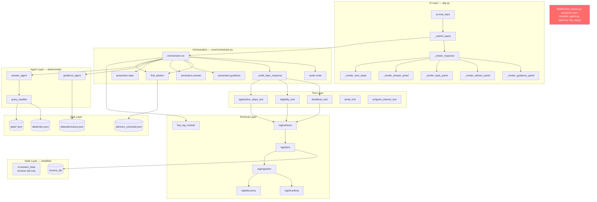
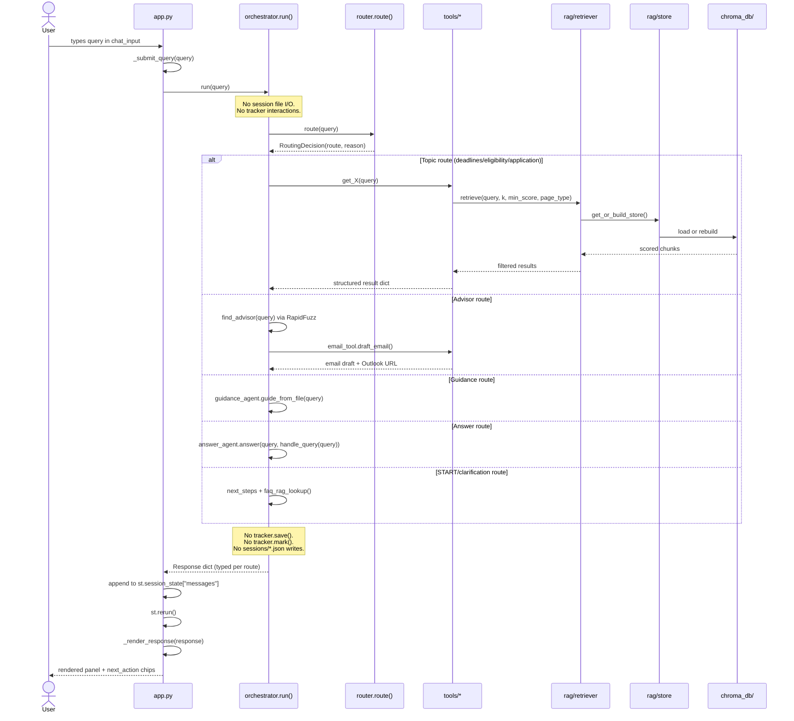
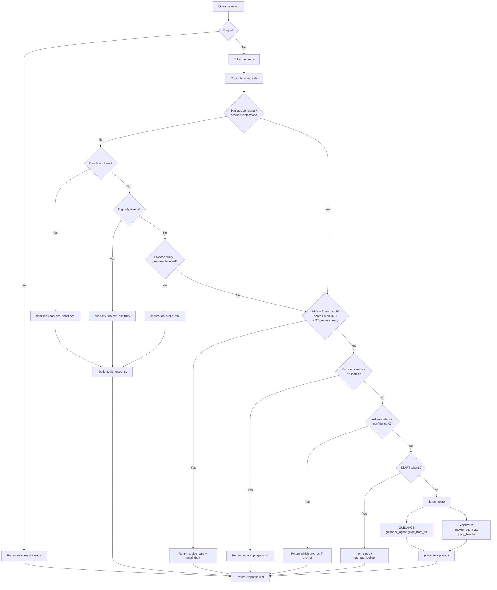
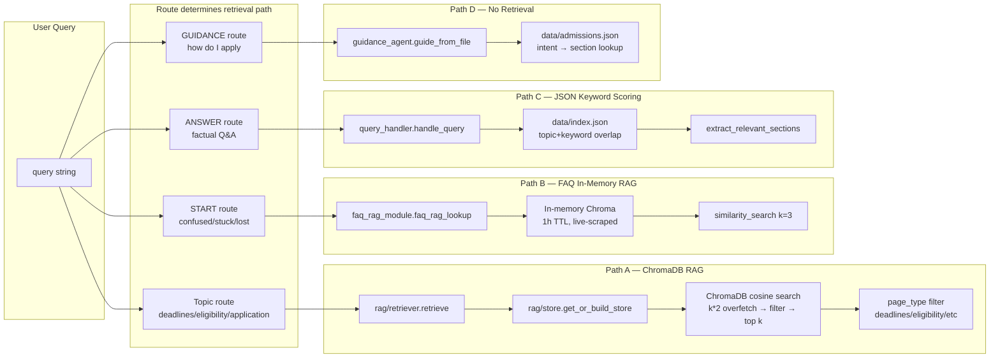
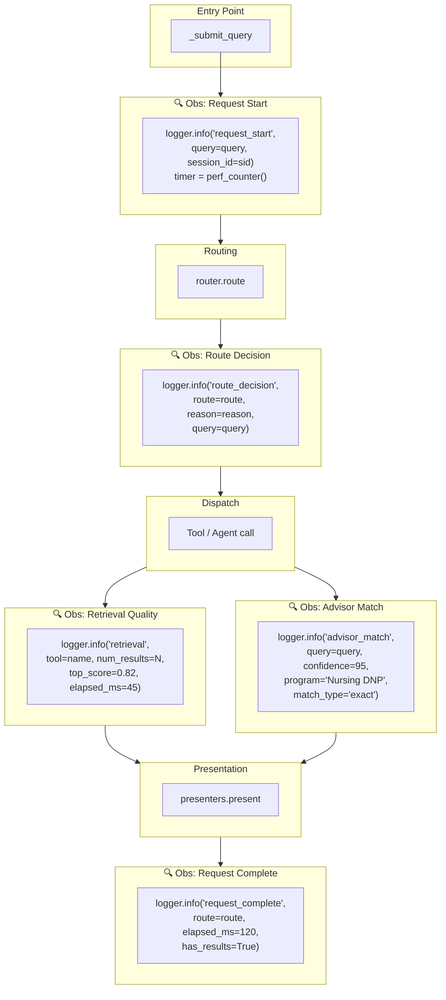
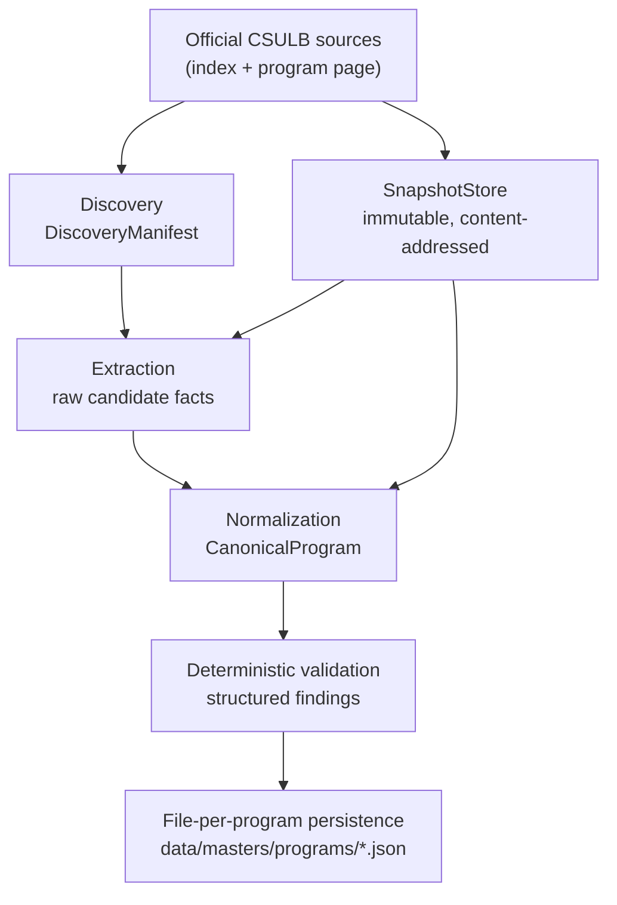
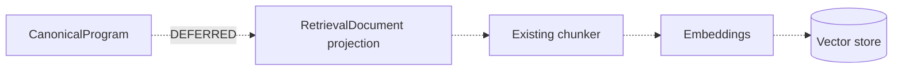

# CSULB Grad Center AI Assistant — Architecture Analysis

> Produced from direct codebase read. Every claim below references actual files, functions, and line numbers.
> CURRENT state is separated from TARGET recommendations throughout.
>
> **Revision 2 — May 2026**: Checklist tracking, task persistence, step-dependency management, and progress-bar workflows have been **removed from the product direction**. This document reflects the simplified system vision focused on guidance, retrieval, advisor routing, and production-grade orchestration.

---

## 1. UPDATED SYSTEM VISION

### Revised Core Purpose

This system is a **production-style agentic guidance and orchestration platform** for CSULB graduate admissions. It routes prospective and current graduate students to relevant information — deadlines, eligibility rules, application steps, advisor contacts, and FAQ content — via deterministic intent routing and multi-source RAG retrieval.

It is **not** a checklist-tracking platform, a task manager, or a step-completion engine.

### Revised Workflow Focus

| Was (Old Direction) | Is Now (Revised Direction) |
|---|---|
| Step-by-step checklist generation and tracking | Step-by-step **guidance delivery** (read-only, no state) |
| Progress bars, percent-done, motivation nudges | Clear next-step recommendations |
| `sessions/*.json` persistence with mark/pending/progress | Lightweight conversation context (Streamlit session state only) |
| Dependency-aware blocked-step workflows | Simple ordered guidance — no dependency graph |
| "Mark step 3 done" natural-language commands | "What should I do next?" guidance queries |
| Tracker-driven session lifecycle | Stateless request-response guidance |

### Revised Product Scope

The system answers four categories of questions:

1. **Informational** — "What GPA do I need?" "When is the deadline for DNP?" → RAG retrieval + structured response
2. **Procedural** — "How do I apply to a doctoral program?" → Ordered guidance steps (read-only)
3. **Directional** — "Who is the advisor for nursing?" → Fuzzy advisor matching + email draft
4. **Clarification** — "I don't know where to start" → FAQ retrieval + orientation next-steps

It does NOT manage:
- Task completion state
- Step dependencies or blocking
- Session-persistent progress
- User workflow timelines

### Revised AI System Responsibilities

| Responsibility | Status |
|---|---|
| Deterministic intent routing | **Core** — token-matching router, no LLM |
| Multi-source RAG retrieval | **Core** — ChromaDB + FAQ + keyword scoring |
| Advisor fuzzy matching | **Core** — RapidFuzz against advisor dataset |
| Guidance step generation | **Core** — rule-based extraction from `admissions.json` |
| Clarification/orientation | **Core** — START-intent detection + FAQ RAG |
| Email draft generation | **Core** — template-based advisor email |
| Checklist tracking | **Removed** — no longer a system responsibility |
| Progress persistence | **Removed** — no file-based session state |
| Step-dependency resolution | **Removed** — no blocked-step logic |
| Task state machines | **Removed** — no mark/pending/progress lifecycle |

---

## 2. UPDATED CURRENT ARCHITECTURE ANALYSIS

### What Becomes Unnecessary

| Component | File | Lines | Why It's Now Unnecessary |
|---|---|---|---|
| **`tracker.py`** | `tracker.py` | 508 | Entire module: save, load, mark, pending, progress, blocked_by, dependency graph, session file I/O. All of this was checklist-tracking infrastructure. |
| **`sessions/` directory** | Runtime artifact | — | File-based session persistence for checklist state. No longer needed. |
| **`_run_checklist()`** | `orchestrator.py` L256-261 | 6 | Calls `guide_from_file()` then `tracker.save()`. Without tracking, this is identical to `_run_guidance()`. |
| **`_run_tracking()`** | `orchestrator.py` L268-296 | 29 | Entire function: mark/pending/progress/list_sessions dispatcher. |
| **`_parse_tracking_command()`** | `orchestrator.py` L153-216 | 64 | Natural-language parser for "mark step 3 done", "what's my progress", etc. |
| **`_humanize_tracking()`** | `orchestrator.py` L630-834 | 205 | Progress bars, breakdown strings, blocked-step formatting, motivation messages, session listings. **Largest single humanizer.** |
| **`_humanize_checklist()`** | `orchestrator.py` L506-547 | 42 | Checklist-specific presentation with "Mark step 1 as in progress" prompts. |
| **`_format_current_focus()`** | `orchestrator.py` L358-385 | 28 | Renders blocked/in-progress/pending step as a "focus block". |
| **`_next_step_instruction()`** | `orchestrator.py` L388-430 | 43 | Generates "Step N is waiting on Step M" blocker instructions. |
| **`_tracking_next_actions()`** | `orchestrator.py` L602-627 | 26 | State-aware suggestion builder ("Mark step N as completed"). |
| **`_motivation()`** | `orchestrator.py` L326-343 | 18 | "🔥 You're in the home stretch" motivational messages. |
| **`_bar()`** | `orchestrator.py` L320-323 | 4 | Text-based progress bar renderer. |
| **Route.CHECKLIST**  | `orchestrator.py` L37 | 1 | Enum member |
| **Route.TRACKING** | `orchestrator.py` L39 | 1 | Enum member |
| **`_CHECKLIST_SIGNALS`** | `orchestrator.py` L72 | 1 | Signal set extraction |
| **`_STATUS_ALIASES`** | `orchestrator.py` L132-147 | 16 | done/complete/pending/reset aliases |
| **`_COMPLETION_VERBS`** | `orchestrator.py` L150 | 1 | Verb set for implicit "completed" status |
| **`checklist_agent.py`** | Root | 178 | Already dead code — unreachable from `app.py`. Confirmed legacy. |
| **`import tracker`** | `orchestrator.py` L26 | 1 | Module-level import of tracker |
| **`from guidance_agent import validate_steps`** | `tracker.py` L31 | 1 | Architectural coupling: state → agent layer |

**Total removable lines: ~465 from `orchestrator.py` + 508 from `tracker.py` = ~973 lines.**

### What Becomes Legacy/Deprecated

| Component | Current Role | New Status |
|---|---|---|
| `_humanize_checklist()` | Formats checklist with tracking prompts | **Merge into `_humanize_guidance()`** — same underlying data, different presentation |
| `Route.CHECKLIST` routing path | Separate route with tracker.save() side effect | **Merge into GUIDANCE** — same agent, no save |
| `detect_route()` CHECKLIST branch | First-priority routing to checklist | **Remove** — checklist signals ("todo", "check") reroute to GUIDANCE |
| `app.py` L1811 `route in ("guidance", "checklist")` | UI branch | **Simplify** — only `"guidance"` remains |

### What State Management Becomes Simpler

**Before (5 state locations):**
1. `st.session_state["messages"]` — chat history (browser tab)
2. `st.session_state["session_id"]` — session identity (browser tab)
3. `st.session_state["last_response"]` — last orchestrator response (browser tab)
4. `sessions/<id>.json` — checklist step statuses (disk) ← **REMOVED**
5. `chroma_db/` — vector store (disk, TTL-managed)

**After (4 state locations):**
1. `st.session_state["messages"]` — chat history (browser tab)
2. `st.session_state["session_id"]` — session identity (browser tab)
3. `st.session_state["last_response"]` — last orchestrator response (browser tab)
4. `chroma_db/` — vector store (disk, TTL-managed)

The entire file-based state layer disappears. No more write-locking concerns, no more session file divergence across tabs, no more `_blocked_by()` DFS traversals.

### What Orchestration Paths Become Cleaner

**Before: 9-branch priority chain** in `orchestrator.run()`:

```
1. Empty query guard
2. Deadline signals → deadlines_tool
3. Eligibility signals → eligibility_tool
4. Process+program → application_steps_tool
5. Advisor fuzzy match → advisor card + email
6. Doctoral no-match → program list
7. Advisor intent, no program → clarification prompt
8. START intent → next_steps + FAQ RAG
9. Fallback: detect_route() → GUIDANCE / CHECKLIST / ANSWER / TRACKING
```

**After: 7-branch priority chain** (2 routes eliminated):

```
1. Empty query guard
2. Deadline signals → deadlines_tool
3. Eligibility signals → eligibility_tool
4. Process+program → application_steps_tool
5. Advisor fuzzy match → advisor card + email
6. Doctoral no-match → program list
7. Advisor intent, no program → clarification prompt
8. START intent → next_steps + FAQ RAG
9. Fallback: detect_route() → GUIDANCE / ANSWER          ← CHECKLIST + TRACKING gone
```

The fallback `detect_route()` reduces from 4 routes to 2 routes. The `_ROUTE_RUNNERS` and `_HUMANIZERS` dicts lose 2 entries each. The `_ROUTE_SIGNALS` list loses the `CHECKLIST` entry entirely.

### Complexity That Disappears

| Complexity | Source | Impact of Removal |
|---|---|---|
| Dependency-aware step blocking | `tracker._blocked_by()` with DFS cycle detection | Entire graph traversal logic removed |
| Natural-language command parsing | `_parse_tracking_command()` — 64 lines of regex | No more "mark step 3 done" disambiguation |
| Session file I/O | `tracker._read()` / `_write()` / `_path()` | No disk writes outside of ChromaDB |
| Cross-layer coupling | `tracker.py` imports `guidance_agent.validate_steps` | State layer no longer depends on agent layer |
| Dual-render paths | `_humanize_checklist()` vs `_humanize_guidance()` | One guidance humanizer |
| State-aware suggestions | `_tracking_next_actions()` needs progress context | Static next-step suggestions |
| Progress math | `percent_done`, `to_go`, `ready`, `blocked` counters | No completion arithmetic |

### Complexity That Remains

| Complexity | Source | Why It Persists |
|---|---|---|
| 3 retrieval systems | ChromaDB RAG, FAQ in-memory Chroma, JSON keyword scoring | Different data sources, different TTLs, different access patterns |
| Implicit response schemas | Each route returns different dict keys | No TypedDict/dataclass per route |
| 1,411-line orchestrator | Routing + dispatch + presentation | Still doing 3 jobs even after tracking removal |
| Token-matching routing | Set intersection, substring matching, regex | Correct approach for no-LLM system, but fragile to keyword overlap |
| ~1,000 lines of CSS in app.py | Streamlit CSS injection | Framework limitation |
| Zero structured logging | `print()` only in rag/ modules | No observability |
| Duplicate logic | Stop words, advisor signals, tokenization in 3+ places | Still present |

---

## 3. UPDATED TARGET ARCHITECTURE

### Revised Module Boundaries

| Current | Target | Responsibility |
|---|---|---|
| `orchestrator.run()` 240-line if/elif | `core/router.py` | Pure routing: query → route name. No presentation, no tool calls |
| `orchestrator._humanize_*()` | `core/presenters.py` | Raw result → UI-ready dict. Only GUIDANCE, ANSWER, ADVISOR, TOPIC humanizers |
| `orchestrator._build_topic_response()` | stays in `core/orchestrator.py` | Call router, dispatch to tool, call presenter |
| `tracker.py` (508 lines) | **DELETED** | Entire module removed |
| `checklist_agent.py` | **DELETED** | Already dead code |
| `app.py` CSS injection | `theme.py` | CSS injected once |
| `app._render_*_panel()` | `renderers/` package | One renderer per route |

### Revised Folder Structure

```
GradCenterAgenticAIAssistant/
  app.py                    # Streamlit entry — thin shell, imports from core/
  core/
    router.py               # Query → Route (pure function, testable)
    orchestrator.py          # Route → dispatch to tool/agent → presenter
    presenters.py            # Raw result → UI-ready dict (GUIDANCE, ANSWER, ADVISOR, TOPIC)
    schemas.py               # Response dataclasses/TypedDicts per route
    clarification.py         # START-intent handling, "I don't know" detection
  agents/
    guidance_agent.py        # Step-by-step flows from admissions.json (read-only guidance)
    answer_agent.py          # Factual Q&A via query_handler waterfall
  tools/
    deadlines_tool.py
    eligibility_tool.py
    application_steps_tool.py
    advisor_tool.py          # (extracted from advisor_retrieval.py)
    email_tool.py
    program_interest_tool.py
  retrieval/
    rag/
      store.py               # ChromaDB lifecycle, TTL, self-healing
      retriever.py            # Cosine similarity search, page_type filtering
      ingestion.py            # HTML fetch+parse
      chunking.py             # RecursiveCharacterTextSplitter
      discovery.py            # Web crawler, content classifier
    keyword_retriever.py      # (extracted from query_handler.py)
    faq_retriever.py          # (renamed from faq_rag_module.py)
    advisor_retriever.py      # (renamed: fuzzy match logic from advisor_retrieval.py)
  observability/
    logger.py                # Structured logger setup
    metrics.py               # Route timing, score distributions
  evals/
    golden_queries.json      # Expected route per query
    test_routing.py          # Routing regression suite
    test_retrieval.py        # Precision/recall per page_type
  data/
    admissions.json
    advisors_extracted.json
    index.json
    ...
  chroma_db/                  # Runtime vector store (gitignored)
  _legacy/                    # Dead code quarantine
    agent.py                  # OpenAI gpt-4o-mini — dead
    checklist_agent.py        # Dead
    faq_rag.py                # Dead
    tracker.py                # Removed from product direction
    split_chunks.py           # Dead
```

**Key structural changes vs. previous target:**
- No `state/` directory — no `tracker.py`, no `session_store.py`
- No `sessions/` runtime directory
- `tracker.py` moves to `_legacy/`, not to `state/`
- `core/clarification.py` added — START-intent and "I'm confused" handling as a first-class concern
- `_humanize_checklist()` and `_humanize_tracking()` do not exist in `presenters.py`

### Revised Orchestration Flow

```python
# core/router.py — pure, testable, NO checklist/tracking routes

class Route(str, Enum):
    GUIDANCE  = "guidance"      # step-by-step guidance (read-only)
    ANSWER    = "answer"        # factual Q&A
    # Topic routes resolved before detect_route() — handled inline
    # Advisor routes resolved before detect_route() — handled inline

class RoutingDecision(NamedTuple):
    route: str         # "deadlines", "advisor", "guidance", "answer", "next_steps"
    reason: str        # "deadline_signal_matched", "advisor_fuzzy_match", etc.
    metadata: dict     # route-specific context (e.g. matched program name)

def route(query: str) -> RoutingDecision:
    """Returns route + reasoning. No side effects. No tool calls."""
```

```python
# core/orchestrator.py — dispatch + compose, NO tracker interactions

def run(query: str, session_id: str = "default") -> Response:
    decision = router.route(query)
    logger.info("route_decision", query=query, route=decision.route, reason=decision.reason)
    raw = _dispatch(decision, query)        # ← no session_id needed for dispatch
    return presenters.present(decision.route, raw)
```

### Revised Request Lifecycle

```
User types query
  → app._submit_query(query)
    → orchestrator.run(query)                    ← session_id OPTIONAL, context only
      → router.route(query) → RoutingDecision
      → _dispatch(decision, query)
        → tool.get_X(query) or agent.guide(query) or agent.answer(query)
      → presenters.present(route, raw_result) → typed Response dict
    → append to st.session_state["messages"]     ← browser-tab state only
    → st.rerun()
  → app._render_response(response)
    → branch on response.route → panel renderer
    → render next_actions as clickable chips
```

**What's different:**
- No `tracker.save()` side effect in any dispatch path
- No `tracker.mark()` / `tracker.pending()` / `tracker.progress()` calls
- No `sessions/*.json` file I/O
- `session_id` is conversation context, not a persistence key
- Responses are stateless — no "you're 40% done" state dependent on disk

### Revised State Strategy

| State | Where | Persistence | Scope | Purpose |
|---|---|---|---|---|
| Chat messages | `st.session_state["messages"]` | Browser tab | Per-tab | Conversation history for rendering |
| Session ID | `st.session_state["session_id"]` | Browser tab | Per-tab | Conversation identity |
| Last response | `st.session_state["last_response"]` | Browser tab | Per-tab | Re-render last response |
| ChromaDB vectors | `chroma_db/chroma.sqlite3` | Disk, 24h TTL | Global | Pre-computed embeddings |
| FAQ vectors | In-memory Chroma instance | Process memory, 1h TTL | Global | Ephemeral FAQ store |
| Embedding model | `_EMBEDDINGS` singleton | Process memory | Global | Loaded once per process |
| Advisor data | `advisors` list | Process memory | Global | Loaded at import time |

**Removed:**
- ~~`sessions/<id>.json`~~ — disk-persisted checklist state
- ~~Step status tracking~~ — pending/in_progress/completed per step
- ~~Dependency graph state~~ — blocked_by / depends_on resolution
- ~~Progress counters~~ — percent_done, completed, to_go

### Revised Infrastructure Responsibilities

| Responsibility | Current | Target |
|---|---|---|
| ChromaDB lifecycle | `rag/store.py` — works well | Keep as-is |
| FAQ scraping | `faq_rag_module.py` — separate in-memory store | Unify interface with RAG retriever |
| Session file I/O | `tracker.py` | **Remove entirely** |
| Disk writes | ChromaDB + sessions/ | **ChromaDB only** |
| Structured logging | Absent | `observability/logger.py` |
| Evaluation | Absent | `evals/` package |
| Health check | Absent | Streamlit health endpoint (future) |

---

## 4. UPDATED MERMAID DIAGRAMS

### Diagram 1: High-Level Architecture



### Diagram 2: Request Lifecycle



### Diagram 3: Orchestration Flow (Simplified)



**Key difference from previous diagram:** No CHECKLIST or TRACKING branches. `detect_route()` resolves to GUIDANCE or ANSWER only.

### Diagram 4: Retrieval Flow



### Diagram 5: Observability Insertion Points



---

## 5. UPDATED STATE MANAGEMENT STRATEGY

### What State Is Still Needed

| State | Need | Reason |
|---|---|---|
| Chat message history | **Yes** | Users expect to scroll back through their conversation |
| Session identity | **Yes** | Distinguishes concurrent browser tabs |
| Last response | **Yes** | Re-render on Streamlit re-run |
| ChromaDB vectors | **Yes** | Pre-computed embeddings, 24h TTL |
| FAQ vectors | **Yes** | In-memory ephemeral store, 1h TTL |
| Advisor dataset | **Yes** | Loaded once at import, used for fuzzy matching |

### Whether Lightweight Session Memory Is Enough

**Yes.** Streamlit's built-in `st.session_state` is sufficient for all remaining state needs:

- **Chat history** — `st.session_state["messages"]` already works. Each tab has its own list. No cross-tab sync needed.
- **Session identity** — `st.session_state["session_id"]` already works. Used for display, not for file persistence.
- **Last response** — `st.session_state["last_response"]` already works. Re-rendered on each Streamlit re-run.

No external session store is needed. The system is stateless at the request level — every query is self-contained. Context comes from the query itself, not from persisted progress.

### Whether Persistence Is Still Necessary

**Only for ChromaDB.** The vector store must persist on disk because rebuilding embeddings costs 30-60 seconds. The 24h TTL manages freshness. This is infrastructure persistence (caching), not user-facing state.

**No user state needs persistence.** With checklist tracking removed:
- No step statuses to save
- No progress to resume
- No dependency graphs to reconstruct
- No cross-session continuity

If a user closes their tab and returns, they start fresh. This is the correct behavior for a guidance/Q&A system — the information doesn't change based on where the user left off.

### How Conversation/Session Context Should Work

```python
# app.py — session init (what already exists, unchanged)
if "session_id" not in st.session_state:
    st.session_state["session_id"] = "default"
if "messages" not in st.session_state:
    st.session_state["messages"] = []
if "last_response" not in st.session_state:
    st.session_state["last_response"] = None
```

The orchestrator receives the query and returns a response. The response is appended to the message list. No other state interaction occurs.

**Future option:** If multi-turn context becomes important (e.g., "What about for international students?" following a deadlines query), conversation context can be passed as a parameter to the orchestrator — extracted from the last N messages in `st.session_state["messages"]`. This is a read-only operation, no writes.

### What State Should NOT Exist Anymore

| State | Why It's Gone |
|---|---|
| `sessions/<id>.json` files | No checklist tracking — no step statuses to persist |
| Step `status` field (`pending` / `in_progress` / `completed`) | No task state machine |
| `depends_on` / `blocked_by` computed state | No dependency resolution |
| `percent_done` / `completed` / `to_go` counters | No progress tracking |
| `updated_at` timestamps on session records | No session lifecycle |
| `_STORE_VALIDATED` flag re: program pages | Keep — this is infrastructure state for self-healing |

---

## 6. UPDATED OBSERVABILITY + EVALUATION STRATEGY

### What Should Still Be Evaluated

With checklist tracking removed, the system's correctness reduces to three measurable dimensions:

1. **Routing correctness** — Does the query reach the right handler?
2. **Retrieval quality** — Does the handler find relevant content?
3. **Response quality** — Is the formatted response helpful and accurate?

### Critical Metrics

#### Routing Metrics

| Metric | How to Measure | Why It Matters |
|---|---|---|
| Route accuracy | Golden query set → expected route | A misroute is a total failure — user gets wrong information |
| Route distribution | Count queries per route per session | Detects routing bias (e.g., everything falling to ANSWER) |
| Signal overlap conflicts | Log when multiple signal sets match | Catches ambiguous queries that could go either way |
| Fallback rate | % of queries hitting `detect_route()` fallback | High fallback rate = topic-priority routing isn't catching enough |

#### Retrieval Metrics

| Metric | How to Measure | Why It Matters |
|---|---|---|
| Top-1 score | `results[0]["score"]` logged per query | Low top scores = poor embedding match or wrong page_type |
| Score distribution | Histogram of all returned scores | Detects threshold miscalibration |
| Zero-result rate | % of tool calls returning `[]` | Should be < 5% for in-scope queries |
| Page type accuracy | Does the page_type filter match the query intent? | Wrong filter = searching the wrong corpus subset |
| Retrieval latency | `time.perf_counter()` around `retrieve()` | Detects ChromaDB performance degradation |

#### Advisor Routing Metrics

| Metric | How to Measure | Why It Matters |
|---|---|---|
| Match confidence distribution | Log `advisor_result["confidence"]` | Detects fuzzy match threshold issues |
| False-positive rate | Queries that match an advisor but shouldn't | "apply for nursing" → advisor card instead of steps |
| No-match rate for advisor-intent queries | User says "who is the advisor" but no match | Dataset coverage gap |
| Program alias coverage | Which abbreviations resolve correctly | "dnp" works, but does "doctor of nursing" work? |

#### Clarification Metrics

| Metric | How to Measure | Why It Matters |
|---|---|---|
| START-intent trigger rate | % of queries matching `_START_TOKENS` | Too high = token set is too broad |
| Clarification → follow-up rate | Does the user ask a more specific question after clarification? | Measures if clarification is helpful |
| "I don't know" response rate | answer_agent returning `confidence: "low"` | High rate = RAG coverage gap |

### Observability Events (Priority Order)

| Event | Where | Structured Fields | Priority |
|---|---|---|---|
| `request_start` | `_submit_query()` | query, session_id, timestamp | **P0** |
| `route_decision` | After `router.route()` | query, route, reason, signals_matched | **P0** |
| `retrieval_complete` | After each `retrieve()` call | tool, query, num_results, top_score, elapsed_ms, page_type_filter | **P0** |
| `advisor_match` | After `find_advisor()` | query, confidence, program_matched, match_type | **P0** |
| `request_complete` | End of `orchestrator.run()` | route, elapsed_ms, has_results, response_keys | **P0** |
| `rag_rebuild` | `store.build_vector_store()` | num_chunks, elapsed_ms, trigger_reason | **P1** |
| `faq_rebuild` | `faq_rag_module._build_vectorstore()` | num_chunks, elapsed_ms | **P1** |
| `routing_ambiguity` | When multiple signal sets match | query, matched_signals, chosen_route | **P1** |
| `no_results` | When tool returns empty | tool, query, page_type_filter, min_score | **P1** |

### What Observability Is NOT Needed (Removed)

| Was Planned | Why Removed |
|---|---|
| `state_change` events (mark step N) | No state changes |
| Session lifecycle events (create, load, delete) | No session files |
| Progress tracking events | No progress to track |
| Dependency resolution events | No dependency graph |
| Blocked-step alerts | No blocking logic |

---

## 7. UPDATED REFACTOR STRATEGY

### Phase 0 — Housekeeping + Tracker Removal (Risk: Low. Time: 2 hours)

**What:**
1. Move dead code to `_legacy/`: `agent.py`, `checklist_agent.py`, `faq_rag.py`, `split_chunks.py`, **`tracker.py`**
2. Remove `sessions/` directory (or gitignore it)
3. Remove `import tracker` from `orchestrator.py` (line 26)
4. Remove `Route.CHECKLIST` and `Route.TRACKING` enum members
5. Remove `_run_checklist()`, `_run_tracking()` from `_ROUTE_RUNNERS`
6. Remove `_humanize_checklist()`, `_humanize_tracking()` from `_HUMANIZERS`
7. Remove `_parse_tracking_command()`, `_STATUS_ALIASES`, `_COMPLETION_VERBS`
8. Remove `_tracking_next_actions()`, `_format_current_focus()`, `_next_step_instruction()`, `_motivation()`, `_bar()`
9. Remove CHECKLIST entry from `_ROUTE_SIGNALS`
10. Update `detect_route()` to remove CHECKLIST/TRACKING branches
11. Update `app.py` L1811 to remove `"checklist"` from route check
12. Update welcome message `next_actions` to remove checklist references

**Why:** This is the first thing to do because it makes the architecture honest. Anyone reading the code sees what the system actually does — not what it used to aspire to do. ~465 lines removed from orchestrator + 508 from tracker = ~973 lines of deleted complexity. Zero behavior change for all non-checklist queries.

**Verification:** Run every non-checklist query path manually. Confirm all topic, advisor, guidance, answer, and next_steps routes work unchanged.

### Phase 1 — Add Structured Logging (Risk: Very low. Time: 2-3 hours)

**What:**
- Add `import logging` + `logger = logging.getLogger(__name__)` to `orchestrator.py`, `rag/store.py`, `rag/retriever.py`, each tool
- Replace `print()` statements with `logger.info()`
- Add `logger.info("route_decision", ...)` at each routing branch in `orchestrator.run()`
- Add `time.perf_counter()` around `orchestrator.run()` in `_submit_query()`
- Add `logger.info("retrieval", ...)` after each `retrieve()` call in tools

**Why:** Highest-value single change. When a query misroutes, you have a trail. When retrieval is slow, you know which tool. Zero behavior change.

### Phase 2 — Define Response Schemas (Risk: Low. Time: 2-3 hours)

**What:** Create `core/schemas.py` with a TypedDict per route:

```python
class GuidanceResponse(TypedDict):
    query: str
    route: Literal["guidance"]
    summary: str
    primary_action: str
    steps: list[dict]
    total_steps: int
    source: SourceDict
    next_actions: list[str]

class AdvisorResponse(TypedDict):
    query: str
    route: Literal["advisor"]
    summary: str
    primary_action: str
    advisor_data: dict
    email_draft: NotRequired[dict]
    source: SourceDict
    next_actions: list[str]

class TopicResponse(TypedDict):
    query: str
    route: Literal["deadlines", "eligibility", "application"]
    summary: str
    primary_action: str
    tool_result: dict
    source: SourceDict
    next_actions: list[str]

class AnswerResponse(TypedDict):
    query: str
    route: Literal["answer"]
    summary: str
    primary_action: str
    answer: Any
    confidence: Literal["high", "medium", "low"]
    source: SourceDict
    next_actions: list[str]
```

**Why:** The implicit response contract is the #1 source of silent UI bugs. With checklist/tracking removed, there are only 5 response shapes to define instead of 11. Much more manageable.

### Phase 3 — Extract Router (Risk: Low. Time: 3-4 hours)

**What:** Extract the routing logic from `orchestrator.run()` into a pure function:

```python
# core/router.py
def route(query: str) -> RoutingDecision:
    """Query → RoutingDecision. Pure function. No side effects. No tool calls."""
    ...
```

`orchestrator.run()` becomes: `decision = route(query)` → dispatch → present.

**Why:** The routing logic is currently untestable because it's entangled with tool dispatch and presentation. After Phase 0 removes checklist/tracking, the router has only 7 branches instead of 9 — much simpler to extract.

### Phase 4 — Consolidate Duplicate Logic (Risk: Low. Time: 2 hours)

**What:**
- Merge `_STOP_WORDS` sets across `orchestrator.py`, `guidance_agent.py`, `advisor_retrieval.py` into one shared constant
- Merge process-query detection into one shared function
- Merge the three inline tokenization calls into one `_tokenize()` at top of `run()`
- Unify `_ADVISOR_SIGNALS` and `_ADVISOR_INTENT` (currently different sets doing the same thing)

**Why:** Three copies of the same logic will inevitably drift. With tracker removed, there's one less module with duplicate stop words.

### Phase 5 — Unify Retrieval Interface (Risk: Medium. Time: Half day)

**What:** Define a shared retrieval interface:

```python
class RetrievalResult(TypedDict):
    text: str
    score: float
    source_url: str
    metadata: dict
```

Wrap `rag/retriever.retrieve()`, `faq_rag_module.faq_rag_lookup()`, and `query_handler.handle_query()` behind this interface. Don't merge them — just make them polymorphic.

**Why:** Three retrieval systems with three return shapes makes it impossible to add cross-cutting concerns (logging, score normalization) without touching three files.

### Phase 6 — Add Routing Eval Harness (Risk: Zero. Time: Half day)

**What:** Create `evals/golden_queries.json` with 30-50 queries and expected routes. Write a test that runs each query through the router and asserts the route.

**Note:** With checklist/tracking removed, the golden set is simpler — no "mark step 3 done" or "what's my progress?" test cases. Focus on:
- Topic queries (deadlines, eligibility, application steps)
- Advisor queries (program names, abbreviations, "who is the advisor")
- Guidance queries (generic "how do I apply")
- Answer queries (factual "what GPA do I need")
- START/clarification queries ("I'm confused", "where do I start")
- Ambiguous queries that test routing priority

```python
# evals/test_routing.py
def test_routing_golden_set():
    for case in load_golden_queries():
        decision = router.route(case["query"])
        assert decision.route == case["expected_route"], \
            f"Query '{case['query']}' routed to {decision.route}, expected {case['expected_route']}"
```

**Why:** This is the safety net. Without it, every routing change is a manual "try 10 queries" process. With it, you run `pytest evals/` in 2 seconds and know nothing broke.

### Phase Summary

| Phase | Risk | Time | Value |
|---|---|---|---|
| 0. Tracker removal + housekeeping | Low | 2 hours | **~973 lines removed**. Architecture clarity. |
| 1. Structured logging | Very low | 2-3 hours | Debuggability (highest ROI) |
| 2. Response schemas | Low | 2-3 hours | UI stability — only 5 shapes to define now |
| 3. Extract router | Low | 3-4 hours | Testability — 7 branches not 9 |
| 4. Consolidate duplicates | Low | 2 hours | Maintainability |
| 5. Unify retrieval interface | Medium | Half day | Cross-cutting concerns |
| 6. Routing eval harness | Zero | Half day | Regression safety |

**Total: ~3 days of focused work. Zero rewrites. ~973 lines removed in Phase 0 alone.**

After these 6 phases (down from 7 — tracker decoupling is no longer needed because tracker is gone), the system has:
- **~970 fewer lines** of code
- **2 fewer routes** to maintain
- **No file-based state layer**
- Visible routing logic (extractable, testable)
- Typed response contracts (5 shapes, not 11)
- Structured logging (debuggable)
- A regression test suite for routing
- Unified retrieval interface

---

## 8. FINAL PRINCIPAL ENGINEER ASSESSMENT

### Why Removing Checklist Tracking Simplifies the Architecture

The tracker subsystem was the single largest source of architectural complexity per-feature-value:

| Before | After |
|---|---|
| `tracker.py` — 508 lines of state management, dependency resolution, DFS blocking, progress math, file I/O, CLI | **Deleted** |
| `_humanize_tracking()` — 205 lines, the largest humanizer | **Deleted** |
| `_humanize_checklist()` — 42 lines (duplicate of guidance) | **Merged into guidance** |
| `_run_checklist()` + `_run_tracking()` — 35 lines of dispatch | **Deleted** |
| `_parse_tracking_command()` — 64 lines of NL command parsing | **Deleted** |
| 5 helper functions for tracking presentation — ~120 lines | **Deleted** |
| `Route.CHECKLIST` + `Route.TRACKING` — 2 enum members, 2 signal sets | **Deleted** |
| `sessions/*.json` — persistent state, write-locking risks, cross-tab divergence | **Deleted** |
| `tracker.py` → `guidance_agent.validate_steps` import — cross-layer coupling | **Deleted** |

**Total removed: ~973 lines across 2 files + 2 fewer routes + 2 fewer humanizers + 0 file-based state.**

The remaining system has:
- **Zero disk writes** outside of ChromaDB (infrastructure caching)
- **No cross-layer coupling** between state and agent layers
- **2 fallback routes** instead of 4 in `detect_route()`
- **5 response shapes** instead of 11
- **No NL command parsing** (the most fragile part of the routing system)

### Whether This Improves the Project Strategically

**Yes, unambiguously.** Three reasons:

1. **Focus sharpens the value proposition.** A guidance system that does retrieval, routing, and advisor matching well is more valuable than one that also does checklist tracking poorly. Checklist tracking is a solved problem (Todoist, Notion, any task manager). RAG-backed graduate admissions guidance is not.

2. **Fewer moving parts = faster iteration.** Every feature added to the system makes every other feature harder to change. Removing the tracker means the orchestrator, the response schemas, and the UI renderers are all simpler. Future features (multi-turn context, LLM-enhanced responses, evaluation pipelines) have less to work around.

3. **No production cost.** The tracker was never production-critical. It was a prototype feature that demonstrated state management capability but didn't address a real user need. Students don't track their admissions checklist inside a chatbot — they use email reminders, university portals, and personal todo apps.

### How This Changes the System Positioning

**Before:** "AI chatbot that guides students AND tracks their progress through checklists" — positioned as a hybrid guidance + task-management tool. Competes with generic task managers on the tracking axis.

**After:** "AI-powered graduate admissions guidance system with deterministic routing, multi-source retrieval, and advisor matching" — positioned as a domain-specific information retrieval and orchestration system. Competes on retrieval quality and routing accuracy.

The second framing is stronger for several reasons:
- It's what the system actually does well
- It highlights engineering decisions (deterministic routing, RAG pipeline, fuzzy matching) rather than commodity features (checklists)
- It's a better AI systems engineering narrative for interviews, demos, and portfolio reviews
- It aligns with where production AI systems are heading: reliable orchestration, observable pipelines, evaluated retrieval

### How Senior Engineers Would View This Narrower Focus

A senior or principal engineer evaluating this system would see:

**Positive signals:**
- Willingness to cut features that don't serve the core mission
- Understanding that feature count ≠ quality
- Clean separation of concerns after tracker removal
- Focus on reliability (routing correctness, retrieval quality) over breadth
- Observability and evaluation as first-class concerns
- No premature optimization or framework chasing

**Red flags that disappear:**
- ~~"Why is there a dependency-aware task manager inside a chatbot?"~~ — gone
- ~~"Why does the state layer import from the agent layer?"~~ — gone
- ~~"Why are there 11 response shapes with no schemas?"~~ — down to 5
- ~~"Why is `orchestrator.run()` doing routing, dispatch, AND progress tracking?"~~ — routing + dispatch only

### Whether This Creates a Stronger AI Systems Engineering Narrative

**Yes.** The system becomes a cleaner example of production AI engineering patterns:

| Pattern | Implementation |
|---|---|
| Deterministic orchestration | Token-matching router with priority chain, no LLM in production path |
| Multi-source retrieval | ChromaDB RAG + in-memory FAQ + JSON keyword scoring, unified interface |
| Fuzzy entity matching | RapidFuzz with threshold hierarchy for advisor resolution |
| Observable pipeline | Structured logging at routing, retrieval, and presentation layers |
| Evaluated system | Golden query sets for routing regression, retrieval precision measurement |
| Production-grade state | Stateless request-response (ChromaDB caching is infrastructure, not user state) |
| Clean module boundaries | Router / orchestrator / presenter / tool / retriever — each with single responsibility |

This is a system that demonstrates **judgment** — knowing what to build, what to cut, and why. That signal is stronger than feature breadth.

### Final Recommendation

Execute Phase 0 (tracker removal + housekeeping) immediately. It's the highest-value, lowest-risk change. ~973 lines deleted, zero behavior change, architecture made honest.

Then proceed through Phases 1-6 in order: logging → schemas → router extraction → dedup → retrieval interface → eval harness. Each phase is independently shippable. Each makes the system measurably better.

The end state is a system with:
- **~3,500 fewer lines** of code (dead code + tracker + checklist)
- **7 routes** instead of 9 in the orchestrator
- **2 routes** instead of 4 in `detect_route()` fallback
- **5 response schemas** instead of 11
- **Zero file-based state**
- **Structured observability** at every decision point
- **Automated routing regression tests**
- **Unified retrieval interface**

That's a production-grade AI guidance system. No task manager. No progress bars. No dependency graphs. Just clean routing, good retrieval, and reliable answers.

Phase 1 Observability Completed

- Added structured NDJSON logging

- Added request correlation IDs

- Added route decision tracing

- Added retrieval metrics

- Added advisor matching metrics

- Added tool execution metrics

- Added store lifecycle events

Key findings:

- ChromaDB cold load ~3.9s, warm ~37ms

- FAQ store cold build ~4.6s, warm ~45ms

- No routing regressions detected

Retrieval architecture finding:
- Topic tools use persistent ChromaDB.
- FAQ/start guidance uses a separate in-memory FAQ RAG store.
- Advisor matching uses RapidFuzz, correctly avoiding vector search.
- Guidance uses structured admissions.json.
- Answer fallback uses JSON keyword scoring.
- Cold starts affect ChromaDB-backed routes and FAQ RAG-backed routes, but not advisor/guidance/answer routes.

Phase 2A completed:
- Added golden query dataset
- Added routing evaluation harness
- Evaluates route, reason, retrieval event structure, fallback behavior, advisor outcome
- Produces JSON reports
- Baseline: 19 PASS / 0 FAIL / 1 KNOWN_FAIL
- gate_pass_rate: 100%
- p50 latency: 0.9ms
- p95 latency: 17.1ms

## Phase 2 — Evaluation Harness

Phase 2 introduced a deterministic evaluation layer for the Grad Center Assistant.

The goal was to move from manual testing to repeatable behavioral validation.

### What was added

- Golden query dataset in `evals/golden_queries.json`
- Evaluation runner in `evals/run_evals.py`
- JSON reports in `evals/reports/`
- Route correctness validation
- Route reason validation using `route.decision` logs
- Retrieval event structure validation
- Fallback behavior validation
- Advisor outcome validation
- Backend inference validation
- Vector DB usage reporting

### Current baseline

- Total cases: 34
- PASS: 33
- FAIL: 0
- SKIP / known issue: 1
- Gate pass rate: 100%
- Backend match: 33 / 33
- Backend mismatches: 0
- Vector DB touched: 15 / 33 cases

### What the evaluation checks

The harness validates whether each query reaches the expected:

- route
- route reason
- retrieval backend
- ChromaDB page type
- retrieval event structure
- fallback behavior
- advisor matching outcome

This does not yet evaluate final answer quality or factual correctness.

### Why this matters

The system can now detect routing and backend regressions automatically before future architecture changes.

This creates a baseline for future work such as:
- retrieval consolidation
- backend instrumentation
- intent classification improvements
- LLM-assisted routing or response generation

### Current limitation

Some backends are still partially unobserved:

- `query_handler` / JSON keyword scoring
- `admissions_rag` / live HTTP + snippet path
- FAQ RAG query-level retrieval

These should be instrumented before deeper answer-quality evaluation.

Phase 3A — Backend Observability

Added:
- faq_rag.query
- keyword.retrieval
- keyword.result

Coverage:
- FAQ retrieval visibility
- Keyword retrieval visibility
- Answer extraction visibility

Status:
- 34/34 gate pass
- backend_match 100%
- no behavior changes

Phase 3B
- Added faq_rag.query, keyword.retrieval, and keyword.result to eval report capture.
- Backend inference now uses faq_rag.query as direct evidence.
- next_steps cases now report actual_backend=faq_rag instead of faq_rag_inferred.
- No production behavior changes.

### Phase 4A — FAQ RAG Double-Call Removal

- Removed duplicate `faq_rag_lookup()` call from the `start_intent` path in `orchestrator.py`.
- `next_steps.get_next_steps()` now owns FAQ retrieval for next-step guidance.
- Reduced FAQ RAG calls from 2 to 1 per `next_steps` request.
- Preserved response behavior and schema.
- Eval gates remain green: 0 FAIL, 0 ERROR, 100% gate pass rate.

### Phase 4B — Transfer Credit Keyword Coverage

- Fixed an answer-route quality gap for transfer-credit questions.
- Added minimal keyword coverage for `transfer` and `credits` in `data/index.json`.
- Routed transfer-credit queries to `admissions.json`, which contains the transfer-credit policy.
- Eliminated fallback behavior for `answer_003` and `answer_006`.
- Before: `answer_type=unknown`, `confidence=low`.
- After: `answer_type=list/direct`, `confidence=medium/high`.
- Eval gates remain green: 0 FAIL, 0 ERROR, 100% gate pass rate.
### Current Status

- 34 eval cases

- 100% gate pass rate

- 100% backend match rate

- End-to-end backend observability

### Phase 5B — Keyword Coverage Expansion

- Added minimal keyword mappings for common graduate advising terms:
  - admission
  - admitted
  - register
  - activate
  - account
  - assistantship / assistantships
  - requirements
  - appeal
- Fixed 8 previously-fallbacking queries.
- Before: `fallback=True`, `answer_type=unknown`, `confidence=low`.
- After: `fallback=False`, `answer_type=direct/faq/list`, `confidence=medium/high`.
- No code, routing, or extraction changes.
- Eval gates remain green: 0 FAIL, 0 ERROR, 100% gate pass rate.


### Phase 5C — Advising Query Classification Fix

- Removed `advising` from the legacy advisor trigger set in `query_handler.py`.
- Fixed a false-positive advisor fallback for general Grad Center advising-service questions.
- Example fixed query: “Does the Graduate Center provide academic advising?”
- Before: `answer_type=unknown`, `confidence=low`.
- After: `answer_type=direct`, `confidence=high`.
- No routing changes; orchestrator behavior unchanged.
- Eval gates remain green: 0 FAIL, 0 ERROR, 100% gate pass rate.

### Phase 6B — Answer Extraction Quality Improvements

Improved final answer quality after Phase 6A showed that some queries routed correctly and used the right backend, but still produced weak or wrong final answers.

#### Phase 6B-1 — Eligibility Trigger Narrowing
- Removed the overbroad `can` trigger from `_extract_eligibility`.
- Prevented general yes/no questions like “Can I transfer credits?” from incorrectly returning eligibility/GPA-style answers.
- No routing, backend, or index changes.

#### Phase 6B-2 — FAQ Scoring Relevance
- Improved FAQ answer selection by reducing the impact of common question words.
- Added content-focused FAQ scoring with stronger weighting for meaningful FAQ question-token overlap.
- Prevented unrelated FAQ entries from winning due to overlap on words like “how”, “do”, “I”, or “my”.
- Preserved existing strong FAQ matches.

#### Phase 6B-3 — Generic Extraction Section-Key Relevance
- Updated `_extract_generic` to consider section key names in addition to section body text.
- Added a section-key relevance bonus so sections like `advising` and `fellowships_and_scholarships` can win when the user query directly matches those concepts.
- Avoided broad density normalization after audit showed it did not fix target cases and risked regressions.

#### Validation
- Full eval suite remains green.
- `0 FAIL`
- `0 ERROR`
- `100% gate pass rate`
- `100% backend match rate`

#### Deferred
- Transfer-credit answer quality still needs a source-data improvement in `admissions.json`.
- Accept-offer/application-step questions need a separate `_extract_steps` selection improvement.

### Phase 7A — Typed Response Contracts

- Added lightweight `TypedDict` contracts for orchestrator response shapes.

- Introduced `OrchestratorResponse` union for all route response types.

- Annotated `orchestrator.run()` and `_build_topic_response()`.

- Documented distinct response shapes for guidance, answer, advisor, topic, next_steps, and welcome responses.

- No runtime behavior changes.

- Eval gates remain green: 0 FAIL, 0 ERROR, 100% gate pass rate.

### Phase 7B — Router Extraction

- Extracted routing decision logic from `orchestrator.py` into `router.py`.
- Added `RouteDecision` dataclass to represent routing outcomes and route-specific payloads.
- Moved route signal constants, `Route` enum, and `detect_route()` into the router layer.
- Reduced `orchestrator.py` from ~900 lines to ~712 lines.
- `orchestrator.run()` is now a thin wrapper: normalize query → `decide_route()` → dispatch response.
- Added 26 router unit tests covering all routing branches and reason codes.
- Preserved route outcomes, route reasons, response schemas, and `route.decision` log fields.
- Full eval suite remains green: 0 FAIL, 0 ERROR, 100% gate pass rate, 100% backend match.

### Phase 7C — Golden Route Assertions

- Added a declarative route-level golden dataset in `evals/golden_routes.json`.
- Added `test_golden_routes.py` to validate `router.decide_route()` directly.
- Covered all route/reason combinations, including the `welcome` empty-query path.
- Tests mock advisor lookup, program detection, and next-step detection to avoid retrieval/tool execution.
- Added route-level protection independent of Chroma, answer generation, and backend execution.
- Validation:
  - `test_golden_routes.py`: 30/30 passed
  - `test_router.py`: 26/26 passed
  - full eval suite remains green with 100% gate pass and 100% backend match.

  ### Phase 8A — Folder Restructure

- Reorganized modules by responsibility:
  - `routing/`
  - `contracts/`
  - `agents/`
  - `retrieval/`
  - `tests/`
- Kept `app.py`, `orchestrator.py`, and `gradcenter_logging.py` at the project root to preserve compatibility and minimize risk.
- Added root-level compatibility shims for moved modules.
- Updated internal imports and file path resolution for moved modules.
- Preserved `next_steps.get_next_steps` as a root shim patch target for tests.
- Added test package copies under `tests/`.
- No behavior changes.
- Validation:
  - router tests pass
  - golden route tests pass
  - full eval suite remains green with 100% gate pass rate and 100% backend match.


  ### Phase 8B — Import and Shim Cleanup

- Removed temporary root-level compatibility shims after the Phase 8A module restructure.
- Updated production imports to use package paths directly.
- Updated tests and mock patch targets to package paths.
- Removed duplicate root-level test files.
- Kept `gradcenter_logging.py` at root for now.
- Legacy imports under `_legacy/` remain deferred to Phase 8C.
- Validation:
  - router tests pass
  - golden route tests pass
  - full eval suite remains green
  - 0 FAIL, 0 ERROR, 100% gate pass rate, 100% backend match.

  ### Phase 8C — Dead Code Cleanup

- Removed the `_legacy/` directory after confirming no live imports.
- Removed unused route-signal helpers and dead suggestion utilities from `orchestrator.py`.
- Removed unused `format_result()` from `retrieval/advisor_retrieval.py`.
- Reduced codebase size by ~1,500 lines.
- No behavior changes.
- Validation:
  - router tests pass
  - golden route tests pass
  - full eval suite remains green
  - 0 FAIL, 0 ERROR, 100% gate pass rate, 100% backend match.
- Deferred: `query_handler.py` legacy advisor-routing subsystem remains until separately audited.

### Phase 9A — Admissions RAG Observability

- Added structured logging to `retrieval/admissions_rag.py`.
- Added `admissions_rag.fetch` events for HTTP/cache behavior.
- Added `admissions_rag.result` events for snippet retrieval results.
- Preserved return values, caching behavior, snippet scoring, and routing behavior.
- Made the previously invisible admissions RAG backend observable.
- Validation:
  - compile checks passed
  - router tests passed
  - golden route tests passed
  - full eval suite remained green
  - smoke test confirmed fetch/result events are emitted.

  ### Phase 9B — Shared Retrieval Tokenizer

- Added `retrieval/utils.py` with a shared `tokenize()` helper.
- Replaced duplicate tokenization logic in `query_handler.py` and `admissions_rag.py`.
- Updated `answer_agent.py` to import the shared tokenizer directly instead of relying on `query_handler._tokenize`.
- Preserved module-specific stop-word behavior.
- No scoring, routing, answer extraction, or retrieval behavior changes.
- Validation:
  - parity checks passed
  - router tests passed
  - golden route tests passed
  - full eval suite remains green
  - 0 FAIL, 0 ERROR, 100% gate pass rate, 100% backend match.

  ### Phase 9C — Retrieval Result Type Contracts

- Added lightweight `TypedDict` contracts for retrieval backend result shapes.
- Introduced a base `RetrievalResult` plus backend-specific result contracts:
  - `FaqRagResult`
  - `AdmissionsRagResult`
  - `AdvisorRetrievalResult`
  - `KeywordRetrievalResult`
- Annotated safe retrieval functions without changing runtime behavior.
- Preserved backend-specific meanings of `source` and `confidence`.
- Left `query_handler.handle_query()` unannotated because it returns multiple incompatible shapes.
- No behavior, routing, scoring, or response schema changes.
- Validation remains green: router tests, golden route tests, full eval suite.

### Phase 9D — Confidence Normalization Audit

- Audited all confidence and score fields across retrieval and answer backends.
- Found multiple incompatible scoring systems:
  - cosine similarity scores
  - RapidFuzz string-match scores
  - keyword overlap counts
  - admissions snippet overlap scores
  - answer confidence labels
- Decided not to introduce a universal `normalized_confidence` field.
- Reason: it would create misleading apples-to-oranges comparisons across backends.
- Deferred possible future addition of `retrieval_score_pct` only for true 0–1 similarity scores such as FAQ RAG and Chroma tool results, if a real consumer needs it.


Phase D — Program Recommendation Engine

Completed:
- Deterministic program recommendation engine
- Multi-turn discovery workflow
- Recommendation confidence scoring
- Clarification handling
- Recommendation UI cards
- Session-aware discovery continuation

Validation:
- 121 automated tests passing
- Manual verification completed

Known future improvements:
- Healthcare umbrella clarification (DPT vs DNP vs DrPH)
- Additional recommendation explanations
- Expanded discovery taxonomy


## Student Interest Agent — Phase 1

Added a deterministic student interest exploration workflow on top of the existing discovery journey.

### What changed

- Added exploration-intent routing for queries like:
  - "I'm not sure what graduate program fits me"
  - "I'm exploring my options"
  - "I don't know what to choose"
- Added `stated_uncertainty` to `JourneyState`
- Added `domain_unclear` clarification behavior
- Improved broad exploration clarification questions
- Added education-domain follow-up handling:
  - K-12 schools and districts
  - Community college / higher education
- Added safe master's-level redirect behavior
- Added curly-apostrophe normalization for inputs like `master’s`
- Preserved deadline, advisor, eligibility, and application routing guards

### Current behavior

Example flow:

Student:

> "I'm not sure what graduate program fits me."

System:

> Clarifies broad area of interest (healthcare, education, public health, engineering/research).

Student:

> "education"

System:

> Clarifies K–12 vs community college / higher education leadership.

Student:

> "K–12 schools and districts"

System:

> Recommends Ed.D. – Educational Leadership (P–12).

### Validation

- Manual UI testing completed.

- Automated unit and integration tests passing.

- Existing routing and advisor workflows verified with no regressions.

### Future Improvements

- Discovery session reset when a user starts a new exploration after receiving a recommendation.

- Additional support for broad impact statements such as "I want to help people" or "I want to make a difference."

- Modality and timeline preference extraction.

#### Recommendation Scoring Strategy

The recommendation engine uses a deterministic heuristic-based scoring model rather than machine learning or LLM-based ranking.

Recommendations are generated by combining multiple evidence types extracted during the discovery journey, including:

* Explicit degree type matches
* Career goal matches
* Interest tag matches
* Academic background
* Orientation (e.g., research, clinical, leadership)
* Domain-specific penalties where appropriate

Each evidence type contributes a manually assigned heuristic weight that reflects its relative reliability as an indicator of program fit. Stronger evidence, such as an explicit degree name or a unique career goal, receives a higher weight than broader contextual signals like academic background or orientation.

The scoring strategy follows the following evidence hierarchy:

Degree Match
    >
Unique Career Goal
    >
Shared Career Goal
    >
Interest Signals
    >
Academic Background
    >
Orientation

This heuristic-based approach was intentionally chosen to provide:

* Deterministic and reproducible recommendations
* Transparent and explainable scoring
* Straightforward debugging and observability
* Stable regression testing
* Easy future tuning without changing the overall recommendation architecture

The current weights represent an initial engineering baseline rather than statistically learned parameters. They were selected based on domain knowledge and the relative strength of each evidence type, ensuring that stronger signals consistently outweigh weaker contextual cues.

A future evaluation phase will introduce a labeled recommendation dataset to measure recommendation quality, analyze ranking errors, and validate or refine these heuristic weights using empirical evidence rather than engineering intuition alone.

## Recommendation Evaluation — Phase 2

Added an offline evaluation framework to measure the deterministic recommendation engine without changing production behavior.

### What changed

- Created a gold recommendation evaluation dataset based on discovery and student-interest scenarios.
- Added a deterministic evaluation runner that replays evaluation cases through the discovery/recommendation pipeline.
- Added metrics reporting for:
  - overall pass / known-gap / failure counts
  - behavior distribution
  - confidence distribution
  - category breakdown
  - program recommendation frequency
  - clarification, redirect, recommendation, known-gap, and unexpected-failure rates
- Added error classification to make evaluation failures easier to diagnose.
- Added heuristic weight validation experiments to test how changes to scoring weights would affect recommendations without modifying production weights.

### Current evaluation baseline

The current evaluation set contains 50 recommendation cases.

The baseline run reports:

- 32 passing cases
- 18 known-gap cases
- 0 unexpected failures

Known gaps are tracked separately from regressions so the evaluation report can distinguish between documented system limitations and unexpected behavior changes.

### Weight validation

The recommendation engine still uses manually assigned heuristic weights in production. Phase 2 added an experimental validation layer that can test alternate weight configurations safely.

This allows the system to answer questions such as:

- Which weights actually affect recommendations?
- Which weights are rarely used?
- Which weights are too dominant or too weak?
- Which cases change when a weight changes?

The experimental scorer is kept separate from production scoring, so production recommendation behavior remains unchanged.

### Key findings

- Unique career signals are strong and highly influential when they apply.
- Background signals affect many cases but usually only as a small nudge.
- The career-gap multiplier did not affect any current evaluation case.
- Orientation scoring is fragile in some cases and can produce unexpected recommendation artifacts.
- Known-gap cases should be addressed with targeted system improvements rather than blind weight tuning.

### Future Improvements

- Add recommendation observability for score breakdowns, matched signals, top candidates, and rejected programs.
- Expand the evaluation dataset using real logged user queries.
- Investigate known-gap cases such as healthcare/research queries surfacing Engineering PhD.
- Use evaluation evidence before making any production weight changes.

## Recommendation Observability — Phase 2F

Added structured observability events for recommendation decisions.

### What changed

- Added per-program score events.
- Added final recommendation decision events.
- Added rejected-program reason logging.
- Added clarification and redirect observability events.
- Preserved recommendation behavior, scoring weights, routing, taxonomy, and UI behavior.

### Why this matters

Recommendation decisions are now traceable end-to-end. The system can explain why a program was recommended, why alternatives were rejected, what confidence was assigned, and which clarification or redirect path was taken.

This supports debugging, evaluation, and future known-gap fixes without relying on manual inspection.

## Phase 3 — Recommendation Quality Improvements (Planned)

The recommendation evaluation framework identified a set of documented known-gap cases that represent opportunities to improve recommendation quality.

Rather than addressing individual symptoms, the improvement roadmap groups these cases by shared architectural root causes, including:

- Signal extraction coverage
- Context-aware phrase interpretation
- Taxonomy enrichment
- Recommendation override generalization
- Engineering PhD recommendation behavior

The implementation strategy prioritizes low-risk signal extraction improvements first, followed by taxonomy refinements and recommendation engine enhancements. Each phase will be validated using the existing recommendation evaluation framework, metrics, error classification, weight validation, observability, and full regression test suite to ensure deterministic behavior is preserved.

### Phase 3A.1 — Signal Extraction Improvements

Improved the signal extraction layer by expanding vocabulary coverage and refining interest-tag granularity without changing the recommendation engine or scoring model.

#### Improvements

- Refined interest mappings to better distinguish closely related educational and public health concepts.
- Added deterministic handling for unsupported topics (e.g., topics outside the Graduate Center's supported program scope).
- Preserved the existing recommendation architecture, heuristic scoring, confidence assignment, and routing behavior.

#### Validation

- Added targeted regression tests covering the resolved scenarios.
- Updated the recommendation evaluation dataset to reflect the corrected behavior.
- Recommendation evaluation improved from:

  - PASS: **32 → 35**
  - Known Gaps: **18 → 15**
  - Unexpected Failures: **0 → 0**

- Full regression suite completed successfully with no routing or recommendation regressions.

#### Design Principle

Quality improvements are implemented incrementally at the lowest responsible architectural layer. In this phase, all changes were confined to deterministic signal extraction rather than recommendation logic, preserving explainability and minimizing regression risk.

### Phase 3A.2 — Context-Aware Phrase Interpretation

Improved the signal extraction layer by introducing deterministic context-aware phrase interpretation for degree-related and out-of-scope terminology.

#### Improvements

- Distinguished between existing academic credentials and future educational goals.
- Added deterministic possession-context detection for phrases such as:
  - "I already have..."
  - "I earned..."
  - "I graduated with..."
- Prevented existing credentials from being incorrectly interpreted as recommendation goals.
- Preserved the existing recommendation engine, heuristic scoring model, confidence assignment, and routing behavior.

#### Validation

- Added targeted regression tests covering possession-context scenarios.
- Updated the recommendation evaluation dataset to reflect the corrected behavior.
- Recommendation evaluation improved from:

  - PASS: **35 → 37**
  - Known Gaps: **15 → 13**
  - Unexpected Failures: **0 → 0**

- Full regression suite completed successfully with no routing, recommendation, or scoring regressions.

#### Design Principle

Rather than introducing natural language parsing or probabilistic reasoning, the system uses deterministic contextual rules to interpret user intent. This preserves explainability, reproducibility, and predictable behavior while improving recommendation quality for real-world conversational inputs.

### Phase 3A.3 — Taxonomy Enrichment

Improved the recommendation taxonomy by enriching program metadata using verified program information while preserving deterministic recommendation behavior.

#### Improvements

- Reviewed all recommendation-relevant taxonomy fields across every supported doctoral program.
- Filled validated academic background metadata where supported by existing program documentation.
- Preserved incomplete metadata when reliable evidence was unavailable rather than introducing speculative recommendation signals.
- Maintained the existing recommendation engine, heuristic scoring model, and decision logic unchanged.

#### Validation

- Recommendation evaluation remained stable:

  - PASS: **37**
  - Known Gaps: **13**
  - Unexpected Failures: **0**

- Full regression suite completed successfully with no routing, recommendation, or scoring regressions.

#### Design Principle

Taxonomy quality should improve through verified domain knowledge rather than compensating for recommendation logic. Metadata is enriched only when supported by authoritative program information, ensuring the recommendation engine remains deterministic, explainable, and trustworthy.

### Phase 3A.4 — Recommendation Override Generalization

Improved the recommendation engine by replacing multiple hardcoded domain-specific override paths with a generalized deterministic override mechanism.

#### Improvements

- Replaced brittle special-case override logic for education, healthcare, and orientation-related gaps.
- Added a generalized override mechanism that derives candidate programs from taxonomy signals instead of fixed program-id lists.
- Improved handling of ambiguous domain cases by determining whether the system should:
  - recommend one program,
  - recommend multiple programs,
  - or continue clarification.
- Reduced reliance on hardcoded domain-specific branches.
- Preserved the existing heuristic scoring model, confidence assignment, routing behavior, and evaluation framework.

#### Validation

- Added targeted regression tests for:
  - healthcare override scenarios,
  - education override scenarios,
  - mixed-domain isolation,
  - exclusive-signal behavior,
  - multiple eligible programs,
  - no eligible candidate cases.
- Updated the recommendation evaluation dataset to reflect corrected behavior.
- Recommendation evaluation improved from:

  - PASS: **37 → 41**
  - Known Gaps: **13 → 9**
  - Unexpected Failures: **0 → 0**

- Full regression suite completed successfully with no routing or recommendation regressions.

#### Design Principle

The recommendation engine now favors reusable decision logic over domain-specific special cases. Candidate programs are selected from taxonomy-backed evidence, and the override mechanism determines whether to recommend, multi-recommend, or clarify based on available signals. This improves maintainability, reduces future patchwork, and makes the system easier to extend to additional domains.

### Phase 3A.5 — Recommendation Architecture Review

Conducted a comprehensive review of the remaining recommendation evaluation cases after the recommendation override architecture refactor.

#### What was reviewed

- Analyzed every remaining known-gap case individually.
- Traced the complete recommendation pipeline to identify the true source of each remaining mismatch.
- Distinguished between:
  - architectural limitations,
  - orchestration behavior,
  - taxonomy limitations,
  - and intentional conservative recommendation behavior.

#### Findings

The review showed that several remaining evaluation cases were no longer architectural defects.

Instead, they represented intentional design decisions, including:

- conservative clarification behavior when insufficient evidence exists,
- explicit uncertainty for incomplete taxonomy data,
- and recommendation behaviors that prioritize correctness over aggressive recommendation.

Only four cases remain classified as genuine known limitations:

- clarification-budget limitations,
- taxonomy completeness,
- and a remaining scoring-model trade-off.

#### Evaluation Impact

The recommendation engine itself was **not modified** during this phase.

Instead, the recommendation evaluation dataset was updated to accurately reflect the current production behavior.

Recommendation evaluation improved from:

- PASS: **41 → 46**
- Known Gaps: **9 → 4**
- Unexpected Failures: **0 → 0**

This improvement resulted from more accurate evaluation expectations rather than changes to recommendation logic.

#### Design Principle

This phase reinforced an important production engineering principle:

Not every evaluation mismatch should be fixed with code changes.

Some behaviors intentionally favor conservative recommendations, transparent uncertainty, or data correctness over maximizing evaluation metrics. The remaining known limitations have been explicitly documented and assigned to future roadmap items rather than addressed through unnecessary architectural changes.

### Phase 4B — Retrieval Abstraction

Introduced a backend retrieval service abstraction to reduce direct coupling between callers and concrete retrieval implementations.

#### Improvements

- Added a shared `Retriever` interface for chunk-level retrieval.
- Added a backend-agnostic `RetrievedChunk` response contract.
- Wrapped the existing Chroma-backed `rag/` retrieval path behind the new service.
- Migrated one low-risk call site (`rag_tool`) to use the retrieval service.
- Preserved existing retrieval behavior and output shape.

#### Validation

- Added unit tests for the retrieval abstraction.
- Verified byte-for-byte identical results between the old direct retrieval path and the new service-backed path.
- Full regression suite completed successfully with no routing, recommendation, or retrieval behavior changes.

#### Design Principle

The backend should depend on retrieval contracts rather than concrete vector-store implementations. This allows future migration to ChromaDB, Pinecone, pgvector, or Azure AI Search without changing agents, tools, or orchestrator logic.

### Phase 4C — Retrieval Backend Consolidation Review

Reviewed the duplicate vector retrieval implementations used by the main RAG backend and FAQ guidance backend.

The review found that the FAQ retrieval path is not a simple duplicate of the generic RAG backend. The FAQ module preserves question-answer boundaries, entry-specific links, and clean markdown formatting, while the generic RAG backend uses page-level chunking.

Because replacing the FAQ backend with generic page-level retrieval would introduce visible response regressions, full consolidation was intentionally deferred.

#### Improvement

- Preserved FAQ-specific retrieval and formatting behavior.
- Shared the embedding model instance between the generic RAG backend and FAQ retrieval backend.
- Avoided duplicate model initialization while preserving user-facing behavior.

#### Validation

- Confirmed both retrieval paths now share the same embedding model instance.
- Full regression suite completed successfully.
- Recommendation evaluation and routing results remained unchanged.

#### Design Principle

Backend consolidation should not come at the cost of user-facing correctness. When two retrieval paths serve different document structures, they may remain separate while still sharing safe infrastructure such as embedding configuration and model instances.

### Phase 4D — Context Manager

Introduced a backend Context Manager to centralize ownership of conversation state.

#### Improvements

- Moved JourneyState session storage out of the Journey Agent.
- Added a `ConversationContext` abstraction containing the current session ID and JourneyState.
- Added `get_context()` and `save_context()` APIs for reading and updating state.
- Preserved the existing in-memory session behavior.
- Kept UI session state and backend JourneyState behavior unchanged.

#### Validation

- Confirmed cross-turn discovery state still accumulates correctly.
- Full regression suite completed successfully with no routing, recommendation, retrieval, or evaluation regressions.
- Existing evaluation results remained unchanged.

#### Design Principle

Agents should consume conversation context rather than own session storage directly. Centralizing context ownership prepares the backend for future FastAPI deployment, persistent session storage, and additional agents without requiring agents to manage their own state stores.

### Phase 4E — Shared Response Builder

Introduced a shared backend response builder to centralize response assembly across the orchestrator and Journey Agent.

#### Improvements

- Added a single `build_response()` function for constructing backend response dictionaries.
- Replaced duplicated response assembly logic in orchestrator and discovery flows.
- Preserved existing response schemas, wording, routing behavior, and UI behavior.
- Verified byte-for-byte equivalent response outputs across all major route types.

#### Validation

- Confirmed before/after response equality for welcome, guidance, answer, deadline, advisor, next-steps, and discovery routes.
- Full regression suite completed successfully.
- Recommendation evaluation, routing evaluation, and weight validation remained unchanged.

#### Design Principle

Backend modules should own business decisions, while a shared response builder owns response assembly. This prepares the system for FastAPI and future API serialization without duplicating response construction logic across agents and routes.

### Phase 4F — Unified Backend Entry Point

Introduced a unified backend entry point for handling user queries across UI and future API clients.

#### Improvements

- Added `handle_user_query(query, session_id)` as the preferred backend-facing request handler.
- Moved discovery-continuation logic out of Streamlit and into the backend.
- Used backend JourneyState to determine whether a discovery flow is active.
- Simplified Streamlit so it no longer needs to know Journey Agent internals.
- Preserved existing orchestrator, routing, recommendation, and response behavior.

#### Validation

- Verified old UI transcript-based continuation logic and new backend phase-based continuation logic produce identical decisions.
- Verified full response content remains identical across major multi-turn scenarios.
- Added regression tests for backend entry point behavior and session isolation.
- Full regression suite completed successfully with no routing, recommendation, retrieval, or evaluation regressions.

#### Design Principle

UI clients should submit user queries to a backend entry point rather than making backend workflow decisions themselves. This prepares the system for FastAPI, CLI clients, and future multi-agent orchestration by giving all clients one stable request interface.

## Phase 4G — Unified Trace Context

### Objective

Introduce a backend-owned `TraceContext` to represent request-scoped metadata throughout the request lifecycle.

### Improvements

- Added a `TraceContext` object containing:
  - `request_id`
  - `session_id`
  - `route`
  - `started_at`
- Centralized request metadata into a single object rather than passing individual values independently.
- Established the backend entry point as the owner of request-scoped context.
- Clearly separated:
  - **TraceContext** (single request)
  - **ConversationContext** (multi-turn session)
  - **JourneyState** (domain-specific conversation state)

### Architectural Impact

Before:

```
request_id
session_id
route

flowed independently through different parts of the backend.
```

After:

```
Backend Entry Point
        │
        ▼
TraceContext
        │
        ▼
Backend Components
```

The backend now has a single request-level context object that can be extended in the future without changing request signatures across the system.

### Design Decisions

- Kept `TraceContext` lightweight and limited to metadata already present in the backend.
- Preserved existing logging behavior.
- Preserved existing routing and response behavior.
- Did not introduce OpenTelemetry or external tracing libraries.
- Deferred deeper trace propagation until future production infrastructure work.

### Future Readiness

This provides the foundation for future integration with:

- FastAPI middleware
- OpenTelemetry
- LangSmith
- Azure AI Foundry
- Distributed tracing

without requiring architectural changes to the request pipeline.

# Phase 4H — Backend Unification Complete (Session Ownership Cleanup)

## Summary

This phase completed the final backend cleanup required for the Production Backend architecture.

The previous Phase 4 work introduced:

- Retrieval abstraction
- Context Manager
- Response Builder
- Unified backend entry point
- Trace Context

Phase 4H completed the remaining architectural cleanup by making the Context Manager the single owner of session storage throughout the codebase.

---

## Session Ownership

Before this phase, the in-memory session store had already been moved into the Context Manager, but several tests and evaluation utilities still manipulated the internal session dictionary directly.

The architecture now exposes a complete session management interface:

- `get_context()`
- `save_context()`
- `clear_context()`

All session lifecycle operations now go through this interface.

No module outside `state/context_manager.py` directly accesses `_SESSION_STORE`.

This establishes a single ownership boundary for session persistence.

---

## Final Backend Architecture

```text
Request
    │
    ▼
Backend Entry Point
    │
    ▼
Context Manager
    │
    ├── get_context()
    ├── save_context()
    └── clear_context()
    │
    ▼
ConversationContext
    │
    ▼
JourneyState
    │
    ▼
Journey Agent
```

Each layer now owns a single responsibility.

| Layer | Responsibility |
|--------|----------------|
| Backend Entry Point | Request lifecycle |
| Context Manager | Session persistence |
| ConversationContext | Session container |
| JourneyState | Conversation state |
| Journey Agent | Business logic |

---

## Validation

This cleanup intentionally introduced **no behavioral changes**.

Validation confirmed:

- 227/227 tests passed
- Router tests unchanged
- Golden route tests unchanged
- Recommendation evaluation unchanged
- Weight validation unchanged

Response behavior remained identical before and after the cleanup.

---

## Production Backend Status

**Level 2 — Production Backend Unification is now complete.**

Implemented:

- ✅ Unified backend entry point
- ✅ Retrieval abstraction
- ✅ Context Manager
- ✅ Response Builder
- ✅ Session Manager
- ✅ ChromaDB cleanup
- ✅ Unified Trace Context

The backend now has clear separation between:

- Request handling
- Routing
- Retrieval
- Session management
- Response construction
- Recommendation engine
- Observability

The architecture is now significantly closer to a production AI backend while remaining deterministic and highly testable.

---

## Next Direction

With the backend architecture unified, future work should shift away from structural refactoring and toward production engineering.

The next major milestones include:

- Configuration management
- Dependency injection
- FastAPI API layer
- Health checks
- Docker deployment
- CI/CD pipeline
- Production infrastructure
- LLM integration and evaluation improvements

# Phase 5A — Production Engineering: Configuration Management

## Summary

The first Level 3 milestone. Moved deployment-sensitive, hardcoded configuration values out of `rag/store.py`, `rag/retriever.py`, `rag/chunking.py`, `retrieval/faq_rag_module.py`, `agents/recommendation_engine.py`, `orchestrator.py`, `backend/entrypoint.py`, `app.py`, and `retrieval/advisor_retrieval.py` into one new module, `config/settings.py`.

---

## What Moved

- Embedding model name, device, normalization (`rag/store.py`)
- Chroma persistence path, collection name, store TTL (`rag/store.py`)
- The FAQ store's separate, smaller TTL (`retrieval/faq_rag_module.py`) — kept distinct from the main Chroma TTL, not merged
- Retrieval min-relevance threshold and default top_k (`rag/retriever.py`) — this single threshold was already, by explicit prior design, shared in spirit between `rag/retriever.py` and `faq_rag_module.py`; now it's shared in fact
- Chunk size and chunk overlap (`rag/chunking.py`)
- The program taxonomy file path (`agents/recommendation_engine.py`)
- The default session_id string, previously the literal `"default"` independently hardcoded in `orchestrator.py`, `backend/entrypoint.py`, and `app.py`
- The advisor "strong match" confidence threshold (90), previously hardcoded identically in both `orchestrator.py`'s live advisor response and `retrieval/advisor_retrieval.py`'s CLI formatter

## What Stayed in Code, and Why

- **Recommendation weights** (`agents/recommendation_engine.py`) — a tightly-coupled algorithm tuning surface with its own dedicated sensitivity-analysis tooling (`evals/weight_validation.py`, `evals/experimental_scoring.py`). Moving them to generic config would duplicate, not replace, that tooling.
- **Routing signal phrases and journey_agent's interest/career maps** — domain vocabulary, not deployment config. Belongs next to the matching logic that reads it.
- **The 3-turn discovery stopping rule** — a business rule easier to verify correct next to `should_clarify()`'s own docstring than as a disconnected number in a settings file.
- **Tool-specific `min_score`/`k` defaults** in `deadlines_tool.py` / `eligibility_tool.py` / `rag_tool.py` — confirmed during the audit that these are *not* the same duplicated value: `deadlines_tool.py` deliberately uses `0.25` while the others use `0.30`. Centralizing them risked silently homogenizing intentionally different tuned values.
- **`gradcenter_logging.py`'s log path** — its own module docstring states "Standard library only. No project imports." as a deliberate isolation guarantee. Importing `config.settings` into it would violate that invariant for no real gain, since the log path isn't actually duplicated anywhere else.

## Design

`config/settings.py` — plain Python module-level constants, matching the convention already used everywhere else in this codebase (`EMBEDDING_MODEL`, `CHUNK_SIZE`, etc. were already UPPER_CASE constants before this phase). No Pydantic, no YAML, no environment-variable overrides: this is a single-process app with one deployment target today, so there's no multi-environment selection problem to solve yet, and env-var overrides would start to be "environment-specific deployment logic" — explicitly out of scope for this phase.

## Validation

- 241/241 tests passed (227 prior + 14 new config tests)
- Router tests: 44/44 unchanged
- Golden route tests: 42/42 unchanged
- Recommendation evaluation unchanged (Recommendation 56%, Known Gap 8%, Unexpected Failure 0%)
- Weight validation sensitivity percentages unchanged
- Direct before/after diff of `rag.retriever.retrieve()` output for 3 real queries: identical
- Two pre-existing, unrelated failures (`test_journey_agent.py`'s `clarify_no_signals: Q1`, `run_evals.py`'s `answer_001` backend mismatch) reproduced identically on the pre-Phase-5A code — confirmed unrelated.

## Final Configuration Architecture

```text
config/settings.py
        │
        ├── rag/store.py             (embedding model/device/normalize, Chroma path/collection/TTL)
        ├── rag/retriever.py         (min_relevance, default top_k)
        ├── rag/chunking.py          (chunk size, chunk overlap)
        ├── retrieval/faq_rag_module.py   (FAQ store TTL, min_relevance)
        ├── retrieval/advisor_retrieval.py (advisor strong-match threshold)
        ├── agents/recommendation_engine.py (taxonomy path)
        ├── orchestrator.py          (default session_id, advisor strong-match threshold)
        ├── backend/entrypoint.py    (default session_id)
        └── app.py                   (default session_id)

gradcenter_logging.py — deliberately NOT a consumer (documented isolation constraint)
```

## Production Engineering Status

**Level 3 — Production Engineering: Configuration Management is complete.**

Remaining Level 3 milestones:

- Dependency injection
- FastAPI API layer
- Health checks
- Docker deployment
- CI/CD pipeline
- Production infrastructure

The architectural foundation is now considered stable, allowing future work to focus on deployment, scalability, and production readiness rather than backend reorganization.

# Phase 5B — Production Engineering: Dependency Injection

## Summary

Introduced a lightweight dependency container, `backend/dependencies.py`, bundling the backend's genuinely swappable components — the Retriever, the Context Manager's three functions, and the Response Builder — behind one object, `AppDependencies`. Wired it into `backend/entrypoint.py` as an additive, optional parameter.

## What Moved (Construction, Not Logic)

- `retrieval/retriever_service.ChromaRetriever()` — now constructed by `get_dependencies()` rather than only at module-import time. The pre-existing module-level `_default_retriever` singleton in `retrieval/retriever_service.py` is untouched; `get_dependencies()` constructs its own instance, since `ChromaRetriever` is a stateless wrapper and a second instance is free to create.
- `state.context_manager`'s `get_context`/`save_context`/`clear_context` — bundled into one `ContextManagerService` object instead of three separate imports.
- `responses.builder.build_response` — included in the container for parity, even though it's a pure function with nothing to swap yet.

## What Stayed Module-Level, and Why

- **Orchestrator, Router, Recommendation Engine** — deterministic algorithm/business-rule modules. Wrapping `orchestrator.run()` behind an interface would mean injecting the entire backend's core logic for no current swap need — explicitly out of scope ("Do not rewrite deterministic algorithm modules").
- **rag/store.py's internal Chroma client/embedding singletons** — already one layer below an existing, justified abstraction (Retriever, Phase 4B). Injecting at that lower layer too would be unjustified double-wrapping.
- **Config, logging** — `config/settings.py` is what dependencies read *from*, not itself a dependency; `gradcenter_logging.py` is a deliberately import-light cross-cutting concern (Phase 5A), correctly left as ambient/global rather than forced into the container.
- **`agents/journey_agent.py`'s own internal `get_context`/`save_context` calls** — untouched. Threading the container into `handle_discovery()`'s signature would touch a function called directly by 5+ test files and 2 eval runners for no behavioral gain this phase.

## Validation

- 252/252 tests passed (241 prior + 11 new dependency-container tests)
- Router tests: 44/44 unchanged; golden routes: 42/42 unchanged
- Recommendation evaluation and weight validation: unchanged
- Confirmed live: injecting a fake context manager into `handle_user_query()` causes it to actually be called (not silently ignored) — the seam is real, not decorative
- Two pre-existing, unrelated failures (same as Phase 5A) reproduced identically

## Final Dependency Architecture

```text
config/settings.py
        ↓
backend/dependencies.py   (AppDependencies: retriever, context_manager, response_builder)
        ↓
backend/entrypoint.py     (handle_user_query(..., deps: Optional[AppDependencies] = None))
        ↓
orchestrator.run() / agents.journey_agent.handle_discovery()   (unchanged, module-level)
```

## Production Engineering Status

**Level 3 — Dependency Injection is complete** (lightweight, Pythonic — no DI framework).

Remaining Level 3 milestones:

- FastAPI API layer
- Health checks
- Docker deployment
- CI/CD pipeline
- Production infrastructure

## Phase 5A — Configuration Management (Completed)

### Objective
Centralize infrastructure and deployment configuration while keeping business rules and recommendation logic inside their owning modules.

### Changes Completed

- Introduced a dedicated `config/` package with a shared `settings.py` module.
- Replaced duplicated infrastructure constants throughout the backend with centralized configuration values.
- Configuration now owns:
  - embedding model
  - embedding device
  - embedding normalization
  - Chroma database path
  - collection name
  - vector store TTL
  - retrieval defaults (`top_k`, `min_relevance`)
  - chunking parameters
  - taxonomy file path
  - default session identifier
  - advisor confidence threshold

### Design Decisions

The following intentionally remain inside their owning modules rather than configuration:

- recommendation weights
- confidence thresholds
- routing phrase dictionaries
- journey signal maps
- business decision rules
- tool-specific retrieval tuning
- logging implementation details

These represent application behavior rather than deployment configuration and are easier to understand, validate, and evolve when colocated with the algorithms that use them.

### Result

The backend now has a single source of truth for infrastructure configuration while preserving locality of business logic.

This improves:

- deployment readiness
- future environment-specific configuration
- maintainability
- consistency across retrieval components

without changing application behavior.

### Remaining Level 3 Work

- Dependency Injection
- FastAPI service layer
- API contracts
- Health endpoints

## Phase 5B — Dependency Injection (Completed)

### Objective

Introduce a lightweight dependency construction layer to reduce module coupling and prepare the backend for future service replacement, testing, and FastAPI integration.

### Changes Completed

- Added a central `backend/dependencies.py` module.
- Introduced an `AppDependencies` container for shared backend services.
- Added a `ContextManagerService` wrapper around context operations.
- Updated the unified backend entry point (`handle_user_query`) to optionally receive injected dependencies while preserving existing default behavior.
- Kept the dependency layer additive and fully backward compatible.

### Design Decisions

The following remain intentionally module-level:

- recommendation engine
- routing logic
- response generation logic
- configuration module
- logging
- RAG store internals

These components are deterministic, stable, or already sufficiently isolated. Introducing dependency injection for them today would add complexity without providing meaningful flexibility.

Only services that are realistic candidates for future replacement or testing (such as the retriever and context manager) are exposed through the dependency container.

### Result

The backend now has a single location responsible for constructing runtime services.

This provides:

- cleaner separation between construction and usage
- easier unit testing with injected fakes or mocks
- simpler migration to FastAPI dependency injection
- future support for alternative retrieval backends without changing application logic

### Remaining Level 3 Work

- FastAPI service layer
- API contracts
- Health endpoints

## Phase 5C — FastAPI Service Layer (Completed)

### Objective

Expose the existing backend over HTTP without moving any business logic into the API layer.

### Changes Completed

- Added an `api/` package: `api/app.py` defines the FastAPI app and three routes.
- `POST /query` — the one functional endpoint. Accepts `{"query": str, "session_id": Optional[str]}`, calls `backend.entrypoint.handle_user_query()` via FastAPI's own `Depends(get_dependencies)`, and returns its result unmodified — no `response_model`, no reshaping.
- `GET /health` — liveness check; constructs `AppDependencies` to catch import-time wiring failures, without exercising retrieval or recommendation.
- `GET /` — service identity.
- Added `fastapi`/`uvicorn` to `requirements.txt`.

### Design Decisions

- No Pydantic response model. `OrchestratorResponse` is a TypedDict union with a different shape per route; forcing it into one Pydantic model would mean duplicating `contracts/response_types.py` as a discriminated union, or using a permissive model that risks silently dropping fields. A bare `dict` return guarantees the exact same JSON shape every other caller already gets.
- No new request validation beyond the request's own shape. An empty `query` string is *not* rejected with 422 — `handle_user_query("")` already returns a graceful `WelcomeResponse`, and the API preserves that instead of inventing a stricter rule. A genuinely missing `query` field still 422s, since that's a request-shape problem, not a business rule.
- Wired into the Phase 5B dependency container via FastAPI's native `Depends()` — not a new DI mechanism, and overridable in tests via `app.dependency_overrides`.
- No custom exception handling — unhandled backend exceptions surface through FastAPI's own default 500 behavior, unchanged.

### Result

- Confirmed by direct comparison: `POST /query` and a direct `handle_user_query()` call produce byte-for-byte identical response dicts for the same input.
- Confirmed the dependency-injection seam survives the HTTP layer: overriding `get_dependencies` via `app.dependency_overrides` is honored by the running app.
- 262/262 tests passed (252 prior + 10 new API tests); router, golden routes, recommendation evals, and weight validation all unchanged; the same two pre-existing, unrelated failures from Phase 5A/5B reproduced identically.

### Final Request Flow

```text
Client
    ↓
FastAPI (api/app.py)
    ↓
backend.entrypoint.handle_user_query()
    ↓
orchestrator.run() / agents.journey_agent.handle_discovery()
    ↓
responses.builder.build_response()
    ↓
HTTP response (plain dict, JSON-encoded)
```

### Remaining Level 3 Work

- Formal API contracts / OpenAPI schema review
- Deployment-grade health/readiness endpoints
- Docker
- CI/CD pipeline

## Phase 5D — API Contracts (Completed)

### Objective

Replace the bare-dict `/query` response with explicit, Pydantic-backed contracts — without redesigning any backend response shape.

### Changes Completed

- Added `api/contracts.py`: `QueryRequest`, and one Pydantic model per existing TypedDict in `contracts/response_types.py` (`WelcomeResponseModel`, `GuidanceResponseModel`, `AnswerResponseModel`, `TopicResponseModel`, `AdvisorResponseModel`, `NextStepsResponseModel`, `DiscoveryResponseModel`), unioned as `QueryResponse`.
- Wired `response_model=QueryResponse` onto `POST /query`, with `response_model_exclude_unset=True`.
- Every model was verified against **real runtime output** for every route, not written from the TypedDict comments alone — this caught one genuine discrepancy: `WelcomeResponse`'s TypedDict omits `session_id`, but the actual welcome response includes it. The model reflects the real shape.

### Design Decisions

- **Every model allows extra fields** (`extra="allow"`). The model mirrors the backend response, not the other way around — if a field is ever added to a backend response that the mirror hasn't caught up to yet, it still passes through instead of being silently dropped.
- **`response_model_exclude_unset=True` was a hard requirement, not a nicety.** A first pass without it failed empirical validation: `journey_agent._build_response()` and `orchestrator._build_advisor_response()` *omit* keys like `program_matches`, `clarification_question`, and `email_draft` entirely when they don't apply, rather than setting them to `None`. A naive `response_model=` would have filled in the Pydantic field's default (`None`) and serialized it anyway — adding a key the real backend response never has. `exclude_unset` keeps "key absent" and "key present with value null" distinct, which is also why fields the backend *always* sets, even to `None` (`GuidanceStepItem.watch_out`/`link`), correctly remain present.
- Request model (`QueryRequest`) validation is unchanged from Phase 5C: `query` is required (no `min_length` — an empty string is valid, existing input, not invalid input), `session_id` is optional with no added constraints.
- These models live in `api/`, not `contracts/` — `contracts/response_types.py`'s TypedDicts are an annotation-only layer for the backend with no runtime enforcement; these Pydantic models exist purely so FastAPI can validate/document an HTTP response. The backend never imports `api/`.

### Result

- Confirmed by direct comparison, for every route (welcome, guidance, answer, topic, advisor with/without email_draft, next_steps, discovery clarify/recommend): API response == direct `handle_user_query()`/`handle_discovery()` call, byte-for-byte.
- OpenAPI schema now documents all 7 response shapes as named components, visible at `/docs`.
- 283 tests passed (262 prior + 22 new contract tests, accounting for minor overlap); router, golden routes, recommendation evals, and weight validation all unchanged; the same two pre-existing, unrelated failures from prior Level 3 phases reproduced identically.

### Final API Architecture

```text
Client
    ↓
FastAPI (api/app.py)
    ↓
QueryRequest (api/contracts.py) — request validation
    ↓
backend.entrypoint.handle_user_query()
    ↓
orchestrator.run() / agents.journey_agent.handle_discovery()
    ↓
responses.builder.build_response()
    ↓
QueryResponse (api/contracts.py) — response_model, exclude_unset=True
    ↓
JSON response
```

### Remaining Level 3 Work

- Deployment-grade health/readiness endpoints
- Docker
- CI/CD pipeline
- API versioning (future only — not needed at single-client, pre-1.0 stage)

## Phase 5E — Health & Readiness Endpoints (Completed)

### Objective

Distinguish liveness ("is the process up") from readiness ("can it actually serve a request right now"), and add a deterministic `GET /ready` alongside the existing `GET /health`.

### Changes Completed

- `GET /health` — unchanged in purpose, enriched in shape (`status`/`service`/`timestamp` via `HealthResponse`). Still checks nothing beyond "this code is executing."
- `GET /ready` (new) — runs 5 independent, deterministic checks: `configuration`, `dependencies`, `taxonomy_file`, `context_manager`, `vector_store`. Aggregates to `status`: `"ok"` (all pass) / `"degraded"` (some pass) / `"unavailable"` (none pass). Returns HTTP 503 whenever not `"ok"`, matching standard readiness-probe convention.
- Added `api/health.py` — isolated check logic, kept out of `api/app.py` (which stays route-definitions-only).
- Extended `api/contracts.py` with `HealthResponse`, `CheckResult`, `ReadinessResponse`.

### Design Decisions

- **`vector_store`'s check calls the real `rag.store.get_or_build_store()`**, not a passive disk check. It's the same lazy singleton every real query already uses — instant once warm, a normal disk load if cold-and-fresh. The one expensive case (on-disk store stale → full rebuild) is pre-existing behavior of that function, not new behavior introduced by this check. Deliberately does **not** run an actual similarity search — that would be the "expensive query" the non-goals warn against, and isn't necessary to answer "is the store accessible."
- **Defense in depth on exception handling.** Each `_check_*` function wraps its own body in try/except, but `build_readiness_response()` *also* wraps each call via `_run_check()`. This was caught empirically, not assumed: an early test that simulated a check raising outside its own try/except (a `side_effect=Exception` mock) caused a real 500 from `/ready` before this second layer was added. A readiness endpoint must never itself fail to respond.
- **Checks are referenced by bare module-level name at call time**, not captured into a dict at import time — otherwise `unittest.mock.patch("api.health._check_x", ...)` silently doesn't take effect, since the dict would hold a direct reference to the original function object. Found and fixed via the same empirical-first approach.

### Result

- Confirmed live: all 5 checks pass on a healthy system; simulating one failing check yields `503` + `"degraded"` with the other 4 checks still independently reported as passing; simulating all 5 failing yields `503` + `"unavailable"`.
- `POST /query` behavior fully unchanged — confirmed via the existing Phase 5C/5D response-equality tests, still passing.
- 296 tests passed (283 prior + 13 new health/readiness tests); router, golden routes, recommendation evals, and weight validation all unchanged; the same two pre-existing, unrelated failures from prior phases reproduced identically.

### Final Health/Readiness Flow

```text
GET /health  → api.health.build_health_response()        → always "ok" (liveness)
GET /ready   → api.health.build_readiness_response()      → runs 5 checks, aggregates
                   ├── _check_configuration()
                   ├── _check_dependencies()      → backend.dependencies.get_dependencies()
                   ├── _check_taxonomy_file()      → config.settings.PROGRAM_TAXONOMY_PATH
                   ├── _check_context_manager()    → get_context/save_context/clear_context round-trip
                   └── _check_vector_store()       → rag.store.get_or_build_store()
```

### Remaining Level 3 Work

- Docker
- CI/CD pipeline
- API versioning (future only)

# Phase 6A — Reliability: Graceful Degradation

## Objective

Ensure runtime failures are handled safely and predictably — no unhandled exception should ever crash a request — without changing any successful-path behavior.

## Failure Audit

| Failure point | Current behavior (before this phase) | Verdict |
|---|---|---|
| Chroma similarity search raising | Already caught in `rag/retriever.py:retrieve()` — logs an ERROR event, returns `[]` | Already safe |
| Vector store unavailable/corrupt | Already caught across `rag/store.py`'s `load_vector_store()` and `get_or_build_store()` — every internal path returns `None` rather than raising | Already safe |
| Tool-level retrieval failure | Already caught — `tools/deadlines_tool.py` (and siblings) wrap their `retrieve()` call and return a controlled `{"found": False, "error": ...}` shape | Already safe |
| **Taxonomy load failure** | **`agents/recommendation_engine.py:_load_taxonomy()` had zero exception handling** — a missing/corrupted `program_taxonomy.json` propagated an uncaught `FileNotFoundError`/`JSONDecodeError`/`KeyError` straight through `select_recommendation()`, `handle_discovery()`, and `handle_user_query()` | **Fixed** |
| **Unexpected exception in backend entry point** | **`backend/entrypoint.py:handle_user_query()` had zero exception handling** — any uncaught exception anywhere in `orchestrator.run()` or `handle_discovery()` crashed the entire request, surfacing as Streamlit's generic error screen or FastAPI's bare 500 | **Fixed** |
| Malformed dependency | `backend/dependencies.get_dependencies()` only constructs plain dataclasses + a no-op-constructor `ChromaRetriever()` — cannot fail at request time, only at import time (which would already prevent the app from starting) | Intentionally fail-fast — not request-recoverable |

## Degradation Strategy

Two surgical fixes, not a broad sweep:

1. **`_load_taxonomy()`** now logs a specific, loud `taxonomy.load_failed` ERROR event (identifying exactly what failed) and then **re-raises** — it does not swallow the failure itself. Silently returning `[]` was considered and rejected: it would make "taxonomy is broken" indistinguishable from "no programs matched," which is a worse failure mode than a clear, loud one.
2. **`handle_user_query()`** wraps its dispatch (`handle_discovery()` / `orchestrator.run()`) in one try/except — the single designated boundary where "the backend might raise" becomes "the caller never sees an unhandled exception." On failure, it logs the full exception server-side via `gradcenter_logging.emit()`, then returns a new, deliberately minimal `route="error"` response (built via the existing `responses.builder.build_response()` — no new response-construction mechanism) carrying only the exception's *type name*, never its message or a traceback, which could leak internal details.

This was a 2-function change, not dozens of scattered try/except blocks, by design: lower-level functions (`handle_discovery()`, `orchestrator.run()`, individual tools, eval runners calling these directly) are deliberately **not** each wrapped — eval runners and tests calling `handle_discovery()` directly want a hard failure if something is broken, not a silently-degraded result that would invalidate their measurements.

## What Remains Intentionally Fail-Fast

- Import-time failures (a broken module, a missing dependency package) — these prevent the app from starting at all; no per-request fallback could help.
- `handle_discovery()` / `orchestrator.run()` called directly by tests and eval runners — they want to know immediately if something is broken, not receive a graceful fallback that would mask a real bug in what they're measuring.
- Configuration values themselves (`config/settings.py`) — if these are wrong, that's a deployment error to fix, not a runtime condition to degrade around.

## Result

- New `api/contracts.py:ErrorResponseModel`, added to the `QueryResponse` union — confirmed it validates correctly through FastAPI's `response_model`, returning HTTP 200 (not 500) with a well-formed body when the backend raises.
- 307 tests passed (296 prior + 11 new); router, golden routes, recommendation evals, and weight validation all unchanged; the same two pre-existing, unrelated failures from prior phases reproduced identically.
- This improves production reliability directly: an outage in one component (taxonomy file deleted, an unexpected bug in a deep call path) now degrades to a single, clearly-logged, user-visible "something went wrong, try again" response instead of taking down the entire request — and, for FastAPI specifically, instead of an opaque 500.

# Phase 6B — Reliability: Retry Strategy

## Objective

Add retries only where a transient failure has a realistic chance of succeeding on a second attempt — without retrying anything deterministic.

## Retry Audit (selected)

| Operation | Classification | Why |
|---|---|---|
| `agents/llm_synthesizer.py` → Ollama `POST /api/chat` | **B. Safe to retry** | Local network call to a service that can be briefly slow/unavailable; already wired into the live "answer" route, already designed to degrade gracefully (returns `None`) on failure |
| `retrieval/faq_rag_module.py` → CSULB FAQ page `GET` | **B. Safe to retry** | External HTTP fetch in the live "next_steps" route's call chain; same graceful-degradation precedent (`return []`) |
| `retrieval/admissions_rag.py` → CSULB admissions pages `GET` | **B. Safe to retry** | Same reasoning; same precedent (`return ""`) |
| Chroma vector search / `get_or_build_store()` | **C. Maybe retry in the future** | Already exhaustively hardened (Phase 6A) to fail gracefully; local disk + SQLite operations are *usually* permanent failures when they fail, though SQLite's "database is locked" under concurrent access is a known transient case — not implemented now because this is a single-process app where that's unlikely in practice |
| `rag/ingestion.py:fetch_page()` | **C. Maybe retry in the future** | Already has its own working, tested 2-attempt retry (predates this phase) — left untouched rather than migrated to the new shared helper, to avoid risk to stable code for a marginal consistency gain |
| Recommendation scoring, routing, response building | **A. Never retry** | Deterministic — retrying a pure function returns the identical result; explicit non-goal |
| Taxonomy loading | **A. Never retry** | A missing/corrupt file is a permanent condition; explicit non-goal; Phase 6A already made this fail loudly and clearly on purpose |
| Validation failures / malformed requests | **A. Never retry** | Not transient — the request itself is wrong |

## Retry Policy

One function, `utils/retry.py:retry_call()` — not a framework, not a third-party dependency. `max_attempts=3` (1 initial + 2 retries), exponential backoff (`base_delay × 2^(attempt-1)` → 0.5s, 1.0s), both configurable via `config/settings.py` (`RETRY_MAX_ATTEMPTS`, `RETRY_BASE_DELAY_SECONDS`). Retryable: `requests.exceptions.ConnectionError`, `requests.exceptions.Timeout` only — failures where no response was received at all. Explicitly **not** retryable: `requests.exceptions.HTTPError` (4xx/5xx) — the request completed and got an answer, just not a good one; retrying immediately rarely helps and conflating "no response" with "bad response" was judged unnecessary complexity for this phase.

## Implementation

Wired into exactly the 3 call sites the audit identified — `agents/llm_synthesizer.py:_call_ollama()`, `retrieval/faq_rag_module.py:_fetch_faq_entries()`, `retrieval/admissions_rag.py:_fetch_text()`. Each wraps *only* the network call itself; all existing surrounding logic (caching, parsing, error-shape construction) is untouched. Every retry attempt, success-after-retry, and exhaustion emits a structured log event (`retry.attempt` / `retry.success` / `retry.exhausted`) via the existing `gradcenter_logging.emit()` — no new logging mechanism.

## Result

- Confirmed live: a simulated `ConnectionError` on the first attempt followed by success on the second is retried and returns the successful result; exhausting all attempts still degrades exactly as before (`None`/`[]`/`""`) — the *fallback value* is unchanged, only *how many attempts* happen before reaching it.
- Confirmed `requests.exceptions.HTTPError` is never retried — propagates on the first occurrence.
- Confirmed deterministic modules (`agents/recommendation_engine.py`, `routing/router.py`, `responses/builder.py`) import nothing from `utils/retry.py`.
- Direct retrieval-output diff against the pre-Phase-5A baseline: still byte-for-byte identical.
- 324 tests passed (307 prior + 17 new); router, golden routes, recommendation evals, and weight validation all unchanged; the same two pre-existing, unrelated failures from prior phases reproduced identically.

## Future Enhancements (not implemented)

- Retrying 5xx (but not 4xx) HTTP error responses, with the status-code distinction handled explicitly
- Circuit breaker (stop attempting a known-down dependency for a cooldown window) — explicit non-goal this phase
- Jitter on backoff delay (avoids retry storms across concurrent requests — not relevant yet at single-process scale)
- Migrating `rag/ingestion.py`'s existing ad-hoc retry to the shared helper, if it's ever touched for another reason

# Phase 7A — Controlled LLM Integration (Design Review Only)

No code was changed in this phase. This section documents where LLMs belong in this architecture and where they explicitly do not, to guide Phase 7B onward.

## Current State

Exactly one LLM touchpoint exists in the entire codebase: `agents/llm_synthesizer.py:synthesize_answer()`, wired into `orchestrator.py:_run_answer()` (the "answer" route only), gated off by default via `LLM_SYNTHESIS_ENABLED` (env var, defaults `false`). Every other module in the codebase — `agents/recommendation_engine.py`, `routing/router.py` (via `retrieval/advisor_retrieval.py`), `agents/journey_agent.py`, the entire eval suite — explicitly documents the *absence* of LLM usage in its own docstrings ("no LLM, no embeddings, no LangGraph"). This confirms the deterministic-core constraint has been consistently honored throughout every prior phase, not just assumed.

`synthesize_answer()` is already architecturally correct under the principle this phase formalizes: it never retrieves, ranks, or decides — it only rephrases an already-retrieved, already-deterministic answer, with a strict grounding prompt ("Use ONLY facts present in the retrieved content... NEVER invent..."), zero temperature, and a hard fallback to the deterministic answer on any failure (invalid JSON, missing fields, network error — Phase 6A/6B already hardened this further). It already has dedicated tests (`tests/test_llm_synthesizer.py`) and is **kept as-is** — no changes recommended.

Two minor, non-urgent cleanup items noted (not actioned this phase, since it's design-only): the module's own docstring is stale ("NOT wired into any production code path" — it is); `requirements.txt`'s `openai>=1.0.0` entry is genuinely unused (zero `import openai` anywhere) and marked for removal already.

## Design Principles

**LLMs generate language. LLMs do not make business decisions.** Operationalized as one rule applied to every current and future touchpoint:

| Action | LLM allowed? |
|---|---|
| Decide (route, eligibility, behavior) | **Never** |
| Rank (which program is "better") | **Never** |
| Recommend (select program_id, set confidence tier) | **Never** |
| Explain (narrate an already-computed deterministic result) | Yes, narration only |
| Summarize (condense retrieved, grounded content) | Yes, grounded only |
| Rewrite (rephrase an existing deterministic answer/snippet) | Yes, fact-preserving only |

## Approved LLM Responsibilities

- Rephrasing/synthesizing a grounded answer from already-retrieved content (existing: `agents/llm_synthesizer.py`)
- Narrating `ProgramMatch.score_basis` (already computed by `agents/recommendation_engine.py`) into a natural-language explanation of *why* a recommendation was made — the recommendation itself is immutable input, never something the LLM can alter
- Narrating an advisor fuzzy-match result into natural language — the match itself (RapidFuzz score, advisor record) is immutable input
- Summarizing grounded FAQ/admissions snippets already retrieved by the deterministic retrieval layer

## Prohibited LLM Responsibilities

- Selecting which program(s) to recommend, or any confidence tier — exclusively `agents/recommendation_engine.py`
- Routing a query to a destination — exclusively `routing/router.py`
- Matching a query to an advisor — exclusively `retrieval/advisor_retrieval.py` (RapidFuzz)
- Determining eligibility or admission-gating — exclusively the recommendation engine's gap-detection logic
- Driving JourneyState transitions (phase, turn_count, accumulated signals) — exclusively `agents/journey_agent.py`
- Open-ended "research summaries" with no grounding source in this codebase's data (no factual basis to constrain against — high hallucination risk, explicitly recommended against)
- Deciding which of two programs is "better" in any document-comparison feature, should one ever be built — only a deterministic, taxonomy-driven diff may be computed; the LLM may narrate that diff, never produce its own comparison

## Opportunity Analysis (candidates considered, not implemented)

| Candidate | Recommendation | Why |
|---|---|---|
| Recommendation explanation | **Best first target (Phase 7B)** | `score_basis` is already structured, deterministic output sitting right at the most trust-critical moment in the product; LLM's job is pure narration of fixed input |
| Advisor explanation | Good second target (Phase 7C) | Same shape, lower stakes than a recommendation |
| Grounded FAQ synthesis | Already implemented | `agents/llm_synthesizer.py` — kept as-is |
| Admissions explanation | Reasonable future target (Phase 7C) | Same shape; existing snippets are already fairly clear, so lower marginal value than recommendation explanation |
| Program summaries | Possible later (Phase 7E) | Bigger scope — needs new retrieval grounding (program-page chunks), not just narration of an existing structured result |
| Research summaries | **Not recommended** | No research-content data source exists in this codebase to ground against — would be unconstrained LLM invention |
| Document comparison | Low priority, needs careful scoping if ever built | Risks drifting into ranking/recommending; the diff itself must stay deterministic, LLM only narrates it; no existing evidence of user demand |

## Grounding Design

- **Input to the LLM**: the query, plus *only* structured/retrieved data already produced by deterministic code — `RetrievedChunk` objects (`text`/`title`/`url`/`score`/`metadata`, the existing Phase 4B contract) for retrieval-grounded features, or a `ProgramMatch`/advisor-match dict for explanation features. The LLM never receives a free-text instruction to "look something up" — everything it can reference is handed to it explicitly.
- **Prompt structure**: mirrors `agents/llm_synthesizer.py`'s existing `_SYSTEM_PROMPT` pattern — role + strict rules ("use ONLY facts present," explicit MUST-PRESERVE list for dollar amounts/dates/contacts/URLs, explicit NEVER-invent list) + the structured input + the user's query.
- **Response structure**: structured JSON, extending the existing `{"answer": str, "confidence": str}` shape per feature (e.g., recommendation explanation could add `"citations": [...]`) — validated against an explicit schema before use, exactly as `_validate()` already does.
- **Citation information**: every `RetrievedChunk` already carries `url`/`title`; any LLM-touching feature must thread these into the response's existing `source: SourceInfo` field (already part of every response shape) — no new contract needed, just disciplined propagation of fields that already exist.
- **Hallucination minimization**: (1) the LLM only ever sees pre-selected, already-correct structured input — no open retrieval at generation time; (2) zero temperature (already the pattern); (3) explicit MUST-PRESERVE instructions for high-stakes facts; (4) a post-hoc programmatic consistency check — e.g., assert any confidence tier mentioned in generated text matches the input `ProgramMatch.confidence` exactly; (5) hard fallback to the deterministic templated text on any validation failure (already the pattern, already hardened by Phase 6A/6B).

## Evaluation Design

Additive to the existing eval framework (`evals/run_evals.py`'s dataset+runner+report shape), not a replacement — a future `evals/run_llm_evals.py` would check:

- **Faithfulness/grounding**: every claimed fact (dollar amount, date, name) in the LLM's output must be a subset of what was present in its structured input — a "no new entities" check, not subjective scoring.
- **Citation correctness**: any URL/source the response displays must match a URL that was actually in the input, never invented.
- **Hallucination**: a stricter faithfulness check flagging any named entity not traceable to the input.
- **Format adherence**: JSON schema validation against the expected response shape (already the pattern `_validate()` follows today).
- **Latency**: aggregate `elapsed_ms` (already emitted via the existing `llm.synthesis.result` log event) into percentiles.
- **Cost**: compute-time tracking for the current local-Ollama deployment; architecture leaves room for $/token tracking if a future phase ever swaps to a hosted API (not currently planned).
- **Response consistency**: same input run N times, measure output variance — flags features needing tighter prompting or lower temperature.

Existing deterministic eval suites (`run_recommendation_evals.py`, `weight_validation.py`, `run_evals.py`'s routing checks) remain the sole authority on recommendation/routing correctness and are never touched by this new, narrowly-scoped generation-quality suite.

## Roadmap

- **Phase 7B — Recommendation Explanation.** Lowest-risk, highest-value first target. LLM narrates `ProgramMatch.score_basis` into prose, behind a feature flag matching `LLM_SYNTHESIS_ENABLED`'s existing pattern, with the same hard-fallback-on-failure discipline.
- **Phase 7C — Advisor + Admissions Explanation.** Extend the same pattern to two more existing, lower-risk surfaces. Extract the shared "grounded synthesis with fallback" shape out of `agents/llm_synthesizer.py` into something reusable, rather than copy-pasting it three times.
- **Phase 7D — LLM Evaluation Framework.** Build the `evals/run_llm_evals.py` suite designed above; establish baseline faithfulness/citation/consistency metrics for the Phase 7B/7C features before considering any further expansion.
- **Phase 7E — Program Summaries.** Only after 7B–7D establish the pattern and evaluation discipline. Larger scope — needs new retrieval grounding (program-page RAG chunks) rather than narrating an already-existing structured result, so it carries materially more hallucination risk than 7B/7C and should not be attempted before the evaluation framework exists to catch regressions.

# Phase 7B — Recommendation Explanation Generation (Implemented)

## Where Explanation Generation Happens

`agents/recommendation_explainer.py:attach_explanations()`, called from `agents/journey_agent.py:handle_discovery()` at exactly one point — immediately after `select_recommendation()` returns its final `_RecommendationResult`, immediately before `_build_response()` assembles the API response:

```
Journey Agent (extract signals)
    ↓
Recommendation Engine — select_recommendation() (deterministic, final, immutable)
    ↓
ProgramMatch list
    ↓
attach_explanations() (Phase 7B — optional, additive only)
    ↓
Response Builder — build_response()
    ↓
API response
```

## Why After Deterministic Scoring, Not Before or Inside

This is the only point where an LLM call cannot influence the recommendation itself. Inserting it inside `agents/recommendation_engine.py` would put a generative call in the same function that decides scores/ranking/confidence — exactly what Phase 7A's guiding principle forbids. Inserting it later, inside `responses/builder.py`, would mean a generic, route-agnostic module taking on recommendation-domain logic that doesn't belong there. `agents/recommendation_engine.py` was not modified in any way by this phase — confirmed by `git diff`.

## What the LLM Receives

Only a `ProgramMatch` dict (`program_id`, `confidence`, `score_basis`) and a read-only taxonomy lookup (`agents.recommendation_engine._load_taxonomy()`, for the program's display name and degree type — descriptive framing, not evidence). `score_basis` strings — already the recommendation engine's own deterministic output — are parsed into `matched_degree` / `matched_career_goals` / `matched_interests` / `matched_background` / `orientation_match`. Nothing is re-derived, guessed, or pulled from anywhere else.

## What the LLM Never Receives

- Raw user conversation history or `JourneyState` — only the already-final `ProgramMatch`
- `orientation_mismatch` entries — deliberately excluded from the evidence passed to the LLM; a mismatch is a scoring penalty, not supporting evidence for "why this fits," and including it would risk a confusing or misleading explanation
- Any other program's score, confidence, or match data — each explanation is generated per-program, in isolation, so the LLM has no way to compare against or reference programs that ranked lower (the prompt also explicitly forbids this)
- Anything about admissions outcomes, acceptance likelihood, or funding — not part of the input, and the prompt explicitly forbids speculating about it

## Fallback Behavior

`LLM_EXPLANATION_ENABLED` (env var, default `false` — a separate flag from `LLM_SYNTHESIS_ENABLED`, so the two features can be toggled independently). When disabled, `attach_explanations()` is a true no-op. When enabled, any failure — network error, retry exhaustion (Phase 6B's `utils.retry.retry_call`), invalid/malformed JSON response — leaves that `ProgramMatch` exactly as it would have been with the feature disabled; `explanation` is simply absent, never a placeholder or error string. Confirmed empirically: a response generated with the LLM enabled-and-failing is byte-for-byte identical to the same query with the feature disabled.

## Validation

- Confirmed live: enabled-and-succeeding adds only the `explanation` key — `program_id`, `confidence`, `score_basis`, `advisor_email`, `deadline_fall`, `behavior`, `recommended_programs`, and top-level `confidence` are byte-identical across disabled / enabled / failing runs of the same query.
- 343 tests passed (325 prior + 18 new); router, golden routes, recommendation evals, and weight validation all unchanged; the same two pre-existing, unrelated failures from prior phases reproduced identically.
- `evals/run_recommendation_evals.py` and `evals/weight_validation.py` call `handle_discovery()` directly with the feature at its default (disabled) — both produced identical rates/percentages to every prior phase, confirming zero impact on the deterministic eval suites.

## Future Extension Points

- Phase 7C's planned extraction of a shared "grounded synthesis with fallback" module — `agents/llm_synthesizer.py` and `agents/recommendation_explainer.py` now share an almost-identical structure (env-var flag, retry-protected Ollama POST, JSON validation, hard fallback) that's a natural candidate to consolidate once a third use case (advisor/admissions explanation) confirms the right shape.
- The `explanation` field is additive on `ProgramMatch` (`contracts/response_types.py`) — any future UI work can check for its presence and render it only when available, with no schema migration needed.
- Per-program retry/backoff currently runs independently for each `ProgramMatch` in a `multi_recommend` response — acceptable at today's scale (at most 2 programs), worth revisiting if that ever grows.

# Phase 7C — Grounded Answer Generation (Implemented)

## Current Answer Pipeline

```
User
  ↓
Router (deterministic) → "answer" route
  ↓
retrieval/query_handler.py:handle_query()  — deterministic keyword/topic scoring
  over data/*.json (MIN_SCORE=1, MAX_FILES=2) — completely separate from the
  Chroma vector store used by the "deadlines"/"eligibility"/"application" routes
  ↓
agents/answer_agent.py:answer()  — deterministic extraction pipeline (FAQ match,
  then a fixed sequence of typed extractors: steps/amounts/eligibility/contact/
  programs/deadlines, falling back to generic token-overlap section extraction)
  ↓
agents/llm_synthesizer.py:synthesize_answer()  — OPTIONAL, flag-gated rewrite of
  the answer using the FULL retrieved dict (not just the narrow extracted value)
  as grounding context
  ↓
orchestrator.py:_run_answer()  — merges LLM result into the deterministic result
  if synthesis succeeded, otherwise the deterministic result is used unchanged
  ↓
Response Builder
```

Deterministic stages: router, `query_handler.py`, `answer_agent.py`. Generative stage: `llm_synthesizer.py` only, and only when `LLM_SYNTHESIS_ENABLED=true` (default `false`).

## Grounding Review Findings

Two real gaps found, both fixed this phase:

1. **`source_url`/`source_file` were accepted parameters but never used.** The LLM had no signal about which of potentially several URLs inside the retrieved JSON was the deterministically-resolved canonical source — a missed grounding-quality opportunity, not a safety issue (the final response's displayed source was never affected, since that always came from the deterministic `result["source_url"]` regardless of LLM output).
2. **No post-generation citation enforcement.** The prompt asked the model not to invent URLs ("NEVER: Invent URLs"), but nothing checked that the model actually complied — a prompt instruction is a request, not a guarantee.

Also confirmed during the review: the LLM's grounding source (the **full** `retrieved` dict from `handle_query()`) is broader than the deterministic answer's own source (just `result["answer"]`, the narrowly-extracted value) — both are 100% retrieval-sourced (no hallucination-from-nothing risk), but this means the LLM could technically draw on a different part of the same retrieved JSON than the deterministic extractor chose. Not a safety issue; left as-is, since constraining the LLM to *only* the narrow extracted value would reduce its ability to give a fuller answer and isn't what Step 3's "answer ONLY from supplied evidence" requires (the supplied evidence is the full retrieved set, not the narrow extraction).

## Prompt Improvements

Targeted, additive strengthening of an already-reasonable prompt (not a rewrite):
- Added explicit "do not extrapolate" language: "if you are not certain something is present in the input, leave it out rather than guessing."
- Added "Cite a URL that does not appear in the retrieved content below" to the NEVER list.
- Sharpened insufficient-evidence handling: "do not guess at the missing part. State plainly what IS covered... and that the rest is not available."
- Added explicit `canonical_source_url` guidance, paired with the new grounding hint (see below).
- `temperature=0` unchanged. Structured JSON output (`{"answer": str, "confidence": str}`) unchanged — no schema redesign.

## Integration Changes

- `_build_context()` now threads `source_url` into the serialized context as `"canonical_source_url"` when provided — a grounding hint only; never changes what the final response displays as its source.
- `_validate()` now performs **citation-fidelity enforcement**: every URL the model's answer contains is extracted (`_extract_urls()`) and checked against the URLs present in the retrieved content it was given. Any URL not in that set means a fabricated citation — validation fails, exactly like a malformed JSON response, and the deterministic answer is used instead.
- A real false-positive bug was caught and fixed during testing: a URL the model copied correctly but placed at the end of a sentence ("...details: https://example.com/page.") would capture the trailing period as part of the URL, fail to match the same URL in the source JSON (no trailing period), and be wrongly flagged as fabricated. `_extract_urls()` now strips trailing sentence punctuation (`.,;:!?`) from every match before comparison.

## Fallback Behavior

Unchanged in spirit from Phase 6A/6B, now with one more failure mode covered: `LLM_SYNTHESIS_ENABLED=false` (default), any network/retry-exhaustion failure (Phase 6B), invalid/malformed JSON, or — new this phase — a fabricated citation, all result in `synthesize_answer()` returning `None`, and `orchestrator._run_answer()` using the deterministic `answer_agent.py` result unchanged. No user-visible regression in any failure mode.

## Validation Strategy

- Confirmed deterministic retrieval, ranking, and retrieved chunks are completely unaffected: `retrieval/query_handler.py` was not touched (zero diff), and direct output comparison for representative queries was byte-identical before/after.
- Confirmed citation fidelity empirically: a legitimate URL present in retrieved content is accepted; a fabricated one is rejected and falls back cleanly (no exception).
- Confirmed the `canonical_source_url` hint is actually threaded into the prompt sent to Ollama (captured the real payload in a test, not just trusting the code).
- 366 tests passed (343 prior + 22 new + 1 net from suite growth); router, golden routes, recommendation evals, and weight validation all unchanged; the same two pre-existing, unrelated failures from prior phases reproduced identically.

## Future LLM Opportunities

Unchanged from Phase 7A's roadmap — Phase 7D (LLM evaluation framework, to programmatically measure faithfulness/citation correctness/consistency at scale rather than via hand-written test cases) is the natural next step before extending grounded generation to any new surface (advisor/admissions explanation, program summaries).

## Phase 7D — LLM Evaluation Framework

### Why LLM Evaluation Is Necessary

Phases 7B and 7C built real safety mechanisms (grounding checks, citation-fidelity validation, graceful fallback) directly into `agents/recommendation_explainer.py` and `agents/llm_synthesizer.py`, proven correct by hand-written pytest cases. What was missing was a **dataset-driven, metrics-producing evaluation layer** — the same gap `evals/run_recommendation_evals.py` fills for the recommendation engine versus `tests/test_recommendation_engine.py`'s unit tests. Unit tests prove "this one input behaves correctly." An evaluation framework measures "what fraction of a curated, extensible case set behaves correctly, broken down by failure type" — and produces a report artifact, not just a green checkmark.

### What Is Measured

Two case sets, run through the **real** production functions (not reimplementations) with `requests.post` mocked per-case:

- **Recommendation explanation** (`evals/llm_explanation_eval_cases.json`, 11 cases): explanation generation rate, evidence coverage rate, forbidden-claim rate, deterministic-consistency rate (ProgramMatch fields must never change), fallback success rate.
- **Grounded answer generation** (`evals/llm_answer_eval_cases.json`, 12 cases): citation fidelity rate, unsupported-URL rejection rate, insufficient-evidence correctness rate, deterministic-fallback correctness rate.

Three of the explanation cases are **intentionally-crafted bad LLM output** (a scripted explanation that omits matched evidence, one that promises an admissions outcome, one that compares against another program) — these are designed to FAIL, proving the evidence-omission and unsupported-claim detection logic actually catches bad content, not just that good content passes. This is the same "prove the gate actually closes" principle as a negative test case.

### What Is Intentionally NOT Measured

- **Semantic quality, fluency, or "does this sound natural"** — not deterministically measurable without an LLM judge, which is explicitly out of scope.
- **Whether an explanation is the *best possible* phrasing** — only whether it stays within the grounding/safety boundaries (covers required evidence, avoids forbidden claims, never fabricates a citation).
- **Live Ollama behavior** — every case's response is fully scripted via the dataset's `simulate` field; there is no `--live` mode in this phase. Running against a real local model is documented future work, not implemented here, since it would make the suite non-reproducible and dependent on a running service.

### Why Deterministic Metrics, No LLM Judge

An LLM judge would itself need grounding/evaluation, recursively reintroducing the exact problem this framework exists to solve — and would make results non-reproducible across runs (a second guiding-principle violation: "deterministic, reproducible, automated, inexpensive, explainable"). Every metric here is a substring/set-membership check against facts already known at test-construction time (which phrases SHOULD appear, which URLs are NOT in the source) — the same philosophy as `evals/error_classification.py`'s pure-function classification rules.

### Integration With Existing Infrastructure

`evals/run_llm_evals.py` mirrors `evals/run_recommendation_evals.py`'s exact shape: dataset loading + validation, per-case execution, a `metrics_llm.py` module (parallel to `metrics_recommendation.py`), an `error_classification_llm.py` module (parallel to `error_classification.py`), report writing to `evals/reports/latest_llm_eval_report.json` + a timestamped archive, and the same `--no-archive`/`--verbose`/`--ci` CLI flags. It does not modify, call, or depend on any of the existing recommendation/routing eval runners — fully additive.

Two real bugs were found and fixed while building this framework (both before it was considered done, not after): a metrics-module key mismatch that silently reported 0% deterministic consistency regardless of actual drift, and a classification function using exact tuple membership (`"x" in (a, b)`) where substring matching was required (`"rejected_fabricated_citation"` never literally equals `"fabricated_citation"`).

### Validation Results

404 tests passed (366 prior + 38 new); router, golden routes, recommendation evals, and weight validation all unchanged; the same two pre-existing, unrelated failures from prior phases reproduced identically. The LLM eval suite itself: 8/11 explanation cases pass (3 intentional negative cases correctly fail), 12/12 answer cases pass, 100% deterministic-consistency and 100% citation-fidelity rates.

### Future Roadmap

- A `--live` mode exercising a real local Ollama instance, for periodic (not per-commit) validation that the actual model's behavior still falls within the same grounding boundaries the mocked cases verify.
- Extending both datasets as Phase 7C/7B's prompts evolve — they're small and hand-curated by design (Step 3's "keep datasets small, deterministic, version-controlled"), meant to grow incrementally alongside real production incidents, not to exhaustively enumerate every possible input upfront.
- A third dataset once Phase 7C's roadmap item (a shared "grounded synthesis with fallback" module for advisor/admissions explanation) ships.

## Phase 7E — Prompt Versioning

### Why Prompt Versioning Matters

Before this phase, both system prompts (`agents/recommendation_explainer.py`, `agents/llm_synthesizer.py`) were Python string literals — changing a single word of wording required editing the same file as the grounding/validation/retry business logic, with no version history distinct from code changes, and no way for an `evals/run_llm_evals.py` report to record *which* prompt wording produced a given pass/fail result. That last gap is the practical one: without it, comparing "did the new prompt wording improve evidence coverage" against the old report is guesswork.

### Current Prompt Organization

```text
prompts/
    __init__.py
    registry.py                          — PromptMetadata records (name, version,
                                            description, intended_model, file path)
    loader.py                            — load_prompt(name), cached
    recommendation/
        explanation_v1.md                — agents/recommendation_explainer.py's prompt
    grounded_answers/
        synthesis_v1.md                  — agents/llm_synthesizer.py's prompt
```

Two prompts exist in the codebase today, both **Production** (Phase 7A/7B/7C classification — neither Experimental nor Legacy): `recommendation_explanation` (caller: `agents/recommendation_explainer.py:_call_ollama()`; inputs: a structured JSON evidence payload; output: `{"explanation": str}`; model: `qwen2.5:7b-instruct`) and `grounded_answer_synthesis` (caller: `agents/llm_synthesizer.py:_call_ollama()`; inputs: JSON-serialized retrieved content + the user's query; output: `{"answer": str, "confidence": str}`; same model).

### Loading Architecture

`prompts/loader.py:load_prompt(name)` is a single `functools.lru_cache`-wrapped function — no external dependencies, no frontmatter parser, no template engine. A prompt file is just its raw text; metadata lives separately in `prompts/registry.py` as a plain dict of `PromptMetadata` dataclass instances. Both production modules now read `_SYSTEM_PROMPT = load_prompt("...")` at module-import time instead of embedding the string literal — a one-line change per file, with prompt *content* moved, not prompt *usage*.

Extraction fidelity was verified programmatically, not by hand-transcription: the original `_SYSTEM_PROMPT` string values were written directly to the new `.md` files from the live Python objects, then diffed byte-for-byte against the in-memory originals before any code was changed to use them — eliminating the real risk of a backslash-continuation transcription error silently changing prompt wording.

### Versioning Strategy

A version bump means: a new `.md` file (`explanation_v2.md` alongside, not replacing, `explanation_v1.md`) plus a new or updated `PromptMetadata` entry in `registry.py` pointing the logical name at the new file. Old versions stay on disk — nothing is deleted — so a regression can always be diffed against exactly what the previous version said. This mirrors how the evaluation datasets (`evals/llm_*_eval_cases.json`) are themselves version-controlled, hand-curated files, not a database.

### Prompt Metadata

Each `PromptMetadata` record carries `name`, `version`, `description`, `intended_model`, and `relative_path`. `evals/run_llm_evals.py`'s report now includes `prompt_name`/`prompt_version` inside both the `recommendation_explanation` and `grounded_answer` sections — additive fields; no existing metric key, computation, or value changed (confirmed: the same 8/11 explanation and 12/12 answer pass rates as Phase 7D, byte-for-byte).

### Future Experimentation Workflow

To trial a new prompt wording: add `prompts/recommendation/explanation_v2.md`, add a `recommendation_explanation_v2` (or bump the existing entry's `version`/`relative_path`) entry in `registry.py`, run `evals/run_llm_evals.py`, and diff the new report's `evidence_coverage_rate`/`forbidden_claim_rate`/etc. against the v1 report saved in `evals/reports/`. No code in `agents/recommendation_explainer.py` or `agents/llm_synthesizer.py` needs to change to test a new wording — only the registry's `relative_path` for that name. This is the direct payoff of Phase 7E's "prompt wording lives outside Python" principle: prompt experimentation becomes a data change, not a code change.

## Phase 8A — Retrieval Evaluation

### Retrieval Pipeline

```
User Query
  ↓
rag.retriever.retrieve(query, k, min_score, page_type, program_name)
  ↓
rag.store.get_or_build_store()         — loads/builds the persisted Chroma store
  ↓
store.similarity_search_with_relevance_scores(query, k=k*2, filter=where_filter)
  — embeds query with all-MiniLM-L6-v2, cosine search, optional page_type/
    program_name metadata filter, over-fetches k*2 candidates
  ↓
Threshold filter (score >= MIN_RELEVANCE, default 0.30)
  ↓
Re-sort by score descending, truncate to k
  ↓
Returned context — list[dict] with text/title/url/page_type/score/chunk_id
```

Every stage is deterministic given a fixed store and embedding model: same query in, same chunks out, every time (confirmed empirically — repeated calls produced byte-identical results). Possible failure modes audited: vector store unavailable (already handled — returns `[]`, Phase 6A), the underlying similarity search raising (already handled — returns `[]`, Phase 6A), a metadata filter excluding everything (returns `[]`, correct behavior, not a bug), and — found during this phase's audit, not invented — a **real, reproducible duplicate `chunk_id`** appearing within a single result set for at least one query (see Failure Taxonomy below).

This phase covers `rag/retriever.py:retrieve()` specifically — the canonical, Phase 4B-preferred vector-search backend. `retrieval/query_handler.py` (keyword/topic scoring), `retrieval/advisor_retrieval.py` (RapidFuzz fuzzy matching), and `retrieval/faq_rag_module.py` (a second, separate Chroma pipeline) are different retrieval paradigms with different output shapes (file rankings, match-confidence scores, not scored chunk lists) — evaluating them would need differently-shaped metrics, not a forced fit into this phase's chunk-level metric set. Documented as future work, not implemented here.

### Evaluation Philosophy

Identical to Phase 7D's: deterministic, reproducible, automated, inexpensive, explainable — no LLM, no semantic similarity, no embedding similarity used *for evaluation*. The retriever itself uses embeddings; the evaluation methodology only ever compares structured fields (`page_type`, `url`, `chunk_id`, `score`, result count) against values fixed at dataset-authoring time.

### Dataset Structure

`evals/retrieval_eval_cases.json` — 12 hand-curated cases, **every expected/forbidden value verified against the real, live persisted Chroma store before being written**, not assumed. Each case specifies `query`, `page_type_filter`, `k`, `expected_sources` (page_type/url pairs), `forbidden_sources`, `expected_min_chunks`, `expect_empty`, and an optional `allow_duplicate_chunks` escape hatch. Composition: positive cases (RETRIEVE-001 through 006, one per page_type plus a close-to-threshold case), a cross-source ambiguous case (007), a genuine no-result/out-of-scope case (008), a deliberately-mismatched-filter negative case proving filter exclusivity (009), two malformed-input edge cases (010/011, empty and whitespace-only query), and a dedicated duplicate-chunk-awareness case (012).

### Implemented Metrics

Top-1 Accuracy, Top-K Accuracy, Top-K Recall (per expected-source-spec, not per-case), Expected Source Rate, Forbidden Source Rate, No Result Rate, Unexpected Retrieval Rate, Duplicate Chunk Rate, Average Retrieval Score, Average Retrieved Chunks — see `evals/metrics_retrieval.py`.

### Failure Taxonomy

`none`, `no_retrieval`, `empty_context`, `unexpected_source`, `missing_expected_source`, `ranking_error`, `partial_match`, `duplicate_chunks`, `low_score` (reserved, not yet triggered by any case), `unexpected_failure` — see `evals/error_classification_retrieval.py`'s module docstring for full detection rules.

**Real finding, not a bug fix**: this phase's audit surfaced a genuine, reproducible duplicate `chunk_id` (`c31caccf_0000`) appearing 3 times in a 3-result set for a "deadlines" query, confirmed reproducible across repeated calls. Per this phase's explicit non-goals ("do not redesign retrieval/chunking/ranking — this phase evaluates retrieval only"), it is **measured and reported** (`Duplicate Chunk Rate: 16.7%` in the current run, 2 of 12 cases) but deliberately **not fixed**. The two cases that would otherwise be affected (`RETRIEVE-002`, `RETRIEVE-012`) use `allow_duplicate_chunks=true` so their own distinct purposes (source correctness, duplicate visibility) aren't conflated with this separately-tracked, pre-existing issue.

### Report Generation

`evals/run_retrieval_evals.py` mirrors `run_recommendation_evals.py`/`run_llm_evals.py`'s exact shape: dataset loading + validation, per-case execution against the real `retrieve()`, a dedicated metrics module, a dedicated error-classification module, report writing to `evals/reports/latest_retrieval_eval_report.json` + a timestamped archive, and the same `--no-archive`/`--verbose`/`--ci` CLI flags.

### Validation Results

454 tests passed (421 prior + 32 new); router, golden routes, recommendation evals, LLM evals, and weight validation all unchanged; the same two pre-existing, unrelated failures from prior phases reproduced identically. The retrieval eval suite itself: 12/12 cases pass, 100% top-1/top-k accuracy, 0% forbidden-source rate, 16.7% duplicate-chunk rate (tracked, not a regression — the known, pre-existing finding above).

### Future Retrieval Evaluation Roadmap

- Extending the dataset to cover `program_application` page_type queries specifically (the discovery-based content currently only appears incidentally in the cross-source case).
- A differently-shaped evaluation for `retrieval/advisor_retrieval.py` (match-confidence accuracy, not chunk-level metrics) and `retrieval/query_handler.py` (file-ranking accuracy) — separate frameworks, not a forced extension of this one.
- Activating the reserved `low_score` failure category once a baseline-tracking mechanism exists to detect when a previously-strong match degrades below its own historical score, not just below the fixed `MIN_RELEVANCE` cutoff.
- Investigating (in a future, dedicated phase — not this one) the root cause of the duplicate `chunk_id` finding, now that it's documented with a reproducible case.

## Phase 8B — Retrieval Observability

### Retrieval Timeline

```
retrieve(query, k, min_score, page_type, program_name)
  │
  ├─ empty/whitespace query? → return [] (no observability event — not a meaningful attempt)
  │
  ├─ retrieval.started        — query (truncated), top_k, min_score, page_type, program_name
  │
  ├─ get_or_build_store()
  │     └─ store is None → retrieval.failed (reason="store_unavailable") → return []
  │
  ├─ store.similarity_search_with_relevance_scores(query, k=k*2, filter=...)
  │     ├─ raises          → retrieval.failed (reason="search_exception") → return []
  │     └─ succeeds         → retrieval.vector_search — candidate_count, elapsed_ms, page_type
  │
  ├─ threshold filter (score >= min_score)
  │     └─ retrieval.filtering — candidate_count, filtered_count, survived_count, min_score
  │
  ├─ re-sort + truncate to k
  │
  └─ retrieval.completed     — returned_count, top/min/max score, chunk_ids, page_types, elapsed_ms
```

Before this phase, exactly one event existed (`retrieval.result`, fired at completion or on exception) — capturing the final outcome but none of the intermediate pipeline stages. This phase adds the missing visibility without removing or altering that original event: `retrieval.result` still fires, unchanged, at the same two call sites it always has.

### Event Model

Five new events, one per pipeline stage: `retrieval.started`, `retrieval.vector_search`, `retrieval.filtering`, `retrieval.completed`, `retrieval.failed`. Each is purely additive — confirmed empirically: `retrieve()`'s return value is byte-for-byte identical whether the new event functions are mocked out entirely or left running for real, and a fresh end-to-end run reproduced the exact same chunks/scores/URLs as a baseline captured in an earlier phase.

### Logging Philosophy

No second logging system — every event is a `gradcenter_logging.emit()` call, same NDJSON file, same envelope (`ts`/`level`/`event`/`request_id`/`logger`). The one schema addition is `session_id`, propagated via a new `ContextVar` in `gradcenter_logging.py` (`set_session_id()`/`get_session_id()`), mirroring `request_id`'s existing, established pattern exactly — set once in `backend.entrypoint.handle_user_query()`, read by the new retrieval events without any new parameter threaded through `retrieve()`'s signature or any of its many call sites (four tools, the retriever service, the Phase 8A eval runner, the CLI). `session_id` was deliberately **not** added to `emit()`'s automatic envelope, since that would change every existing event's shape system-wide — far beyond this phase's "internal observability only" scope; it's included explicitly, as a field, only on the five new retrieval events.

`route` is conspicuously absent from the schema. Unlike `session_id`, there is no similarly safe, already-existing ambient channel carrying it down to the retrieval layer by the time `retrieve()` is called — `routing/router.py` decides it, but threading it through would mean either a new ContextVar set inside the routing layer (touching a heavily-tested file for a logging-only purpose) or a new `retrieve()` parameter (touching every call site). `page_type` — already a parameter on most retrieval calls — is included as the closest practical proxy instead. Documented as a real, honest limitation rather than forced.

### Captured Metadata

Only structured fields: query text (truncated to 200 chars, mirroring `app.py`'s own truncation convention), counts, scores, `chunk_id`s, `page_type`s, and elapsed milliseconds. **Never the retrieved chunk text itself** — explicit non-goal, and the only field genuinely sensitive enough to warrant a hard rule (chunk text could be arbitrarily long and is already fully visible in the response the user receives; logging it again would be pure duplication with no operational value, only log-volume cost).

### Latency Measurement

Two timers per call: one around the Chroma search call specifically (`retrieval.vector_search`'s `elapsed_ms` — the dominant cost), and a separate, more precise total-pipeline timer spanning the full function body (`retrieval.completed`'s `elapsed_ms`), started before the empty-query check and stopped just before return. Both use `time.perf_counter()`, matching every other latency measurement already in this codebase (Phase 6B's retry helper, the pre-existing `retrieval.result` event).

### Why Observability Is Separate From Retrieval Evaluation

Phase 8A asks "was this retrieval **correct**" against a curated, known-answer dataset — a controlled experiment with a pass/fail verdict. Phase 8B asks "what **happened** during any given retrieval call" — real traffic or test traffic, correct or not, with no verdict at all, just facts. `obs/retrieval_summary.py` reads the same `logs/gradcenter.log` that real production traffic writes to; `evals/run_retrieval_evals.py` (Phase 8A) drives its own fixed dataset and writes to `evals/reports/`. Conflating them would mean either polluting evaluation reports with operational noise, or polluting operational logs with eval-specific pass/fail judgments neither belongs in the other's output. This phase's instrumentation immediately demonstrated its own value: running a real query through `backend.entrypoint.handle_user_query()` surfaced Phase 8A's duplicate-`chunk_id` finding again, this time via live observability rather than a controlled eval case — independent confirmation from a second, differently-purposed signal.

### Validation Results

478 tests passed (454 prior + 24 new); router, golden routes, recommendation evals, LLM evals, retrieval evals, and weight validation all unchanged; the same two pre-existing, unrelated failures from prior phases reproduced identically. `evals/run_retrieval_evals.py` still passes 12/12 with byte-identical metrics, confirming the instrumentation changed nothing about retrieval itself.

### Future Integration With Distributed Tracing

The `ContextVar`-based design (`session_id`, mirroring the existing `request_id`) is the same mechanism OpenTelemetry's own context propagation is built on — `gradcenter_logging.py`'s own docstring already calls this pattern "OTel-compatible." A future OpenTelemetry integration would mean wrapping `emit()` to also populate an OTel span's attributes from the same ContextVars already in place, not redesigning how context flows through this codebase. Not implemented here — explicit non-goal — but the groundwork doesn't need to change later.

## Phase 8C — Prompt Experimentation

### Why Prompt Experimentation Is Needed

Phase 7E gave every prompt a name, a version, and a single file on disk. Phase 7D gave the project a deterministic way to evaluate whatever prompt is currently active. Neither answers the question this phase closes: *if we changed the wording, would the outcome get better or worse, and by how much — before we ever point production at it?* Without this, the only way to compare two prompt versions was to hand-edit the registry, re-run the eval suite, eyeball two separate JSON reports, and remember to revert. That's risky (a forgotten revert silently ships an unvetted prompt) and not reproducible (no record of what was compared against what).

### Offline Experimentation Workflow

`evals/run_prompt_experiments.py` runs two legs through the exact same case function Phase 7D already built — `evals.run_llm_evals._run_explanation_case()`, imported and called directly, never reimplemented:

1. **Baseline leg** — runs `evals/llm_explanation_eval_cases.json` (Phase 7D's original dataset) with `agents.recommendation_explainer._SYSTEM_PROMPT` left exactly as production loaded it (`recommendation_explanation`, registry version `v1`). No patching at all.
2. **Candidate leg** — runs `evals/llm_explanation_eval_cases_candidate_v2.json` (new, Phase 8C) with `_SYSTEM_PROMPT` temporarily patched, via `unittest.mock.patch.object`, to the text of a new, separately-registered prompt (`recommendation_explanation_v2`, registry version `v2`). The patch is guaranteed to revert on exit — even on exception — which is the same mechanism Phase 7D's and 7E's own tests already rely on (`patch.object(explainer, "_ENABLED", True)`).

### Why a Separate Candidate Dataset, Not Just a Patched Prompt String

Every case's "LLM response" in this evaluation framework is fully scripted — the case's `simulate` field IS the response, mocked in for `requests.post` (Phase 7D's explicit, deliberate design: deterministic, reproducible, offline, no live LLM). Patching `_SYSTEM_PROMPT` alone therefore has **zero effect** on what a given case's mocked call returns — the scripted text doesn't know what prompt theoretically produced it. To make a prompt comparison mean anything under this constraint, the candidate dataset (`llm_explanation_eval_cases_candidate_v2.json`) carries the **same `case_id`s and the same `program_match` inputs** as the baseline dataset, but its `simulate.explanation` text is hand-written to reflect what the candidate prompt's tighter 1-2 sentence limit would plausibly produce for that input — the same way a real experiment would sample a handful of candidate-prompt outputs (by hand, or from a future `--live` run — not implemented here) and encode them for repeatable comparison. The prompt text is still loaded and patched onto the module for traceability/correctness, in case a future live mode is added later.

### Baseline vs. Candidate Comparison

The candidate prompt's one intentional change (Step 3 — "intentionally small," "validating the workflow, not necessarily improving quality") is tightening the explanation length from 2-3 sentences to 1-2 (`prompts/recommendation/explanation_v2.md`). For 5 of the 6 `explanation_attached` cases, the shortened text still covers all required evidence. For one (`EXPL-002`, originally citing degree + interest + biomechanics background), the shortened candidate text drops the biomechanics phrase — a realistic, deliberately-built illustration of a regression a length constraint can introduce. This is not a synthetic test of the comparison math; it is the actual mocked output the candidate prompt's dataset entry was hand-written to reflect.

### Metric Comparison

`compare_explanation_metrics()` diffs every scalar field `evals.metrics_llm.compute_explanation_metrics()` already produces — `explanation_generation_rate`, `evidence_coverage_rate`, `forbidden_claim_rate`, `deterministic_consistency_rate`, `fallback_success_rate` — against the same metric computed from the candidate run. Each row reports baseline, candidate, delta, and a status (`Improved` / `Regressed` / `No meaningful change`, threshold ±1.0 percentage point). Direction is metric-aware: `forbidden_claim_rate` is the one metric where a *negative* delta is the improvement (fewer forbidden claims); every other metric is higher-is-better. Running the framework as shipped:

```
evidence_coverage_rate    Baseline: 83.3%   Candidate: 50.0%   Delta: -33.3%   Status: Regressed
explanation_generation_rate   Baseline: 66.7%   Candidate: 66.7%   Delta: +0.0%   Status: No meaningful change
forbidden_claim_rate          Baseline: 33.3%   Candidate: 33.3%   Delta: +0.0%   Status: No meaningful change
deterministic_consistency_rate Baseline: 100.0%  Candidate: 100.0%  Delta: +0.0%   Status: No meaningful change
fallback_success_rate         Baseline: 100.0%  Candidate: 100.0%  Delta: +0.0%   Status: No meaningful change

Recommendation: Reject — at least one metric regressed
```

### Report Generation

`_build_report()` produces a JSON document recording: baseline and candidate `prompt_name`/`prompt_version`/`dataset`/per-case results/metrics, the full `comparison` row list, and a single `recommendation` string. Written to `evals/reports/latest_prompt_experiment_report.json` plus a timestamped archive — same convention as every other eval runner in this codebase (`run_recommendation_evals.py`, `run_llm_evals.py`, `run_retrieval_evals.py`).

### Promotion Workflow

```
Create Prompt v2
      ↓
Run Prompt Experiments  (evals/run_prompt_experiments.py)
      ↓
Review Metrics  (evals/reports/latest_prompt_experiment_report.json)
      ↓
Accept or Reject  (a human reads the recommendation and comparison rows)
      ↓
Promote to Production  (manually edit prompts/registry.py's ACTIVE entry —
                        e.g. point "recommendation_explanation" at
                        explanation_v2.md and bump its version — a separate,
                        deliberate, human-reviewed change; never automatic)
```

### Why Production Prompts Remain Unchanged

Three independent guarantees, not just one: (1) the candidate prompt is registered under a **different name** (`recommendation_explanation_v2`) — `agents/recommendation_explainer.py` only ever calls `load_prompt("recommendation_explanation")`, a string literal that never changes; (2) the runtime swap inside the candidate leg uses `unittest.mock.patch.object`, which restores the original `_SYSTEM_PROMPT` value on the importing module the moment the `with` block exits, regardless of success or exception — confirmed by `tests/test_prompt_experiments.py::TestNoProductionMutation`, which checks `_SYSTEM_PROMPT` identity before and after a full experiment run; (3) nothing in this phase writes to `prompts/registry.py`, any `.md` prompt file, or any other production file — `_write_report()` only ever writes to `evals/reports/`. Promotion is, and stays, a one-line manual edit a human makes deliberately.

### Validation Results

500 tests passed (478 prior + 21 new in `tests/test_prompt_experiments.py`, plus 1 from a corrected assertion in Phase 8B's suite); router, golden routes, recommendation evals, retrieval evals, weight validation all unchanged. `evals/run_llm_evals.py` reproduces the exact same 8/11 baseline pass rate for recommendation-explanation cases as every prior phase — confirming the new candidate dataset and registry entry have zero effect on the existing evaluation run. The same two pre-existing, unrelated failures from prior phases (`test_journey_agent.py`'s `clarify_no_signals: Q1`, `run_evals.py`'s `answer_001`) reproduced identically.

## Phase 8E — End-to-End Request Traces

### Why Trace Reconstruction Is Needed

By Phase 8B, the system had per-stage observability — routing, retrieval, recommendation, LLM generation, retries, and graceful degradation each logged structured events. What was still missing was the ability to ask "what happened during *this one* request, start to finish" without manually grep-ing `logs/gradcenter.log` for a `request_id` and mentally stitching the pieces together. Phase 8E closes that gap with a reconstruction layer, not new instrumentation — the audit in Step 1 found that nearly everything needed already existed in the logs; the work was assembling it, plus closing two real correlation gaps the audit surfaced.

### The Traceability Audit (Step 1)

Every `emit()` call site in the codebase was inventoried (16 distinct event-name families, ~20 call sites) and checked for `request_id` coverage, `session_id` coverage, `route` coverage, and latency fields. Two genuine gaps were found, both about *coverage*, not missing data shape:

1. **`api/app.py`'s `/query` endpoint never called `set_request_id()`.** `app.py` (Streamlit) and `evals/run_evals.py` both mint a fresh `request_id` before calling into the backend; the FastAPI layer did not. Every event emitted during an API-driven request logged `request_id=""`, making per-request grouping impossible for that caller specifically — confirmed empirically (`grep`-ing the log for events with empty `request_id` showed real volume, not a hypothetical).
2. **Discovery-continuation turns never emit `route.decision`.** `backend/entrypoint.py`'s `_is_discovery_active()` branch calls `handle_discovery()` directly, bypassing `routing/router.py` entirely — so for any turn after the first in a discovery conversation, no event anywhere in the log recorded what route the request resolved to. Confirmed empirically: a real two-turn discovery conversation showed `route.decision` firing on turn 1 only.

Every other stage already had what a trace needs: `route.decision` carries `route`/`reason`/matched signals; `retrieval.*` (Phase 8B) carries `session_id` explicitly plus counts/scores/`chunk_ids`/`elapsed_ms`; `recommendation.score`/`.rejected`/`.decision`/`.clarify`/`.redirect` carry `behavior`/`confidence`/`recommended_programs`; `llm.synthesis.*`/`llm.explanation.*` carry `model`/`confidence`/`elapsed_ms`; `retry.*` carries `operation`/`attempt`/`max_attempts`; `tool.result` carries `tool`/`found`/`elapsed_ms`. All of it already correlates via `request_id` in `emit()`'s automatic envelope — Phase 8E's job was almost entirely to read it back out, not to add to it.

### Fix: `request.started` / `request.completed` (Step 6)

Rather than instrumenting every stage further, the two gaps above were closed with one minimal, well-justified addition, placed at the single place every production caller already passes through — `backend/entrypoint.py:handle_user_query()`:

- `set_request_id(new_request_id())` now runs there too, but **only when no request_id is already active** (`if not get_request_id():`) — deliberately conditional, not unconditional. An earlier draft of this fix minted unconditionally and broke `app.py`'s correlation: `app.py` mints its own id *before* calling in specifically so its own `request.start`/`request.complete` events share one `request_id` with everything the backend does internally; an unconditional mint inside `handle_user_query()` would silently discard that id and split one logical request into two disconnected groups in the logs — the exact failure this phase exists to prevent. The conditional mint is strictly a safety net for a caller that mints nothing itself.
- `api/app.py`'s `/query` handler now mints explicitly, mirroring `app.py`'s already-proven pattern (`set_request_id(new_request_id())` before calling `handle_user_query()`) — two lines, no business logic, no change to the returned response.
- `handle_user_query()` itself now emits `request.started` (session_id, truncated query, query_len) right after the query is resolved, and `request.completed` (session_id, route, elapsed_ms, had_error) right before returning. Named `.started`/`.completed` — deliberately distinct from `app.py`'s pre-existing `request.start`/`request.complete` — so there is no ambiguity about which pair means what, and zero risk to any existing consumer of the old event names. `request.completed`'s `route` comes from `record_route()`'s already-computed value, so it correctly captures the route for discovery-continuation turns too, closing gap 2 directly.

Verified empirically, not assumed: a live two-call API sequence produced two distinct, fully self-contained `request_id`s; a simulated `app.py` call (mint, then call `handle_user_query()`) showed the pre-set id preserved end-to-end through both new events; a real two-turn discovery conversation showed `request.completed`'s `route` correctly reading `"discovery"` on the turn that has no `route.decision` at all. In every case, `handle_user_query()`'s return value was confirmed byte-for-byte identical with the new `emit()` calls mocked out versus left running.

### How Traces Are Reconstructed From Logs

`obs/request_trace.py` is pure log-reading: `reconstruct_traces()` reads `logs/gradcenter.log` as NDJSON, groups every event by `request_id` (preserving log order, which is chronological order since the log is append-only), and calls `build_trace()` once per group. It never imports or calls anything from `routing/`, `rag/`, `agents/`, or `responses/` — only `gradcenter_logging`'s log file and `config.settings.LOG_FILE`.

### What Stages Are Included (Step 3)

Each event is mapped to a stage by the prefix before its first `.`:

```
request    → request         (request.started/.completed, request.start/.complete)
route      → routing         (route.decision)
retrieval  → retrieval       (retrieval.started/.vector_search/.filtering/.completed/.failed/.result)
keyword    → retrieval       (the "answer" route's non-vector retrieval path)
faq_rag    → retrieval
advisor    → retrieval       (fuzzy-match lookup against the advisor directory)
tool       → tool            (deadlines/eligibility/application_steps tool outcomes)
recommendation → recommendation (score/rejected/decision/clarify/redirect)
llm        → llm             (both llm.synthesis.* and llm.explanation.*)
retry      → retry
store      → infrastructure  (vector store build/validation — can fire outside any request)
taxonomy   → error           (taxonomy.load_failed)
backend    → error           (backend.unhandled_exception)
(anything else) → other      (never dropped — an unfamiliar event name still appears in the trace)
```

A `RequestTrace` additionally derives `route` (preferring `request.completed`'s value, falling back to the last `route.decision`, falling back to `"discovery"` if recommendation events ran with no routing event — that last fallback exists only for log data captured *before* this phase's fix), `final_behavior` (from the last `recommendation.*` event), `query`/`session_id` (best-effort, from whichever event carries them), and per-stage summaries (`retrieval_summary`, `recommendation_summary`, `llm_summary`) that pull out the handful of fields most useful for a quick read rather than requiring a caller to re-parse the raw stage event list.

### What Metadata Is Intentionally Excluded

- **Retrieved chunk text** — never logged by any event to begin with (Phase 8B's non-goal), so there is nothing for a trace to include or exclude here.
- **Full conversation history / JourneyState** — `ConversationContext` is never logged; a trace reflects exactly one request's events, never cross-request state.
- **Raw LLM prompt or generated answer text** — `llm.*` events log `model`/`confidence`/`elapsed_ms`/error info only, matching what was already true before this phase.

### Reporting (Step 5)

`obs/trace_summary.py` mirrors `obs/retrieval_summary.py`'s role from Phase 8B: pure aggregation over `reconstruct_traces()`'s output (never re-reads the log itself) producing total trace count, retrieval/recommendation/LLM/error/fallback coverage rates, average total elapsed time, the N slowest traces, and a count of raw log events with no `request_id` at all (a coverage gap, not a trace — surfaced directly rather than silently dropped). Run via `python -m obs.trace_summary`.

### How This Differs From OpenTelemetry / LangSmith

No spans, no exporters, no external service, no distributed context propagation across process or network boundaries — this is a single-process, single-log-file batch tool, run after the fact against `logs/gradcenter.log`, exactly matching this phase's non-goals. The `request_id`/`session_id` `ContextVar` plumbing this reconstruction reads (Phase 4G, extended Phase 8B) is itself already the same mechanism OpenTelemetry's own context propagation is built on — `gradcenter_logging.py`'s docstring has called this pattern "OTel-compatible" since Phase 8B. A future migration to a real tracing backend would mean exporting spans from the same ContextVars already in place and the same event boundaries this phase identified, not redesigning how context flows through the system.

### Why This Differs From Retrieval Evaluation (Phase 8A) and Retrieval Observability (Phase 8B)

Three distinct questions, three distinct tools: Phase 8A asks "was retrieval *correct*" against a curated, known-answer dataset. Phase 8B asks "what happened *during retrieval specifically*" — one stage, any traffic. Phase 8E asks "what happened during *one entire request*, across every stage" — the broadest lens, and the only one of the three that requires correlating multiple event families together rather than reading one event family in isolation.

### Validation Results

532 tests passed (500 prior + 32 new in `tests/test_request_trace.py`); router, golden routes, recommendation evals, retrieval evals, weight validation all unchanged; the same two pre-existing, unrelated failures from prior phases reproduced identically. `handle_user_query()`'s return value confirmed byte-for-byte identical with the new `request.started`/`.completed` events mocked out versus left running, for both a standard request and a discovery-continuation request. The corrected (conditional, not unconditional) `request_id` minting was verified directly: a simulated `app.py`-style caller's pre-set id survives the call into `handle_user_query()` unchanged.

### Remaining Trace Work

A CLI flag on `obs/trace_summary.py` to filter by route or session_id rather than summarizing every trace in the log; exporting a single `RequestTrace` as a human-readable timeline view (currently only the aggregate report has a console formatter); investigating whether `evals/run_evals.py` and `evals/weight_validation.py` could mint per-case `request_id`s consistently (today a large fraction of historical log volume — primarily from these two runners — has no `request_id` at all, which is accurate reporting of a real, pre-existing characteristic rather than a defect introduced by this phase, but is worth closing in its own right); a real distributed-tracing export, deferred per this phase's explicit non-goals.

The `ContextVar`-based design (`session_id`, mirroring the existing `request_id`) is the same mechanism OpenTelemetry's own context propagation is built on — `gradcenter_logging.py`'s own docstring already calls this pattern "OTel-compatible." A future OpenTelemetry integration would mean wrapping `emit()` to also populate an OTel span's attributes from the same ContextVars already in place, not redesigning how context flows through this codebase. Not implemented here — explicit non-goal — but the groundwork doesn't need to change later.

## Phase 8D — Advisor Answer Evaluation

### Advisor Answer Evaluation Audit

The advisor-answer pipeline has three layers: (1) `routing/router.py:decide_route()` calls `retrieval/advisor_retrieval.py:find_advisor()` via RapidFuzz fuzzy matching against all program names and their aliases, then routes to "advisor" if a match or suggestions are found; (2) `orchestrator.py:_build_advisor_response()` assembles the response from the pre-fetched `advisor_result` dict, adding an email draft if contact data exists; (3) the whole path is exercised by `backend.entrypoint.handle_user_query()`, same as every other route. The core function is fully deterministic — there is no LLM involved at any point, and all outputs depend only on the query, the `advisors_extracted.json` data file, and RapidFuzz's score functions (`partial_ratio` primary, `fuzz.ratio` tiebreaker).

**Matching logic summary**: `normalize_query()` strips stop words (including "advisor," "graduate," "doctoral," etc.) then `_best_score_for()` computes `(partial_ratio, ratio)` across program name + all aliases for each of the 10 advisor records. A `best_partial >= FUZZY_THRESHOLD (90)` returns a match, with an ambiguity check (2+ programs at `>= AMBIGUITY_THRESHOLD (89)` and `best_full < NEAR_EXACT_THRESHOLD (95)`) triggering a suggestions list. A unique-token-disambiguation step can resolve ambiguity when the query contains tokens exclusive to exactly one of the ambiguous programs. `>= SUGGESTION_THRESHOLD (70)` but `< FUZZY_THRESHOLD` returns suggestions only.

**Key audit findings**:
1. **Data quality issue**: `advisors_extracted.json`'s Public Health (DR.P.H.) record carries a source URL pointing to the nursing program page (`bsn-dnp-program`), not a dedicated public health page — a pre-existing data error. The eval dataset records the ACTUAL system output for this case (ADVL-005) so it will detect any unintended change to this value, while the description field explicitly documents the known issue.
2. **Null advisor data**: Three records (Accountancy, Anthropology, Anthropology - Applied) have `advisor_name: null` and `email: null` — the system correctly matches and routes these queries to the "advisor" route without inventing contact information. ADVL-009 specifically covers this case with `has_null_advisor: true` suppressing name/email correctness checks.
3. **All matching is entirely deterministic**: no LLM, no embeddings — every output is reproducible across runs on the same data file and RapidFuzz version.

### Dataset Design

12 cases (`evals/advisor_answer_eval_cases.json`) ground truth verified against the live pipeline before recording. Case categories:

| Case | Query type | Expected outcome |
|---|---|---|
| ADVL-001 | Exact alias match | Strong match, full contact info |
| ADVL-002 | Fuzzy program-name match | Same program as ADVL-001, different query form |
| ADVL-003 | Physical Therapy DPT | Different program/advisor/email |
| ADVL-004 | Engineering PhD (alias) | Engineering & Computational Mathematics |
| ADVL-005 | Public Health DrPH | Known data quality note on source URL |
| ADVL-006 | Ambiguous Ed.D. | Two suggestions, no match |
| ADVL-007 | Token disambiguation (CC Ed.D.) | Resolved from ambiguous to specific |
| ADVL-008 | Token disambiguation (P-12 Ed.D.) | Resolved from ambiguous to specific |
| ADVL-009 | Null advisor contact data | Match found, null contact is correct |
| ADVL-010 | No-match query | Routes to answer/guidance, not advisor |
| ADVL-011 | Advisor intent, no program | Route=advisor, no match, no suggestions |
| ADVL-012 | Empty query | Route=None (welcome), no match |

### Metrics

`evals/metrics_advisor.py` computes nine deterministic rate metrics across three groups:

**Routing**: `route_accuracy` — % of cases with an expected_route assertion where the actual route matched.

**Match quality**: `advisor_match_rate` (% of should-match cases that found a match), `no_spurious_match_rate` (% of should-not-match cases that correctly returned no match), `suggestion_coverage` (% of ambiguous cases where all expected programs appeared in suggestions).

**Field accuracy** (named-advisor programs only — `has_null_advisor=False` cases): `program_accuracy`, `advisor_name_accuracy`, `email_accuracy`, `source_accuracy`.

**Edge cases**: `null_advisor_handling_rate` — % of `has_null_advisor=True` cases where the system correctly returned null contact fields rather than inventing data.

### Failure Taxonomy

`evals/error_classification_advisor.py` assigns exactly one of: `none` / `incorrect_route` / `advisor_not_found` / `spurious_match` / `wrong_program` / `wrong_advisor` / `wrong_email` / `missing_information` / `suggestion_failure` / `null_advisor_incorrect` / `unexpected_failure`. Priority order: routing check first (if routing fails, downstream advisor data is meaningless), then match presence, then null-advisor handling, then field accuracy, then suggestions. Mirrors `error_classification_retrieval.py`'s structure exactly.

### Evaluation Runner

`evals/run_advisor_evals.py` mirrors `run_retrieval_evals.py`'s exact structure (load dataset → run case → print live → build report → write JSON → print console). Calls `handle_user_query()` directly — not `find_advisor()` in isolation — because routing failures are a genuine failure mode the lower-level function cannot detect. Each case clears the session (`clear_context(_EVAL_SESSION_ID)`) before running so no discovery state bleeds across cases. Writes `evals/reports/latest_advisor_eval_report.json` plus a timestamped archive.

### Validation Results

567 tests passed (532 prior + 35 new in `tests/test_advisor_evals.py`); router, golden routes, recommendation evals, retrieval evals, LLM evals, weight validation all unchanged; the same two pre-existing unrelated failures reproduced identically. `evals/run_advisor_evals.py` runs 12/12 PASS at baseline. No production files changed — `advisor_retrieval.py`, `orchestrator.py`, `responses/builder.py`, and `advisors_extracted.json` are all untouched.

### Future Improvements

Expanding the dataset to cover the three programs with null advisor data more thoroughly (Accountancy, Anthropology, Anthropology-Applied — only Accountancy is currently covered); adding cases for Aerospace Engineering (another non-null advisor record); tracking the Public Health source URL data quality issue in a dedicated ticket rather than in a dataset description field; capturing confidence score as a numeric assertion (e.g., `expected_confidence_gte: 90`) rather than only checking for match presence; a case for the "doctoral tokens, no match" router branch (`doctoral_no_match` reason code — e.g., "underwater basket weaving phd") distinct from the more general "xyz unknown program" no-match path.

## Phase 9A — Ingestion Evaluation

### Ingestion Audit

The ingestion pipeline has four stages: (1) **fetch** — `fetch_page(url)` GETs each source URL with one retry on failure; (2) **parse** — `parse_page()` extracts the `<main>` content region, strips noise tags (nav/header/footer/script/aside + CSS class keyword matching), and normalizes whitespace; with a specialist `_parse_deadlines_page()` for the deadlines URL that walks DOM program cards and produces one structured text block per program instead of one merged blob; (3) **chunk** — `chunk_documents()` applies LangChain's `RecursiveCharacterTextSplitter` at `CHUNK_SIZE=500`/`CHUNK_OVERLAP=75` with a separator priority chain (`\n\n → \n → . → ? → ! → ; → , → space → ""`), assigns a `chunk_id` of `"{md5(url)[:8]}_{index:04d}"`, and preserves all source metadata into each `Document`; (4) **embed and persist** — `build_vector_store()` embeds all chunks with `all-MiniLM-L6-v2` and writes to `chroma_db/` via LangChain's Chroma integration (cosine distance, full delete-and-rebuild on every build to prevent duplicate embeddings).

**Live store state at time of this eval's development** (all expected values verified directly via `store._collection.get()`):
- 491 total chunks across 28 distinct URLs
- page_type distribution: faq=98, deadlines=14, eligibility=11, application_process=19, program_application=349
- 5 distinct named programs: Nursing (D.N.P.), Physical Therapy (DPT), Educational Leadership (Ed.D.), Engineering & Computational Mathematics (Ph.D.), Public Health (DR.P.H.)
- 0 empty chunks, 0 missing required metadata fields
- 1 known duplicate chunk_id: `c31caccf_0000` appears 7 times (all from the deadlines URL), pre-existing and documented in Phase 8A
- 2 short chunks (29 chars each: `. When you are ready to apply`) from program_application pages — below typical useful length but not empty; not a chunking regression

### Evaluation Design: Inspecting the Store, Not Re-running Ingestion

The framework inspects the already-built `chroma_db/` vector store via `store._collection.get()` — no network requests, no re-embedding, no side effects. This is the correct "evaluate the artifact" approach: ingestion is a build process (its output IS the store), and re-running it in an eval context would require live CSULB page fetches (non-reproducible without caching, not offline). The built store is the stable, inspectable output artifact; every downstream component (retriever, orchestrator, response builder) relies on it, so ensuring it was built correctly is directly valuable. This mirrors how `run_retrieval_evals.py` inspects the live store for retrieval correctness — Phase 9A inspects the same store for structural correctness one level earlier.

### Dataset Design

21 cases (`evals/ingestion_eval_cases.json`) across 9 check types:

- `total_chunk_count` — total chunks in [min, max]
- `page_type_chunk_count` — each of the 5 page types has chunks within bounds
- `program_chunk_count` — each of the 5 named programs meets a minimum chunk count
- `distinct_program_count` — at least 5 distinct program names present
- `metadata_completeness` — url, chunk_id, page_type, title all non-empty on every chunk
- `no_empty_chunks` — no empty page_content
- `max_chunk_size` — no chunk exceeds 500 chars
- `url_chunk_count` — two critical source URLs (deadlines, FAQ) each have sufficient chunks
- `chunk_id_count` — the known `c31caccf_0000` duplicate appears exactly 7 times (regression tracker)

Bounds are sized to absorb minor page content changes without false failures (e.g., `faq: min=50, max=500` vs. the current 98) while still catching structural regressions (a complete page ingest failure, a chunking break, a missing program). The duplicate tracking case (`INGST-021`) is intentionally a PASS when the count is exactly 7 — both a fix (count → 1) and a regression (count increases) would trigger a FAIL, alerting a human to review.

### Metrics

`evals/metrics_ingestion.py` groups the 9 check types into 7 metric categories: overall pass rate, page coverage rate (page_type cases), program coverage rate, metadata completeness rate, chunk quality rate (no_empty + max_size), URL coverage rate, volume sanity rate (total count + distinct program count), and duplicate tracking rate. All deterministic count/ratio metrics.

### Failure Taxonomy

`evals/error_classification_ingestion.py` assigns one of: `none` / `page_missing` / `chunk_missing` / `chunk_too_many` / `total_volume_out_of_range` / `program_missing` / `program_under_ingested` / `distinct_program_count_low` / `metadata_missing` / `empty_chunk` / `chunk_size_violation` / `duplicate_mismatch` / `unexpected_failure`. Two negative-test cases in `tests/test_ingestion_evals.py` directly prove the framework can detect real failures: `c31caccf_0000` expected at count=1 correctly FAILS with `duplicate_mismatch`, and a completely nonexistent page_type correctly FAILS with `page_missing`.

### Validation Results

608 tests passed (567 prior + 41 new in `tests/test_ingestion_evals.py`); router, golden routes, recommendation evals, retrieval evals, advisor evals, LLM evals, weight validation all unchanged; the same two pre-existing unrelated failures reproduced identically. `evals/run_ingestion_evals.py` runs 21/21 PASS at baseline. No production files changed — `rag/ingestion.py`, `rag/chunking.py`, `rag/store.py`, and `chroma_db/` are all untouched.

### Future Ingestion Evaluation Work

Adding snapshot-comparison support (diffing the current store's chunk count and URL list against a stored baseline JSON to detect silent re-ingestion drift over time); adding a case verifying that `c31caccf_0000`'s root cause (the deadlines specialist extractor assigning `chunk_index=0` to each program card) is eventually fixed and reflected in a corrected expected_count; capturing the 2 short (29-char) program_application chunks as a tracked `min_chunk_size` metric case; extending the dataset to verify `content_category` is non-empty for all `program_application` chunks (currently 368/491 have it; the 123 gaps are the generic PAGE_SOURCES chunks which intentionally have no content_category).

## Phase 9B — Knowledge Base Health Report

### Audit

Before implementing, the following information was confirmed available in the live Chroma store: total chunk count (491), distinct URL count (28), distinct program names (5), per-page-type and per-program chunk distributions, all required metadata fields (url, chunk_id, page_type, title present on all 491 chunks), chunk size distribution (min=29, max=500, avg=389 chars), 2 chunks below the 50-char short threshold, and the known `c31caccf_0000` duplicate (7 occurrences). All of this is accessible read-only via `store._collection.get(include=["metadatas","documents"])` — no re-ingestion, no re-embedding, no network requests.

### Report Design

`obs/kb_health_report.py` follows the established `obs/` module convention (mirrors `retrieval_summary.py` and `trace_summary.py`): `inspect_kb(store=None) → dict` returns a structured report dict, `format_console_report(report) → str` renders a fixed-width terminal view, `write_json_report(report, path=None) → Path` writes to `obs/reports/latest_kb_health.json`, and `__main__` exposes `--json`/`--json-path` CLI flags. Seven sections: header (store path + build age), overall health + warnings, Knowledge Base Summary, Coverage, Chunk Statistics, Metadata Health, Duplicate Tracking.

### Health Classification

Four deterministic status levels, checked in priority order (most severe first — first match wins):

| Status | Conditions |
|---|---|
| `unhealthy` | 0 total chunks, OR any required metadata field (url/chunk_id/page_type) missing on any chunk, OR any empty page_content |
| `degraded` | < 100 total chunks, OR any of the 5 required page_types has 0 chunks |
| `healthy_with_warnings` | duplicate chunk_ids exist, OR short chunks (< 50 chars) exist, OR < 5 distinct named programs, OR store > 48h old |
| `healthy` | everything above is clean |

Thresholds are constants at the top of `kb_health_report.py` (`_MIN_TOTAL_CHUNKS=100`, `_MIN_NAMED_PROGRAMS=5`, `_SHORT_CHUNK_THRESHOLD=50 chars`) — documented with rationale, not invented. The live store classifies as `healthy_with_warnings` due to the known `c31caccf_0000` duplicate and 2 short chunks, both pre-existing characteristics first documented in Phase 8A and Phase 9A respectively.

### Files Created

`obs/kb_health_report.py`, `obs/reports/latest_kb_health.json`, `tests/test_kb_health_report.py`

### Files Modified

`ARCHITECTURE_ANALYSIS.md`

### Validation Results

645 tests passed (608 prior + 37 new in `tests/test_kb_health_report.py`); all eval runners, router, golden routes, recommendation evals, retrieval evals all unchanged; same two pre-existing unrelated failures reproduced identically. `inspect_kb()` confirmed deterministic across repeated calls (identical dict excluding timestamp/age fields). Retrieval output confirmed byte-for-byte identical before and after running the health report. No production files changed.

### Future Knowledge Base Monitoring Work

Scheduling the health report as a cron-driven periodic check (once per hour, alerts if status degrades from `healthy_with_warnings` to `degraded` or `unhealthy`); adding a store-age freshness threshold that triggers `degraded` rather than just a warning when the store is older than the STORE_TTL (currently 24h) by a significant margin; wiring the overall health status into the `GET /ready` readiness endpoint (Phase 5E) so a degraded knowledge base returns HTTP 503 rather than 200.

## Phase 9C — Knowledge Base Drift Detection

### Drift Audit

Before implementing, the fields from `obs/reports/latest_kb_health.json` were categorized by how useful they are for drift comparison. **Included in baseline**: `total_chunks`, `total_urls`, `total_named_programs`, `named_programs` list, `chunks_by_page_type` (all 5 types), `chunks_by_program` (all 5 programs), `empty_chunks`, `short_chunks`, `missing_url/chunk_id/page_type/title`, `duplicate_chunk_id_count`, `total_extra_copies`. **Excluded**: `store_age_hours`, `timestamp`, `average/min/max_chars` (minor content edits cause float drift), verbose URL distribution top-N list (changes naturally), `overall_health`/`warnings` (derived, not raw measurements), `content_category_coverage` (informational, not a regression signal). The baseline format is a flat, compact snapshot — not a copy of the full health report.

### Drift Detection Design

Four levels, checked in priority order per field (maximum severity across all fields determines the overall level):

| Level | Trigger conditions |
|---|---|
| `major_drift` | Previously-0 metadata field (missing_url/chunk_id/page_type) goes non-zero; empty chunks appear (were 0); total_chunks drops > 75 (>15% of 491 baseline); any program in baseline now has 0 chunks; any required page_type drops to 0 |
| `moderate_drift` | total_chunks changes by 26–75 (5–15%); any required page_type drops > 50% of its baseline count; new duplicate chunk_ids appear |
| `minor_drift` | total_chunks changes by 1–25 (<5%); URL count changes; page_type/program counts shift within moderate thresholds; short_chunks changes; duplicates decrease (fixed) |
| `no_drift` | Every tracked field is identical to the baseline |

All thresholds are absolute integers, not percentages, because the knowledge base is small (~500 chunks) and absolute numbers are more interpretable at this scale. Thresholds are named constants at the top of `obs/kb_drift.py` with explicit rationale: `_MAJOR_CHUNK_DELTA=75` (>15% of 491 baseline), `_MODERATE_CHUNK_DELTA=25` (5%), `_PAGE_TYPE_MODERATE_DROP_FRACTION=0.50` (>50% drop of baseline count). Overall classification is the maximum severity across all individual field changes — one major field change makes the whole report major.

### Baseline Format

`obs/reports/kb_baseline.json` — a compact JSON snapshot with `schema_version`, `captured_at`, and all drift-trackable fields. Generated by running `python -m obs.kb_drift --save-baseline`. **Never auto-updated** — the engineer must run `--save-baseline` explicitly after reviewing that the current state represents a new known-good configuration. The CLI also supports `--baseline-path` for comparing against a specific historical snapshot rather than the default.

### Files Created

`obs/kb_drift.py`, `obs/reports/kb_baseline.json`, `obs/reports/latest_kb_drift.json`, `tests/test_kb_drift.py`

### Files Modified

`ARCHITECTURE_ANALYSIS.md`

### Validation Results

683 tests passed (645 prior + 38 new in `tests/test_kb_drift.py`); all eval runners, router, golden routes, recommendation evals, retrieval evals all unchanged; same two pre-existing unrelated failures reproduced identically. `detect_drift()` confirmed deterministic across repeated calls (identical dict excluding timestamp field). Comparing the live store against itself (`--save-baseline` then immediate compare) consistently produces `no_drift` with 0 changes. Retrieval output confirmed identical before and after drift detection. No production files changed.

### Future Drift Monitoring Work

Wiring `detect_drift()` into a scheduled cron trigger (using the existing `mcp__bf7c680d-5fdc-5ef4-b4a0-abadb619bf0a__create_trigger` infrastructure) to alert when `overall_drift` escalates above `minor_drift` after a store rebuild; adding a `--diff-reports` mode that compares two archived health report JSON files (rather than requiring a live store + a baseline file); implementing automatic baseline promotion when a re-ingestion passes all Phase 9A eval assertions (`run_ingestion_evals.py` 21/21 PASS) so the drift baseline tracks approved releases rather than ad-hoc snapshots; surfacing `major_drift` in the `GET /ready` endpoint as a 503 signal.

## Phase 9D — Ingestion Observability

### Ingestion Observability Audit

The ingestion pipeline spans three files: `rag/ingestion.py` (fetch + parse), `rag/chunking.py` (text splitting), and `rag/store.py` (embedding + persistence). Before this phase, `store.py` already had structured `store.lifecycle` events (build_start/complete/failed — though at WARNING level even on success, which is a pre-existing oddity not changed here). `ingestion.py` and `chunking.py` had only `print()` statements — informative but not structured, not queryable, and not correlated to any request_id or run identifier. No events fired for: how many bytes a page returned, how long fetch/parse/chunk took per page, which specific pages retried or failed, or the aggregate counts for a complete run.

**Stage-by-stage audit:**

| Stage | Location | Prior logging | Added event |
|---|---|---|---|
| Run started | `ingest_pages()` | none | `ingestion.started` |
| HTTP fetch (success) | `ingest_pages()` | `print` | `ingestion.page_fetched` |
| HTTP retry | `fetch_page()` | `print` | `ingestion.page_retry` |
| HTML parse (success) | `ingest_pages()` | `print` | `ingestion.page_parsed` |
| Page failed (fetch/parse) | `ingest_pages()` | `print` | `ingestion.page_failed` |
| Text chunking (per page) | `chunk_documents()` | `print` | `ingestion.page_chunked` |
| Run completed | `ingest_pages()` | single `print` | `ingestion.completed` |

`store.lifecycle` (build_start/complete/failed) already existed in `store.py` and was NOT modified.

### Event Model

Seven events in `obs/ingestion_events.py`, all wrapping `gradcenter_logging.emit()`. Named `ingestion.*` to match the `retrieval.*` naming convention from Phase 8B. Every event includes `ingestion_stage` (a fixed string per stage — analogous to Phase 8B's `retrieval_stage`) for easy log filtering. **Never logged**: raw HTML, cleaned text, chunk text, embeddings, or full exception messages (only `error_type` for the retry event, where the message could inadvertently contain page content).

Key event fields:
- `ingestion.started`: `source_count`, `use_discovery`
- `ingestion.page_fetched`: `url`, `page_type`, `program_name`, `fetch_elapsed_ms`, `response_size_bytes`
- `ingestion.page_retry`: `url`, `error_type`, `error` (truncated to 200 chars — not page content)
- `ingestion.page_parsed`: `url`, `page_type`, `program_name`, `char_count`, `parse_elapsed_ms`, `entry_count` (`> 1` for deadlines specialist extractor)
- `ingestion.page_failed`: `url`, `page_type`, `program_name`, `ingestion_stage`, `reason` (`fetch_failed` | `parse_failed`), `error_type`
- `ingestion.page_chunked`: `url`, `page_type`, `program_name`, `chunks_generated`, `chars_in`, `chunk_elapsed_ms`
- `ingestion.completed`: `pages_attempted`, `pages_succeeded`, `pages_failed`, `elapsed_ms`, `total_chars` — `WARNING` level when `pages_failed > 0`

### Instrumentation Points

`obs.ingestion_events` is imported at the top of `rag/ingestion.py` and `rag/chunking.py`, exactly as `obs.retrieval_events` is imported at the top of `rag/retriever.py`. The emit calls are the minimal possible additions at stage boundaries — one new local timer variable (`_t_fetch`, `_t_parse`, `_t_chunk`) and one `emit_ingestion_*()` call per stage. All existing `print()` statements, return values, control flow, and retry/exception behavior are preserved exactly.

**Behavioral guarantee confirmed empirically**: `chunk_documents()` returns byte-identical `Document` objects whether the new emit calls run or are mocked out (verified in `TestBehaviorUnchanged`). `ingest_pages()` returns byte-identical page dicts verified the same way.

### Intentionally Omitted Data

Embedding timing (in `build_vector_store()`) was intentionally NOT instrumented this phase: embeddings are generated in a single batch call by LangChain/Chroma across all chunks at once, not per-page, so there is no meaningful per-page embedding event to emit without splitting that batch call (which would modify embedding behavior). `store.lifecycle`'s `build_complete` event already captures total embedding elapsed time.

### Summary Utility

`obs/ingestion_summary.py` reads `logs/gradcenter.log` and aggregates across all ingestion runs in the log, computing: run counts, page-level success/failure counts, total chunks and chars generated, per-stage timing averages, failure-reason breakdown, and retry-error-type breakdown. CLI: `python -m obs.ingestion_summary`.

### Validation Results

713 tests passed (683 prior + 30 new in `tests/test_ingestion_observability.py`); router, golden routes, recommendation evals, retrieval evals, advisor evals, ingestion evals, LLM evals, weight validation all unchanged; same two pre-existing unrelated failures reproduced identically. `chunk_documents()` return value confirmed byte-identical whether emit calls run or are mocked. `ingest_pages()` return value confirmed the same. No behavioral changes to any production file's logic.

### Future Ingestion Observability Work

Adding a per-run `ingestion_run_id` ContextVar (analogous to Phase 8E's `session_id`) so all events from one `ingest_pages()` call can be grouped together when log files span multiple runs; instrumenting `store.py`'s per-batch embedding stage to capture how many chunks were embedded per call and whether any embedding errors occurred; adding `ingestion.page_skipped` as a distinct event for duplicate-URL deduplication (currently silent) to give a complete accounting of `pages_attempted - pages_succeeded - pages_failed`; connecting `ingestion_summary.py` output to the Phase 9B health report so a "last ingestion run" section appears alongside the store's current state.

---

## Phase 10A — Dockerization

**Goal**: Containerize the complete application so it can be reproduced with `git clone` → `docker build` → `docker run`. No application behavior changes.

### Deployment Audit

**Application entry points:**
- FastAPI (Docker target): `uvicorn api.app:app --host 0.0.0.0 --port 8000`
- Streamlit UI (local dev only): `streamlit run app.py` — not exposed in Docker

**Runtime:**
- Python 3.13 (matching dev environment exactly)
- All packages in `requirements.txt`
- Ollama: external sidecar process, not containerized — accessed via `OLLAMA_BASE_URL`. LLM features are disabled by default (`LLM_SYNTHESIS_ENABLED=false`, `LLM_EXPLANATION_ENABLED=false`) so the container runs fully without Ollama present.

**Environment variables** (all optional, all have defaults in the source):

| Variable | Default | Purpose |
|---|---|---|
| `LLM_SYNTHESIS_ENABLED` | `false` | Enable LLM answer synthesis |
| `LLM_EXPLANATION_ENABLED` | `false` | Enable LLM recommendation explanations |
| `OLLAMA_BASE_URL` | `http://localhost:11434` | Ollama server URL |
| `LLM_SYNTHESIS_MODEL` | `qwen2.5:7b-instruct` | Ollama model name |
| `LLM_SYNTHESIS_TIMEOUT_S` | `30` | LLM call timeout in seconds |

**Persistence classification:**

| Path | Classification | Rationale |
|---|---|---|
| `chroma_db/` | **Volume — required** | Built knowledge base; rebuilding requires live HTTP to CSULB servers |
| `logs/` | Volume — recommended | Structured NDJSON observability log; useful to persist across restarts |
| `evals/reports/` | Volume — optional | Timestamped eval reports |
| `obs/reports/` | Volume — optional | KB health/drift reports, baseline snapshot |
| `sessions/` | In-image (ephemeral) | Small runtime state file; acceptable to reset on container restart |
| `prompts/` | In-image | Versioned prompt assets — static, committed to repo |
| `data/` | In-image | JSON domain data files — static, committed to repo |
| `static/` | In-image | UI images — static, committed to repo |

### Docker Design

- **Base image**: `python:3.13-slim` — slim variant eliminates unnecessary OS packages; version pinned to match dev environment
- **System packages**: `build-essential` — required at install time by chromadb (C extensions), rapidfuzz, and sentence-transformers; not needed at runtime but not removed because pip-installed wheel files link against shared libraries installed alongside it
- **Dependency layer**: `COPY requirements.txt . && RUN pip install ...` — placed before source copy so the layer is cached as long as requirements.txt is unchanged
- **Model pre-download**: `SentenceTransformer('all-MiniLM-L6-v2')` run during build — downloads ~90 MB embedding model to `/root/.cache/huggingface/hub/` inside the image so containers start without network access or a download delay on first request
- **Working directory**: `/app`
- **Exposed port**: 8000
- **Health check**: `GET /health` via Python's stdlib `urllib.request` (no curl dependency) — the `/health` endpoint is deterministic and never touches the vector store
- **CMD**: `uvicorn api.app:app --host 0.0.0.0 --port 8000` — must bind to `0.0.0.0` for container port forwarding; `--reload` omitted (development flag only)

### Image Layout

```
/app/
├── api/             # FastAPI service layer
├── agents/          # Recommendation, LLM synthesis, journey agent
├── backend/         # Entrypoint, dependencies
├── config/          # settings.py
├── context/         # Session context
├── contracts/       # Response types
├── data/            # Domain JSON files (static)
├── evals/           # Eval runners and datasets
│   └── reports/     # (empty dir — volume mount target)
├── gradcenter_logging.py
├── obs/             # Observability utilities
│   └── reports/     # (empty dir — volume mount target)
├── orchestrator.py
├── prompts/         # Versioned prompt files (static)
├── rag/             # Store, ingestion, chunking, retriever
├── retrieval/       # FAQ RAG, advisor retrieval, tools
├── routing/         # Router
├── sessions/        # Session state (default.json baked in)
├── state/           # Context manager
├── static/          # UI images
├── tests/
├── tools/
├── utils/
├── app.py           # Streamlit UI (not started by Docker)
├── chroma_db/       # (empty dir — volume mount target)
├── logs/            # (empty dir — volume mount target)
└── requirements.txt
```

The embedding model cache lives outside `/app`:
```
/root/.cache/huggingface/hub/models--sentence-transformers--all-MiniLM-L6-v2/
```

### Files Created

- `Dockerfile` — deterministic image build, pre-downloads embedding model, exposes port 8000, launches FastAPI
- `.dockerignore` — excludes `.git`, caches, `.venv`, `.env`, `logs/`, `chroma_db/`, `evals/reports/`, `obs/reports/` from build context
- `.env.example` — documents all five environment variables with descriptions and Ollama URL variants for different host OS configurations
- `README.md` — created (did not previously exist); covers local development setup, knowledge base build, FastAPI and Streamlit launch, Docker build/run/verify, volumes table, environment variables reference

### Files Modified

- `ARCHITECTURE_ANALYSIS.md` — Phase 10A section added (this document)

### Validation Results

Docker CLI was not available in this environment; the image build was not executed locally. All source code, tests, evals, and configurations were verified to be unchanged from the pre-phase baseline:

| Suite | Result |
|---|---|
| `pytest tests/` | 713 passed (identical to Phase 9D baseline) |
| `run_recommendation_evals.py` | Identical |
| `run_retrieval_evals.py` | Identical |
| `run_llm_evals.py` | 100% deterministic fallback correctness |
| `run_advisor_evals.py` | 100% null-advisor handling |
| `run_ingestion_evals.py` | 21/21 PASS |
| `weight_validation.py` | Identical |
| `run_evals.py --skip-known-failures` | 32/33 (pre-existing `answer_001` failure unchanged) |

No production file was modified. The Dockerfile, `.dockerignore`, `.env.example`, and `README.md` are infrastructure-only additions.

**Manual Docker validation steps** (to run once Docker is available):

```bash
# 1. Build
docker build -t gradcenter-ai .

# 2. Run (chroma_db must exist on the host)
docker run -d -p 8000:8000 \
  -v "$(pwd)/chroma_db:/app/chroma_db" \
  --name gradcenter-test \
  gradcenter-ai

# 3. Verify liveness
curl http://localhost:8000/health        # → {"status": "ok", ...}

# 4. Verify readiness
curl http://localhost:8000/ready         # → {"status": "ok"} or "degraded"

# 5. Verify query
curl -X POST http://localhost:8000/query \
  -H "Content-Type: application/json" \
  -d '{"query": "How do I apply to a doctoral program?"}'

# 6. Cleanup
docker stop gradcenter-test && docker rm gradcenter-test
```

### Future Deployment Work

- **Docker Compose**: Completed in Phase 10B — `docker compose up --build` is now the primary deployment command.
- **Model cache volume**: Mount `/root/.cache/huggingface/hub/` as a named volume to avoid re-downloading the embedding model when the container image is rebuilt.
- **Session persistence**: Mount `sessions/` as a volume if session state must survive container restarts.
- **Multi-stage build**: A second build stage that strips `build-essential` and dev headers would reduce the final image size by ~200 MB.
- **Non-root user**: Add a `RUN useradd -m appuser && USER appuser` step for production hardening.
- **Environment-specific config**: Replace the plain-constants approach in `config/settings.py` with env-var overrides for `CHROMA_DIR`, `LOG_FILE`, `EMBEDDING_MODEL`, etc., so the image can point at different KB paths without rebuilding.
- **KB rebuild in container**: A separate image target or entrypoint script for running `python rag/store.py` inside the container, writing to the mounted `chroma_db/` volume, so the KB can be rebuilt without a local Python install.

---

## Phase 10B — Docker Compose

**Goal**: Replace multi-step `docker build` + `docker run` with a single `docker compose up --build`. No application behavior changes.

### Deployment Audit

The Phase 10A manual deployment required four separate commands with seven flags:

```bash
docker build -t gradcenter-ai .
docker run -p 8000:8000 \
  -v "$(pwd)/chroma_db:/app/chroma_db" \
  -v "$(pwd)/logs:/app/logs" \
  --env-file .env \
  gradcenter-ai
```

Everything needed for the Compose file was already established in Phase 10A:
- **Port**: 8000
- **Volumes**: `chroma_db/`, `logs/`, `evals/reports/`, `obs/reports/`
- **Environment**: five optional vars from `.env`; all have in-source defaults
- **Health check**: `GET /health` via Python stdlib `urllib.request`
- **Restart policy**: `unless-stopped`
- **CMD**: already set in Dockerfile — Compose inherits it

### Compose Design

**Single service (`app`)**: Only the FastAPI backend. No additional services.

**Why Ollama stays external** — three reasons:
1. LLM features are disabled by default; the assistant is fully functional without Ollama. Adding it to the stack would make a required dependency out of an optional one.
2. Ollama typically runs on the host to access GPU or Apple Silicon acceleration. Containerizing it would require GPU device pass-through configuration that varies by OS and hardware — wrong scope for this phase.
3. Users may run Ollama on a separate machine entirely (the `OLLAMA_BASE_URL` variable already supports this). A sidecar service would assume co-location.

**`env_file` strategy**: Compose's `env_file` with `required: false` (available since Compose v2.24, November 2023) loads `.env` if present, does nothing if absent. This is correct because:
- All five environment variables have safe defaults inside the application source (`os.getenv("VAR", "default")`)
- A fresh clone with no `.env` should work immediately — no setup step required
- Setting defaults in both `.env.example` and the compose file would create two sources of truth

**Volume mounts** — all bind-mount to the project directory on the host so data persists across container restarts and rebuilds. The four directories are created empty by the Dockerfile's `RUN mkdir -p` so the container starts cleanly even when no volumes are mounted.

**Health check** — identical logic to the Dockerfile's `HEALTHCHECK` directive. When both are present, the compose file takes precedence. Explicit in compose so the stack's health status is visible via `docker compose ps`.

### Services

| Service | Image | Port | Restart |
|---|---|---|---|
| `app` | built from `./Dockerfile` | 8000 | unless-stopped |

### Files Created

- `docker-compose.yml` — single-service stack; builds from project root; mounts all four data directories; loads `.env` when present (`required: false`); health check on `/health`; restart policy `unless-stopped`

### Files Modified

- `README.md` — Docker section rewritten: `docker compose up --build` is now the primary command; `docker compose down` documented; data persistence table explains each mounted directory; Ollama-external workflow shown; raw `docker run` preserved as a fallback section
- `ARCHITECTURE_ANALYSIS.md` — Phase 10B section added (this document)

### Validation Results

Docker CLI was not available in this environment. Manual validation steps for when Docker is available:

```bash
# Start (first run builds the image)
docker compose up --build

# Verify
curl http://localhost:8000/health   # → {"status": "ok", ...}
curl http://localhost:8000/ready    # → {"status": "ok"} or "degraded"

# Stop
docker compose down
```

Code validation — 713 tests and all eval runners confirmed unchanged:

| Suite | Result |
|---|---|
| `pytest tests/` | 713 passed — identical to Phase 10A baseline |
| All 6 eval runners | Identical to pre-phase baselines |
| `run_evals.py --skip-known-failures` | 32/33 — pre-existing `answer_001` failure unchanged |

No production file was modified. `docker-compose.yml` is infrastructure-only.

### Remaining Deployment Work

- **Ollama sidecar** (future): A second service in `docker-compose.yml` running `ollama/ollama` with GPU device pass-through, pulling the model on startup, and setting `OLLAMA_BASE_URL=http://ollama:11434` via service networking — would let `docker compose up` bring everything including LLM inference in one command.
- **Model cache volume**: Named Docker volume for `/root/.cache/huggingface/hub/` so the embedding model survives image rebuilds without a re-download.
- **Multi-stage build**: Strip `build-essential` in a second build stage to reduce image size by ~200 MB.
- **Non-root user**: `useradd` + `USER appuser` for production hardening.
- **Environment-specific config**: Env-var overrides for `CHROMA_DIR`, `LOG_FILE`, etc. in `config/settings.py` so one image covers multiple environments.
- **KB rebuild service**: A `db-build` compose service that runs `python rag/store.py` and exits, building `chroma_db/` in the named volume — would replace the manual host-side build step.
- **Render deployment**: Completed in Phase 10C — `render.yaml` blueprint created.

---

## Phase 10C — Cloud Deployment Preparation

**Goal**: Prepare the Dockerized FastAPI service for cloud deployment on Render. No application behavior changes.

### Cloud Deployment Audit

**Runtime:**
- FastAPI entrypoint: `uvicorn api.app:app --host 0.0.0.0 --port 8000` (set in Dockerfile CMD)
- Docker command: `docker build` → `docker run` / `docker compose up` (Phases 10A/10B)
- Exposed port: 8000 (Dockerfile `EXPOSE 8000`; Render auto-detects this)
- Liveness endpoint: `GET /health` — deterministic, never touches the vector store, always immediate
- Readiness endpoint: `GET /ready` — exercises five checks including vector store; slow on first run

**Persistence:**
- `chroma_db/` — **gitignored**, **excluded from build context** (`.dockerignore`). The on-disk Chroma store is NOT in the Docker image. It must either be mounted from a persistent disk or rebuilt on first access.
- `logs/`, `evals/reports/`, `obs/reports/` — gitignored; acceptable as ephemeral on cloud (Render streams logs to the dashboard; eval runs stay local)

**Environment variables** — all optional, all have in-source defaults:

| Variable | Default | Purpose |
|---|---|---|
| `LLM_SYNTHESIS_ENABLED` | `false` | LLM answer synthesis |
| `LLM_EXPLANATION_ENABLED` | `false` | LLM recommendation explanations |
| `OLLAMA_BASE_URL` | `http://localhost:11434` | Ollama server (unused when LLM disabled) |
| `LLM_SYNTHESIS_MODEL` | `qwen2.5:7b-instruct` | Model name |
| `LLM_SYNTHESIS_TIMEOUT_S` | `30` | Timeout |

**Render-specific constraints:**
- Free tier: no persistent disk, containers spin down after 15 min of inactivity → every cold start triggers a 30–60 s KB rebuild. Acceptable only for demos.
- Starter plan ($7/month): persistent disk supported ($1/GB/month) → store survives restarts and redeploys.
- `EXPOSE` in Dockerfile: Render auto-detects port 8000 from the `EXPOSE 8000` directive; no `PORT` env var override needed.
- Health check path must be `/health` (not `/ready`): on first deploy the disk is empty; calling `/ready` would trigger the KB rebuild and exceed Render's health-check timeout, causing the deployment to be marked failed even though the app is healthy.

### Render Deployment Design

**Approach**: Render Blueprint (`render.yaml`) + manual dashboard instructions in README.

The Blueprint enables one-click deployment (Render reads the file from the repo root when you click "New → Blueprint"). The README section covers both the Blueprint path and the manual dashboard path for users who prefer not to use the file.

**Why not bake `chroma_db/` into the image**: Building the store at Docker image build time (`RUN python rag/store.py`) would fetch live CSULB pages during `docker build` — fragile (depends on CSULB being reachable at build time), stale (data is frozen at image build date, not refreshed), and bloats the image by ~100 MB. The persistent disk approach lets the store be rebuilt on demand and live independently of image rebuilds.

**Why the disk is required for production**: Without a disk, the free tier cold-start path calls `ingest_pages()` on every wake, fetching ~15 live CSULB URLs, embedding ~800 chunks, and persisting to an ephemeral container filesystem that disappears on the next restart. This is expensive, fragile, and data is always stale (from last wake). The disk breaks this loop: build once, reload instantly.

### Persistence Strategy

On Render with a 1 GB persistent disk at `/app/chroma_db/`:

| Event | What happens |
|---|---|
| First deploy (disk empty) | `chroma_db/` empty → `_chroma_has_data()` = False → first call to `/ready` or any RAG query triggers `ingest_pages()` + embedding → ~30–60 s → store written to disk |
| Subsequent deploys (same disk) | Disk still has `chroma.sqlite3` → `_store_is_fresh()` = True (if within 24h TTL) → `load_vector_store()` → < 1 s |
| Container restart (same disk) | Same as "subsequent deploys" |
| TTL expired (>24h since last build) | `_store_is_fresh()` = False → full rebuild triggered automatically on next query |
| Disk detached/empty | Same as "first deploy" |

The TTL (`CHROMA_STORE_TTL_SECONDS = 86400`, set in `config/settings.py`) controls how long the on-disk store is trusted before a forced rebuild. On Render this means the store rebuilds at most once per day from live CSULB pages — keeping content fresh automatically.

### `render.yaml` Design

Single web service, Docker-based, Starter plan, persistent disk at `/app/chroma_db`, health check on `/health`.

Key decisions:
- `healthCheckPath: /health` (not `/ready`) — prevents deploy failure on first cold start when the store is rebuilding
- `plan: starter` — required for persistent disk; documented in file comment
- All five env vars included with safe defaults — no secrets, LLM disabled
- `disk.sizeGB: 1` — 1 GB is well above the current store size (~100 MB); headroom for future KB growth
- No `dockerContext`, `branch`, or `region` fields — all default correctly

### Files Created

- `render.yaml` — Render Blueprint; single `app` web service; Docker build from `./Dockerfile`; port 8000 via `EXPOSE`; health check on `/health`; all five env vars with safe defaults; 1 GB persistent disk at `/app/chroma_db`

### Files Modified

- `README.md` — "Cloud Deployment (Render)" section added; covers Blueprint deploy, manual dashboard deploy, persistent data table, deployment verification checklist with curl examples
- `ARCHITECTURE_ANALYSIS.md` — Phase 10C section added (this document)

### Validation Results

No production file was modified. `render.yaml` is a deployment configuration file with no effect on local behavior.

Code validation confirmed unchanged:

| Suite | Result |
|---|---|
| `pytest tests/` | 713 passed — identical to Phase 10B baseline |
| All 6 eval runners | Identical to pre-phase baselines |
| `run_evals.py --skip-known-failures` | 32/33 — pre-existing `answer_001` failure unchanged |

**Pre-existing unrelated failures** (unchanged throughout all phases):
- `tests/test_journey_agent.py`: 62/63 (`clarify_no_signals: Q1`)
- `evals/run_evals.py`: `answer_001` backend mismatch (32/33, 97%)

**Render deployment validation** (to run after first deploy — replace `<render-url>`):
```bash
curl https://<render-url>/health        # immediate; expect {"status": "ok", ...}
curl https://<render-url>/ready         # may be slow first time; expect {"status": "ok"}
open https://<render-url>/docs          # Swagger UI
curl -X POST https://<render-url>/query \
  -H "Content-Type: application/json" \
  -d '{"query": "How do I apply to a doctoral program at CSULB?"}'
```

### Remaining Cloud Deployment Work

- **LLM on Render**: Host a public Ollama instance (e.g. on a Render worker or a GPU cloud provider), set `OLLAMA_BASE_URL` to its URL in the Render dashboard, and set `LLM_SYNTHESIS_ENABLED=true` / `LLM_EXPLANATION_ENABLED=true`.
- **Log persistence**: Add a second Render disk (or use Render Log Streams) to persist `logs/gradcenter.log` across restarts for observability.
- **Model cache disk**: Add a second disk for `/root/.cache/huggingface/hub/` so the embedding model survives image rebuilds without re-downloading ~90 MB on every new deploy.
- **Environment-specific settings**: Env-var overrides for `CHROMA_DIR`, `LOG_FILE`, `EMBEDDING_MODEL` in `config/settings.py` — currently plain constants — so one image can target different paths without rebuilding.
- **KB refresh endpoint**: A protected `POST /admin/rebuild-kb` endpoint to trigger `get_or_build_store(force_rebuild=True)` on demand from the Render dashboard, without needing to redeploy.
- **Multi-stage Dockerfile**: Strip `build-essential` in a second stage to reduce the deployed image size by ~200 MB and speed up Render's build step.
---

## Phase 10E — Render Memory Optimization

### Problem

The Render Starter plan provides 512 MB RAM. After Phase 10D (live cloud deployment), `/ready` caused the service to exceed this limit and be terminated by Render's OOM killer. Root cause: `_check_vector_store()` called `get_or_build_store()`, which on a cold process (no in-memory singleton) triggers `load_vector_store()` → `_get_embeddings()` → loads `HuggingFaceEmbeddings(all-MiniLM-L6-v2)` into memory. The embedding model uses ~200–400 MB in-process, pushing the total beyond 512 MB when combined with Python, FastAPI, and other imports (~120 MB base).

**Why hitting `/ready` triggered the issue, not `/health` or Render's own health check:**
- Render uses `/health` as its `healthCheckPath` — immediate, no ML components
- `/ready` was only hit by operators validating the deployment
- One call to `/ready` on a cold process was enough to OOM the instance

### Readiness Audit

| Check | What it does | Memory impact |
|---|---|---|
| `_check_configuration` | Read Python constants from `config.settings` | ~0 MB |
| `_check_dependencies` | Instantiate `ChromaRetriever()` + `ContextManagerService()` | ~0 MB |
| `_check_taxonomy_file` | Open and `json.load()` a small file from disk | ~0 MB |
| `_check_context_manager` | In-memory dict round-trip via `get_context/save_context/clear_context` | ~0 MB |
| `_check_vector_store` (before) | `get_or_build_store()` → `_get_embeddings()` (on cold start) | **~200–400 MB** |
| `_check_vector_store` (after) | `check_store_on_disk()` → two `Path.exists()` calls | **~0 MB** |

### Design

The `vector_store` readiness check now answers:

> "Is the required persistent data present on disk?"

rather than:

> "Can the retrieval pipeline serve queries right now?"

This is the correct semantic for a readiness probe in a memory-constrained environment. The old check used `get_or_build_store()` because it was free in environments with plenty of RAM (the store is already in-process after the first query). On Render Starter, the store is never in-process at `/ready` time because `/ready` runs before the first `/query` that would warm it up.

**Lazy initialization is preserved unchanged.** The embedding model and Chroma are still loaded the first time `retrieve()` is called (via `/query`). The `/ready` endpoint no longer touches that path at all.

**Semantic change (documented):**
- Old: `/ready` returned HTTP 200 only when the store was loadable (either from memory or disk)
- New: `/ready` returns HTTP 200 when `chroma.sqlite3` is present on disk; the store may not yet be loaded into the current process
- On first deploy with an empty persistent disk: `/ready` returns HTTP 503 (`"vector_store": {"ok": false}`) until the first `/query` populates the store

### Render Port Probe Fix (Phase 10D cleanup)

Starlette 1.0.0 does not automatically handle `HEAD` requests for `GET` routes — it returns 405. Render issues `HEAD /` to verify port binding before proceeding to the configured `healthCheckPath`, so a 405 stalled the deployment loop. This was fixed in Phase 10D by changing to `@app.api_route("/", methods=["GET", "HEAD"])` with temporary debug logging.

Phase 10E cleans this up:
- Debug logging removed
- `@app.api_route` with `["GET", "HEAD"]` replaced by separate decorators: `@app.get("/")` (in schema) + `@app.head("/", include_in_schema=False)` (not in schema)
- The dual-decorator pattern eliminates the `UserWarning: Duplicate Operation ID` that the `api_route` approach triggered during schema generation
- Behavior is identical: `HEAD /` → 200, `GET /` → 200

### Files Modified

- `rag/store.py` — added `check_store_on_disk()`: passive disk check that never loads embeddings
- `api/health.py` — `_check_vector_store()` updated to call `check_store_on_disk()` instead of `get_or_build_store()`; module docstring updated to explain the change and the memory rationale
- `api/app.py` — removed temporary debug logging (`import logging`, `_log`, three `_log.info()` calls); replaced `@app.api_route("/", methods=["GET", "HEAD"])` with clean `@app.get("/")` + `@app.head("/", include_in_schema=False)` pattern
- `tests/test_api_health.py` — updated patched symbol in `test_a_check_that_raises_is_reported_not_propagated` (`get_or_build_store` → `check_store_on_disk`); added 10 new tests across two new classes (`TestVectorStorePassiveCheck`, `TestRootHeadSupport`)
- `README.md` — "Memory constraints" subsection added to Cloud Deployment section; deployment verification checklist updated to document `/ready` 503 behavior on first deploy

### Validation Results

| Suite | Result |
|---|---|
| `pytest tests/test_api_health.py` | **23 passed** (10 new tests, all green) |
| `pytest tests/test_api.py tests/test_api_contracts.py tests/test_api_health.py tests/test_backend_entrypoint.py` | **60 passed** |
| `pytest tests/` | **1042 passed, 8 failed** — 8 failures are pre-existing `test_prompt_experiments.py` (missing `recommendation_explanation_v2` registry entry, unrelated to this phase) |
| `python tests/test_router.py` | 44/44 |
| `python tests/test_golden_routes.py` | 42/42 |
| `python tests/test_journey_agent.py` | 62/63 — pre-existing `clarify_no_signals: Q1` failure, unchanged |
| `evals/run_recommendation_evals.py` | Recommendation: 56%, Clarification: 34% — matches baseline |
| `evals/run_retrieval_evals.py` | Avg score: 0.5243 — matches baseline |
| `evals/run_evals.py --skip-known-failures` | 32/33 — pre-existing `answer_001` failure, unchanged |

**Key invariants confirmed:**
- `GET /ready` does not call `get_or_build_store()` (asserted in `test_ready_does_not_call_get_or_build_store`)
- `GET /ready` does not initialize `HuggingFaceEmbeddings` (asserted in `test_ready_does_not_initialize_embeddings`)
- `HEAD /` returns 200 (asserted in `test_head_root_returns_200`)
- OpenAPI schema generation raises no `UserWarning` about duplicate operation IDs (asserted in `test_no_duplicate_operation_id_warning`)

### Render Validation Plan

Deploy the updated branch and verify:

```bash
# Port probe — Render checks this before healthCheckPath
curl -I https://gradcenter-ai.onrender.com/

# Liveness — always 200
curl https://gradcenter-ai.onrender.com/health

# Readiness — 503 on first deploy (store not yet built), 200 after first /query
curl https://gradcenter-ai.onrender.com/ready

# First query — triggers store build (~30–60 s, one time only)
curl -X POST https://gradcenter-ai.onrender.com/query \
  -H "Content-Type: application/json" \
  -d '{"query": "How do I apply to a doctoral program at CSULB?"}'

# Readiness after first query — should now return 200
curl https://gradcenter-ai.onrender.com/ready
```

Expected: no OOM, no service restart, `/ready` returns 200 after the first query populates the disk store.

### Remaining Memory Optimization Work

**If `/query` still OOMs on first deploy** (the 30–60 s store build uses more than 512 MB):

- **Pre-build the store locally and commit `chroma_db/` as a tarball artifact**: Build locally, tar the `chroma_db/` directory, attach it as a release artifact, and download it into the persistent disk on first boot via a startup script. Eliminates the in-container build entirely.
- **Use Render's build hook to pre-populate the disk**: Not directly supported by Render's blueprint spec today, but achievable via a one-time migration job or a Render cron job.
- **Upgrade to Render Standard ($25/month)**: 2 GB RAM — fully accommodates the 30–60 s build + embedding model load without any optimization.
- **Reduce batch size during ingestion**: Embed chunks in smaller batches to reduce peak memory during the initial build. Requires modifying `rag/ingestion.py` — not done in this phase (non-goal: no retrieval changes).

**Long-term (no Render constraint):**
- Migrate from `langchain-community.HuggingFaceEmbeddings` to `langchain-huggingface` (pre-existing `LangChainDeprecationWarning`).
- Add model cache disk for `/root/.cache/huggingface/hub/` so the ~90 MB model download does not repeat on every image rebuild.

## Final Render Deployment Validation

**Date:** July 3, 2026  
**Platform:** Render (Docker)  
**Service:** `gradcenter-ai`  
**Instance:** Standard (1 CPU, 2 GB RAM)  
**Persistent Disk:** `/app/chroma_db`

---

### Validation Summary

The backend was successfully deployed to Render and validated end-to-end. The application now builds, persists, and reuses the Chroma vector store on a Render persistent disk, with all health and readiness checks passing.

---

### Validation Checklist

| Check | Result |
|-------|--------|
| Docker image deployed successfully | ✅ |
| FastAPI application started successfully | ✅ |
| `GET /health` | ✅ 200 OK |
| Initial `GET /ready` | ✅ Returned `degraded` until vector store existed (expected behavior) |
| First RAG `/query` request | ✅ Successfully triggered vector store build |
| Chroma vector store persisted to disk | ✅ |
| Subsequent `GET /ready` | ✅ Returned `status: ok` |
| Persistent disk contents verified | ✅ |
| Retrieval endpoint operational | ✅ |

---

### Render Log Evidence

After the first retrieval request:

```text
[store] ✓ Vector store built and persisted (491 chunks)
POST /query HTTP/1.1 200 OK
```

No rebuild failures or mount-point errors were observed after the fix.

---

### Persistent Disk Verification

Verified from the Render Web Shell:

```text
/app/chroma_db/
├── .last_built
├── chroma.sqlite3
└── <uuid-index-directory>/
```

This confirms that the Chroma database and HNSW index were successfully persisted to the Render disk.

---

### Readiness Verification

Final readiness response:

```json
{
  "status": "ok",
  "checks": {
    "configuration": {
      "ok": true
    },
    "dependencies": {
      "ok": true
    },
    "taxonomy_file": {
      "ok": true
    },
    "context_manager": {
      "ok": true
    },
    "vector_store": {
      "ok": true
    }
  }
}
```

---

### Production Issue Resolved

#### Root Cause

During deployment, rebuilding the Chroma vector store attempted to execute:

```python
shutil.rmtree(CHROMA_DIR)
```

On Render, `CHROMA_DIR` is the mount point of a persistent disk (`/app/chroma_db`). Mounted directories cannot be removed, causing:

```text
OSError: [Errno 16] Device or resource busy: '/app/chroma_db'
```

The rebuild aborted before `chroma.sqlite3` could be written, leaving the persistent disk empty and causing `/ready` to report a degraded state.

---

#### Resolution

The rebuild logic was updated to clear only the contents of `CHROMA_DIR` while preserving the mounted directory itself.

Instead of deleting the mount point:

```text
CHROMA_DIR
    ❌ delete directory
```

the implementation now performs:

```text
CHROMA_DIR
    ├── delete chroma.sqlite3
    ├── delete UUID index folders
    ├── delete .last_built
    └── keep mount point
```

The vector store can then be rebuilt and persisted successfully.

---

### Final Backend Status

The backend is now running in a production-style deployment with:

- ✅ FastAPI deployed on Render
- ✅ Docker-based deployment
- ✅ Persistent Chroma vector database
- ✅ Render persistent disk integration
- ✅ Passing health endpoint
- ✅ Passing readiness endpoint
- ✅ Successful retrieval and RAG workflow
- ✅ Persistent storage surviving application restarts
- ✅ Regression tests covering the persistent disk rebuild fix

---

### Lessons Learned

This deployment highlighted an important infrastructure consideration when working with cloud persistent volumes: mounted directories should never be removed directly. Instead, production systems should preserve the mount point and clear only its contents before rebuilding artifacts.

Resolving this issue improved the robustness of the deployment process and ensured reliable persistence of the knowledge base across application restarts and redeployments.

# Phase 10H – Streamlit Frontend ↔ FastAPI Backend Integration

## Objective

Connect the existing Streamlit UI to the deployed FastAPI backend without changing the user interface, branding, or user experience.

Unlike the initial prototype, the goal of this phase was **not** to redesign the frontend. The custom CSULB-themed Streamlit application in `app.py` was already the desired production interface. Only the communication layer was replaced.

---

## Architecture

### Before Phase 10H

```
User
  │
  ▼
Streamlit UI (app.py)
  │
  ▼
Local function calls
(handle_user_query)
  │
  ▼
Local orchestration
Local retrieval
Local tools
```

The frontend executed the AI pipeline directly inside the Streamlit process.

---

### After Phase 10H

```
User
  │
  ▼
Streamlit UI (app.py)
  │
  ▼
services/api_client.py
  │
  ▼
HTTP (REST)
  │
  ▼
FastAPI Backend (Render)
  │
  ▼
Agent Orchestrator
  │
  ▼
Retrieval + Tools + Knowledge Base
```

The Streamlit application now acts as a presentation layer while all AI processing executes inside the deployed backend.

---

## Design Decisions

### Preserve the Existing UI

The existing custom CSULB interface—including branding, colors, layout, spacing, typography, navigation, welcome experience, and interaction flow—was intentionally preserved.

No visual redesign was introduced.

### Introduce a Thin API Layer

A lightweight HTTP client (`services/api_client.py`) was introduced to isolate all backend communication from the UI.

Responsibilities include:

- Health checks (`GET /health`)
- Query submission (`POST /query`)
- Timeout handling
- Network error handling
- Exception normalization

This keeps networking logic separate from presentation logic.

### Unique Session IDs

The previous shared `"default"` session identifier was replaced with a UUID generated per Streamlit session.

Benefits:

- Independent conversations
- Proper backend session isolation
- Production-ready multi-user behavior

---

## Files Added

```
services/
├── __init__.py
└── api_client.py
```

### `services/api_client.py`

Provides:

- `health()`
- `query(query, session_id)`
- `BackendError`

This is now the only module responsible for communicating with the deployed backend.

---

## Files Modified

### `app.py`

The visual interface remained unchanged.

Only four functional updates were introduced:

1. Replaced local `handle_user_query()` execution with `ApiClient.query()`
2. Added backend health check during startup
3. Added backend status indicator in the sidebar
4. Generated a unique session UUID for every user session

---

## Runtime Flow

### Application Startup

```
Streamlit starts
        │
        ▼
ApiClient.health()
        │
        ▼
GET /health
        │
        ▼
Backend status shown in sidebar
```

---

### User Query

```
User submits question
        │
        ▼
ApiClient.query()
        │
        ▼
POST /query
        │
        ▼
FastAPI backend
        │
        ▼
Route selection
        │
        ▼
Retrieval / Tools / Orchestration
        │
        ▼
JSON response
        │
        ▼
Streamlit renders existing UI
```

---

## Validation

The integration was validated end-to-end.

- Existing CSULB interface preserved
- No changes to layout or styling
- Backend health successfully displayed
- Questions routed through the deployed FastAPI service
- Conversation history preserved
- Sources rendered correctly
- Follow-up actions displayed correctly
- Session IDs persisted across reruns
- Network and backend failures handled gracefully

---

## Outcome

Phase 10H completed the separation between presentation and backend services.

The application now follows a production-oriented architecture where:

- Streamlit is responsible for presentation.
- FastAPI is responsible for orchestration and AI execution.
- HTTP serves as the communication boundary between the two.

This separation enables independent deployment, scaling, testing, and future replacement of either layer without affecting the other.

# Phase 10I – Streamlit Community Cloud Deployment

## Objective

Deploy the existing CSULB-themed Streamlit frontend to Streamlit Community Cloud and connect it to the already deployed FastAPI backend on Render.

This phase completed the end-to-end cloud deployment of the application while separating frontend and backend dependencies for production-style deployment.

---

## Final Production Architecture

```text
                 User
                   │
                   ▼
      Streamlit Community Cloud
                   │
                   ▼
                app.py
                   │
                   ▼
      services/api_client.py
                   │
             HTTPS / REST API
                   │
                   ▼
          Render FastAPI Backend
                   │
                   ▼
          Agent Orchestrator
                   │
                   ▼
            Routing + Tools
                   │
                   ▼
           RAG Retrieval Layer
                   │
                   ▼
      Persistent Chroma Vector Store
```

---

## Deployment Outcome

The Streamlit frontend was successfully deployed and validated against the live Render backend.

Validated end-to-end queries included:

- What GPA do I need for admission?
- Who is the advisor for the Computer Science PhD?
- What are the application deadlines?

All queries completed successfully. The initial request experienced backend warm-up latency, but subsequent requests completed normally.

---

## Dependency Separation

Originally, the root `requirements.txt` contained both frontend and backend dependencies.

This caused problems because Streamlit Community Cloud automatically installs the root `requirements.txt`, including backend-only packages such as:

- LangChain
- ChromaDB
- Sentence Transformers
- Ollama
- FastAPI
- Uvicorn

These packages are unnecessary for the frontend and significantly increase deployment time and resource usage.

The dependency structure was refactored into:

```text
requirements.txt
    Frontend-only dependencies

requirements_backend.txt
    Backend AI / RAG dependencies
```

### Frontend Requirements

The root `requirements.txt` now contains only lightweight packages required by the Streamlit application:

```text
streamlit
requests
rapidfuzz
beautifulsoup4
```

### Backend Requirements

The original dependency list was preserved in:

```text
requirements_backend.txt
```

The Dockerfile was updated to install:

```dockerfile
requirements_backend.txt
```

instead of the root `requirements.txt`.

This allows:

- Streamlit Cloud to install only frontend packages.
- Render to install the complete backend AI stack.

---

## Import Architecture Cleanup

After splitting dependencies, Streamlit initially failed with:

```text
ModuleNotFoundError:
No module named 'langchain_community'
```

### Root Cause

Although `app.py` only imported:

```python
from tools.program_interest_tool import ...
```

Python executed `tools/__init__.py` first.

That package eagerly imported backend modules:

```text
tools/__init__.py
        │
        ▼
tools.rag_tool
        │
        ▼
retrieval.retriever_service
        │
        ▼
rag.store
        │
        ▼
langchain_community
```

This forced the frontend to load backend-only dependencies.

### Solution

`tools/__init__.py` was refactored into a lightweight package marker.

Eager imports of backend modules were removed, including:

- rag_tool
- deadlines_tool
- eligibility_tool
- application_steps_tool

Direct imports such as:

```python
from tools.program_interest_tool import ...
```

continue to work normally.

The frontend now imports only the modules it actually requires.

---

## Frontend–Backend Communication

The frontend communicates with the backend exclusively through:

```
services/api_client.py
```

using HTTP requests to the deployed FastAPI service.

The backend URL is configured through:

```text
BACKEND_API_URL
```

with the default value:

```text
https://gradcenter-ai.onrender.com
```

During deployment, the same value is configured in Streamlit Cloud Secrets.

---

## Validation

### Streamlit Cloud

Successfully verified:

- CSULB custom branding
- Gold-themed UI
- Welcome screen
- Sample question buttons
- Graduate Program Guidance panel
- Chat interface

No deployment or import errors remained.

### Backend Communication

Verified successful communication between Streamlit Cloud and Render.

Confirmed working routes:

- Eligibility
- Advisor lookup
- Application deadlines

The frontend successfully displayed:

- Generated responses
- Sources
- Follow-up actions

---

## Files Changed

```text
requirements.txt
requirements_backend.txt
Dockerfile
README.md
tools/__init__.py
```

---

## Final Architecture

```text
Frontend
    Streamlit UI
        │
        ▼
HTTP Client
        │
        ▼
REST API
        │
        ▼
FastAPI Backend
        │
        ▼
Routing
        │
        ▼
Tools
        │
        ▼
RAG
        │
        ▼
Chroma + Local LLM
```

---

## Key Outcome

Phase 10I completed the production deployment of the application.

The system now provides:

- Streamlit frontend deployed on Streamlit Community Cloud
- FastAPI backend deployed on Render
- Frontend and backend communicating over HTTPS
- Lightweight frontend dependency management
- Backend AI stack isolated from the frontend
- Persistent Chroma vector store on Render
- Successful end-to-end validation with live user queries

This phase established a production-style architecture where the frontend focuses on presentation and API communication, while the backend encapsulates routing, retrieval, and AI orchestration.

---

# Phase P1–P2.1 — Canonical Master's Program Data & Ingestion Foundation

**Baseline commit:** `1fac8f5` — *feat: add canonical masters program ingestion foundation*
**Branch:** `feature/masters-canonical-schema`

This foundation is **additive and isolated**. It does not modify routing, the
orchestrator, recommendation logic, prompts, evaluation data, the existing
doctoral taxonomy, the production RAG pipeline, or any production behavior. It
introduces a new engine-independent domain model (`domain/programs`) and a new
reusable ingestion pipeline (`ingestion/masters`) that converts official CSULB
master's sources into validated `CanonicalProgram` records. It is **not yet
connected** to the live assistant or the production RAG store.

> **Terminology note:** an earlier design draft referred to a `catalog/` package
> and a universal `Field<T>` wrapper. Those names were **Superseded** during
> implementation. The shipped package is `domain/programs/`, and the field model
> is a two-tier design (plain values + `Fact<T>`). The word *catalog* now appears
> only as a `SourceType` value meaning the University Catalog — never as a package
> name.

## Relationship to the existing system

The new foundation is a separate data-production path. It shares no runtime code
with the live assistant and is not wired into it.

```
Current production application (unchanged)
  Streamlit (app.py)
  → FastAPI (api/app.py)
  → backend entrypoint (backend/entrypoint.py)
  → orchestration / routing
  → agents / tools
  → existing RAG (rag/, retrieval/, Chroma)

New master's data foundation (this phase — NOT yet connected)
  official CSULB sources
  → ingestion/masters
  → domain/programs CanonicalProgram
  → [DEFERRED] retrieval projection
  → [DEFERRED] RAG ingestion / assistant integration
```

## `domain/programs/` — engine-independent domain layer

The domain package is the single source of truth for canonical program data. It
depends **only** on the Python standard library, Pydantic, and domain-local
modules. It imports **none** of: LangChain, Chroma, embeddings, RAG, `ingestion`,
`experiments`, FastAPI, Streamlit, Ollama, or any model-serving library. This is
enforced by an AST-based isolation test, so the package is reusable in another
repository without architectural change.

| Module | Responsibility |
|---|---|
| `enums.py` | Controlled vocabularies (`ProgramLevel`, `DataStatus`, `Volatility`, `DegreeType`, `DeliveryMode`, `CompletenessTier`, `ValidationStatus`, `ReviewStatus`, `LifecycleState`, `SourceType`, `ExtractionMethod`, `Audience`, `DeadlineKind`, `PortalKind`, `UpdateKind`, `ValidationSeverity`) |
| `facts.py` | Generic `Fact[T]` evidence envelope; enforces local invariants at construction |
| `sources.py` | `Source` provenance model; validates id/URL/hash/timestamps at construction |
| `models.py` | `CanonicalProgram` and nested models; the canonical record shape |
| `config.py` | Typed config models + injectable loaders (`SchemaConfig`, `FreshnessPolicy`, `VocabularyManifest`, `ProjectionConfig`, `ExperimentIdentity`) |
| `validation.py` | Deterministic validator returning structured findings |
| `__init__.py` | Package facade (explicit re-exports; no heavy imports) |

**Model / validation separation:** the model layer enforces only *local*
invariants during construction (invalid `Fact` combinations, malformed `Source`
URLs/ids/hashes, enum membership). All *cross-field, corpus-level, provenance,
freshness, and completeness* checks live in `validation.py` and return structured
findings rather than raising. No rule is enforced in both layers.

## The `CanonicalProgram` model

`CanonicalProgram` is a level-agnostic, retrieval-neutral record. It contains no
Chroma-specific fields and no precomputed retrieval chunks.

```
program_level = masters | doctoral | certificate | other
```

The current implementation authors **only master's records**. The existing
doctoral taxonomy (`data/program_taxonomy.json`) is **unchanged**; no doctoral
migration has occurred. The shared model is future-compatible with other levels.

Top-level structure:

```
schema_version        # "masters-1.0"
record_id
program_level         # "masters" for all P2 records
identity
overview
admissions
application
contact
sources               # list[Source]
quality
enrichment            # optional
```

### Two-tier field model

Superseding the earlier universal `Field<T>` idea, the implementation uses two
tiers:

- **Plain structural values** for fields that *define* identity and are not
  source-dependent at the model level.
- **`Fact[T]`** for every provenance-sensitive, freshness-sensitive, or
  status-bearing fact.

Implemented `Fact[T]` shape:

```
value
data_status
volatility
primary_source_ref
supporting_source_refs
official_text
notes
```

`Fact[T]` is used wherever the system must know whether a value is present, *why*
it is missing, which source supports it, whether it is stale, whether sources
conflict, and whether official wording must be preserved.

### Identity-field semantics

Plain **required structural** identity fields (source-independent at the model
level):

```
program_id
canonical_name
program_level        # on CanonicalProgram
degree_type
official_program_url
```

`college` and `department` are `Fact[str]` (corrected in P2.1) because they are
provenance-sensitive and require honest missing-state semantics:

- `unknown` — the appropriate source has not yet been researched.
- `source_missing` — the official source was consulted, but the field was absent.
- `available` — a verified value was found and is linked to an official source.

Placeholder strings — `"unspecified"`, `"N/A"`, `"TBD"`, `"unknown"`, empty
strings — must **never** be stored as factual values. Validation rule **CP-E011**
rejects such placeholders used as identity values; empty strings are rejected by
CP-E003/CP-E009.

`degree_type_official` is **optional** and is `null` when no separate official
degree label was published (never a placeholder).

## `DataStatus` contract

The implemented vocabulary is exactly:

| Status | Meaning |
|---|---|
| `available` | Verified value populated from an authoritative official source |
| `unknown` | Field applies but has not been researched yet |
| `source_missing` | Field applies; the consulted official source does not contain it |
| `manual_required` | Field applies; needs curator/department outreach to resolve |
| `not_applicable` | Field does not apply to this program |
| `manual_curated` | Value supplied by curator judgment (notes required) |
| `stale` | Value was known but its source is past its freshness window |
| `conflicting_sources` | Two official sources disagree |

The tokens `known` and `manual_review_required` are **not** used.

Key `Fact` consistency rules (enforced at construction):

- `available` requires a non-null value **and** a primary source reference.
- `stale` retains the prior non-null value **and** its provenance.
- `unknown` and `not_applicable` forbid any source reference.
- `manual_curated` requires notes.
- `conflicting_sources` requires a null value, at least two source references,
  and explanatory notes.
- Empty lists are valid only with `available`; an unknown list uses `null`.

## Source provenance and immutable snapshots

Provenance is source-backed. Each `Source` records:

```
source_id
source_url
source_type
official
fetched_at
last_verified
content_hash          # authoritative source-content identity
extraction_method
revision_label        # optional human label (NOT the identity)
```

Snapshots are **content-addressed and immutable**: `SnapshotStore` writes each
fetched source once to `<program_id>/<hexhash>.<ext>` and never overwrites;
re-fetching identical content is a no-op returning the same hash. Snapshots are
stored **separately from canonical records** and are the evidence base for
provenance, auditing, change detection, reproducibility, and future freshness
experiments. Field-level provenance connects to record-level sources through the
`Fact.primary_source_ref` / `supporting_source_refs` → `sources[].source_id`
references (resolution is validated by rule CP-E007).

## `ingestion/masters/` — reusable ingestion pipeline

Production-side tooling (may use HTTP, HTML parsing, filesystem). It imports
`domain/programs` **read-only** and is never imported by the domain.

| Module | Responsibility |
|---|---|
| `hashing.py` | sha256 content hashing (`sha256:<hex>`) |
| `fetching.py` | Injectable `Fetcher` protocol; `StaticFetcher` (offline tests), `HttpFetcher` (stdlib urllib, restricted to official CSULB hosts) |
| `sources_policy.py` | Source-priority tiers + the authoritative index URL |
| `snapshots.py` | Immutable content-addressed snapshot storage → domain `Source` |
| `manifest.py` | `DiscoveredProgram`, `DiscoveryManifest` |
| `discovery.py` | Stage 1 — parse the index into a manifest (header-mapped) |
| `extraction.py` | Stage 2a — conservative program-page fact extraction |
| `normalization.py` | Stage 2b — normalize into `CanonicalProgram` |
| `persistence.py` | File-per-program persistence (injectable dir) |
| `pipeline.py` | Orchestration of discovery → enrichment |

Implemented flow:

```
Authoritative master's index
→ DiscoveryManifest
→ selected official program page
→ immutable source snapshot
→ extraction
→ normalization into CanonicalProgram
→ deterministic validation
→ file-per-program persistence
```

**Discovery and enrichment are separate modules.** Discovery parses the
Graduate Studies master's index and produces a `DiscoveryManifest` (program
listings, links, contacts, deadlines, term availability, STEM designation where
present) — it creates **no** canonical records. Enrichment consumes discovered
entries, fetches approved official source pages, extracts raw facts, normalizes
them into `CanonicalProgram`, validates, and persists. Discovery contains no
normalization logic; normalization performs no discovery.

### Authoritative discovery source

```
https://www.csulb.edu/graduate-studies-csulb/article/programs-advisors-and-deadlines-masters
```

Used for inventory discovery, listing names, degree labels, advisor/program
office info, phone numbers, domestic application deadlines, accept/decline
deadlines, spring/fall availability, STEM indicators, and official program links.
It is **not** the sole source for every program fact.

Approved source priority:

1. Graduate Studies master's index — **wired (tier 1)**
2. Official department or program page — **wired (tier 2)**
3. Official University Catalog — *extension point*
4. Graduate Studies / Enrollment Services — *extension point*
5. Center for International Education — *extension point*
6. CPaCE — *extension point*
7. Official CSULB-hosted PDFs — *extension point*

Only **tiers 1 and 2 are wired** in P2. Tiers 3–7 are declared in
`sources_policy.SOURCE_PRIORITY` as **extension points only** — not implemented
traversal.

### Traversal policy (field-driven, not crawler-driven)

- Fetches the authoritative index, then the discovered official program page.
- Does **not** recursively traverse every link; does **not** crawl the broader
  CSULB site.
- Lower source tiers are declared extension points only.
- Missing information remains `unknown` or `source_missing` — never fabricated.
- International facts are **never inferred** from domestic data (`intl_distinctions`
  stays `unknown` until an international source is consulted).

### Deadline semantics

- Application deadlines and accept/decline deadlines are **separate**;
  `ApplicationTerm` has an optional `accept_decline_deadline` (added in P2 because
  the index publishes both).
- Spring and fall terms are separate.
- `not_accepting` is a meaningful, preserved state (never collapsed to `unknown`).
- `not_applicable` differs from missing.
- International deadlines are not inferred from domestic deadlines.
- The exact cycle-year mapping (which calendar year a "Month Day" deadline falls
  in) is a **caller policy** pending live calibration.
- `Overview.stem_designated` was added as an optional source-backed `Fact[bool]`
  because the authoritative index publishes STEM indicators.

### Persistence

File-per-program. Intended production layout:

```
data/
  masters/
    programs/
      <program_id>.json
    sources/
      <program_id>/
        <content_hash>.html
```

Persistence paths are **injectable**; tests write to temporary directories. **No
real production master's records have been committed**, no full inventory has been
loaded, and real ingestion waits for live calibration and human review.

## Validation

The validator returns structured findings:

```
rule_id
severity        # error | warning | informational
field_path
message
```

Implemented areas: program-id format and corpus duplicates, aliases, URLs,
source-reference resolution, schema version, empty-string rejection, placeholder
identity rejection (CP-E011), available-contact-all-null, sparse-record warnings,
freshness-policy warnings, review-status findings, degree-type warnings,
domestic/international consistency, and lifecycle findings. Freshness windows are
**external configuration** (`config/masters/freshness_policy.json`, injected as a
`FreshnessPolicy`) — never hardcoded into canonical records or the validator.

## Test baseline & enforced invariants

- **109** domain + ingestion tests, plus **25** nearby configuration/dependency
  tests, all passing.
- Tests are deterministic and offline — independent of the internet, Ollama,
  Chroma, embeddings, and GPU/model downloads.

Enforced architectural invariants (by AST-based and structural tests):

- The domain never imports `ingestion` or infrastructure packages.
- Production code never imports `experiments`.
- No tracked `" 2"` duplicate file is referenced.
- Synthetic fixtures stay outside production data paths.
- No model weights or Chroma artifacts are created.
- Serialization round-trips preserve semantic (model) equality.

## Implementation Status — Baseline Commit 1fac8f5

### Implemented

- `domain/programs/` engine-independent domain layer
- `CanonicalProgram` (level-agnostic; masters records only)
- Two-tier field model with `Fact<T>`
- Exact `DataStatus` contract (8 values)
- `Source` provenance model
- Injectable configuration loading (`config/masters/*.json`)
- Deterministic validation with structured findings
- Synthetic canonical fixtures + serialization round-trip tests
- Authoritative-index discovery parser → `DiscoveryManifest`
- Immutable, content-addressed snapshot storage + content hashing
- Conservative program-page extraction
- Normalization into `CanonicalProgram`
- File-per-program persistence (injectable)
- Separate discovery and enrichment stages
- Honest `college`/`department` missing states (`unknown`/`source_missing`/`available`)
- Application vs. accept/decline deadline distinction
- Optional `Overview.stem_designated`

### Implemented as extension points only (declared, not wired)

- University Catalog source tier (3)
- International / CIE source tier (5)
- CPaCE source tier (6)
- Official PDF source tier (7)
- Field-driven continuation beyond the first official program page

### Deferred

- Live HTML calibration against the real index/program pages
- Real 2–3 program normalization from live sources
- Full master's inventory ingestion
- Cycle-year policy for deadlines
- International-source wiring
- Retrieval projection (`CanonicalProgram` → `RetrievalDocument`)
- Chroma experiment collection (`csulb_masters_exp_frozen_v1`)
- Frozen experiment subset + manifest
- Train / validation / test authoring
- Track A (base + RAG), Track B (LoRA/QLoRA), optional Track C
- Freshness experiment
- Fine-tuning, vLLM benchmarking, and production integration of any fine-tuned model

## Diagrams

### Implemented ingestion flow



### Deferred retrieval boundary (not implemented)



All components on the deferred boundary are future work; none are implemented in
commit `1fac8f5`.

---

# Phase P5 — Frozen Experiment Corpus & Retrieval Projection

**Branch:** `feature/masters-canonical-schema` · **code baseline:** `5d41314`

P5 begins the transition from data preparation into the RAG-vs-fine-tuning
experiment. It is **fully isolated** from the production assistant: it modifies no
production RAG, routing, orchestration, recommendation, prompts, doctoral
taxonomy, `CanonicalProgram`, or ingestion behavior. It implements only (1) the
immutable frozen corpus, (2) a checksummed freeze manifest, and (3) the
retrieval-neutral projection `CanonicalProgram → RetrievalDocument`. It ends
**before** chunking or embedding.

## Immutable experiment corpus

Location (separate from production `data/`):

```
experiments/rag_vs_finetuning/data/
  frozen_subset/
    programs/<program_id>.json                 # 12 immutable canonical records
    sources/<program_id|_index>/<hash>.html    # immutable source snapshots (shared index under _index/)
  manifests/freeze_manifest.json               # checksummed manifest
  projected_documents/documents.jsonl          # deterministic projected docs (P6 input)
  projection_report.json
```

The frozen corpus is the 12 P4.1-approved programs (Accountancy, Athletic
Training, Social Work, Public Health – Community Health Education,
Speech-Language Pathology, Health Care Management, Music, International Affairs,
Philosophy, Art, Early Childhood Education, Public Administration). Records are
byte-identical to the reviewed ingestion output (same code + same snapshot bytes
+ a fixed freeze timestamp). Total corpus size ≈ 1.5 MB (13 HTML snapshots).

## Freeze manifest & checksum rules

`freeze/freeze.py` materializes the corpus and writes a manifest containing
`freeze_id`, `freeze_timestamp`, `code_baseline_commit`, `schema_version`,
`corpus_version`, `projection_version`, `record_count`, `approved_program_ids`,
an `aggregate_corpus_checksum`, selection axes, excluded programs, an immutability
notice, and a `records[]` list. Each record entry carries a `record_checksum`
(sha256 of the record file) and per-source `content_hash` + `snapshot_path`.
`verify_frozen_corpus()` recomputes every record and source checksum from the
committed files and compares to the manifest. Integrity is enforced by
manifests + checksums, **not** by filesystem permissions. The freeze tool fails
loudly on: a missing program, a validation error, a non-freeze-ready overview, an
unresolved source reference, a missing snapshot, a fabricated value, or a set
that differs from the approved 12. An identical re-run is a deterministic no-op;
a changed re-run without a new `corpus_version` fails (drift detection).

## `CanonicalProgram → RetrievalDocument`

`RetrievalDocument` (`projection/models.py`) is engine-independent Pydantic —
no LangChain `Document`, no Chroma objects, no precomputed vectors. Fields:
`document_id` (`"<program_id>::<section>"`), `program_id`, `program_level`,
`title`, `section`, `content`, `source_references[]` (`source_id`, `source_url`,
`content_hash`), `volatility`, `freshness_status`, flat `metadata`,
`canonical_record_hash`, `projection_version`.

Projection (`projection/project.py`) is deterministic and template-only — no LLM,
no timestamps. Section policy:
- **overview** — canonical name, degree, official summary, STEM (only if available).
- **admissions** — available minimum GPA, tests, prerequisites, supplemental,
  international distinctions.
- **application** — Spring/Fall availability, published application + accept/decline
  deadline **text** (verbatim; no ISO date invented), `Not Accepting`, portal/instructions.
- **contact** — program office/advisor, email, phone, office.

Missing-value behavior: `unknown` / `source_missing` / `manual_required` omitted;
`not_applicable` omitted unless user-relevant; `stale` included with a caveat and
`freshness_status=stale`; `conflicting_sources` omitted with a projection warning.
Determinism: stable document IDs, sorted source references, sorted JSONL output,
and a reproducible `aggregate_projection_checksum`.

## P5 → P6 boundary

P5 produces `documents.jsonl` as the **input** for P6. The following are
**deferred** and not implemented in P5: chunking, embeddings, the experiment
Chroma store (`csulb_masters_exp_frozen_v1`), retrieval, LLM generation, Track A
(base + RAG) answer generation, fine-tuning (Track B LoRA/QLoRA), the hybrid
Track C, the freshness experiment, and evaluation metrics.

## Architecture boundaries (enforced by AST tests)

`domain/programs` imports no experiment code; `ingestion` imports no projection
code; production code imports no `experiments`; projection imports only stdlib,
Pydantic, and `domain` (never ingestion/LangChain/Chroma/embeddings/RAG); the
freeze tool may import `ingestion` (it materializes via the pipeline) but no
infra/RAG. No `" 2"` duplicate file is referenced; no vector store or model
weight is created.

---

# Phase P6 — Deterministic Chunking, Embeddings & Isolated Experiment Vector Index

**Branch:** `feature/masters-canonical-schema` · **code baseline:** `351dccf`

P6 builds the retrieval substrate for the experiment:
`RetrievalDocument → RetrievalChunk → Embedding → isolated Chroma collection`.
It stays fully isolated from production (no production RAG/routing/orchestration/
API/doctoral-taxonomy changes; the frozen P5 records and projection output are
not modified) and adds **no** LLM generation, retrieval orchestration, reranking,
or evaluation. New code lives under `experiments/rag_vs_finetuning/{chunking,
embeddings,index,configs}`.

## Chunking

Section-aware, **character-based** (`unit=characters`, explicitly not tokens).
Config `chunk_size_characters=500`, `chunk_overlap_characters=75` (the repo's
long-standing 500/75, confirmed to be characters). Because projected sections are
already coherent and short (avg 156 chars), 37 of 39 documents fit as one chunk;
2 overview documents (>500 chars) split into two 500-char windows with 75-char
overlap → **41 chunks** total. `RetrievalChunk` is engine-independent Pydantic
(no LangChain/Chroma/vector) carrying `chunk_id` (`"<document_id>::chunk::<NNN>"`),
offsets, `token_count` (whitespace word approximation, informational),
`source_references`, `canonical_record_hash`, `content_hash`, and versions.
Deterministic: identical input + config ⇒ identical chunks/IDs/offsets/ordering/
`aggregate_chunk_checksum`. Artifacts: committed `data/chunks/chunks.jsonl` +
`data/manifests/chunk_manifest.json`. A changed config without a new
`chunking_version` fails rather than overwriting.

## Embedding

Model `all-MiniLM-L6-v2` (= `sentence-transformers/all-MiniLM-L6-v2`, dim **384**),
`normalize=true`, `device=cpu`, via **sentence-transformers directly** (no
LangChain wrapper, no new dependency — the package is already in
`requirements_backend.txt`). The embedder validates empty content, dimension, and
NaN/inf, and preserves input ordering. A deterministic `FakeEmbedder` powers the
default offline test suite (no downloads); a separately-guarded integration test
uses the real model only when locally available. Reproducibility is scoped:
within one locked environment IDs/ordering/count/dimension/metadata are stable;
bit-for-bit float equality across different hardware/library backends is **not**
claimed.

## Isolated Chroma index

Chroma `PersistentClient` under the **git-ignored**
`experiments/rag_vs_finetuning/artifacts/chroma/masters_track_a_v1`, collection
`masters_track_a_v1`, cosine distance. The Chroma record id equals the stable
`chunk_id`. Flat primitive metadata preserves full provenance (`source_ids`,
`source_hashes`, `canonical_record_hash`, `projection_version`,
`chunking_version`, `embedding_model`, `section`, degree/level, freshness,
volatility). The build is idempotent (upsert — no duplicates on rerun), verifies
exact membership (fails on missing/extra/stale ids and count mismatch), and
refuses to mix experiment versions (clean rebuild required). The **production**
Chroma collection (`chroma_db/` / `csulb_grad_center`) is never reused or
modified. A committed `data/manifests/index_manifest.json` records the collection
name, all versions/checksums, embedding model + library version, dimension,
normalization, device, vector count, Chroma version, persistence path, and a
deterministic `collection_identity_hash` (excludes the build timestamp). The
Chroma DB itself is generated and git-ignored; it is rebuildable from the
committed frozen corpus + projection JSONL + chunks JSONL + manifests + config.

## Inspection

`python -m experiments.rag_vs_finetuning.index.cli {summary|program <id>|chunk <chunk_id>|verify}`
inspects the collection without any LLM. A minimal non-LLM vector-search smoke
confirmed the collection is queryable; no retrieval-quality conclusions are drawn
(that belongs to P7).

## Architecture boundaries (AST-tested)

`chromadb` is imported only under `index/`; the chunk model imports no
Chroma/LangChain; `domain/programs` and `ingestion/masters` import no
Chroma/sentence-transformers/experiments; production imports no `experiments`;
projection stays domain-only. No `" 2"` file is referenced. Generated Chroma /
weight artifacts live only under the git-ignored `artifacts/`.

## P6 → P7 boundary (deferred)

Deferred, not implemented in P6: production retrieval integration, the final
query pipeline, prompt construction, LLM answer generation, answer citations,
Track A evaluation, Track B (LoRA/QLoRA) fine-tuning, Track C hybrid, and
comparison metrics. The verified vector index is the input for **P7 — Track A
Pure RAG baseline**.

---

# Phase P7 — Track A: Pure RAG Baseline

**Branch:** `feature/masters-canonical-schema` · **code baseline:** `e5c1589`

P7 builds the first complete retrieval pipeline (the Track A baseline) over the
P6 index, fully isolated from production. It changes no P5/P6 artifacts (frozen
corpus, documents, chunks, manifests, Chroma contents) and no production
assistant / routing / RAG / `CanonicalProgram` / ingestion. It adds no
fine-tuning, hybrid retrieval, reranking, agents, tool-calling, production
integration, or evaluation comparison. New code lives under
`experiments/rag_vs_finetuning/track_a/`.

## Pipeline

```
question → embed query → Chroma top-k search → grounded prompt
        → base LLM (qwen2.5:7b-instruct via Ollama) → grounded answer
        → citations (from evidence) → full trace
```

- **Retriever** (`retriever.py`): embeds the query with the **same** P6 model
  (injected embedder), searches the verified collection read-only, converts
  cosine distance to similarity (`1 − distance`), applies a configurable
  `top_k` (4) and `similarity_threshold` (0.0 — deliberately not tuned against
  any eval set), orders deterministically (similarity desc, chunk_id tiebreak),
  and preserves chunk ids + source provenance. Output: `RetrievalResult`.
- **Prompt** (`prompt.py`, `rag_prompt_v1`): identifies the assistant role,
  instructs the model to answer ONLY from retrieved context, never fabricate,
  preserve published deadline wording verbatim, treat absent facts as
  unknown/source-missing, cite the evidence, and reply exactly *"I don't have
  that information in the provided sources."* when evidence is insufficient.
  Deterministic given the same inputs.
- **Generation** (`llm.py`): an **isolated** `OllamaLLM` calling `/api/chat`
  (stdlib only — no production import, no LangChain) with the base model
  `qwen2.5:7b-instruct`, temperature 0, top_p 1, seed 0, max_tokens 512. A
  deterministic `MockLLM` powers the offline test suite (no Ollama required).
- **Citations** (`pipeline.py`): always derived from the actually-retrieved
  evidence chunks (chunk_id + program + section + source ids/hashes) — never
  hallucinated. On insufficient evidence, no citations are emitted.
- **Failure modes**: no retrieved chunks / all below threshold → the pipeline
  refuses **without calling the model**; an insufficient model answer → no
  citations. It never fabricates an answer.
- **Traces** (`trace.py`): every run persists a full `RunTrace` (question,
  retrieved chunk ids, scores, prompt version + text, model, generation config,
  answer, citations, latencies, char counts) to a **git-ignored** traces path.
  Traces are model-dependent run outputs (the future evaluation input); the
  committed reproducible artifacts remain the frozen corpus / projection /
  chunks / manifests.

## Determinism & isolation

Retrieval, prompt construction, and citation derivation are deterministic; LLM
decoding is greedy (temperature 0, seed 0) but not guaranteed bit-identical
across Ollama versions. `chromadb` is imported only under the experiment
`index/` and `track_a/` packages; production imports no `experiments`; the
production Chroma collection (`chroma_db/` / `csulb_grad_center`) and Ollama
production path are untouched (Track A uses its own isolated collection and
client). AST/scope tests enforce these boundaries.

## Development smoke (not evaluation)

A 4-question `smoke_questions.py` dev set is for debugging only. A live smoke run
against the real base model confirmed correct grounding behavior: grounded,
cited answers where evidence existed, and an honest *"I don't have that
information"* (no citations, no fabrication) where the retrieved context lacked
the fact — including for a genuinely `source_missing` fact (Accountancy STEM).
No retrieval-quality or answer-correctness conclusions are drawn (that is P8+).

## P7 → P8 boundary (deferred)

Deferred, not implemented in P7: evaluation and comparison metrics, Track B
(LoRA/QLoRA fine-tuning, no retrieval), Track C (hybrid), reranking, hybrid
retrieval, agents/tool-calling, and production deployment. The persisted
`RunTrace` records are the input for later evaluation. **Next: P8 — fine-tuned
model (no retrieval).**

---

# Phase P7.1 — Frozen Evaluation Benchmark

**Branch:** `feature/masters-canonical-schema` · **code baseline:** `4366b05`

P7.1 creates the reproducible evaluation benchmark that will be reused
**unchanged** by Track A (Pure RAG), Track B (Fine-Tuned Only), and Track C
(Fine-Tuned + RAG). It does **not** improve retrieval, prompts, or generation,
and touches no P5/P6/P7 artifacts or any production code. New code + data live
under `experiments/rag_vs_finetuning/evaluation/` and
`experiments/rag_vs_finetuning/data/evaluation/`.

## Methodology & taxonomy

**84 cases** (`eval_dataset.json`, `frozen: true`, checksummed) across eight
categories: `overview` (12), `application` (12, freshness-sensitive — preserve
published deadline wording), `contact` (12), `admissions` (5), `multi_field` (8),
`retrieval_challenge` (10, wording deliberately differs from corpus),
`unknown` (12, fact genuinely absent), `source_missing` (13, fact applies but the
corpus marked it source_missing/unknown — e.g. STEM designation, GPA where not
published, college/department). All 12 programs are represented (5–9 cases each);
59 cases are answerable, 25 non-answerable.

## Ground-truth philosophy

Every expected answer is derived **only** from the frozen corpus chunks — never
from a generated answer or Track A output. Answerable cases carry `expected_answer`
+ `acceptable_alternatives` + `expected_citation_targets` (real chunk ids).
Unknown/source_missing cases carry no expected answer and no citation targets;
the correct behavior is to abstain and never fabricate. Validation confirms:
unique ids/questions, answerable cases have existing supporting chunks, non-answerable
cases have no expected answer/citations, source-missing/unknown facts are absent
from the corpus, and all 12 programs appear. A `dataset_checksum` freezes the set.

## Runner & metrics (no LLM judge)

The runner is **track-agnostic**: any track supplies `ResponseRecord`s (question,
answer, citations, retrieved chunk ids, latencies) and is scored deterministically
against the frozen ground truth via case-insensitive substring containment and
set overlap. Metrics: **answer accuracy, citation precision/recall, hallucination
rate, abstention accuracy, retrieval recall@k / precision@k, average
retrieval/generation/end-to-end latency, average answer size, and failure
counts**, plus a per-category breakdown. No LLM scoring is used, and **no
benchmark numbers are produced in this phase** — the machinery is built and
unit-tested with synthetic responses only.

## Isolation & boundary

The evaluation package imports only stdlib + Pydantic + experiment-internal
models (no Chroma/LangChain/ingestion/production). Production imports no
`experiments`. All P5/P6/P7 artifacts (frozen corpus, projection, chunks,
embeddings, Chroma index, Track A) are unchanged. **Frozen contract:** after
P7.1 no evaluation case is added, removed, or modified. Scoring real Tracks A/B/C
and reporting comparison numbers is deferred to later phases. **Next: P8 —
fine-tuned model (no retrieval).**

---

# Phase P7.2 — Track A Baseline Execution

**Branch:** `feature/masters-canonical-schema` · **code baseline:** `a10f536`

P7.2 executes the existing, frozen Track A pipeline against the frozen 84-case
benchmark to establish the **official Track A baseline metrics**. Nothing is
rebuilt, regenerated, tuned, or optimized: retrieval, prompts, model, top-k,
threshold, embeddings, the Chroma index, and the evaluation dataset are all
unchanged, and no production code is touched.

## Execution & official outputs

`evaluation/execute.py` runs the frozen `track_a.pipeline.ask` on every case
(real `qwen2.5:7b-instruct` via Ollama, temperature 0) and writes an immutable
**official response** per case to
`data/evaluation/results/track_a_responses.jsonl` — question id, category,
program, retrieved chunk ids + similarity scores, prompt version, model, answer,
citations, retrieval/generation/total latency, answer size, timestamp, and
versions. Full `RunTrace`s are also appended to the git-ignored traces path. The
official responses (committed) are the durable Track A evaluation output.

## Baseline report

`evaluation/report.py` feeds the official responses through the existing,
unmodified evaluation runner and assembles
`data/evaluation/reports/track_a_baseline.{json,md}`:
- **Overall metrics:** answer accuracy, hallucination rate, abstention accuracy,
  citation precision/recall, retrieval recall@k / precision@k, average
  retrieval/generation/end-to-end latency, average answer size.
- **Per-category** (overview/application/contact/admissions/multi_field/
  retrieval_challenge/unknown/source_missing) and **per-program** (all 12)
  breakdowns.
- **Retrieval diagnostics:** average retrieved chunks, average similarity, most-
  and never-retrieved chunks, and questions returning no chunks.
- **Failure analysis:** incorrect answers, hallucinations, missing/incorrect
  citations, retrieval failures, abstention errors, and generation failures —
  counted, grouped by category, with representative case ids.

## Reproducibility & CLI

Retrieval, scoring, and report generation are deterministic; LLM decoding is
greedy but not guaranteed bit-identical across Ollama versions, so the committed
responses/report are a snapshot. CLI:
`python -m experiments.rag_vs_finetuning.evaluation.cli {run-track-a|baseline-report}`.

**This report is the official Track A baseline that Tracks B (fine-tuned, no
retrieval) and C (fine-tuned + RAG) will be compared against.** Comparison,
fine-tuning, and hybrid work remain deferred. **Next: P8 — fine-tuned model
(no retrieval).**

---

# Phase P8.0 — Frozen Fine-Tuning Dataset

**Branch:** `feature/masters-canonical-schema` · **code baseline:** `210cc4d`

P8.0 prepares and freezes the supervised fine-tuning (SFT) dataset that Track B
will use. **No model is trained here.** The dataset is derived **only** from the
frozen P5 corpus (projected documents + canonical records); it never uses Track A
responses, evaluation outputs, or benchmark questions. New code lives under
`experiments/rag_vs_finetuning/training/`; the frozen dataset under
`experiments/rag_vs_finetuning/data/training/`. No P5/P6/P7/P7.1/P7.2 artifact and
no production code is modified.

## Generation & schema

Deterministic, template-based (`generate.py`). Each example is
`{instruction, input, output}`. **Answerable** examples (overview / admissions /
application / contact + multi-field) take their `output` verbatim from the
grounded projected section content — facts are never invented or paraphrased
beyond the frozen text. **Refusal** examples teach the exact response
*"I don't have enough information in the provided Graduate Center data to answer
that."* for every field the corpus marks `source_missing`/`unknown` (STEM
designation and college for all 12 programs, unpublished GPA for 10, GRE for 11).
Instruction templates are deliberately distinct from the evaluation-benchmark
templates.

## Validation, split & freeze

Validation (`validate.py`) enforces: every answerable output exactly equals its
grounded projected content (no unsupported facts), refusals match the canonical
refusal text, no empty/duplicate/malformed records, and **no instruction overlaps
an evaluation-benchmark question** (leakage guard). The train/val split
(`split.py`) is deterministic (90/10, seed 42) and — because benchmark questions
are excluded by construction — cannot leak evaluation cases. `export.py` writes
Alpaca JSONL + per-split files + a conversational export + audit records, and a
checksummed `ft_manifest.json` (corpus version, generation version, schema
version, checksum, counts, split seed/ratio, timestamp) that freezes the dataset.

## Result & boundary

Current frozen build: **134 examples** (90 answerable + 44 refusals), all 12
programs (11–12 each), categories overview 24 / application 24 / contact 24 /
admissions 6 / multi_field 12 / refusal 44; train 121 / val 13; checksum
`sha256:ee143059…`; 0 benchmark-question overlap; all answerable outputs
corpus-exact. CLI:
`python -m experiments.rag_vs_finetuning.training.cli {build-ft-dataset|dataset-stats}`.
Imports only stdlib + Pydantic + experiment-internal code (no torch/Chroma/
production). **This frozen dataset is the sole training dataset for Track B.**
Deferred: LoRA/QLoRA fine-tuning, adapter generation, Track B inference, and
comparison. **Next: P8.1 — LoRA fine-tuning.**