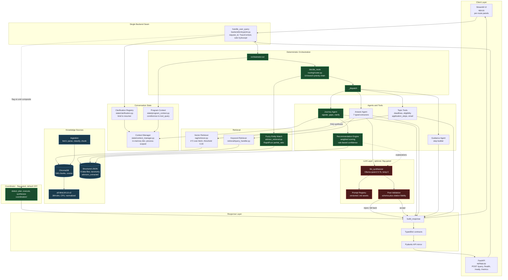

# CSULB Graduate Center AI Assistant

An agentic AI assistant for CSULB Graduate Center prospective students.
Covers application steps, deadlines, program recommendations, advisor
contact, eligibility, and FAQ — backed by a local RAG knowledge base
(Chroma + sentence-transformers) and an optional local LLM (Ollama).

---

## Local Development

### Prerequisites

- Python 3.13
- [Ollama](https://ollama.ai) (optional — required only for LLM synthesis features)

### Setup

```bash
# 1. Create and activate a virtual environment
python3.13 -m venv .venv
source .venv/bin/activate        # macOS / Linux
# .venv\Scripts\activate          # Windows

# 2. Install backend dependencies (RAG, FastAPI, Chroma, sentence-transformers)
pip install -r requirements_backend.txt

# 3. (Optional) Copy and edit environment variables
cp .env.example .env
```

### Requirements files

| File | Used by | Contents |
|---|---|---|
| `requirements.txt` | Streamlit Community Cloud | Frontend-only: `streamlit`, `requests`, `beautifulsoup4`, `rapidfuzz` |
| `requirements_backend.txt` | Docker / Render / local backend dev | Full stack: all of the above + `langchain`, `chromadb`, `sentence-transformers`, `fastapi`, `uvicorn`, `ollama`, `openai` |
| `requirements_app.txt` | Legacy / manual override | Identical to `requirements.txt` — kept for reference |

**Why the split?**
Streamlit Community Cloud installs the root `requirements.txt` automatically and does not expose a way to point at a different file. The root file must therefore contain only the lightweight packages `app.py` actually imports. The Dockerfile installs `requirements_backend.txt` instead, which preserves the full backend stack without any behavior change on Render.

### Build the knowledge base

The Chroma vector store must be built before the app can answer queries.
This step fetches live CSULB pages — requires internet access.

```bash
python rag/store.py
```

The store is written to `chroma_db/`.

### Run the FastAPI service

```bash
uvicorn api.app:app --reload
```

Endpoints:
- `GET  /`        — service identity
- `GET  /health`  — liveness check
- `GET  /ready`   — readiness check (exercises the vector store)
- `POST /query`   — submit a question (body: `{"query": "...", "session_id": "..."}`)

### Run the Streamlit UI

```bash
streamlit run app.py
```

Opens at `http://localhost:8501`.

### Run tests

```bash
pytest tests/
```

### Run evaluations

```bash
python evals/run_recommendation_evals.py
python evals/run_retrieval_evals.py
python evals/run_llm_evals.py
python evals/run_advisor_evals.py
python evals/run_ingestion_evals.py
python evals/weight_validation.py
python evals/run_evals.py --skip-known-failures
```

---

## Docker

### Requirements

- Docker 20.10+ with Compose v2 (`docker compose`)
- A built `chroma_db/` directory on the host (see "Build the knowledge base" above)
- (Optional) Ollama running on the host for LLM features

### Start

```bash
docker compose up --build
```

This builds the image (if not already cached), mounts all data volumes,
loads environment variables from `.env` if present, and starts the FastAPI
service on port 8000.

### Stop

```bash
docker compose down
```

### Where data persists

All application data lives on the host, not inside the container:

| Host path | Purpose |
|---|---|
| `./chroma_db/` | Chroma vector store — **required**. Build once with `python rag/store.py`. |
| `./logs/` | Structured NDJSON observability log (`gradcenter.log`). |
| `./evals/reports/` | Timestamped eval runner output. |
| `./obs/reports/` | KB health, drift reports, and baseline snapshots. |

Stopping or removing the container does not affect any of these directories.
`chroma_db/` is the only required mount — without it `/ready` returns 503
and retrieval queries fail gracefully.

### With LLM features enabled

Ollama runs on the host machine, not inside the container. Set
`OLLAMA_BASE_URL` to reach it from within Docker:

```bash
cp .env.example .env
# Edit .env:
#   LLM_SYNTHESIS_ENABLED=true
#   LLM_EXPLANATION_ENABLED=true
#   OLLAMA_BASE_URL=http://host.docker.internal:11434  # macOS / Windows
#   OLLAMA_BASE_URL=http://172.17.0.1:11434            # Linux
docker compose up --build
```

`docker-compose.yml` loads `.env` automatically when the file exists.
Without `.env`, all LLM features stay off — the assistant runs in its
full deterministic mode with no Ollama dependency.

### Verify

```bash
curl http://localhost:8000/health
curl http://localhost:8000/ready
curl -X POST http://localhost:8000/query \
  -H "Content-Type: application/json" \
  -d '{"query": "How do I apply?"}'
```

### Ports

| Port | Service |
|------|---------|
| 8000 | FastAPI (uvicorn) |

The Streamlit UI (`app.py`) is not exposed by the Docker image — it is
intended for local development only.

### Environment variables

See `.env.example` for the full list with descriptions. All variables are
optional; the application runs without LLM features when none are set.

### Raw Docker commands (without Compose)

If Compose is unavailable, the equivalent `docker run` command is:

```bash
docker build -t gradcenter-ai .
docker run -p 8000:8000 \
  -v "$(pwd)/chroma_db:/app/chroma_db" \
  -v "$(pwd)/logs:/app/logs" \
  -v "$(pwd)/evals/reports:/app/evals/reports" \
  -v "$(pwd)/obs/reports:/app/obs/reports" \
  --env-file .env \
  gradcenter-ai
```

---

## Cloud Deployment (Render)

The project includes a `render.yaml` Blueprint for one-click deployment
to [Render](https://render.com).

> **Warnings before you deploy**
> - LLM features (`LLM_SYNTHESIS_ENABLED`, `LLM_EXPLANATION_ENABLED`) are
>   **off by default**. The assistant runs fully without Ollama.
> - Ollama is **not included** in the Render deployment. If you want LLM
>   features in production, you need a separately hosted Ollama instance and
>   must update `OLLAMA_BASE_URL` in the Render dashboard.
> - The Chroma vector store (`chroma_db/`) is **not committed to git** and is
>   not baked into the Docker image. On first deploy it is built automatically
>   from live CSULB pages (~30–60 s). Configure the persistent disk below so
>   the store survives restarts.

### Requirements

- Render account
- **Starter plan or higher** (free tier has no persistent disk — the vector
  store would rebuild on every cold start, which is ~30–60 s after every
  ~15 minutes of inactivity)

### Deploy with the Blueprint (recommended)

1. Push this repository to GitHub.
2. In the Render dashboard: **New → Blueprint** → select your repo.
3. Render reads `render.yaml` and creates the `gradcenter-ai` web service
   with a 1 GB persistent disk at `/app/chroma_db`.
4. The first deploy builds the Docker image (includes the embedding model).
   When the first request arrives, the app fetches CSULB pages and builds
   the Chroma store onto the disk (~30–60 s, one time only).
5. All subsequent requests (and restarts) load the store from disk in < 1 s.

### Deploy manually (dashboard)

If you prefer not to use the Blueprint:

1. **New → Web Service** → connect your GitHub repo.
2. Environment: **Docker**.
3. Dockerfile path: `./Dockerfile`.
4. Plan: **Starter** (required for the persistent disk).
5. Health check path: `/health`.
6. Add environment variables (all optional — defaults shown):

   | Key | Default value |
   |---|---|
   | `LLM_SYNTHESIS_ENABLED` | `false` |
   | `LLM_EXPLANATION_ENABLED` | `false` |
   | `OLLAMA_BASE_URL` | `http://localhost:11434` |
   | `LLM_SYNTHESIS_MODEL` | `qwen2.5:7b-instruct` |
   | `LLM_SYNTHESIS_TIMEOUT_S` | `30` |

7. **Disks** tab → **Add Disk**:
   - Name: `chroma-db`
   - Mount path: `/app/chroma_db`
   - Size: 1 GB

### Persistent data on Render

| What | Where it lives | Notes |
|---|---|---|
| Chroma vector store | Render persistent disk → `/app/chroma_db/` | **Required**. Built on first request, reused across restarts. |
| Logs | Container filesystem (ephemeral) | Lost on restart. Render streams logs in the dashboard. |
| Eval reports | Container filesystem (ephemeral) | Run evals locally, not in production. |

### Memory constraints

The Render Starter plan has 512 MB RAM. The readiness endpoint (`/ready`) is
optimized for this constraint:

- `/ready` performs a **passive disk check** only — it verifies `chroma.sqlite3`
  is present on disk without loading the embedding model or instantiating Chroma.
- The embedding model (`all-MiniLM-L6-v2`, ~200 MB in-process) loads lazily on
  the **first `/query` request**.
- On first deploy the persistent disk is empty, so `/ready` returns HTTP 503
  (`"vector_store": {"ok": false, "detail": "chroma.sqlite3 not present"}`) until
  the first `/query` triggers the store build (~30–60 s, one time).

### Deployment verification

Replace `<render-url>` with your service URL (e.g.
`gradcenter-ai.onrender.com`):

```bash
# Liveness — always returns 200 if the process is running
curl https://<render-url>/health

# Readiness — passive disk check; 503 until first /query populates the store
curl https://<render-url>/ready

# Swagger UI — interactive API docs
open https://<render-url>/docs

# First query — triggers vector store build if not already populated (~30–60 s)
curl -X POST https://<render-url>/query \
  -H "Content-Type: application/json" \
  -d '{"query": "How do I apply to a doctoral program at CSULB?"}'

# Readiness after first query — should now return 200
curl https://<render-url>/ready
```

Expected responses:

| Endpoint | Expected |
|---|---|
| `/health` | `{"status": "ok", "service": "csulb-grad-center-assistant", ...}` |
| `/ready` (before first query) | `{"status": "degraded", ...}` HTTP 503 — store not yet built |
| `/ready` (after first query) | `{"status": "ok", ...}` HTTP 200 |
| `/docs` | Swagger UI with `/`, `/health`, `/ready`, `/query` |
| `/query` | JSON with routing and retrieval results |

---

## Streamlit Deployment

The Streamlit UI (`app.py`) connects to the deployed FastAPI backend on Render
via HTTP. It has no local RAG, Chroma, or LLM dependency.

### Deployed architecture

```
User
  │
  ▼
Streamlit Community Cloud  (app.py)
  │  HTTPS
  ▼
Render FastAPI Backend  (https://gradcenter-ai.onrender.com)
  │
  ▼
Agent Orchestrator → RAG + Chroma
```

### Run locally

```bash
streamlit run app.py
```

Opens at `http://localhost:8501`. The app calls the Render backend by default.
Override the backend URL by setting `BACKEND_API_URL` in your shell:

```bash
BACKEND_API_URL=http://localhost:8000 streamlit run app.py
```

### Deploy to Streamlit Community Cloud

#### 1. Prerequisites

- The repository is pushed to GitHub (public or private with Streamlit access).
- The Render backend (`https://gradcenter-ai.onrender.com`) is running.

#### 2. Create the app

1. Go to [share.streamlit.io](https://share.streamlit.io) → **New app**.
2. Select your repository and branch (e.g. `main`).
3. Set **Main file path** to:
   ```
   app.py
   ```
4. Open **Advanced settings**:
   - **Python version**: `3.11` (recommended)
   - No custom requirements file needed — Streamlit Cloud installs the root
     `requirements.txt` automatically, which now contains only the four
     lightweight frontend packages.

5. Click **Deploy**.

#### 3. Environment variables

After deployment, open **Settings → Secrets** in the Streamlit Cloud dashboard
and add:

```toml
BACKEND_API_URL = "https://gradcenter-ai.onrender.com"
```

This is optional — the app falls back to `https://gradcenter-ai.onrender.com`
if the variable is not set.

To point at a different backend (e.g. a staging deployment), override the value:

```toml
BACKEND_API_URL = "https://your-staging-backend.onrender.com"
```

#### 4. Verify

Once deployed, open the Streamlit Cloud URL and confirm:

| Check | Expected |
|---|---|
| Page loads | CSULB gold header + welcome screen |
| Sidebar backend status | 🟢 Backend: ok |
| Submit a question | Answer renders with summary box + sources |
| Follow-up buttons | Clicking a follow-up submits as a new query |
| Sidebar "Clear history" | Clears chat and resets follow-ups |

#### 5. Startup behaviour when backend is unavailable

If the Render backend is cold-starting or temporarily unreachable:

- The Streamlit app **still loads** — the frontend never crashes on a missing backend.
- Sidebar shows: **🔴 Backend: unreachable**.
- Submitting a question shows a friendly `⚠️ Cannot connect to the backend.` error inline.
- The backend status auto-recovers on the next page rerun once Render responds.

---

## Architecture

## 🏗️ System Architecture


